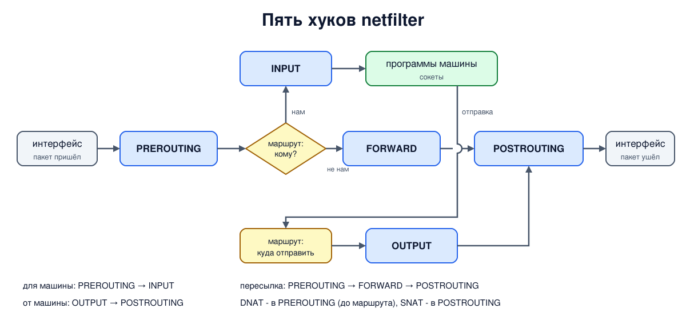

# Урок 52. netfilter: пять хуков и путь пакета через ядро

В прошлом уроке мы писали правила файервола, не задумываясь, где именно в ядре они срабатывают. Пора разобраться. iptables, nftables, отслеживание соединений и NAT в Linux построены на одной подсистеме ядра: **netfilter** (tc и XDP из прошлых уроков - отдельные механизмы). Она задаёт несколько точек на пути пакета, в которых можно вмешаться, и порядок, в котором вмешиваются разные участники. Поняв эти точки, легко отвечать на вопросы вроде "почему правило в INPUT не действует на пересылаемый трафик" или "где делается NAT".

Учебники по сетям этот механизм Linux не описывают; источники - документация netfilter и nftables, исходники ядра, ссылки в конце урока.

## Хуки

**Хук** (hook, "крючок") - место в коде сетевого стека, где ядро передаёт пакет всем зарегистрированным на этом хуке функциям. Каждая функция возвращает **вердикт**: пропустить дальше (accept), отбросить (drop), передать в очередь программе в пространстве пользователя (queue) или забрать себе (stolen). Цепочки iptables и nftables - это такие функции, повешенные на хуки; правила проверяются внутри них.

Для IPv4 и IPv6 хуков пять:

1. **PREROUTING** - пакет только что пришёл с интерфейса, решение о маршруте ещё не принято;
2. **INPUT** - пакет адресован самой машине и сейчас будет передан протоколу и сокету;
3. **FORWARD** - пакет адресован не нам и будет переслан дальше;
4. **OUTPUT** - пакет создан на этой машине - программой или самим ядром (например, ответ на ping);
5. **POSTROUTING** - пакет сейчас уйдёт в интерфейс, все решения о маршруте приняты.

В уроке 44 мы видели путь пакета через ядро: хуки netfilter стоят на нём после наблюдателей и tc ingress на приёме и до дисциплины очереди на отправке.

Из этих пяти точек складываются три пути:

- **пакет для самой машины**: PREROUTING → решение о маршруте → INPUT → сокет;
- **пересылаемый пакет**: PREROUTING → решение о маршруте → FORWARD → POSTROUTING;
- **пакет от самой машины**: программа → решение о маршруте → OUTPUT → POSTROUTING.

Отсюда простые, но важные следствия. Правила в INPUT защищают службы самой машины, но не действуют на пересылаемый трафик - для маршрутизатора нужен FORWARD. Пакет, который машина отправляет сама себе (через `lo`), проходит OUTPUT и POSTROUTING, а потом PREROUTING и INPUT. А на PREROUTING стоит всё, что должно случиться **до** решения о маршруте, - прежде всего замена адреса получателя (DNAT, урок 57): иначе ядро выбрало бы маршрут для старого адреса (для пакетов самой машины DNAT делается в OUTPUT, и ядро после этого перевыбирает маршрут).



## Несколько участников на одном хуке: приоритеты

На одном хуке может висеть много функций: отслеживание соединений, правила NAT, ваши цепочки файервола, цепочки Docker. Порядок между ними задаёт **приоритет** - число, меньше - раньше. В nftables приоритет указывается у базовой цепочки, и у стандартных значений есть имена:

| приоритет | имя в nftables | кто обычно |
|---|---|---|
| -300 | `raw` | до отслеживания соединений (например, чтобы отключить его для части трафика) |
| -200 | - | отслеживание соединений (conntrack, урок 55) |
| -150 | `mangle` | изменение пакетов, метки |
| -100 | `dstnat` | замена адреса получателя (DNAT) |
| 0 | `filter` | фильтрация |
| 50 | `security` | правила SELinux и подобных |
| 100 | `srcnat` | замена адреса отправителя (SNAT) |

Это значения для семейств ip, ip6 и inet; у семейства bridge они свои.

Важная тонкость: **accept в одной цепочке не означает "пакет пропущен окончательно"**. Он означает только "эта цепочка не возражает", и пакет идёт к следующей цепочке на том же хуке. А вот **drop окончательный**: пакет уничтожен, следующие цепочки его не увидят. Поэтому, если на машине правила ставят сразу несколько программ (например, ваш файервол и Docker), пакет должен быть разрешён во **всех** цепочках на своём пути.

## Семейства

Хуки есть не только у IPv4 и IPv6. В nftables правила привязаны к **семейству**:

- `ip`, `ip6` - IPv4 и IPv6, пять хуков выше; `inet` - оба сразу, одни правила на IPv4 и IPv6 (так мы делали в уроках 46 и 51);
- `arp` - пакеты ARP;
- `bridge` - кадры, проходящие через мост (урок 50);
- `netdev` - точки у самого интерфейса: хук `ingress` при приёме, ещё до PREROUTING (но после tcpdump и tc ingress из урока 44), и `egress` при отправке, после POSTROUTING и перед tc egress. `ingress` есть с ядра 4.2, `egress` - с 5.16. Удобно для очень быстрой фильтрации, например против потоков мусорного трафика.

## Как это увидеть в Linux

Три пространства имён: `a` (`192.0.2.1`) - маршрутизатор `r` - `s` (`198.51.100.2`). На `r` повесим по цепочке nftables на каждый из пяти хуков, и каждая будет только считать пакеты ICMP. Потом трижды отправим ping: от `a` к самому `r`, от `a` через `r` к `s` и от самого `r` к `s` - и посмотрим, на каких хуках побывали пакеты. Во втором шаге поставим на хук FORWARD две цепочки с разными приоритетами и проследим путь пакета встроенной трассировкой nftables (`meta nftrace set 1` и `nft monitor trace`). В третьем шаге проверим, что запрет в INPUT не мешает пересылке. Нужны Linux (подойдёт WSL2), права sudo и nftables (`sudo apt install nftables iputils-ping`); всё создаётся в пространствах имён `hbh-*` и в конце удаляется.

Создай файл `hooks-lab.sh` и запусти `bash hooks-lab.sh`:
```
set -u
for c in nft ping; do
  command -v $c >/dev/null || { echo "нужен $c: sudo apt install nftables iputils-ping"; exit 1; }
done
ns="hbh-a hbh-r hbh-s"
# убрать остатки прошлого запуска
for n in $ns; do
  sudo ip netns pids $n 2>/dev/null | xargs -r sudo kill
  sudo ip netns del $n 2>/dev/null
done
d=$(mktemp -d)
chmod 755 "$d"
# a (192.0.2.1) - маршрутизатор r - s (198.51.100.2)
for n in $ns; do sudo ip netns add $n; sudo ip -n $n link set lo up; done
A="sudo ip netns exec hbh-a"
R="sudo ip netns exec hbh-r"
S="sudo ip netns exec hbh-s"
sudo ip link add eth0 netns hbh-a type veth peer name eth0 netns hbh-r
sudo ip link add eth0 netns hbh-s type veth peer name eth1 netns hbh-r
$A ip addr add 192.0.2.1/24 dev eth0
$R ip addr add 192.0.2.254/24 dev eth0
$R ip addr add 198.51.100.254/24 dev eth1
$S ip addr add 198.51.100.2/24 dev eth0
for n in $ns; do sudo ip netns exec $n ip link set eth0 up; done
$R ip link set eth1 up
$A ip route add default via 192.0.2.254
$S ip route add default via 198.51.100.254
$R sysctl -qw net.ipv4.ip_forward=1
# на r - по цепочке на каждом из пяти хуков; правило в каждой только считает ICMP
cat > "$d/hooks.nft" <<'EOF'
table ip lab {
  chain c_prerouting  { type filter hook prerouting  priority 0; ip protocol icmp counter; }
  chain c_input       { type filter hook input       priority 0; ip protocol icmp counter; }
  chain c_forward     { type filter hook forward     priority 0; ip protocol icmp counter; }
  chain c_output      { type filter hook output      priority 0; ip protocol icmp counter; }
  chain c_postrouting { type filter hook postrouting priority 0; ip protocol icmp counter; }
}
EOF
hooks() {   # пересоздать таблицу, выполнить команду, показать, на каких хуках побывали пакеты
  $R nft delete table ip lab 2>/dev/null
  $R nft -f "$d/hooks.nft"
  "$@" >/dev/null 2>&1
  $R nft list table ip lab | awk '/chain c_/ {c = substr($2, 3)} /packets/ {for (i = 1; i <= NF; i++) if ($i == "packets") n = $(i + 1); printf "%s %s  ", c, n} END {print ""}'
}
echo '--- 1. which hooks a packet passes on r (one ping = request + reply)'
echo -n 'a pings r itself:     '; hooks $A ping -c 1 -W 1 192.0.2.254
echo -n 'a pings s through r:  '; hooks $A ping -c 1 -W 1 198.51.100.2
echo -n 'r pings s itself:     '; hooks $R ping -c 1 -W 1 198.51.100.2
echo '--- 2. the order inside one hook is set by priority'
$R nft delete table ip lab
$R nft -f - <<'EOF'
table ip lab {
  chain late  { type filter hook forward priority 10;  ip protocol icmp meta nftrace set 1 counter; }
  chain early { type filter hook forward priority -10; ip protocol icmp meta nftrace set 1 counter; }
  chain pre   { type filter hook prerouting priority 0; ip protocol icmp meta nftrace set 1; }
}
EOF
$R timeout 3 nft monitor trace > "$d/trace" 2>/dev/null &
sleep 1
$A ping -c 1 -W 1 198.51.100.2 >/dev/null
wait
echo 'chains the request went through, in order (from nft monitor trace):'
id=$(awk '/trace id/ {print $3; exit}' "$d/trace")
grep "trace id $id" "$d/trace" | grep -oE 'ip lab [a-z]+ (rule|verdict|policy)[^(]*' | sed -E 's/^ip lab //; s/ counter packets.*//; s/ +$//' | awk '{print "   ", $0}'
echo '--- 3. a drop on the input hook does not stop forwarding'
$R nft delete table ip lab
$R nft add table ip lab
$R nft add chain ip lab c_input '{ type filter hook input priority 0; policy drop; }'
echo -n 'a -> r (input, dropped):    '; $A ping -c 1 -W 1 192.0.2.254 | grep -oE '[0-9]+ received'
echo -n 'a -> s (forward, allowed):  '; $A ping -c 1 -W 1 198.51.100.2 | grep -oE '[0-9]+ received'
echo '--- cleanup'
for n in $ns; do
  sudo ip netns pids $n 2>/dev/null | xargs -r sudo kill
  sudo ip netns del $n
done
rm -rf "$d"
ip netns list | grep -cE '^hbh-(a|r|s)( |$)'
```

Вот что получилось на нашем сервере:
```
--- 1. which hooks a packet passes on r (one ping = request + reply)
a pings r itself:     prerouting 1  input 1  forward 0  output 1  postrouting 1  
a pings s through r:  prerouting 2  input 0  forward 2  output 0  postrouting 2  
r pings s itself:     prerouting 1  input 1  forward 0  output 1  postrouting 1  
--- 2. the order inside one hook is set by priority
chains the request went through, in order (from nft monitor trace):
    pre rule ip protocol icmp meta nftrace set 1
    pre policy accept
    early rule ip protocol icmp meta nftrace set 1
    early policy accept
    late rule ip protocol icmp meta nftrace set 1
    late policy accept
--- 3. a drop on the input hook does not stop forwarding
a -> r (input, dropped):    0 received
a -> s (forward, allowed):  1 received
--- cleanup
0
```

Разберём.

**Шаг 1: три пути.** Один ping - это запрос и ответ, два пакета.

- `a` пингует сам `r`: запрос пришёл и адресован `r` - PREROUTING и INPUT; ответ `r` создал сам - OUTPUT и POSTROUTING. FORWARD - ноль.
- `a` пингует `s` через `r`: и запрос, и ответ для `r` чужие - каждый прошёл PREROUTING, FORWARD и POSTROUTING, отсюда по 2. INPUT и OUTPUT - ноль: самой машине эти пакеты не адресованы, и не она их создала.
- `r` пингует `s` сам: запрос - OUTPUT и POSTROUTING, ответ - PREROUTING и INPUT. Картина как в первом случае, только запрос и ответ поменялись ролями.

**Шаг 2: приоритеты.** Цепочки на хуке FORWARD мы объявили в порядке `late`, потом `early`, но пакет прошёл их в порядке приоритетов: сначала `early` (-10), потом `late` (10). Перед ними - цепочка `pre` на PREROUTING. Трассировка показывает и вердикт каждой цепочки: `policy accept`. Обрати внимание: после accept в `early` пакет всё равно пошёл в `late` - accept действует только внутри своей цепочки.

**Шаг 3: INPUT и FORWARD независимы.** На `r` в цепочке INPUT политика `drop`. Ping до самого `r` не проходит, а ping через `r` до `s` проходит: пересылаемые пакеты в INPUT не попадают. Это частая ошибка начинающих: закрыть INPUT на маршрутизаторе и считать, что сеть за ним защищена.

В конце `0`: пространства имён удалены.

## Итог

- netfilter - подсистема ядра, на которой построены iptables, nftables, conntrack и NAT: в точках-хуках ядро передаёт пакет зарегистрированным функциям, и каждая выносит вердикт.
- Пять хуков IPv4 и IPv6: PREROUTING, INPUT, FORWARD, OUTPUT, POSTROUTING. Пути: для машины - PREROUTING, INPUT; пересылка - PREROUTING, FORWARD, POSTROUTING; от машины - OUTPUT, POSTROUTING.
- Правила INPUT не действуют на пересылаемый трафик; DNAT делается до решения о маршруте, SNAT - в самом конце.
- Порядок функций на одном хуке задаёт приоритет: conntrack -200, mangle -150, dstnat -100, filter 0, srcnat 100. accept пропускает к следующей цепочке, drop окончателен.
- Семейства nftables: ip, ip6, inet, arp, bridge, netdev (хуки ingress и egress у самого интерфейса). Путь пакета удобно смотреть трассировкой `nft monitor trace`.

## Что почитать

- Вики nftables (wiki.nftables.org): Netfilter hooks, Configuring chains (приоритеты), Ruleset debug/tracing.
- Документация netfilter: netfilter.org/documentation; исходники ядра: include/uapi/linux/netfilter.h (хуки и вердикты), include/uapi/linux/netfilter_ipv4.h (приоритеты).
- `man 8 nft` (разделы ADDRESS FAMILIES и CHAINS).
