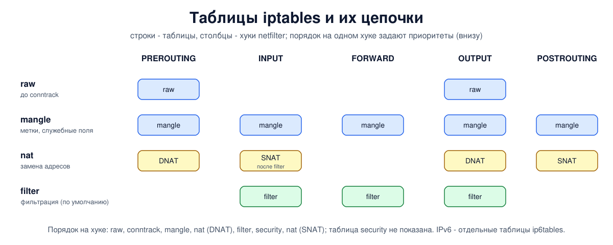

# Урок 53. iptables: таблицы, цепочки, правила

**iptables** - самая известная программа для настройки файервола Linux. Она вошла в ядро Linux 2.4 в 2001 году вместе с netfilter (урок 52), и на ней написаны горы инструкций, скриптов и чужих конфигураций, которые вам ещё встретятся. Сегодня её место занимает nftables (урок 54), но читать и понимать правила iptables нужно уметь: они остаются в Docker, Kubernetes, ufw, в старых версиях firewalld, в старых серверах и в каждом втором ответе на форуме.

Учебники по сетям касаются iptables лишь мимоходом: Олифер (гл. 28, с. 875) показывает цепочки INPUT, OUTPUT, FORWARD и пример правила. Основные источники - `man 8 iptables`, `man 8 iptables-extensions` и документация netfilter, ссылки в конце урока.

## Таблицы и цепочки

Правила iptables организованы в три уровня: **таблицы** → **цепочки** → **правила**.

**Таблица** собирает правила одного назначения:

- `filter` - фильтрация, таблица по умолчанию: всё, что пишется без `-t`, попадает сюда;
- `nat` - замена адресов и портов (уроки 56-57); в неё попадает только первый пакет каждого соединения, остальные обрабатываются по запомненному решению;
- `mangle` - изменение служебных полей пакета и метки (fwmark из урока 48);
- `raw` - самая ранняя точка, ещё до отслеживания соединений: здесь можно, например, отключить его для части трафика;
- `security` - правила для SELinux и подобных систем.

**Цепочка** - упорядоченный список правил. Встроенные цепочки называются как хуки netfilter и привязаны к ним: `PREROUTING`, `INPUT`, `FORWARD`, `OUTPUT`, `POSTROUTING`. В каждой таблице есть не все пять, а только нужные ей: у `filter` - `INPUT`, `FORWARD`, `OUTPUT`, у `nat` - `PREROUTING`, `INPUT`, `OUTPUT`, `POSTROUTING`, у `mangle` - все пять, у `raw` - `PREROUTING` и `OUTPUT`, у `security` - `INPUT`, `FORWARD`, `OUTPUT`. Когда на одном хуке стоят цепочки разных таблиц, порядок между ними задают приоритеты из урока 52: raw, затем отслеживание соединений, mangle, nat (замена получателя), filter, security и в самом конце nat (замена отправителя).

У встроенной цепочки есть **политика** - что делать с пакетом, если ни одно правило не вынесло решения: `ACCEPT` или `DROP`. Кроме встроенных, можно создавать **свои цепочки** (`-N ИМЯ`) и переходить в них из правил (`-j ИМЯ`) - так длинные наборы правил разбивают на части; из своей цепочки пакет возвращается действием `RETURN` или когда её правила закончились.



## Правило: условие и действие

Правило состоит из **условий** (match) и **действия** (target, `-j`). Условия:

- `-p tcp`, `udp`, `icmp` - протокол; `-s` и `-d` - адрес или сеть отправителя и получателя;
- `-i` и `-o` - входящий и исходящий интерфейс (`eth+` - все, чьё имя начинается с `eth`); `-i` работает там, где интерфейс приёма уже известен (PREROUTING, INPUT, FORWARD), `-o` - в FORWARD, OUTPUT, POSTROUTING;
- `--sport`, `--dport` - порты (только вместе с протоколом, у которого есть порты: `-p tcp`, `-p udp` и т. п.);
- расширения через `-m`: `-m conntrack --ctstate ESTABLISHED,RELATED` - состояние соединения (урок 55), `-m multiport --dports 80,443` - несколько портов, `-m limit` - ограничение частоты, `-m comment --comment "..."` - комментарий.

Условие можно отрицать восклицательным знаком: `! -s 192.0.2.0/24`.

Действия:

- `ACCEPT`, `DROP`, `REJECT` (с `--reject-with`, например `tcp-reset`) - как в уроке 51;
- `LOG` - записать пакет в журнал ядра и **продолжить** проверку следующих правил;
- `RETURN` - вернуться из своей цепочки;
- `ИМЯ_ЦЕПОЧКИ` - перейти в свою цепочку;
- в таблице `nat` - `DNAT`, `SNAT`, `MASQUERADE` (уроки 56-57).

## Команды

| команда | что делает |
|---|---|
| `-A ЦЕПОЧКА правило` | добавить правило в конец |
| `-I ЦЕПОЧКА [N] правило` | вставить в начало или на место N |
| `-D ЦЕПОЧКА правило` или `-D ЦЕПОЧКА N` | удалить |
| `-R ЦЕПОЧКА N правило` | заменить правило N |
| `-P ЦЕПОЧКА ACCEPT` или `DROP` | задать политику |
| `-L [ЦЕПОЧКА] -n -v --line-numbers` | показать с номерами и счётчиками |
| `-S` | показать в виде команд |
| `-F`, `-Z` | очистить цепочку, обнулить счётчики |
| `-N`, `-X` | создать и удалить свою цепочку |

Таблица указывается ключом `-t`: `iptables -t nat -L`. Для IPv6 всё то же самое делает **отдельная программа** `ip6tables` со своим набором правил.

Правила, добавленные командами, живут до перезагрузки. Сохраняют и загружают их целиком: `iptables-save > файл` и `iptables-restore < файл` (загрузка атомарна: каждая таблица заменяется целиком одним действием, без промежуточного состояния). В Debian и Ubuntu это автоматизирует пакет `iptables-persistent` (файлы `/etc/iptables/rules.v4` и `rules.v6`); надстройки ufw и firewalld хранят правила по-своему.

## iptables-nft и iptables-legacy

Сегодня под именем `iptables` в большинстве дистрибутивов работает **iptables-nft**: команды и синтаксис прежние, но правила записываются в ядро через nftables, в таблицы с теми же именами. Старый вариант, работающий напрямую со старым интерфейсом ядра, называется **iptables-legacy**. Какой из них у вас, показывает `iptables -V`: `(nf_tables)` или `(legacy)`. Смешивать их опасно: правила, записанные одним, не видны в выводе другого (iptables-nft лишь предупреждает, что есть таблицы legacy), а действуют оба.

## Как это увидеть в Linux

Три пространства имён, как в уроке 51: внутренний компьютер `a`, маршрутизатор `r` и внешний сервер `s` с сайтом на порту 80, но теперь у всех и IPv4, и IPv6. На `a` слушают служба администрирования 2222 и служба 8080, которую решили открыть наружу. Все службы принимают и IPv4, и IPv6 (урок 46). На `r` построим правила iptables: сначала политика DROP и разрешения для IPv4, потом то же для IPv6, потом откроем 8080 и посмотрим, как важен порядок правил. В конце - правила с номерами и счётчиками, их сохранённый вид и то, как они выглядят в nftables. Нужны Linux (подойдёт WSL2), права sudo, python3, iptables и nftables (`sudo apt install python3 iptables nftables`); всё создаётся в пространствах имён `hbh-*` и в конце удаляется.

Создай файл `iptables-lab.sh` и запусти `bash iptables-lab.sh`:
```
set -u
for c in python3 iptables ip6tables iptables-save nft; do
  command -v $c >/dev/null || { echo "нужен $c: sudo apt install python3 iptables nftables"; exit 1; }
done
ns="hbh-a hbh-r hbh-s"
# убрать остатки прошлого запуска
for n in $ns; do
  sudo ip netns pids $n 2>/dev/null | xargs -r sudo kill
  sudo ip netns del $n 2>/dev/null
done
d=$(mktemp -d)
chmod 755 "$d"
# внутренняя сеть: a - маршрутизатор r - внешняя сеть: s; у всех и IPv4, и IPv6
# без проверки уникальности адресов IPv6 (DAD), чтобы адреса работали сразу
for n in $ns; do
  sudo ip netns add $n; sudo ip -n $n link set lo up
  sudo ip netns exec $n sysctl -qw net.ipv6.conf.all.accept_dad=0 net.ipv6.conf.default.accept_dad=0
done
A="sudo ip netns exec hbh-a"
R="sudo ip netns exec hbh-r"
S="sudo ip netns exec hbh-s"
sudo ip link add eth0 netns hbh-a type veth peer name eth0 netns hbh-r
sudo ip link add eth0 netns hbh-s type veth peer name eth1 netns hbh-r
$A ip addr add 192.0.2.1/24 dev eth0
$A ip addr add 2001:db8:1::1/64 dev eth0
$R ip addr add 192.0.2.254/24 dev eth0
$R ip addr add 2001:db8:1::fe/64 dev eth0
$R ip addr add 198.51.100.254/24 dev eth1
$R ip addr add 2001:db8:2::fe/64 dev eth1
$S ip addr add 198.51.100.2/24 dev eth0
$S ip addr add 2001:db8:2::2/64 dev eth0
for n in $ns; do sudo ip netns exec $n ip link set eth0 up; done
$R ip link set eth1 up
$A ip route add default via 192.0.2.254
$A ip -6 route add default via 2001:db8:1::fe
$S ip route add default via 198.51.100.254
$S ip -6 route add default via 2001:db8:2::fe
$R sysctl -qw net.ipv4.ip_forward=1 net.ipv6.conf.all.forwarding=1
# службы слушают и IPv4, и IPv6: сайт на s:80, на a - 2222 (администрирование) и 8080 (её решили открыть наружу)
cat > "$d/srv.py" <<'EOF'
import socket, sys, threading
def serve(port):
    l = socket.socket(socket.AF_INET6); l.setsockopt(socket.SOL_SOCKET, socket.SO_REUSEADDR, 1)
    l.setsockopt(socket.IPPROTO_IPV6, socket.IPV6_V6ONLY, 0)
    l.bind(("::", port)); l.listen()
    while True:
        c, _ = l.accept(); c.sendall(b"hello"); c.close()
for p in sys.argv[1:]:
    threading.Thread(target=serve, args=(int(p),)).start()
EOF
cat > "$d/check.py" <<'EOF'
import socket, sys
host, res = sys.argv[1], []
for port in sys.argv[2:]:
    c = socket.socket(socket.AF_INET6 if ":" in host else socket.AF_INET); c.settimeout(1)
    try:
        c.connect((host, int(port))); r = "open"
    except ConnectionRefusedError:
        r = "refused"
    except socket.timeout:
        r = "no answer"
    res.append(f"{port} {r}")
print(", ".join(res))
EOF
$S python3 "$d/srv.py" 80 &
$A python3 "$d/srv.py" 2222 8080 &
sleep 0.5
# заранее выяснить адреса соседей, чтобы это не попало в замеры
$S ping -c 1 -W 1 192.0.2.1 >/dev/null; $S ping -c 1 -W 1 2001:db8:1::1 >/dev/null
check() {
  echo -n "  a -> s:80 v4: "; $A python3 "$d/check.py" 198.51.100.2 80
  echo -n "  s -> a v4:    "; $S python3 "$d/check.py" 192.0.2.1 2222 8080
  echo -n "  s -> a v6:    "; $S python3 "$d/check.py" 2001:db8:1::1 2222 8080
}
echo '--- 1. iptables on a fresh machine: tables, chains, policies'
$R iptables -V
for t in filter nat mangle raw; do
  echo "table $t: $($R iptables -t $t -S | grep -oE '^-P [A-Z]+' | cut -d' ' -f2 | xargs)"
done
check
echo '--- 2. forward: policy DROP, answers of allowed connections, a -> web'
$R iptables -P FORWARD DROP
$R iptables -A FORWARD -m conntrack --ctstate ESTABLISHED,RELATED -j ACCEPT
$R iptables -A FORWARD -i eth0 -o eth1 -p tcp --dport 80 -j ACCEPT
check
echo '--- 3. the same for IPv6 with ip6tables'
$R ip6tables -P FORWARD DROP
$R ip6tables -A FORWARD -m conntrack --ctstate ESTABLISHED,RELATED -j ACCEPT
$R ip6tables -A FORWARD -i eth0 -o eth1 -p tcp --dport 80 -j ACCEPT
check
echo '--- 4. order matters: a rule appended after a final DROP never works'
$R iptables -A FORWARD -j DROP
$R iptables -A FORWARD -i eth1 -o eth0 -p tcp --dport 8080 -j ACCEPT
echo -n '  after -A (appended to the end): '; $S python3 "$d/check.py" 192.0.2.1 8080
$R iptables -D FORWARD -i eth1 -o eth0 -p tcp --dport 8080 -j ACCEPT
$R iptables -I FORWARD 2 -i eth1 -o eth0 -p tcp --dport 8080 -j ACCEPT
echo -n '  after -I 2 (inserted as rule 2): '; $S python3 "$d/check.py" 192.0.2.1 8080
echo '--- 5. the rules with numbers and counters'
$R iptables -L FORWARD -n -v --line-numbers | tr -s ' ' | sed 's/^/  /'
echo '--- 6. iptables-save: the format to keep rules in a file'
$R iptables-save | grep -vE '^#'
echo '--- 7. this iptables writes to nftables: the same rules seen by nft'
$R nft list chain ip filter FORWARD 2>&1 | grep -vE '^\s*$'
echo '--- cleanup'
for n in $ns; do
  sudo ip netns pids $n 2>/dev/null | xargs -r sudo kill
  sudo ip netns del $n
done
rm -rf "$d"
ip netns list | grep -cE '^hbh-(a|r|s)( |$)'
```

Вот что получилось на нашем сервере:
```
--- 1. iptables on a fresh machine: tables, chains, policies
iptables v1.8.10 (nf_tables)
table filter: INPUT FORWARD OUTPUT
table nat: PREROUTING INPUT OUTPUT POSTROUTING
table mangle: PREROUTING INPUT FORWARD OUTPUT POSTROUTING
table raw: PREROUTING OUTPUT
  a -> s:80 v4: 80 open
  s -> a v4:    2222 open, 8080 open
  s -> a v6:    2222 open, 8080 open
--- 2. forward: policy DROP, answers of allowed connections, a -> web
  a -> s:80 v4: 80 open
  s -> a v4:    2222 no answer, 8080 no answer
  s -> a v6:    2222 open, 8080 open
--- 3. the same for IPv6 with ip6tables
  a -> s:80 v4: 80 open
  s -> a v4:    2222 no answer, 8080 no answer
  s -> a v6:    2222 no answer, 8080 no answer
--- 4. order matters: a rule appended after a final DROP never works
  after -A (appended to the end): 8080 no answer
  after -I 2 (inserted as rule 2): 8080 open
--- 5. the rules with numbers and counters
  Chain FORWARD (policy DROP 4 packets, 240 bytes)
  num pkts bytes target prot opt in out source destination 
  1 16 871 ACCEPT 0 -- * * 0.0.0.0/0 0.0.0.0/0 ctstate RELATED,ESTABLISHED
  2 1 60 ACCEPT 6 -- eth1 eth0 0.0.0.0/0 0.0.0.0/0 tcp dpt:8080
  3 2 120 ACCEPT 6 -- eth0 eth1 0.0.0.0/0 0.0.0.0/0 tcp dpt:80
  4 1 60 DROP 0 -- * * 0.0.0.0/0 0.0.0.0/0 
--- 6. iptables-save: the format to keep rules in a file
*filter
:INPUT ACCEPT [0:0]
:FORWARD DROP [4:240]
:OUTPUT ACCEPT [0:0]
-A FORWARD -m conntrack --ctstate RELATED,ESTABLISHED -j ACCEPT
-A FORWARD -i eth1 -o eth0 -p tcp -m tcp --dport 8080 -j ACCEPT
-A FORWARD -i eth0 -o eth1 -p tcp -m tcp --dport 80 -j ACCEPT
-A FORWARD -j DROP
COMMIT
--- 7. this iptables writes to nftables: the same rules seen by nft
# Warning: table ip filter is managed by iptables-nft, do not touch!
table ip filter {
	chain FORWARD {
		type filter hook forward priority filter; policy drop;
		ct state related,established counter packets 16 bytes 871 accept
		iifname "eth1" oifname "eth0" tcp dport 8080 counter packets 1 bytes 60 accept
		iifname "eth0" oifname "eth1" tcp dport 80 counter packets 2 bytes 120 accept
		counter packets 1 bytes 60 drop
	}
}
--- cleanup
0
```

Разберём.

**Шаг 1: чистая машина.** `iptables v1.8.10 (nf_tables)` - это iptables-nft. Четыре таблицы (security скрипт не показывает) с их встроенными цепочками, ровно как в списке выше. Правил ещё нет, и проверка показывает: всё открыто - и по IPv4, и по IPv6 (политика встроенных цепочек на чистой машине - `ACCEPT`, это видно и в шаге 6: `:INPUT ACCEPT`, `:OUTPUT ACCEPT`).

**Шаг 2: правила для IPv4.** Политика `FORWARD` - `DROP`, разрешены ответы на установленные соединения и соединения изнутри на порт 80. По IPv4 снаружи внутрь стало закрыто. А по IPv6 службы `a` **по-прежнему открыты**: iptables управляет только IPv4, правила IPv6 - отдельный набор `ip6tables`, и он пока пуст.

**Шаг 3: то же в ip6tables.** Те же три команды для IPv6 - и закрыто в обоих протоколах.

**Шаг 4: порядок правил.** В конец цепочки добавили явное правило `-j DROP`, а за ним разрешение для 8080 (`-A`). Разрешение не работает: правила проверяются сверху вниз, и до него пакет просто не доходит. Удалили его и вставили вторым по счёту (`-I FORWARD 2`) - порт 8080 открылся.

**Шаг 5: номера и счётчики.** `-L -n -v --line-numbers` показывает правила с номерами (по ним удобно удалять и вставлять), числом пакетов и байт. `-n` отключает превращение адресов в имена. В заголовке - политика и число пакетов, отброшенных ею. Точные значения счётчиков от запуска к запуску немного отличаются: счётчик политики зависит от того, успел ли клиент повторить SYN за секунду ожидания, а счётчик правила для ответов - от того, сколько подтверждений и сбросов ушло при закрытии соединений. Обрати внимание: колонка протокола в iptables 1.8.10 показывает номера (6 - TCP, 0 - любой), а в WSL2 с iptables 1.8.11 - имена (`tcp`, `all`).

**Шаг 6: iptables-save.** Тот же набор в формате для сохранения: таблица (`*filter`), политики цепочек со счётчиками в квадратных скобках, правила в виде команд `-A` и `COMMIT` в конце. Этот текст загружается обратно через `iptables-restore`. Заметь, что iptables сам дописал `-m tcp`: условие `--dport` берётся из расширения tcp.

**Шаг 7: правила iptables в nftables.** `nft list chain ip filter FORWARD` показывает те же четыре правила, переведённые в синтаксис nftables, и предупреждение (его выводят свежие версии nft): таблицей управляет iptables-nft, руками её не трогать. Политика `drop`, приоритет `filter`, счётчики совпадают с шагом 5.

В конце `0`: пространства имён удалены.

## Безопасность: типичные дыры в правилах

Большинство проблем с iptables - не в самом инструменте, а в ошибках, которые повторяются из раза в раз. Самые частые и как от них защититься:

- **Забыли IPv6.** Правила iptables не касаются IPv6, и при включённом IPv6 службы остаются открытыми - как в шаге 2. Защита: для каждого правила iptables - такое же в ip6tables (или сразу nftables с семейством `inet`, урок 54), плюс разрешения для ICMPv6, без которого IPv6 не работает (обнаружение соседей, урок 31); проверять доступность по обоим протоколам.
- **Порядок правил.** Разрешение после общего запрета не работает, а слишком широкое разрешение в начале цепочки открывает всё, что ниже. Защита: смотреть цепочку с `--line-numbers` и счётчиками, вставлять правила на нужное место (`-I N`), держать набор правил в файле и загружать целиком через `iptables-restore`.
- **Политика ACCEPT и список запретов.** Всё, о чём забыли, открыто (урок 51). Защита: политика `DROP` и явные разрешения.
- **Широкие разрешения для ответов.** Без правила `ESTABLISHED,RELATED` ответы приходится разрешать по портам и адресам, и такие правила пропускают больше, чем нужно. Защита: отслеживание соединений и разрешения только для начала соединений.
- **Правила не сохранены.** После перезагрузки машина оказывается без файервола. Защита: `iptables-persistent` или надстройка, проверка после перезагрузки.
- **Чужие правила.** Docker и другие программы добавляют свои цепочки; трафик к опубликованным портам контейнеров идёт через `FORWARD`, а не `INPUT`, поэтому правила в `INPUT` его не касаются (урок 46). Защита: свои ограничения для контейнеров ставить в цепочку `DOCKER-USER`, которую Docker для этого и оставляет (при бэкенде iptables, который в Docker по умолчанию) (пакеты в ней уже после DNAT, поэтому опубликованный порт проверяют через `-m conntrack --ctorigdstport`), и проверять доступность снаружи.
- **Два набора правил.** Смешение iptables-legacy и iptables-nft даёт два набора, каждый из которых виден только своей программе. Защита: проверить `iptables -V` и пользоваться одним вариантом.
- **Отрезать себе доступ.** Политика `DROP` без разрешения для SSH на удалённом сервере закрывает дверь изнутри. Защита: сначала разрешения, потом политика; `iptables-apply` применяет новые правила и откатывает их, если не подтвердить доступ за заданное время.

## Итог

- iptables организует правила в таблицы (filter, nat, mangle, raw, security), таблицы - в цепочки, привязанные к хукам netfilter, у встроенных цепочек есть политика; свои цепочки создаются через `-N`.
- Правило - условия (`-p`, `-s`, `-d`, `-i`, `-o`, `--dport`, `-m conntrack` и другие расширения) и действие (`ACCEPT`, `DROP`, `REJECT`, `LOG`, `RETURN`, переход в цепочку, NAT).
- Порядок решает: `-A` добавляет в конец, `-I` вставляет; смотреть с `-L -n -v --line-numbers`.
- IPv6 - отдельная программа `ip6tables`. Сохранение - `iptables-save` и `iptables-restore`.
- Современный iptables - это iptables-nft поверх nftables; legacy и nft не смешивать.
- Типичные дыры: забытый IPv6, порядок правил, политика ACCEPT, широкие правила для ответов, несохранённые правила, чужие правила Docker, два набора, потеря доступа.

## Что почитать

- `man 8 iptables`, `man 8 iptables-extensions` (все условия и действия), `man 8 iptables-save`, `man 8 iptables-apply`.
- Документация netfilter (netfilter.org/documentation): Packet Filtering HOWTO - старое, но понятное введение.
- Документация Docker: Packet filtering and firewalls (цепочка DOCKER-USER).
