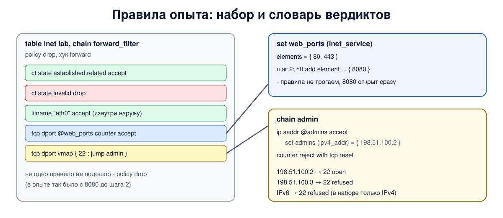

# Урок 54. nftables: семейства, наборы, словари; переход с iptables

**nftables** - преемник iptables, он появился в ядре 3.13 в 2014 году и сегодня это основа файервола по умолчанию в Debian, Ubuntu, RHEL и других дистрибутивах (часто через iptables-nft или firewalld). Мы уже пользовались им, например, в уроках 42, 46, 51, 52 и 53; теперь разберём его как следует: чем он устроен иначе, чем iptables, и что даёт сверх того - наборы, словари, атомарную замену правил.

Учебники по сетям nftables не описывают; источники - `man 8 nft` и вики nftables, ссылки в конце урока.

## Чем nftables отличается от iptables

- **Одна программа на всё.** Вместо iptables, ip6tables, arptables и ebtables - одна `nft` и семейства: `ip`, `ip6`, `inet` (IPv4 и IPv6 вместе), `arp`, `bridge`, `netdev` (урок 52). Одна таблица `inet` закрывает типичную дыру из урока 53 - забытый IPv6.
- **Ничего не создано заранее.** В iptables таблицы filter, nat и их цепочки существуют всегда. В nftables пустая система: таблицы и цепочки с любыми именами вы создаёте сами.
- **Базовые и обычные цепочки.** Базовая цепочка привязана к хуку: у неё есть тип (`filter`, `nat`, `route`), хук, приоритет и политика - `type filter hook forward priority filter; policy drop;`. Обычная цепочка ни к чему не привязана, в неё переходят из правил (`jump` - с возвратом, `goto` - без).
- **Правило - это условия и несколько действий.** `tcp dport 22 counter log prefix "ssh: " accept` - в одной строке условие, счётчик, запись в журнал и вердикт. В iptables для этого понадобилось бы несколько правил.
- **Наборы и словари встроены** (о них ниже) - там, где iptables требовал десятки правил или отдельный модуль ipset.
- **Атомарная замена.** Файл правил загружается командой `nft -f` целиком, как одна транзакция: либо применён весь, либо ничего (при ошибке в файле старые правила остаются). Начав файл со строки `flush ruleset`, вы заменяете всё сразу, без мгновения, когда правил нет.

Внутри ядра nftables устроен иначе: `nft` переводит правила в маленькую программу, которую выполняет виртуальная машина nf_tables, - как BPF для tcpdump (урок 47). Поэтому поддержка нового протокола часто требует только обновления `nft`, без нового ядра.

## Наборы

**Набор** (set) - множество значений, с которым правило сравнивает поле пакета за одну проверку:

- анонимный набор прямо в правиле: `tcp dport { 80, 443 } accept`;
- именованный набор с типом, на который ссылаются через `@имя`: `ip saddr @admins accept`. Его можно менять **на ходу**, не трогая правила: `nft add element inet lab admins { 198.51.100.9 }`, `nft delete element ...`;
- типы элементов: `ipv4_addr`, `ipv6_addr`, `inet_service` (порт), `ether_addr`, `ifname` и другие, а также **сцепления** - `ipv4_addr . inet_service`, пара "адрес и порт" как один элемент;
- флаги: `interval` - элементы-диапазоны и сети (`192.0.2.0/24`, `1000-2000`), `timeout` - у элементов есть срок жизни, по истечении они исчезают сами, `dynamic` - набор может пополнять само правило по ходу работы (например, запоминать адреса, превысившие частоту запросов).

Ядро само выбирает структуру для набора - хеш-таблицу, дерево, битовую карту или особую структуру для сцеплений с диапазонами, поэтому правило с набором из тысяч адресов работает почти так же быстро, как с одним. В iptables без ipset каждый адрес был бы отдельным правилом, проверяемым по очереди.

## Словари

**Словарь** (map) сопоставляет ключу значение:

- **словарь данных** выдаёт значение для действия, например адрес для замены: `dnat ip to tcp dport map { 80 : 192.0.2.10, 443 : 192.0.2.11 }` (в цепочке типа `nat`; `ip` нужно в таблице `inet`, чтобы указать семейство адреса; NAT - уроки 56-57);
- **словарь вердиктов** (verdict map, `vmap`) выдаёт сам вердикт: `tcp dport vmap { 22 : jump admin, 25 : drop, 80 : accept }` - одна проверка вместо цепочки правил "если порт 22 - туда, если 25 - сюда".

## Журнал

Действие `log` записывает пакет в журнал ядра (`journalctl -k`, `dmesg`) с заданным префиксом: `counter log prefix "lab drop: " drop`. Удобно ставить его перед последним запрещающим правилом или перед политикой, чтобы видеть, что именно отбрасывается. Журналируют с ограничением частоты (`limit rate 5/minute`), иначе поток мусорного трафика заполнит журнал. В пространствах имён, кроме начального, запись в журнал ядра по умолчанию выключена (`net.netfilter.nf_log_all_netns = 0`, чтобы контейнеры не засыпали журнал хоста) - поэтому в нашем опыте мы смотрим на счётчики.

## Как хранить правила и как перейти с iptables

Правила хранят в файле - в Debian и Ubuntu это `/etc/nftables.conf`, его загружает служба `nftables.service` при старте, если её включить (`sudo systemctl enable nftables`). Осторожно: `flush ruleset` удаляет все таблицы, в том числе чужие - iptables-nft и Docker. Учти, что файл `/etc/nftables.conf` из пакета уже начинается с `flush ruleset`: на машине с Docker его нужно переписать, иначе перезапуск службы сотрёт правила Docker. Если на машине есть такие соседи, заменяйте только свою таблицу: начните файл с `table inet lab` (создаёт таблицу, если её ещё нет, иначе следующая строка завершится ошибкой) и `delete table inet lab`, а потом опишите её заново - всё это одна транзакция. В опыте `flush ruleset` безопасен: он выполняется в пространстве `hbh-r`. Проверить файл без применения: `nft -c -f файл`. Посмотреть всё текущее: `nft list ruleset`.

Переход с iptables:

- `iptables-translate` и `ip6tables-translate` переводят отдельные команды, `iptables-restore-translate -f файл` - целый сохранённый набор;
- можно ничего не переводить и оставить iptables-nft (урок 53): он и так пишет в nftables;
- свои таблицы nftables прекрасно живут рядом с таблицами iptables-nft и Docker - но помни урок 52: accept в одной таблице не отменяет drop в другой, пакет должен быть разрешён везде.

## Как это увидеть в Linux

Те же три пространства имён: `a` внутри, маршрутизатор `r`, `s` снаружи, с адресами IPv4 и IPv6; у `s` два адреса IPv4, и один из них, `198.51.100.2`, - адрес администратора. На `a` слушают порты 22 (администрирование), 80 и 443 (сайт) и 8080 (пока закрыт). На `r` загрузим одним файлом таблицу `inet` с набором веб-портов, набором адресов администраторов и словарём вердиктов, который отправляет соединения на порт 22 в отдельную цепочку `admin`. Потом откроем 8080, просто добавив элемент в набор, посмотрим на набор с временем жизни элементов, на счётчики и переведём несколько команд iptables. Нужны Linux (подойдёт WSL2), права sudo, python3, nftables и iptables (для `iptables-translate`): `sudo apt install python3 nftables iptables`; всё создаётся в пространствах имён `hbh-*` и в конце удаляется.

Создай файл `nftables-lab.sh` и запусти `bash nftables-lab.sh`:
```
set -u
for c in python3 nft iptables-translate; do
  command -v $c >/dev/null || { echo "нужен $c: sudo apt install python3 nftables iptables"; exit 1; }
done
ns="hbh-a hbh-r hbh-s"
# убрать остатки прошлого запуска
for n in $ns; do
  sudo ip netns pids $n 2>/dev/null | xargs -r sudo kill
  sudo ip netns del $n 2>/dev/null
done
d=$(mktemp -d)
chmod 755 "$d"
# внутренняя сеть: a - маршрутизатор r - внешняя сеть: s, адреса IPv4 и IPv6
for n in $ns; do
  sudo ip netns add $n; sudo ip -n $n link set lo up
  sudo ip netns exec $n sysctl -qw net.ipv6.conf.all.accept_dad=0 net.ipv6.conf.default.accept_dad=0
done
A="sudo ip netns exec hbh-a"
R="sudo ip netns exec hbh-r"
S="sudo ip netns exec hbh-s"
sudo ip link add eth0 netns hbh-a type veth peer name eth0 netns hbh-r
sudo ip link add eth0 netns hbh-s type veth peer name eth1 netns hbh-r
$A ip addr add 192.0.2.1/24 dev eth0
$A ip addr add 2001:db8:1::1/64 dev eth0
$R ip addr add 192.0.2.254/24 dev eth0
$R ip addr add 2001:db8:1::fe/64 dev eth0
$R ip addr add 198.51.100.254/24 dev eth1
$R ip addr add 2001:db8:2::fe/64 dev eth1
$S ip addr add 198.51.100.2/24 dev eth0
$S ip addr add 198.51.100.3/24 dev eth0
$S ip addr add 2001:db8:2::2/64 dev eth0
for n in $ns; do sudo ip netns exec $n ip link set eth0 up; done
$R ip link set eth1 up
$A ip route add default via 192.0.2.254
$A ip -6 route add default via 2001:db8:1::fe
$S ip route add default via 198.51.100.254
$S ip -6 route add default via 2001:db8:2::fe
$R sysctl -qw net.ipv4.ip_forward=1 net.ipv6.conf.all.forwarding=1
# службы на a, слушают IPv4 и IPv6: 22 (администрирование), 80 и 443 (сайт), 8080 (пока закрыта)
cat > "$d/srv.py" <<'EOF'
import socket, sys, threading
def serve(port):
    l = socket.socket(socket.AF_INET6); l.setsockopt(socket.SOL_SOCKET, socket.SO_REUSEADDR, 1)
    l.setsockopt(socket.IPPROTO_IPV6, socket.IPV6_V6ONLY, 0)
    l.bind(("::", port)); l.listen()
    while True:
        c, _ = l.accept(); c.sendall(b"hello"); c.close()
for p in sys.argv[1:]:
    threading.Thread(target=serve, args=(int(p),)).start()
EOF
# проверка с s: можно указать свой адрес отправителя
cat > "$d/check.py" <<'EOF'
import socket, sys
src, host, res = sys.argv[1], sys.argv[2], []
for port in sys.argv[3:]:
    c = socket.socket(socket.AF_INET6 if ":" in host else socket.AF_INET); c.settimeout(1)
    c.bind((src, 0))
    try:
        c.connect((host, int(port))); r = "open"
    except ConnectionRefusedError:
        r = "refused"
    except socket.timeout:
        r = "no answer"
    res.append(f"{port} {r}")
print(", ".join(res))
EOF
$A python3 "$d/srv.py" 22 80 443 8080 &
sleep 0.5
$S ping -c 1 -W 1 192.0.2.1 >/dev/null; $S ping -c 1 -W 1 2001:db8:1::1 >/dev/null
check() {
  echo -n "  from 198.51.100.2 (admin), v4: "; $S python3 "$d/check.py" 198.51.100.2 192.0.2.1 22 80 443 8080
  echo -n "  from 198.51.100.3, v4:         "; $S python3 "$d/check.py" 198.51.100.3 192.0.2.1 22 80 443 8080
  echo -n "  from 2001:db8:2::2, v6:        "; $S python3 "$d/check.py" 2001:db8:2::2 2001:db8:1::1 22 80 443 8080
}
echo '--- 1. one file, one table for IPv4 and IPv6, a set and a verdict map'
cat > "$d/rules.nft" <<'EOF'
flush ruleset

table inet lab {
    set web_ports {
        type inet_service
        elements = { 80, 443 }
    }
    set admins {
        type ipv4_addr
        elements = { 198.51.100.2 }
    }
    chain admin {
        ip saddr @admins accept
        counter reject with tcp reset
    }
    chain forward_filter {
        type filter hook forward priority filter; policy drop;
        ct state established,related accept
        ct state invalid drop
        iifname "eth0" accept
        tcp dport @web_ports counter accept
        tcp dport vmap { 22 : jump admin }
    }
}
EOF
$R nft -f "$d/rules.nft"
check
echo '--- 2. change a set on the fly: open 8080 without touching the rules'
$R nft add element inet lab web_ports '{ 8080 }'
$R nft list set inet lab web_ports | grep elements | tr -s ' \t' ' '
check
echo '--- 3. a set with timeouts: an element disappears by itself'
$R nft add set inet lab recent '{ type ipv4_addr; flags timeout; }'
$R nft add element inet lab recent '{ 203.0.113.7 timeout 2s }'
echo "  right away: $($R nft list set inet lab recent | grep -oE 'elements = \{[^}]*\}' | tr -s ' ')"
sleep 3
echo "  3 s later:  $($R nft list set inet lab recent | grep -oE 'elements = \{[^}]*\}' || echo 'no elements')"
echo '--- 4. counters: which rule worked'
$R nft list chain inet lab forward_filter | grep -E 'counter' | tr -s ' \t' ' '
$R nft list chain inet lab admin | grep -E 'counter' | tr -s ' \t' ' '
echo '--- 5. moving from iptables: iptables-translate'
iptables-translate -A FORWARD -m conntrack --ctstate ESTABLISHED,RELATED -j ACCEPT
iptables-translate -A FORWARD -p tcp -m multiport --dports 80,443 -j ACCEPT
iptables-translate -A FORWARD -s 198.51.100.2 -p tcp --dport 22 -j ACCEPT
echo '--- cleanup'
for n in $ns; do
  sudo ip netns pids $n 2>/dev/null | xargs -r sudo kill
  sudo ip netns del $n
done
rm -rf "$d"
ip netns list | grep -cE '^hbh-(a|r|s)( |$)'
```

Вот что получилось на нашем сервере:
```
--- 1. one file, one table for IPv4 and IPv6, a set and a verdict map
  from 198.51.100.2 (admin), v4: 22 open, 80 open, 443 open, 8080 no answer
  from 198.51.100.3, v4:         22 refused, 80 open, 443 open, 8080 no answer
  from 2001:db8:2::2, v6:        22 refused, 80 open, 443 open, 8080 no answer
--- 2. change a set on the fly: open 8080 without touching the rules
 elements = { 80, 443, 8080 }
  from 198.51.100.2 (admin), v4: 22 open, 80 open, 443 open, 8080 open
  from 198.51.100.3, v4:         22 refused, 80 open, 443 open, 8080 open
  from 2001:db8:2::2, v6:        22 refused, 80 open, 443 open, 8080 open
--- 3. a set with timeouts: an element disappears by itself
  right away: elements = { 203.0.113.7 timeout 2s expires 1s968ms }
  3 s later:  no elements
--- 4. counters: which rule worked
 tcp dport @web_ports counter packets 15 bytes 1000 accept
 meta l4proto tcp counter packets 4 bytes 280 reject with tcp reset
--- 5. moving from iptables: iptables-translate
nft 'add rule ip filter FORWARD ct state related,established counter accept'
nft 'add rule ip filter FORWARD ip protocol tcp tcp dport { 80, 443 } counter accept'
nft 'add rule ip filter FORWARD ip saddr 198.51.100.2 tcp dport 22 counter accept'
--- cleanup
0
```

Разберём.

**Шаг 1: одна таблица для IPv4 и IPv6.** Файл начинается с `flush ruleset` и загружается целиком. Сайт (80 и 443) открыт и по IPv4, и по IPv6: одна таблица `inet` обслуживает оба протокола. Порт 22 словарь вердиктов отправил в цепочку `admin`: администратору `198.51.100.2` - `open`, второму адресу - `refused`, потому что цепочка `admin` отвечает остальным отказом (`reject with tcp reset`). По IPv6 порт 22 тоже `refused`: набор `admins` имеет тип `ipv4_addr`, адресов IPv6 в нём нет - для IPv6 нужен свой набор и своё правило. Порт 8080 ни под одно правило не подошёл и отброшен политикой - `no answer`. Правило `iifname "eth0" accept` разрешает всё, что идёт изнутри наружу.



**Шаг 2: набор меняется на ходу.** Одна команда `nft add element` - и в наборе `web_ports` три порта, 8080 открыт для всех. Правила не перезагружались: набор изменился, а цепочки остались прежними.

**Шаг 3: время жизни.** Элемент добавлен с `timeout 2s`, и `nft` показывает, сколько ему осталось (`expires 1s968ms`). Через 3 секунды элемента нет. Так делают временные блокировки: адрес, который подозрительно часто стучится, попадает в набор "запрещённых" на 10 минут и потом исчезает сам.

**Шаг 4: счётчики.** У правила с набором веб-портов 15 пакетов - это первые пакеты (SYN) соединений: 6 на шаге 1 (два порта по трём проверкам) и 9 на шаге 2 (три порта по трём). Остальные пакеты этих соединений прошли по правилу `established,related`, раньше по списку. Байты это подтверждают: 1000 = 10 SYN IPv4 по 60 байт и 5 SYN IPv6 по 80 байт. В цепочке `admin` 4 отказа: по SYN со второго адреса IPv4 и с адреса IPv6 на шагах 1 и 2. Обрати внимание: в правило `counter reject with tcp reset` nft сам дописал `meta l4proto tcp` - сбросом TCP можно ответить только на пакет TCP.

**Шаг 5: перевод с iptables.** `iptables-translate` выдал готовые команды `nft`. Перевод дословный: правила попадают в таблицу `ip filter`, как у iptables-nft, к каждому добавлен `counter`, а у второго - лишнее `ip protocol tcp` (условие `tcp dport` само подразумевает TCP). Для новой конфигурации их стоит переписать по-человечески: одна таблица `inet`, наборы вместо повторяющихся правил.

В конце `0`: пространства имён удалены.

## Итог

- nftables - преемник iptables: одна программа `nft` и семейства вместо iptables, ip6tables, arptables, ebtables; таблицы и цепочки создаются с нуля; базовые цепочки привязаны к хукам, обычные вызываются через `jump` и `goto`.
- В правиле может быть несколько действий: счётчик, журнал, ограничение частоты и вердикт.
- Наборы - анонимные `{ ... }` прямо в правиле и именованные `@имя` с типами, сцеплениями и флагами `interval`, `timeout`, `dynamic` - проверяются за одну операцию; именованные можно менять на ходу.
- Словари данных выдают значения (например, адрес для NAT), словари вердиктов (`vmap`) - решения.
- `nft -f` применяет файл атомарно, `flush ruleset` в начале заменяет всё; файл правил - `/etc/nftables.conf`, проверка - `nft -c -f`.
- Переход с iptables: `iptables-translate`, `iptables-restore-translate` или iptables-nft; разрешение нужно во всех таблицах на пути пакета.

## Что почитать

- `man 8 nft` (разделы SETS, MAPS, STATEMENTS).
- Вики nftables (wiki.nftables.org): Quick reference-nftables in 10 minutes, Sets, Maps, Verdict Maps (vmaps), Moving from iptables to nftables, Atomic rule replacement, Logging traffic.
