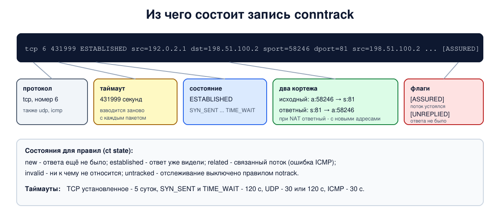

# Урок 55. conntrack: что хранится, состояния, таймауты

В уроках 51-54 правило "пропускать established,related" делало за нас самую тяжёлую работу: пропускала ответы и только их. За ней стоит **conntrack** - подсистема ядра, которая следит за каждым соединением, проходящим через машину. На ней держатся файервол с состоянием и весь NAT (уроки 56-58). В этом уроке заглянем в её таблицу: что в ней лежит, как меняются состояния, сколько живут записи и что будет, если таблица переполнится.

Учебники по сетям устройство conntrack не описывают; источники - `man 8 conntrack`, документация ядра (nf_conntrack-sysctl) и вики nftables, ссылки в конце урока.

## Что такое запись conntrack

Когда через машину проходит первый пакет нового потока, conntrack создаёт **запись** и дальше относит к ней все пакеты этого потока в обе стороны. Запись хранит:

- **два кортежа**: исходный (original) - адреса, протокол и порты, как их видит первый пакет, - и ответный (reply) - каким должен быть ответ. Без NAT ответный кортеж - зеркало исходного; с NAT в нём уже новые адреса (урок 56), и именно по нему conntrack узнаёт ответ и делает обратную замену;
- **состояние** протокола: для TCP - ход рукопожатия и закрытия (урок 37 и 38), для UDP и ICMP - видели ли ответ;
- **таймаут** - сколько секунд запись проживёт без новых пакетов;
- **флаги**: `[UNREPLIED]` - ответа ещё не было, `[ASSURED]` - ядро сочло поток устоявшимся: для TCP после завершённого рукопожатия, для UDP когда обмен в обе стороны длится дольше пары секунд; такие записи ядро не вытесняет первыми при нехватке места;
- метку (mark, урок 48), зону, сведения о NAT и счётчики, если они включены.

Важная мысль: conntrack отслеживает **потоки, а не только соединения TCP**. У UDP и ICMP соединений нет (урок 35), но conntrack всё равно заводит запись: обмен "запрос - ответ" с одними и теми же адресами и портами для него - поток.

## Состояния для правил

Для правил файервола conntrack сводит всё к нескольким состояниям пакета (`ct state` в nftables, `--ctstate` в iptables):

- **new** - пакеты потока, в котором пока видели трафик только в одну сторону (первый и следующие до ответа);
- **established** - пакет относится к потоку, в котором уже видели ответ;
- **related** - пакет нового потока, но связанного с известным: например, сообщение ICMP об ошибке к существующему соединению (урок 51) или канал данных FTP, если включён соответствующий помощник;
- **invalid** - пакет не удаётся отнести ни к чему разумному: например, TCP-сегмент вне окна или SYN+ACK и FIN без известного соединения. Такие обычно отбрасывают;
- **untracked** - пакет, для которого отслеживание отключено правилом `notrack`.

Внутри для TCP conntrack ведёт и более подробное состояние, похожее на состояние сокета из уроков 37-38: `SYN_SENT`, `SYN_RECV`, `ESTABLISHED`, `FIN_WAIT`, `CLOSE_WAIT`, `LAST_ACK`, `TIME_WAIT`, `CLOSE`. Но это состояние записи на промежуточной машине, которая видит пакеты обеих сторон, а не сокета одной из них.

## Таймауты

Запись живёт, пока по потоку идут пакеты; после каждого пакета её таймер взводится заново, и значение зависит от состояния. Основные (параметры `net.netfilter.nf_conntrack_*`, свои в каждом пространстве имён):

- установленное соединение TCP - 432000 секунд, **5 суток**: соединение может долго молчать, и запись не должна исчезнуть раньше него;
- незавершённое рукопожатие и закрытие - минуты и меньше: `SYN_SENT` - 120 секунд, `SYN_RECV` - 60, `TIME_WAIT` - 120;
- UDP - 30 секунд (без ответа и после короткого обмена) и 120, если обмен с ответами длится дольше пары секунд (`udp_timeout_stream`);
- ICMP - 30 секунд.

Отсюда частая проблема: если запись истекла, а соединение продолжает жить (например, оно молчало дольше таймаута), следующий пакет conntrack не узнает: он будет `new` (середину TCP-соединения ядро по умолчанию подхватывает как новый поток) или `invalid`. Пакет снаружи файервол отбросит, а за NAT поток получит новое преобразование, и соединение всё равно сломается. Поэтому долгоживущим соединениям нужны периодические пакеты-проверки (keepalive, уроки 38 и 46).

## Размер таблицы

Таблица conntrack - хеш-таблица в памяти ядра с ограниченным числом записей: `net.netfilter.nf_conntrack_max` (по умолчанию зависит от объёма памяти: больше 1 ГБ - 65536, больше 4 ГБ - 262144; у нас на сервере с 3,8 ГБ - 65536). Значение предела одно на всю машину (менять его можно только в начальном пространстве имён), но сравнивается оно со счётчиком записей каждого пространства имён отдельно; этот счётчик показывает `nf_conntrack_count`. Каждая запись занимает несколько сотен байт, поэтому таблица на сотни тысяч соединений требует десятков мегабайт - это нормально для маршрутизатора, но размер стоит знать.

## Инструменты

- `conntrack -L` - вывести таблицу, с фильтрами по протоколу, адресам, портам: `conntrack -L -p tcp --dport 443`;
- `conntrack -E` - события в реальном времени: создание, изменение, удаление записей;
- `conntrack -C` - число записей, `conntrack -S` - статистика, по строке на процессор (при мониторинге счётчики складывают по всем): сколько отброшено, сколько вытеснено, сколько вставок не удалось;
- `conntrack -D` и `-F` - удалить записи (например, после изменения правил NAT, чтобы старые потоки не держались за старое решение).

Пакет называется `conntrack` (`sudo apt install conntrack`).

## Как это увидеть в Linux

Три пространства имён: `a` (`192.0.2.1`) - маршрутизатор `r` с файерволом с состоянием - `s` (`198.51.100.2`). На `s` работают: TCP 80 - отвечает и сразу закрывает соединение, TCP 81 - держит соединение открытым, UDP 53 - отвечает, UDP 5300 - молча принимает. На `r` посмотрим запись открытого соединения TCP, всю жизнь короткого соединения через события `conntrack -E`, записи UDP с ответом и без, таймауты, статистику таблицы и, наконец, как правило `notrack` выводит часть трафика из-под отслеживания. Нужны Linux (подойдёт WSL2), права sudo, python3, nftables и conntrack (`sudo apt install python3 nftables conntrack`); всё создаётся в пространствах имён `hbh-*` и в конце удаляется.

Создай файл `conntrack-lab.sh` и запусти `bash conntrack-lab.sh`:
```
set -u
for c in python3 nft conntrack; do
  command -v $c >/dev/null || { echo "нужен $c: sudo apt install python3 nftables conntrack"; exit 1; }
done
ns="hbh-a hbh-r hbh-s"
# убрать остатки прошлого запуска
for n in $ns; do
  sudo ip netns pids $n 2>/dev/null | xargs -r sudo kill
  sudo ip netns del $n 2>/dev/null
done
d=$(mktemp -d)
chmod 755 "$d"
# a (192.0.2.1) - маршрутизатор r с отслеживанием соединений - s (198.51.100.2)
for n in $ns; do sudo ip netns add $n; sudo ip -n $n link set lo up; done
A="sudo ip netns exec hbh-a"
R="sudo ip netns exec hbh-r"
S="sudo ip netns exec hbh-s"
sudo ip link add eth0 netns hbh-a type veth peer name eth0 netns hbh-r
sudo ip link add eth0 netns hbh-s type veth peer name eth1 netns hbh-r
$A ip addr add 192.0.2.1/24 dev eth0
$R ip addr add 192.0.2.254/24 dev eth0
$R ip addr add 198.51.100.254/24 dev eth1
$S ip addr add 198.51.100.2/24 dev eth0
for n in $ns; do sudo ip netns exec $n ip link set eth0 up; done
$R ip link set eth1 up
$A ip route add default via 192.0.2.254
$S ip route add default via 198.51.100.254
$R sysctl -qw net.ipv4.ip_forward=1
# файервол с состоянием на r - он и включает отслеживание соединений
$R nft -f - <<'EOF'
table inet lab {
    chain forward_filter {
        type filter hook forward priority filter; policy drop;
        ct state established,related accept
        ct state invalid counter drop
        iifname "eth0" accept
    }
}
EOF
# на s: TCP 80 отвечает и закрывает соединение; TCP 81 держит соединение открытым;
# UDP 53 отвечает, UDP 5300 молча принимает
cat > "$d/srv.py" <<'EOF'
import socket, threading, time
def tcp(port, hold):
    l = socket.socket(); l.setsockopt(socket.SOL_SOCKET, socket.SO_REUSEADDR, 1)
    l.bind(("0.0.0.0", port)); l.listen()
    while True:
        c, _ = l.accept(); c.sendall(b"hello")
        if hold: threading.Thread(target=lambda c=c: (time.sleep(60), c.close())).start()
        else: c.close()
def udp():
    u = socket.socket(socket.AF_INET, socket.SOCK_DGRAM); u.bind(("0.0.0.0", 53))
    while True:
        data, peer = u.recvfrom(100); u.sendto(b"answer", peer)
threading.Thread(target=tcp, args=(80, False)).start()
threading.Thread(target=tcp, args=(81, True)).start()
def silent():
    u = socket.socket(socket.AF_INET, socket.SOCK_DGRAM); u.bind(("0.0.0.0", 5300))
    while True: u.recv(100)
threading.Thread(target=udp).start()
threading.Thread(target=silent).start()
EOF
cat > "$d/cli.py" <<'EOF'
import socket, sys, time
kind = sys.argv[1]
if kind == "tcp":
    c = socket.create_connection(("198.51.100.2", int(sys.argv[2]))); c.recv(100)
    time.sleep(float(sys.argv[3])); c.close()
elif kind == "udp":
    u = socket.socket(socket.AF_INET, socket.SOCK_DGRAM); u.bind(("0.0.0.0", 40000))
    u.sendto(b"question", ("198.51.100.2", int(sys.argv[2])))
    if sys.argv[3] == "wait": u.settimeout(1); u.recv(100)
EOF
$S python3 "$d/srv.py" &
sleep 0.5
$A ping -c 1 -W 1 198.51.100.2 >/dev/null
$R conntrack -F 2>/dev/null
clean() { sed -E 's/ +/ /g; s/(mark|zone|use)=[0-9]+ ?//g; s/ $//'; }
echo '--- 1. an open TCP connection in the table'
$A python3 "$d/cli.py" tcp 81 5 &
sleep 1
$R conntrack -L -p tcp 2>/dev/null | clean
echo '--- 2. the life of one short TCP connection (conntrack -E, events)'
$R timeout 3 conntrack -E -p tcp --dport 80 > "$d/ev" 2>/dev/null &
epid=$!
sleep 0.5
$A python3 "$d/cli.py" tcp 80 0.2
wait $epid
sed -E 's/ +/ /g; s/ (src|dst|sport|dport)=[^ ]+//g; s/ (mark|zone|use)=[0-9]+//g' "$d/ev" | awk '{$1 = $1; print "  " $0}'
echo '--- 3. UDP: no connection, but the table remembers the exchange'
$A python3 "$d/cli.py" udp 5300 nowait
$R conntrack -L -p udp 2>/dev/null | clean
$R conntrack -F 2>/dev/null
$A python3 "$d/cli.py" udp 53 wait
$R conntrack -L -p udp 2>/dev/null | clean
echo '--- 4. timeouts (seconds), per namespace'
for t in tcp_timeout_syn_sent tcp_timeout_established tcp_timeout_time_wait udp_timeout udp_timeout_stream icmp_timeout; do
  echo "  nf_conntrack_$t = $($R sysctl -n net.netfilter.nf_conntrack_$t)"
done
echo '--- 5. how full the table is, and the statistics to watch'
echo "  entries now: $($R sysctl -n net.netfilter.nf_conntrack_count), limit: $($R sysctl -n net.netfilter.nf_conntrack_max)"
$R conntrack -S 2>/dev/null | head -1 | sed -E 's/ +/ /g; s/^/  /'
echo '--- 6. notrack: tell conntrack to skip some traffic'
$R nft add table inet raw_lab
$R nft add chain inet raw_lab pre '{ type filter hook prerouting priority raw; }'
$R nft add rule inet raw_lab pre udp dport 5353 notrack
$R nft insert rule inet lab forward_filter ct state untracked counter accept
$R conntrack -F 2>/dev/null
$A python3 "$d/cli.py" udp 5353 nowait
$A python3 "$d/cli.py" udp 53 nowait
echo "  entries for udp 5353: $($R conntrack -L -p udp --dport 5353 2>/dev/null | wc -l), for udp 53: $($R conntrack -L -p udp --dport 53 2>/dev/null | wc -l)"
echo "  untracked packets passed: $($R nft list chain inet lab forward_filter | grep -oE 'untracked counter packets [0-9]+' | grep -oE '[0-9]+$')"
echo '--- cleanup'
for n in $ns; do
  sudo ip netns pids $n 2>/dev/null | xargs -r sudo kill
  sudo ip netns del $n
done
rm -rf "$d"
ip netns list | grep -cE '^hbh-(a|r|s)( |$)'
```

Вот что получилось на нашем сервере:
```
--- 1. an open TCP connection in the table
tcp 6 431999 ESTABLISHED src=192.0.2.1 dst=198.51.100.2 sport=58246 dport=81 src=198.51.100.2 dst=192.0.2.1 sport=81 dport=58246 [ASSURED]
--- 2. the life of one short TCP connection (conntrack -E, events)
  [NEW] tcp 6 120 SYN_SENT [UNREPLIED]
  [UPDATE] tcp 6 60 SYN_RECV
  [UPDATE] tcp 6 432000 ESTABLISHED [ASSURED]
  [UPDATE] tcp 6 120 FIN_WAIT [ASSURED]
  [UPDATE] tcp 6 30 LAST_ACK [ASSURED]
  [UPDATE] tcp 6 120 TIME_WAIT [ASSURED]
--- 3. UDP: no connection, but the table remembers the exchange
udp 17 29 src=192.0.2.1 dst=198.51.100.2 sport=40000 dport=5300 [UNREPLIED] src=198.51.100.2 dst=192.0.2.1 sport=5300 dport=40000
udp 17 29 src=192.0.2.1 dst=198.51.100.2 sport=40000 dport=53 src=198.51.100.2 dst=192.0.2.1 sport=53 dport=40000
--- 4. timeouts (seconds), per namespace
  nf_conntrack_tcp_timeout_syn_sent = 120
  nf_conntrack_tcp_timeout_established = 432000
  nf_conntrack_tcp_timeout_time_wait = 120
  nf_conntrack_udp_timeout = 30
  nf_conntrack_udp_timeout_stream = 120
  nf_conntrack_icmp_timeout = 30
--- 5. how full the table is, and the statistics to watch
  entries now: 1, limit: 65536
  cpu=0 	found=0 invalid=0 insert=0 insert_failed=0 drop=0 early_drop=0 error=0 search_restart=0 clash_resolve=0 chaintoolong=0 
--- 6. notrack: tell conntrack to skip some traffic
  entries for udp 5353: 0, for udp 53: 1
  untracked packets passed: 1
--- cleanup
0
```

Разберём.

**Шаг 1: запись открытого соединения.** Протокол `tcp` (номер 6), оставшийся таймаут 431999 секунд - почти 5 суток, состояние `ESTABLISHED`. Дальше два кортежа: исходный - от `a` (`192.0.2.1`, временный порт) к `s` на порт 81, и ответный - зеркальный, от `s` к `a`. Флаг `[ASSURED]`: рукопожатие завершено, запись считается устоявшейся.

**Шаг 2: жизнь короткого соединения.** События по порядку: `[NEW]` - пришёл SYN, состояние `SYN_SENT`, флаг `[UNREPLIED]`, таймаут 120; `[UPDATE]` `SYN_RECV` - сервер ответил SYN+ACK, таймаут 60; `ESTABLISHED [ASSURED]` с таймаутом 432000 - рукопожатие завершено. Потом закрытие: `FIN_WAIT` (первый FIN), `LAST_ACK` (второй FIN) и `TIME_WAIT` на 120 секунд. Запись не исчезнет сразу: она доживёт свой `TIME_WAIT`, чтобы опоздавшие пакеты ещё узнавались. Промежуточные состояния закрытия зависят от того, как именно стороны обменялись FIN и подтверждениями: в WSL2 между `FIN_WAIT` и `LAST_ACK` было ещё `CLOSE_WAIT`.

**Шаг 3: UDP.** Дейтаграмма на порт 5300, где никто не отвечает: запись с флагом `[UNREPLIED]` и таймаутом 30 секунд - conntrack ждёт ответа. Дейтаграмма на порт 53 с ответом: флага `[UNREPLIED]` нет, ответ узнан по ответному кортежу. Таймаут остался 30 секунд и флага `[ASSURED]` нет: ядро 6.8 считает обмен потоком, только если после ответа пакеты идут дольше 2 секунд от первого. Тогда таймаут становится 120 (`udp_timeout_stream`) и ставится `[ASSURED]`.

**Шаг 4: таймауты.** Те значения, о которых шла речь выше: `SYN_SENT` и `TIME_WAIT` - по 120 секунд, установленное соединение - 432000, UDP - 30 и 120, ICMP - 30.

**Шаг 5: заполненность и статистика.** В таблице одна запись из 65536 возможных (в WSL2 предел 262144: он считается от объёма памяти). Строка статистики `conntrack -S` для процессора 0: `insert_failed`, `drop`, `early_drop` - нули. Именно на эти счётчики смотрят, когда подозревают переполнение таблицы.

**Шаг 6: notrack.** В цепочке с приоритетом `raw` (-300, до conntrack, урок 52) правило `udp dport 5353 notrack` выключило отслеживание этих пакетов. Дейтаграмма на 5353 не создала записи (0), а на 53 создала (1). Правило `ct state untracked accept` мы вставили в начало цепочки, и пакет прошёл по нему (счётчик 1). Этот пакет пропустило бы и `iifname "eth0" accept`. А вот ответы на такой трафик `established` не станут: записи нет. Поэтому `notrack` ставят на оба направления (например, `udp dport 5353` и `udp sport 5353`), а пропускают этот трафик правилом `ct state untracked accept` или правилами без состояния. В нашем опыте `notrack` есть только для `dport 5353`, и ответ сервера, будь он, conntrack принял бы за новый поток с `eth1`, а политика его отбросила бы.

В конце `0`: пространства имён удалены.



## Безопасность: переполнение таблицы conntrack

Таблица conntrack конечна, а запись в ней занимает **каждый новый поток, который пропустил файервол**, в том числе к открытым службам от поддельных адресов (пакет, отброшенный правилом, записи в таблице не оставляет). Если записей становится больше, чем `nf_conntrack_max`, ядро сначала пытается вытеснить записи без флага `[ASSURED]` из соседних корзин хеш-таблицы, а если не получается - отбрасывает **новые** пакеты, и в журнале ядра появляется сообщение `nf_conntrack: table full, dropping packet`. Для пользователей это выглядит как отказ в обслуживании: уже установленные соединения работают, а новые не открываются. Причиной может быть и атака с потоком мусорных соединений, и просто рост нагрузки (много клиентов за NAT, сканирование, перегруженный DNS-сервер с короткими запросами по UDP).

Как защищаться:

- **Следить.** Отношение `nf_conntrack_count` к `nf_conntrack_max`, счётчики `drop`, `early_drop` и `insert_failed` в `conntrack -S` и сообщения `table full` в журнале ядра - в систему мониторинга, с предупреждением задолго до 100%.
- **Подобрать размер.** Увеличить `nf_conntrack_max` (и число корзин хеш-таблицы `nf_conntrack_buckets`) под реальную нагрузку и память машины.
- **Укоротить таймауты**, которые не нужны такими длинными: например, для незавершённых соединений и UDP; осторожно с `established`, чтобы не обрывать живые долгие соединения.
- **Не отслеживать то, что не нужно.** Высоконагруженные службы без NAT и с простыми правилами (DNS-сервер, отдача статики) можно вывести из-под conntrack правилом `notrack` в цепочке с приоритетом raw, как в шаге 6, и разрешить их трафик правилами без состояния.
- **Отсекать мусор раньше.** Ограничение частоты новых соединений с одного адреса (`limit`, `meter` в nftables), для потока SYN к открытым службам - SYNPROXY (`synproxy` в nftables): ядро само завершает рукопожатие с клиентом по SYN cookie (урок 37), и запись появляется только для настоящих соединений (SYN при этом выводят из-под conntrack правилом notrack, а подхват соединений с середины выключают: `nf_conntrack_tcp_loose = 0`), фильтрация на хуке `netdev ingress` или у провайдера - чтобы мусор не доходил до conntrack.

## Итог

- conntrack - подсистема ядра, которая ведёт таблицу потоков: на ней держатся файервол с состоянием и NAT.
- Запись хранит исходный и ответный кортежи, состояние, таймаут, флаги `[UNREPLIED]` и `[ASSURED]`, метку и сведения о NAT. Отслеживаются и TCP, и UDP, и ICMP.
- Состояния для правил: new, established, related, invalid, untracked; для TCP внутри есть подробные `SYN_SENT` ... `TIME_WAIT`.
- Таймауты зависят от состояния: установленный TCP - 5 суток, `SYN_SENT` и `TIME_WAIT` - 120 секунд, UDP - 30 или 120, ICMP - 30. Истёкшая запись делает живой поток чужим для файервола.
- Инструменты: `conntrack -L`, `-E`, `-C`, `-S`, `-D`, `-F`; параметры `nf_conntrack_count` и `nf_conntrack_max`.
- Переполнение таблицы отбрасывает новые соединения; защита - мониторинг, размер, таймауты, `notrack` для лишнего и отсечение мусора до conntrack.

## Что почитать

- `man 8 conntrack`.
- Документация ядра: Documentation/networking/nf_conntrack-sysctl.rst (все таймауты, `nf_conntrack_max`, `nf_conntrack_buckets`).
- Вики nftables: Matching connection tracking stateful metainformation, Setting packet connection tracking metainformation (notrack).
