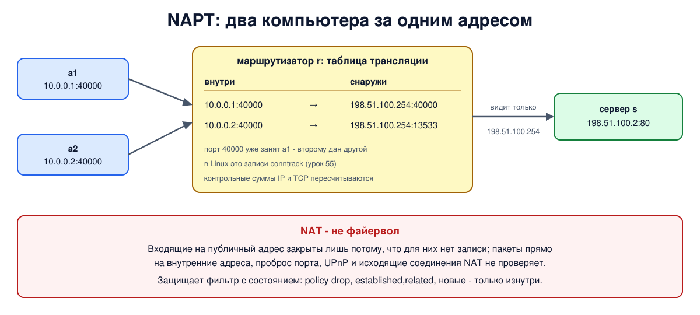

# Урок 56. NAT: зачем появился, NAT и NAPT

Дома у вас наверняка несколько устройств: ноутбук, телефоны, телевизор. У каждого адрес вида `192.168.1.x`, а в интернете все они выглядят как один адрес, который выдал провайдер. Это работа **NAT** (network address translation, преобразование сетевых адресов). В этом уроке разберём, зачем он понадобился, как устроен, что ломает и почему это не средство защиты, хотя его часто так называют. Как настраивать NAT в Linux, подробно - в уроке 57.

## Зачем появился NAT

Адресов IPv4 всего около 4,3 миллиарда (2^32, урок 21), и уже в первой половине 1990-х стало ясно, что на все устройства их не хватит. Долгосрочное решение - IPv6 (урок 30), но переход на него идёт медленно, и NAT стал временной мерой, которая живёт до сих пор (Таненбаум, разд. 5.7.2, с. 515-516). Свободные адреса IPv4 у большинства региональных регистраторов действительно закончились: Таненбаум (разд. 5.7.3, с. 519) пишет, что последние адреса IPv4 выделены 25 ноября 2019 года; точнее, в этот день закончились свободные адреса у RIPE NCC, регистратора Европы (урок 23).

Идея такая: внутри дома или организации устройства получают **частные адреса** из диапазонов `10.0.0.0/8`, `172.16.0.0/12` и `192.168.0.0/16` (RFC 1918, урок 23). Эти адреса используют в тысячах сетей одновременно, и в самом интернете их не бывает. А на границе сети стоит устройство с одним или несколькими публичными адресами, которое подменяет частный адрес отправителя на свой публичный на выходе и делает обратную замену для ответов.

## Базовый NAT и NAPT

Олифер (гл. 28, с. 880-885) различает два вида традиционного NAT - того, что обслуживает соединения, начатые изнутри:

- **базовый NAT** (Basic NAT, "один к одному") меняет только IP-адреса: каждому внутреннему узлу, который сейчас выходит наружу, достаётся свой публичный адрес из пула. Одновременно выйти наружу может не больше узлов, чем публичных адресов. Если соответствие задано заранее (статический NAT), к узлу можно обращаться и снаружи;
- **NAPT** (Network Address Port Translation, трансляция адресов и портов; на практике его тоже зовут просто NAT, у Cisco - PAT) меняет пару "адрес и порт": все узлы выходят наружу через **один** публичный адрес, а различаются по портам. Это то, что работает почти в каждом домашнем маршрутизаторе.

Как работает NAPT (Таненбаум, с. 516-518): для исходящего пакета маршрутизатор запоминает в **таблице трансляции** исходные адрес и порт, ставит вместо них свой публичный адрес и порт и пересчитывает контрольные суммы IP и TCP или UDP (в них входят адреса и порты, уроки 35-36). Ответ приходит на публичный адрес и этот порт - по таблице маршрутизатор находит, чей это ответ, возвращает частный адрес и порт и отправляет пакет внутрь. Порт может и сохраниться (так делает Linux), но если два узла выходят с одного порта к одному и тому же адресу и порту сервера, одному из них порт приходится поменять, иначе ответы не различить.

В Linux таблица трансляции - это таблица conntrack из урока 55: в записи исходный кортеж хранит частный адрес и порт, а ответный - публичный.

## Что NAT ломает

Таненбаум (с. 518-519) перечисляет проблемы, которые принёс NAT:

- **нет сквозной связности.** Снаружи нельзя просто подключиться к устройству за NAT: входящему пакету нет записи в таблице. Отсюда проблемы домашних серверов, игр, видеозвонков, обходные приёмы для пробивки NAT (урок 58) и проброс портов (урок 57);
- **NAT хранит состояние.** Сеть без соединений становится похожей на сеть с соединениями: перезагрузился маршрутизатор - все соединения через него оборвались;
- **NAT нарушает независимость уровней:** устройство сетевого уровня переписывает заголовки транспортного. Протоколы, кроме TCP, UDP и ICMP-запросов (эхо), через NAPT, по RFC 3022, не проходят: различать узлы без портов нечем;
- **адреса внутри данных.** FTP, SIP (телефония) и другие протоколы передают IP-адреса и порты в самих сообщениях. NAT меняет заголовок, но не содержимое, и такие протоколы ломаются, если не помогает специальный модуль-помощник (ALG);
- **порты конечны:** у одного публичного адреса порядка 64 тысяч портов на протокол (Linux берёт для замены порты 1024-65535), а значит и одновременных соединений к одному адресу и порту сервера.

Сегодня NAT часто стоит **дважды**: у вас дома и у провайдера. Провайдеры, которым не хватает публичных адресов, выдают абонентам адреса из диапазона `100.64.0.0/10`, специально отведённого для такого провайдерского NAT (CGNAT, RFC 6598), и уже свой NAT выводит их в интернет (урок 58). А в IPv6 адресов достаточно, и NAT там не нужен и обычно не используется: у каждого устройства свой публичный адрес.

## Как это увидеть в Linux

Четыре пространства имён: в "домашней" сети `10.0.0.0/24` компьютеры `a1` (`10.0.0.1`) и `a2` (`10.0.0.2`), их общий маршрутизатор `r` с одним публичным адресом `198.51.100.254` и сервер `s` (`198.51.100.2`), который отвечает каждому клиенту, с какого адреса и порта он его видит. Сначала попробуем выйти наружу без NAT, потом включим NAPT (в Linux это действие `masquerade` - разновидность SNAT, которая сама подставляет адрес выходного интерфейса; подробно в уроке 57) и выйдем двумя компьютерами с одного и того же порта, посмотрим таблицу трансляции и в конце поставим правильную защиту - фильтр с состоянием. Нужны Linux (подойдёт WSL2), права sudo, python3, nftables, conntrack и tcpdump (`sudo apt install python3 nftables conntrack tcpdump`); всё создаётся в пространствах имён `hbh-*` и в конце удаляется.

Создай файл `nat-lab.sh` и запусти `bash nat-lab.sh`:
```
set -u
for c in python3 nft conntrack tcpdump; do
  command -v $c >/dev/null || { echo "нужен $c: sudo apt install python3 nftables conntrack tcpdump"; exit 1; }
done
ns="hbh-a1 hbh-a2 hbh-r hbh-s"
# убрать остатки прошлого запуска
for n in $ns; do
  sudo ip netns pids $n 2>/dev/null | xargs -r sudo kill
  sudo ip netns del $n 2>/dev/null
done
d=$(mktemp -d)
chmod 755 "$d"
# домашняя сеть с частными адресами 10.0.0.0/24: a1 и a2, общий мост внутри r;
# у r один "белый" адрес 198.51.100.254, за ним сервер s (198.51.100.2)
for n in $ns; do sudo ip netns add $n; sudo ip -n $n link set lo up; done
R="sudo ip netns exec hbh-r"
S="sudo ip netns exec hbh-s"
$R ip link add br0 type bridge
for i in 1 2; do
  sudo ip link add eth0 netns hbh-a$i type veth peer name p$i netns hbh-r
  $R ip link set p$i master br0; $R ip link set p$i up
  sudo ip -n hbh-a$i addr add 10.0.0.$i/24 dev eth0
  sudo ip -n hbh-a$i link set eth0 up
  sudo ip -n hbh-a$i route add default via 10.0.0.254
done
$R ip addr add 10.0.0.254/24 dev br0
$R ip link set br0 up
sudo ip link add eth0 netns hbh-s type veth peer name eth1 netns hbh-r
$R ip addr add 198.51.100.254/24 dev eth1
$R ip link set eth1 up
$S ip addr add 198.51.100.2/24 dev eth0
$S ip link set eth0 up
$R sysctl -qw net.ipv4.ip_forward=1
# сервер на s: отвечает, с какого адреса и порта он видит клиента
cat > "$d/whoami.py" <<'EOF'
import socket
l = socket.socket(); l.setsockopt(socket.SOL_SOCKET, socket.SO_REUSEADDR, 1)
l.bind(("0.0.0.0", 80)); l.listen()
while True:
    c, peer = l.accept(); c.sendall(f"{peer[0]}:{peer[1]}".encode()); c.close()
EOF
# клиент: подключается к s с заданного порта, получает ответ, закрывает соединение и ещё немного работает
cat > "$d/cli.py" <<'EOF'
import socket, sys, time
c = socket.socket(); c.settimeout(1.5); c.setsockopt(socket.SOL_SOCKET, socket.SO_REUSEADDR, 1)
c.bind(("0.0.0.0", int(sys.argv[1])))
try:
    c.connect(("198.51.100.2", 80))
    print(f"server sees me as {c.recv(100).decode()}", flush=True); c.close()
except OSError as e:
    print(f"failed: {e.strerror or e}", flush=True)
time.sleep(float(sys.argv[2]) if len(sys.argv) > 2 else 0)
EOF
$S python3 "$d/whoami.py" &
sleep 0.5
echo '--- 1. without NAT: the server cannot answer a private address'
$S timeout 3 tcpdump -i eth0 -n -l -c 2 'tcp port 80' 2>/dev/null | sed -E 's/^[0-9:.]+ IP //; s/, options \[[^]]*\]//; s/, win [0-9]+//; s/, length 0//' &
tpid=$!
sleep 0.5
r=$(sudo ip netns exec hbh-a1 python3 "$d/cli.py" 39999)
wait $tpid
echo "a1: $r"
echo "  route on s to 10.0.0.0/24: $($S ip route get 10.0.0.1 2>&1 | head -1)"
echo '--- 2. with NAT (masquerade): two private hosts behind one public address'
$R nft add table ip nat
$R nft add chain ip nat postrouting '{ type nat hook postrouting priority srcnat; }'
$R nft add rule ip nat postrouting oifname eth1 ip saddr 10.0.0.0/24 masquerade
sudo ip netns exec hbh-a1 python3 "$d/cli.py" 40000 5 > "$d/c1" &
p1=$!
sleep 0.3
sudo ip netns exec hbh-a2 python3 "$d/cli.py" 40000 5 > "$d/c2" &
p2=$!
sleep 1
echo "a1 from port 40000: $(cat "$d/c1")"
echo "a2 from port 40000: $(cat "$d/c2")"
echo '--- 3. the translation table on r (conntrack)'
$R conntrack -L -p tcp --dport 80 2>/dev/null | sed -E 's/ +/ /g; s/(mark|zone|use)=[0-9]+ ?//g' | sort
wait $p1 $p2
echo '--- 4. NAT is not a firewall: the protection is a filter with state'
$R nft add table inet filter
$R nft add chain inet filter forward_filter '{ type filter hook forward priority filter; policy drop; }'
$R nft add rule inet filter forward_filter ct state established,related accept
$R nft add rule inet filter forward_filter iifname br0 oifname eth1 accept
$R nft list ruleset | grep -vE '^\s*$'
echo -n 'a1 still works: '; sudo ip netns exec hbh-a1 python3 "$d/cli.py" 40001
echo '--- cleanup'
for n in $ns; do
  sudo ip netns pids $n 2>/dev/null | xargs -r sudo kill
  sudo ip netns del $n
done
rm -rf "$d"
ip netns list | grep -cE '^hbh-(a1|a2|r|s)( |$)'
```

Вот что получилось на нашем сервере:
```
--- 1. without NAT: the server cannot answer a private address
10.0.0.1.39999 > 198.51.100.2.80: Flags [S], seq 2261757287
10.0.0.1.39999 > 198.51.100.2.80: Flags [S], seq 2261757287
a1: failed: timed out
  route on s to 10.0.0.0/24: RTNETLINK answers: Network is unreachable
--- 2. with NAT (masquerade): two private hosts behind one public address
a1 from port 40000: server sees me as 198.51.100.254:40000
a2 from port 40000: server sees me as 198.51.100.254:13533
--- 3. the translation table on r (conntrack)
tcp 6 118 TIME_WAIT src=10.0.0.1 dst=198.51.100.2 sport=40000 dport=80 src=198.51.100.2 dst=198.51.100.254 sport=80 dport=40000 [ASSURED] 
tcp 6 118 TIME_WAIT src=10.0.0.2 dst=198.51.100.2 sport=40000 dport=80 src=198.51.100.2 dst=198.51.100.254 sport=80 dport=13533 [ASSURED] 
--- 4. NAT is not a firewall: the protection is a filter with state
table ip nat {
	chain postrouting {
		type nat hook postrouting priority srcnat; policy accept;
		oifname "eth1" ip saddr 10.0.0.0/24 masquerade
	}
}
table inet filter {
	chain forward_filter {
		type filter hook forward priority filter; policy drop;
		ct state established,related accept
		iifname "br0" oifname "eth1" accept
	}
}
a1 still works: server sees me as 198.51.100.254:40001
--- cleanup
0
```

Разберём.

**Шаг 1: без NAT.** (Строки tcpdump идут раньше строки `a1:`: скрипт печатает ответ клиента только после того, как tcpdump закончил запись.) SYN от `a1` дошёл до сервера - tcpdump на `s` видит его, и даже повтор через секунду (урок 40). Отправитель - `10.0.0.1`, частный адрес. Ответить на него сервер не может: маршрута в `10.0.0.0/24` у него нет (`Network is unreachable`), как его нет и у любого маршрутизатора в интернете. Клиент получил `timed out`.

**Шаг 2: NAPT.** Одно правило `masquerade` на выходе в "интернет", и оба компьютера работают через один публичный адрес `198.51.100.254`. Оба вышли с порта 40000, но сервер видит их по-разному: `a1` - на порту 40000 (порт свободен, маршрутизатор его сохранил), `a2` - на другом, случайно выбранном (у нас 13533). Порт 40000 уже был занят записью соединения `a1` с тем же сервером, и ответы иначе было бы не различить. Номер второго порта от запуска к запуску разный.

**Шаг 3: таблица трансляции.** Это записи conntrack на `r`. В исходном кортеже - частный адрес и порт (`src=10.0.0.2 ... sport=40000`), в ответном - то, что видит сервер: ответ придёт на `dst=198.51.100.254`, `dport=13533`. По этой паре маршрутизатор и вернёт ответ `a2`. Обе записи в `TIME_WAIT`: сервер, отправив ответ, закрыл соединение, клиенты тоже; обмен FIN завершён, и записи доживают свои 120 секунд (урок 55). Пока запись `a1` жива, порт 40000 для того же сервера занят - поэтому `a2` и получил другой.

**Шаг 4: защита - фильтр с состоянием.** Без фильтра снаружи нельзя подключиться к `a1` через публичный адрес `r`: для такого пакета нет записи в таблице трансляции, это побочный эффект. А пакет, адресованный прямо на `10.0.0.1`, `r` без фильтра просто переслал бы внутрь (в опыте мы это не проверяли: у `s` нет маршрута в `10.0.0.0/24`). Настоящую защиту даёт цепочка `forward` с политикой `drop`: пропускаются ответы (`established,related`) и новые соединения только изнутри наружу (`br0` → `eth1`). `a1` по-прежнему выходит в интернет.

В конце `0`: пространства имён удалены.



## Безопасность: NAT - не средство защиты

Распространённое убеждение: "у меня NAT, значит, снаружи до меня не добраться". Олифер (гл. 28, с. 880, 882) прямо называет сокрытие внутренних адресов одной из целей NAT. Таненбаум (с. 516) уточняет, что NAT-устройство обычно совмещено с межсетевым экраном, и безопасность обеспечивает именно экран, отслеживающий входящий и исходящий трафик.

Почему NAT сам по себе не защищает:

- **закрытость входящих - побочный эффект**, а не политика. NAT не проверяет, что пакет разрешён, он просто не знает, кому его отдать. Любое правило входящей трансляции - проброс порта, DNAT, порт, открытый через UPnP, - открывает дорогу внутрь без всякой фильтрации;
- **исходящие соединения открыты.** Вредоносная программа внутри сети сама подключается наружу, и NAT честно пропускает и её соединение, и ответы на него;
- **сокрытие адресов почти ничего не скрывает:** число устройств и их типы часто видны по другим признакам трафика, а знание внутренних адресов само по себе не главная преграда для атаки;
- **соседи в сегменте провайдера** могут отправить пакет прямо на внутренний адрес через ваш маршрутизатор, если он пересылает пакеты без фильтра. NAT в обратную сторону ничего не проверяет;
- **в IPv6 NAT обычно не используют**: устройство получает публичный адрес, и если файервола нет, оно доступно напрямую (уроки 30 и 51).

Как защищаться:

- **Файервол с состоянием** на границе сети и для IPv4, и для IPv6: политика "запрещено всё, что не разрешено" для новых входящих соединений (уроки 51 и 54), как в шаге 4.
- **Отключить UPnP** на домашнем маршрутизаторе, если он не нужен: через него любая программа внутри может сама открыть себе порт снаружи.
- **Знать свои пробросы портов** и регулярно их проверять: каждый - это служба, доступная из интернета (урок 57).
- **Защищать сами устройства**: обновления, отсутствие лишних служб, хостовый файервол - как если бы NAT не было.

## Итог

- NAT появился из-за нехватки адресов IPv4: внутри - частные адреса RFC 1918, наружу - один или несколько публичных.
- Базовый NAT меняет только адреса (один к одному), NAPT - адрес и порт, и выводит всю сеть через один публичный адрес; при совпадении портов меняет порт.
- Таблица трансляции в Linux - это conntrack: исходный кортеж с частным адресом, ответный - с публичным. Контрольные суммы пересчитываются.
- NAT ломает сквозную связность, хранит состояние, мешает протоколам с адресами в данных и ограничен числом портов; у провайдеров бывает второй NAT (CGNAT, `100.64.0.0/10`); в IPv6 NAT обычно не используют.
- NAT - не защита: закрытость входящих - побочный эффект. Защищает файервол с состоянием для IPv4 и IPv6, отключённый UPnP, контроль пробросов и защищённые сами по себе устройства.

## Что почитать

- Олифер, гл. 28, с. 880-885: традиционный NAT, базовый NAT, NAPT, двойная трансляция (меняются оба адреса).
- Таненбаум, разд. 5.7.2, с. 515-519: NAT, таблица трансляции, проблемы NAT.
- RFC 1918 (частные адреса), RFC 3022 (традиционный NAT), RFC 2993 (архитектурные последствия NAT), RFC 6598 (адреса для провайдерского NAT).
