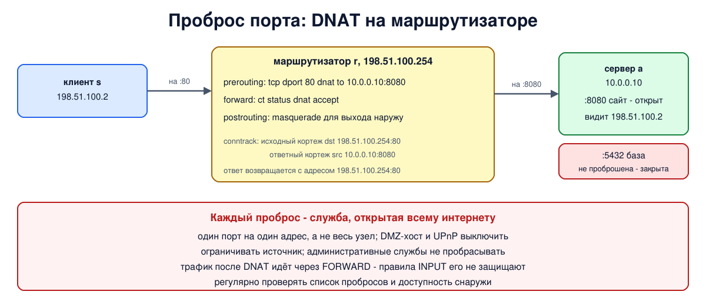

# Урок 57. SNAT, MASQUERADE, DNAT и проброс портов в Linux

В уроке 56 мы разобрали, что такое NAT и почему он не защищает. Теперь - как его настраивать в Linux: замена адреса отправителя для выхода в интернет (SNAT и MASQUERADE), замена адреса получателя для входящих (DNAT) и то, ради чего DNAT обычно и включают, - **проброс порта**: открыть снаружи доступ к одной службе внутри сети. И, конечно, как не открыть наружу то, что не собирались.

Учебники по сетям настройку NAT в Linux не описывают; источники - `man 8 nft`, вики nftables и `man 8 iptables-extensions`, ссылки в конце урока.

## Цепочки типа nat

NAT в nftables настраивается в базовых цепочках типа `nat`. Их особенность: **правила цепочки nat видят только первый пакет соединения.** Решение (менять или нет, на что) записывается в запись conntrack (урок 55), и все остальные пакеты соединения в обе стороны преобразуются по ней автоматически, без проверки правил. Поэтому NAT невозможен без conntrack, а изменения правил NAT не касаются уже установленных соединений (их сбрасывают через `conntrack -F` или `-D`).

Где какая замена делается (урок 52):

- **SNAT** (замена отправителя) - на хуке `postrouting`, приоритет `srcnat` (100): в самом конце, когда маршрут уже выбран и известен выходной интерфейс. Для пакетов, адресованных самой машине, SNAT можно сделать и на хуке `input` - тогда локальная программа увидит другой адрес отправителя;
- **DNAT** (замена получателя) - на хуке `prerouting`, приоритет `dstnat` (-100): до решения о маршруте, чтобы маршрут выбирался уже для нового адреса. Для пакетов самой машины - на хуке `output`.

## SNAT и MASQUERADE

Обе делают одно и то же - NAPT из урока 56: адрес отправителя заменяется публичным, порт по возможности сохраняется.

- `snat to 198.51.100.254` - заменить на **заданный** адрес (можно и диапазон адресов, и диапазон портов). Подходит, когда публичный адрес постоянный.
- `masquerade` - заменить на **адрес выходного интерфейса**, каким он будет в момент начала соединения. Удобно, когда адрес выдаёт провайдер по DHCP и он меняется: правило писать не нужно заново. Адрес при этом ищется заново для каждого нового соединения, а при выключении интерфейса ядро забывает все соединения, замаскированные через него: после переподключения адрес обычно другой, и они всё равно не работали бы.

В iptables (урок 53) то же самое пишется так: `iptables -t nat -A POSTROUTING -o eth1 -s 10.0.0.0/24 -j MASQUERADE` или `-j SNAT --to-source 198.51.100.254`.

## DNAT и проброс порта

`dnat to 10.0.0.10:8080` заменяет адрес получателя (и при желании порт). Типичное применение - **проброс порта** (port forwarding): соединения на публичный адрес маршрутизатора и порт 80 отправлять на внутренний сервер `10.0.0.10`, порт 8080. Для внешнего клиента всё выглядит так, будто служба работает на самом маршрутизаторе. В iptables: `iptables -t nat -A PREROUTING -i eth1 -p tcp --dport 80 -j DNAT --to-destination 10.0.0.10:8080`.

Важные следствия:

- **ответ должен пройти через тот же маршрутизатор** - только там есть запись conntrack для обратной замены. Если у внутреннего сервера другой маршрут по умолчанию, ответ уйдёт мимо, с внутренним адресом, и клиент его не примет;
- **внутренний сервер видит настоящий адрес клиента** - DNAT меняет только получателя;
- **пакеты после DNAT идут через FORWARD, а не через INPUT** маршрутизатора: адресованы они уже не ему. Значит, правила INPUT к проброшенному трафику отношения не имеют, а при политике `drop` в цепочке `forward` пробросу нужно отдельное разрешение. Удобнее всего условие `ct status dnat` - "соединение, к которому применён DNAT": тогда не нужно повторять адрес и порт из правила NAT. Обратная сторона: так разрешается любой DNAT, в том числе добавленный другими программами (UPnP, Docker), поэтому список правил NAT нужно держать под контролем, а при строгих требованиях - разрешать проброс явно: `ct status dnat ip daddr 10.0.0.10 tcp dport 8080 accept`;
- для пакетов, которые машина отправляет сама, нужно такое же правило DNAT в цепочке на хуке `output`, а для обращения изнутри сети на публичный адрес (hairpin) - отдельные правила, о них в уроке 58.

Родственное действие `redirect` - DNAT на адрес самой машины; к нему вернёмся в уроке 59 о прозрачных прокси.

## Как это увидеть в Linux

Три пространства имён: внутренний сервер `a` (`10.0.0.10`) с сайтом на порту 8080 и базой данных на порту 5432, которая должна оставаться только для своих; маршрутизатор `r` с внутренним адресом `10.0.0.254` и публичным `198.51.100.254`; внешний клиент `s` (`198.51.100.2`) со своим сайтом на порту 80. Каждая служба отвечает, с какого адреса видит клиента. Сначала выпустим `a` в "интернет" через SNAT и через masquerade, потом пробросим порт 80 на сайт `a`, посмотрим запись conntrack, затем добавим фильтр с политикой `drop` и увидим, что проброс без своего разрешения не работает. Нужны Linux (подойдёт WSL2), права sudo, python3, nftables и conntrack (`sudo apt install python3 nftables conntrack`); всё создаётся в пространствах имён `hbh-*` и в конце удаляется.

Создай файл `dnat-lab.sh` и запусти `bash dnat-lab.sh`:
```
set -u
for c in python3 nft conntrack; do
  command -v $c >/dev/null || { echo "нужен $c: sudo apt install python3 nftables conntrack"; exit 1; }
done
ns="hbh-a hbh-r hbh-s"
# убрать остатки прошлого запуска
for n in $ns; do
  sudo ip netns pids $n 2>/dev/null | xargs -r sudo kill
  sudo ip netns del $n 2>/dev/null
done
d=$(mktemp -d)
chmod 755 "$d"
# внутренний сервер a (10.0.0.10) - маршрутизатор r (10.0.0.254 и публичный 198.51.100.254) - клиент s (198.51.100.2)
for n in $ns; do sudo ip netns add $n; sudo ip -n $n link set lo up; done
A="sudo ip netns exec hbh-a"
R="sudo ip netns exec hbh-r"
S="sudo ip netns exec hbh-s"
sudo ip link add eth0 netns hbh-a type veth peer name eth0 netns hbh-r
sudo ip link add eth0 netns hbh-s type veth peer name eth1 netns hbh-r
$A ip addr add 10.0.0.10/24 dev eth0
$R ip addr add 10.0.0.254/24 dev eth0
$R ip addr add 198.51.100.254/24 dev eth1
$S ip addr add 198.51.100.2/24 dev eth0
for n in $ns; do sudo ip netns exec $n ip link set eth0 up; done
$R ip link set eth1 up
$A ip route add default via 10.0.0.254
$R sysctl -qw net.ipv4.ip_forward=1
# службы: на a - сайт 8080 и база 5432 (только для своих); на s - сайт 80; каждая говорит, кого видит
cat > "$d/srv.py" <<'EOF'
import socket, sys, threading
def serve(port):
    l = socket.socket(); l.setsockopt(socket.SOL_SOCKET, socket.SO_REUSEADDR, 1)
    l.bind(("0.0.0.0", port)); l.listen()
    while True:
        c, peer = l.accept(); c.sendall(f"port {port} sees {peer[0]}".encode()); c.close()
for p in sys.argv[1:]:
    threading.Thread(target=serve, args=(int(p),)).start()
EOF
cat > "$d/cli.py" <<'EOF'
import socket, sys
host, res = sys.argv[1], []
for port in sys.argv[2:]:
    c = socket.socket(); c.settimeout(1)
    try:
        c.connect((host, int(port))); r = c.recv(100).decode()
    except ConnectionRefusedError:
        r = "refused"
    except socket.timeout:
        r = "no answer"
    res.append(f"{port}: {r}")
print("; ".join(res))
EOF
$A python3 "$d/srv.py" 8080 5432 &
$S python3 "$d/srv.py" 80 &
sleep 0.5
echo '--- 1. outgoing: SNAT to a fixed address, then masquerade'
$R nft add table ip nat
$R nft add chain ip nat postrouting '{ type nat hook postrouting priority srcnat; }'
$R nft add rule ip nat postrouting oifname eth1 ip saddr 10.0.0.0/24 snat to 198.51.100.254
echo -n '  snat:       a -> s '; $A python3 "$d/cli.py" 198.51.100.2 80
$R nft flush chain ip nat postrouting
$R nft add rule ip nat postrouting oifname eth1 ip saddr 10.0.0.0/24 masquerade
echo -n '  masquerade: a -> s '; $A python3 "$d/cli.py" 198.51.100.2 80
echo '--- 2. incoming: forward public port 80 to the site on a:8080 (DNAT)'
echo -n '  before:     s -> r '; $S python3 "$d/cli.py" 198.51.100.254 80 5432
$R nft add chain ip nat prerouting '{ type nat hook prerouting priority dstnat; }'
$R nft add rule ip nat prerouting iifname eth1 tcp dport 80 dnat to 10.0.0.10:8080
echo -n '  after DNAT: s -> r '; $S python3 "$d/cli.py" 198.51.100.254 80 5432
echo '  the translation in conntrack:'
$R conntrack -L -p tcp -d 198.51.100.254 --orig-port-dst 80 2>/dev/null | sed -E 's/ +/ /g; s/(mark|zone|use)=[0-9]+ ?//g; s/^/    /'
echo '--- 3. with a stateful filter: the forwarded port needs its own permission'
$R nft add table inet filter
$R nft add chain inet filter forward_filter '{ type filter hook forward priority filter; policy drop; }'
$R nft add rule inet filter forward_filter ct state established,related accept
$R nft add rule inet filter forward_filter iifname eth0 oifname eth1 accept
echo -n '  policy drop only:      s -> r '; $S python3 "$d/cli.py" 198.51.100.254 80
$R nft add rule inet filter forward_filter ct status dnat counter accept
echo -n '  + ct status dnat:      s -> r '; $S python3 "$d/cli.py" 198.51.100.254 80
echo -n '  a -> s still works:    '; $A python3 "$d/cli.py" 198.51.100.2 80
echo '--- 4. the whole ruleset'
$R nft list ruleset | grep -vE '^\s*$'
echo '--- cleanup'
for n in $ns; do
  sudo ip netns pids $n 2>/dev/null | xargs -r sudo kill
  sudo ip netns del $n
done
rm -rf "$d"
ip netns list | grep -cE '^hbh-(a|r|s)( |$)'
```

Вот что получилось на нашем сервере:
```
--- 1. outgoing: SNAT to a fixed address, then masquerade
  snat:       a -> s 80: port 80 sees 198.51.100.254
  masquerade: a -> s 80: port 80 sees 198.51.100.254
--- 2. incoming: forward public port 80 to the site on a:8080 (DNAT)
  before:     s -> r 80: refused; 5432: refused
  after DNAT: s -> r 80: port 8080 sees 198.51.100.2; 5432: refused
  the translation in conntrack:
    tcp 6 119 TIME_WAIT src=198.51.100.2 dst=198.51.100.254 sport=48086 dport=80 src=10.0.0.10 dst=198.51.100.2 sport=8080 dport=48086 [ASSURED] 
--- 3. with a stateful filter: the forwarded port needs its own permission
  policy drop only:      s -> r 80: no answer
  + ct status dnat:      s -> r 80: port 8080 sees 198.51.100.2
  a -> s still works:    80: port 80 sees 198.51.100.254
--- 4. the whole ruleset
table ip nat {
	chain postrouting {
		type nat hook postrouting priority srcnat; policy accept;
		oifname "eth1" ip saddr 10.0.0.0/24 masquerade
	}
	chain prerouting {
		type nat hook prerouting priority dstnat; policy accept;
		iifname "eth1" tcp dport 80 dnat to 10.0.0.10:8080
	}
}
table inet filter {
	chain forward_filter {
		type filter hook forward priority filter; policy drop;
		ct state established,related accept
		iifname "eth0" oifname "eth1" accept
		ct status dnat counter packets 1 bytes 60 accept
	}
}
--- cleanup
0
```

Разберём.

**Шаг 1: исходящие.** И с `snat to 198.51.100.254`, и с `masquerade` сайт на `s` видит не `10.0.0.10`, а публичный адрес `198.51.100.254`. Разница не в результате, а в том, откуда берётся адрес: из правила или с интерфейса.

**Шаг 2: проброс порта.** До правила DNAT подключения к `198.51.100.254` на порты 80 и 5432 получали `refused`: на самом `r` эти порты никто не слушает. После правила на соединение с портом 80 ответил сайт `a` с порта 8080 - и он видит **настоящий адрес клиента** `198.51.100.2`. Порт 5432 по-прежнему `refused`: пробросили только 80, база данных снаружи недоступна. В записи conntrack виден весь фокус: исходный кортеж - `dst=198.51.100.254 dport=80` (куда обращался клиент), ответный - `src=10.0.0.10 sport=8080` (кто на самом деле отвечает). По ответному кортежу `r` вернёт ответу адрес `198.51.100.254` и порт 80.

**Шаг 3: проброс и фильтр.** Цепочка `forward` с политикой `drop` пропускает ответы и соединения изнутри наружу - и проброс перестал работать: `no answer`. Соединение снаружи внутрь новое, и ни одно правило его не разрешает. Добавили `ct status dnat accept` - проброс снова работает, счётчик правила показывает пакет. А `a` по-прежнему выходит в интернет.

**Шаг 4: весь набор правил.** Это минимальная конфигурация для транзитного трафика: masquerade для выхода сети наружу, один проброс порта и фильтр `forward` с политикой `drop`, разрешающий ответы, исходящие соединения и проброшенный трафик. На настоящем маршрутизаторе к ней нужна ещё цепочка `input` с политикой `drop` для его собственных служб (уроки 52 и 54).

В конце `0`: пространства имён удалены.



## Безопасность: случайно открытые наружу сервисы

Каждый проброс порта - это служба внутренней сети, доступная **всему интернету**. А открываются такие службы часто не намеренно:

- **проброс "на всякий случай" или временный**, о котором забыли: для игры, для удалённого доступа на один вечер, для проверки;
- **проброс всего узла** вместо одного порта - режим "DMZ-хост" в домашних маршрутизаторах или правило DNAT без указания порта: наружу открываются все службы машины, включая те, что никогда не предназначались для внешнего мира (база данных, панель администрирования, общие папки);
- **UPnP**: программы внутри сети сами просят маршрутизатор открыть им порт (урок 56);
- **Docker**: публикация порта контейнера (`-p 5432:5432`) - это DNAT на хосте, и такой порт открыт на всех адресах машины, мимо правил INPUT (уроки 46 и 53);
- **проброс в обход защиты**: трафик после DNAT идёт через FORWARD, и правила INPUT маршрутизатора, которые администратор считал защитой, его не касаются;
- **служба, рассчитанная только на свою сеть**: многие программы по умолчанию доверяют клиентам и не требуют пароля, а после проброса их клиентом может стать любой.

Как защищаться:

- **Пробрасывать минимум**: один нужный порт на один нужный адрес, а не весь узел; режим DMZ-хост и UPnP - выключить.
- **Ограничивать источник**, если служба нужна не всем: `ip saddr { ... }` в правиле DNAT или в разрешении в `forward`.
- **Административный доступ** (SSH, панели, базы данных) не пробрасывать вовсе: заходить к ним через VPN своей организации или через один хорошо защищённый вход.
- **Знать свои пробросы**: регулярно просматривать `nft list ruleset` (или настройки домашнего маршрутизатора) и удалять ненужные; публиковать порты Docker только на `127.0.0.1` (в актуальной версии Docker, см. урок 46), если они нужны локально.
- **Защищать саму службу** так, будто она в интернете, - потому что она в интернете: обновления, пароли, шифрование.
- **Проверять снаружи** со своей другой машины, что открыто только задуманное (урок 46).

## Итог

- Правила цепочек типа nat видят только первый пакет соединения; решение хранится в conntrack и применяется ко всем пакетам в обе стороны. Без conntrack NAT невозможен.
- SNAT и MASQUERADE - на `postrouting`: `snat to адрес` - заданный адрес, `masquerade` - адрес выходного интерфейса (для динамических адресов).
- DNAT - на `prerouting` (для своих пакетов на `output`): `dnat to адрес:порт`; проброс порта открывает внутреннюю службу снаружи, сервер видит настоящий адрес клиента, ответ должен вернуться через тот же маршрутизатор.
- Проброшенный трафик идёт через FORWARD: при политике `drop` ему нужно разрешение, удобно - `ct status dnat accept`.
- Каждый проброс - служба в интернете: минимум пробросов, ограничение источника, никакого проброса административных служб, выключенные DMZ-хост и UPnP, регулярный аудит и проверка снаружи.

## Что почитать

- `man 8 nft` (раздел NAT STATEMENTS), `man 8 iptables-extensions` (SNAT, DNAT, MASQUERADE).
- Вики nftables (wiki.nftables.org): Performing Network Address Translation (NAT), Matching connection tracking stateful metainformation (`ct status`).
