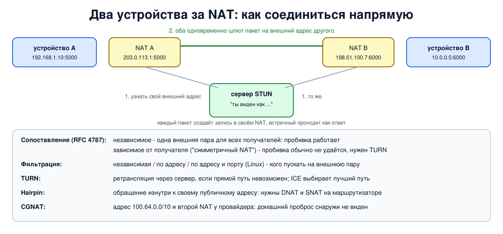

# Урок 58. Типы NAT, hairpin, CGNAT, обход NAT

NAT ломает сквозную связность (урок 56), а людям всё равно нужно звонить друг другу по видео, играть по сети и передавать файлы напрямую. Поэтому вокруг NAT выросло целое хозяйство: классификация того, как разные NAT себя ведут, правила hairpin для обращения изнутри к собственному публичному адресу, провайдерский NAT и способы установить прямое соединение между двумя устройствами за NAT. Разберём всё по порядку.

Учебники здесь почти не помогают: Таненбаум (разд. 5.7.2, с. 518) лишь упоминает, что для доступа к домашнему серверу нужны "специальные настройки или методы обхода NAT". Источники урока - RFC: 4787, 5128, 6888, 6598, 8489 (STUN), 8656 (TURN), 8445 (ICE); ссылки в конце.

## Как ведут себя NAT: сопоставление и фильтрация

RFC 4787 описывает поведение NAT для UDP двумя независимыми свойствами.

**Сопоставление** (mapping) - какой внешний адрес и порт NAT выдаёт внутреннему сокету:

- **независимое от получателя** (endpoint-independent mapping, EIM): один внутренний адрес и порт получает одну и ту же внешнюю пару, куда бы ни отправлялись пакеты;
- **зависимое от адреса** или **от адреса и порта получателя**: к разным получателям - разные внешние порты. Последний вариант в старой классификации назывался "симметричным NAT".

**Фильтрация** (filtering) - чьи пакеты NAT пропускает внутрь на уже выданную внешнюю пару:

- **независимая** (EIF): любые, от кого угодно (вместе с независимым сопоставлением это старый "полный конус", full cone);
- **зависимая от адреса** (ADF): только от тех адресов, куда изнутри уже отправляли пакеты;
- **зависимая от адреса и порта** (APDF): только от тех адресов и портов, куда уже отправляли.

RFC 4787 требует от NAT независимого сопоставления (требование REQ-1) - именно оно делает возможным прямое соединение двух устройств за NAT. Фильтрацию допускает любую: для прозрачности приложений рекомендует независимую, а если нужна строже - зависимую от адреса. Старые названия "конусов" RFC считает неточными, но они до сих пор встречаются в играх и настройках маршрутизаторов.

**Linux** с masquerade по умолчанию на практике ведёт себя так: сопоставление - независимое, пока порт свободен (порт сохраняется, урок 56), фильтрация - зависимая от адреса и порта: внутрь проходят только пакеты, совпадающие с записью conntrack.

## Hairpin

Внутри сети работает сервер, порт к нему проброшен на публичный адрес маршрутизатора (урок 57). Что будет, если компьютер **из той же сети** обратится к серверу по публичному адресу? Это называется **hairpin** ("шпилька"): пакет должен выйти к маршрутизатору и тут же развернуться обратно внутрь. Без специальных правил так не получается:

1. правило DNAT обычно привязано к внешнему интерфейсу и к пакету изнутри не применяется - соединение уходит на сам маршрутизатор;
2. если DNAT применить, сервер получит пакет с внутренним адресом клиента и ответит ему **напрямую** по локальной сети, минуя маршрутизатор. Клиент ждал ответа от публичного адреса, а пришёл ответ от внутреннего - он его отвергнет.

Поэтому для hairpin нужно и DNAT для пакетов изнутри, и SNAT: маршрутизатор подменяет отправителя на свой адрес, и ответ сервера возвращается через него. RFC 4787 требует поддержки hairpin от всех NAT (REQ-9), причём подставлять в качестве отправителя внешний адрес; простое правило masquerade на внутреннем интерфейсе, как в опыте ниже, подставляет внутренний адрес маршрутизатора - для работы этого достаточно. Альтернатива - DNS, который внутри сети отдаёт внутренний адрес сервера (split DNS; о DNS - блок 7).

## CGNAT: NAT у провайдера

Публичных адресов IPv4 не хватает и провайдерам (урок 56). Многие из них ставят **провайдерский NAT** (CGN, carrier-grade NAT): абонент получает адрес не из интернета, а из диапазона `100.64.0.0/10` (RFC 6598), а в интернет выходит через общий NAT провайдера вместе с сотнями других абонентов. Если дома тоже NAT - получается два NAT подряд (иногда это называют NAT444).

Чем это заметно абоненту:

- **проброс порта дома не помогает**: снаружи видно только адрес провайдерского NAT, а провайдер ваших пробросов не знает. Проверить просто: если адрес на внешнем интерфейсе домашнего маршрутизатора отличается от того, что показывают сайты "мой IP", и особенно если он из `100.64.0.0/10` - вы за CGNAT;
- **общий адрес с соседями**: блокировка по IP или капча из-за чужих действий бьёт по всем абонентам за тем же адресом;
- **ограниченное число портов** на абонента.

RFC 6888 требует, чтобы CGN выполнял требования RFC 4787 (значит, независимое сопоставление и hairpin, в том числе между абонентами), умел ограничивать число портов на абонента и давал абоненту протокол для явного открытия портов (рекомендуется PCP); рекомендует он и независимую фильтрацию. Он также описывает журналирование, по которому провайдер может установить, кто пользовался адресом и портом в данный момент.

## Обход NAT

Как установить прямое соединение между двумя устройствами, каждое из которых за NAT (RFC 5128)?

- **STUN** (RFC 8489): устройство отправляет запрос серверу STUN в интернете, и тот отвечает, с какого внешнего адреса и порта он видит запрос, - **отражённый адрес** (server-reflexive). Так устройство узнаёт, как его видят снаружи. Сам STUN NAT не обходит, он даёт сведения для других протоколов;
- **пробивка NAT** (hole punching): обе стороны через третий сервер обмениваются своими отражёнными адресами и почти одновременно отправляют пакеты друг другу. Пакет каждой стороны создаёт запись в её NAT, и встречный пакет уже подходит под неё как ответ. Работает, если сопоставление независимое: тогда отражённый адрес, узнанный у сервера STUN, подходит и для партнёра;
- **TURN** (RFC 8656): если прямой путь не получается (например, сопоставление зависит от получателя), трафик идёт через сервер-ретранслятор. Работает почти всегда, но это дорого: весь трафик через сервер;
- **ICE** (RFC 8445): собирает всех кандидатов - собственные адреса, отражённые (STUN) и ретранслируемые (TURN), - проверяет пары по приоритету и выбирает лучший рабочий путь. Именно ICE работает в браузерных видеозвонках (WebRTC).

Есть и способы попросить NAT открыть порт явно: **UPnP**, NAT-PMP и его преемник PCP. UPnP и NAT-PMP работают только с вашим собственным маршрутизатором; PCP рассчитан и на провайдерский NAT (RFC 6888 требует от CGN такого протокола и рекомендует PCP), но провайдеры включают его редко (об опасности UPnP - урок 56).



## Как это увидеть в Linux

Пять пространств имён - модель квартиры за провайдерским NAT: дома компьютер `a` (`192.168.1.10`) и веб-сервер `w` (`192.168.1.20`) за домашним маршрутизатором `h`; `h` получает от провайдера адрес `100.64.0.2`; провайдерский NAT `c` выводит всех в интернет через `203.0.113.1`; в интернете - `s` с двумя адресами, на которых работает "отражатель" в духе STUN: отвечает, с какого адреса и порта видит запрос, и по просьбе может отправить пакет с другого своего адреса. Посмотрим, как `a` выглядит снаружи через два NAT, проверим фильтрацию и пробивку, убедимся, что домашний проброс не виден из интернета, и настроим hairpin. Нужны Linux (подойдёт WSL2), права sudo, python3, nftables и conntrack (`sudo apt install python3 nftables conntrack`); всё создаётся в пространствах имён `hbh-*` и в конце удаляется.

Создай файл `cgnat-lab.sh` и запусти `bash cgnat-lab.sh`:
```
set -u
for c in python3 nft conntrack; do
  command -v $c >/dev/null || { echo "нужен $c: sudo apt install python3 nftables conntrack"; exit 1; }
done
ns="hbh-a hbh-w hbh-h hbh-c hbh-s"
# убрать остатки прошлого запуска
for n in $ns; do
  sudo ip netns pids $n 2>/dev/null | xargs -r sudo kill
  sudo ip netns del $n 2>/dev/null
done
d=$(mktemp -d)
chmod 755 "$d"
# дома: a (192.168.1.10) и веб-сервер w (192.168.1.20) за домашним маршрутизатором h;
# h получает от провайдера адрес 100.64.0.2 (CGNAT); провайдерский NAT c выводит всех через 203.0.113.1;
# в интернете s с двумя адресами 203.0.113.100 и 203.0.113.101
for n in $ns; do sudo ip netns add $n; sudo ip -n $n link set lo up; done
A="sudo ip netns exec hbh-a"
W="sudo ip netns exec hbh-w"
H="sudo ip netns exec hbh-h"
C="sudo ip netns exec hbh-c"
S="sudo ip netns exec hbh-s"
$H ip link add br0 type bridge
# если загружен модуль br_netfilter (в WSL2 он есть), пакеты внутри моста идут через netfilter; выключим это в h, как на сервере
$H sysctl -qw net.bridge.bridge-nf-call-iptables=0 2>/dev/null
sudo ip link add eth0 netns hbh-a type veth peer name pa netns hbh-h
sudo ip link add eth0 netns hbh-w type veth peer name pw netns hbh-h
for p in pa pw; do $H ip link set $p master br0; $H ip link set $p up; done
$H ip addr add 192.168.1.1/24 dev br0; $H ip link set br0 up
$A ip addr add 192.168.1.10/24 dev eth0; $A ip link set eth0 up; $A ip route add default via 192.168.1.1
$W ip addr add 192.168.1.20/24 dev eth0; $W ip link set eth0 up; $W ip route add default via 192.168.1.1
sudo ip link add wan netns hbh-h type veth peer name eth0 netns hbh-c
$H ip addr add 100.64.0.2/10 dev wan; $H ip link set wan up; $H ip route add default via 100.64.0.1
$C ip addr add 100.64.0.1/10 dev eth0; $C ip link set eth0 up
sudo ip link add eth1 netns hbh-c type veth peer name eth0 netns hbh-s
$C ip addr add 203.0.113.1/24 dev eth1; $C ip link set eth1 up
$S ip addr add 203.0.113.100/24 dev eth0; $S ip addr add 203.0.113.101/24 dev eth0; $S ip link set eth0 up
for n in hbh-h hbh-c; do sudo ip netns exec $n sysctl -qw net.ipv4.ip_forward=1; done
# NAT: дома и у провайдера
$H nft add table ip nat
$H nft add chain ip nat postrouting '{ type nat hook postrouting priority srcnat; }'
$H nft add rule ip nat postrouting oifname wan masquerade
$C nft add table ip nat
$C nft add chain ip nat postrouting '{ type nat hook postrouting priority srcnat; }'
$C nft add rule ip nat postrouting oifname eth1 ip saddr 100.64.0.0/10 snat to 203.0.113.1
# "отражатель" на s, как STUN: отвечает, с какого адреса и порта пришёл запрос; может и сам отправить пакет
cat > "$d/reflector.py" <<'EOF'
import select, socket
socks = {}
for addr, port in (("203.0.113.100", 3478), ("203.0.113.101", 3478), ("203.0.113.101", 3479)):
    u = socket.socket(socket.AF_INET, socket.SOCK_DGRAM); u.bind((addr, port)); socks[f"{addr}:{port}"] = u
while True:
    for u in select.select(list(socks.values()), [], [])[0]:
        data, peer = u.recvfrom(100)
        if data.startswith(b"send-to "):        # "send-to АДРЕС:ПОРТ via ОТКУДА": отправить пакет с другого адреса и порта s
            _, target, _, via = data.decode().split()
            host, port = target.rsplit(":", 1)
            socks[via].sendto(f"hello from {via}".encode(), (host, int(port)))
        else:
            u.sendto(f"{peer[0]}:{peer[1]}".encode(), peer)
EOF
# клиент на a: один сокет с порта 5000; спрашивает отражатели и слушает, что придёт
cat > "$d/peer.py" <<'EOF'
import socket, sys, time
u = socket.socket(socket.AF_INET, socket.SOCK_DGRAM); u.bind(("0.0.0.0", 5000)); u.settimeout(1)
def ask(server):
    u.sendto(b"who am i", (server, 3478)); return u.recv(100).decode()
def invite(via):                                # через 203.0.113.100 попросить, чтобы via прислал пакет на наш внешний адрес
    u.sendto(f"send-to 203.0.113.1:5000 via {via}".encode(), ("203.0.113.100", 3478)); time.sleep(0.3)
    try: return u.recv(100).decode()
    except socket.timeout: return "nothing arrived"
for step in sys.argv[1:]:
    if step.startswith("ask="):
        server = step.split("=")[1]
        print(f"  {server} sees me as {ask(server)}")
    elif step == "invite":
        print(f"  packet from 203.0.113.101:3479, a port we never wrote to: {invite('203.0.113.101:3479')}")
    elif step == "punch":                       # сначала самим отправить пакет на 203.0.113.101
        ask("203.0.113.101")
        print(f"  packet from 203.0.113.101:3478, after we wrote to it: {invite('203.0.113.101:3478')}")
EOF
# простой веб-сервер на w
cat > "$d/web.py" <<'EOF'
import socket
l = socket.socket(); l.setsockopt(socket.SOL_SOCKET, socket.SO_REUSEADDR, 1)
l.bind(("0.0.0.0", 8080)); l.listen()
while True:
    c, peer = l.accept(); c.sendall(f"web on w sees {peer[0]}".encode()); c.close()
EOF
cat > "$d/get.py" <<'EOF'
import socket, sys
c = socket.socket(); c.settimeout(1)
try:
    c.connect((sys.argv[1], int(sys.argv[2]))); print(c.recv(100).decode())
except OSError as e:
    print(f"failed: {e.strerror or e}")
EOF
$S python3 "$d/reflector.py" &
$W python3 "$d/web.py" &
sleep 0.5
echo '--- 1. two NATs in a row: what the internet sees (reflector, like STUN)'
$A python3 "$d/peer.py" ask=203.0.113.100 ask=203.0.113.101
echo '  home router h:'
$H conntrack -L -p udp 2>/dev/null | sed -E 's/ +/ /g; s/(mark|zone|use)=[0-9]+ ?//g; s/^/    /'
echo '  provider NAT c:'
$C conntrack -L -p udp 2>/dev/null | sed -E 's/ +/ /g; s/(mark|zone|use)=[0-9]+ ?//g; s/^/    /'
echo '--- 2. who may send to the mapped port 203.0.113.1:5000'
$H conntrack -F 2>/dev/null; $C conntrack -F 2>/dev/null
$A python3 "$d/peer.py" ask=203.0.113.100 punch invite
echo '--- 3. a port forward at home does not help behind CGNAT'
$H nft add chain ip nat prerouting '{ type nat hook prerouting priority dstnat; }'
$H nft add rule ip nat prerouting iifname wan tcp dport 8080 dnat to 192.168.1.20:8080
echo -n '  from the internet to the public address 203.0.113.1:8080:   '; $S python3 "$d/get.py" 203.0.113.1 8080
echo -n '  from the provider network to the home address 100.64.0.2:8080: '; $C python3 "$d/get.py" 100.64.0.2 8080
echo '--- 4. hairpin: a at home opens the forwarded port by the router address'
echo -n '  a -> 100.64.0.2:8080 without hairpin rules: '; $A python3 "$d/get.py" 100.64.0.2 8080
$H nft add rule ip nat prerouting iifname br0 ip daddr 100.64.0.2 tcp dport 8080 dnat to 192.168.1.20:8080
echo -n '  + DNAT also for the home network:         '; $A python3 "$d/get.py" 100.64.0.2 8080
$H nft add rule ip nat postrouting oifname br0 ip saddr 192.168.1.0/24 ip daddr 192.168.1.20 tcp dport 8080 masquerade
echo -n '  + SNAT of the hairpin traffic:            '; $A python3 "$d/get.py" 100.64.0.2 8080
echo '--- cleanup'
for n in $ns; do
  sudo ip netns pids $n 2>/dev/null | xargs -r sudo kill
  sudo ip netns del $n
done
rm -rf "$d"
ip netns list | grep -cE '^hbh-(a|w|h|c|s)( |$)'
```

Вот что получилось на нашем сервере:
```
--- 1. two NATs in a row: what the internet sees (reflector, like STUN)
  203.0.113.100 sees me as 203.0.113.1:5000
  203.0.113.101 sees me as 203.0.113.1:5000
  home router h:
    udp 17 29 src=192.168.1.10 dst=203.0.113.100 sport=5000 dport=3478 src=203.0.113.100 dst=100.64.0.2 sport=3478 dport=5000 
    udp 17 29 src=192.168.1.10 dst=203.0.113.101 sport=5000 dport=3478 src=203.0.113.101 dst=100.64.0.2 sport=3478 dport=5000 
  provider NAT c:
    udp 17 29 src=100.64.0.2 dst=203.0.113.101 sport=5000 dport=3478 src=203.0.113.101 dst=203.0.113.1 sport=3478 dport=5000 
    udp 17 29 src=100.64.0.2 dst=203.0.113.100 sport=5000 dport=3478 src=203.0.113.100 dst=203.0.113.1 sport=3478 dport=5000 
--- 2. who may send to the mapped port 203.0.113.1:5000
  203.0.113.100 sees me as 203.0.113.1:5000
  packet from 203.0.113.101:3478, after we wrote to it: hello from 203.0.113.101:3478
  packet from 203.0.113.101:3479, a port we never wrote to: nothing arrived
--- 3. a port forward at home does not help behind CGNAT
  from the internet to the public address 203.0.113.1:8080:   failed: Connection refused
  from the provider network to the home address 100.64.0.2:8080: web on w sees 100.64.0.1
--- 4. hairpin: a at home opens the forwarded port by the router address
  a -> 100.64.0.2:8080 without hairpin rules: failed: Connection refused
  + DNAT also for the home network:         failed: timed out
  + SNAT of the hairpin traffic:            web on w sees 192.168.1.1
--- cleanup
0
```

Разберём.

**Шаг 1: два NAT подряд.** Оба адреса "отражателя" видят `a` как `203.0.113.1:5000` - это адрес провайдерского NAT, а не домашний и тем более не `192.168.1.10`. Порт 5000 сохранился на обоих NAT, и к двум разным получателям `a` выходит через одну и ту же внешнюю пару: здесь сопоставление ведёт себя как независимое - порт свободен, и Linux его сохранил. Записи conntrack показывают обе трансляции: дома `192.168.1.10` превращается в `100.64.0.2`, у провайдера `100.64.0.2` - в `203.0.113.1`.

**Шаг 2: фильтрация и пробивка.** `a` сам отправил пакет на `203.0.113.101:3478` - и пакет оттуда дошёл: исходящий пакет создал запись, встречный подошёл под неё. А пакет с того же адреса, но с порта `3479`, куда `a` ничего не отправлял, внутрь не прошёл: на `c` для него нет записи, он попадает на сам `c`, где порт 5000 никто не слушает. Значит, фильтрация зависит не только от адреса, но и от порта. Это и есть пробивка NAT - только в настоящей жизни "встречные" пакеты отправляют обе стороны, и у каждой свой NAT.

**Шаг 3: проброс за CGNAT.** Дома настроен проброс порта 8080 на `w`. Из интернета на `203.0.113.1:8080` - `Connection refused`: на провайдерском NAT такого проброса нет: пакет попадает на сам `c`, где порт 8080 никто не слушает, и `c` отвечает отказом. А из сети провайдера на домашний адрес `100.64.0.2:8080` проброс работает: `w` видит `100.64.0.1`. Вывод: за CGNAT домашний проброс бесполезен, нужен публичный адрес (у провайдера его обычно можно заказать), IPv6 или выход через внешний сервер.

**Шаг 4: hairpin.** `a` обращается к пробросу по адресу маршрутизатора `100.64.0.2:8080`. Без дополнительных правил - `Connection refused`: правило DNAT привязано к внешнему интерфейсу, и соединение пришло на сам `h`, где порт 8080 никто не слушает. Добавили DNAT и для домашней сети - `timed out`: `w` получил пакет от `192.168.1.10` и ответил напрямую по мосту, а `a` ждал ответа от `100.64.0.2` и такой ответ не принял. Добавили SNAT для этого трафика - работает, и `w` видит клиента как `192.168.1.1`, адрес маршрутизатора: ответ теперь возвращается через `h`.

Одна тонкость: если в системе загружен модуль `br_netfilter` (в WSL2 он есть, на нашем сервере - нет), пакеты, которые ходят внутри моста, тоже проходят через netfilter и conntrack, и hairpin может заработать уже без SNAT. Поэтому скрипт выключает это для `h`: `net.bridge.bridge-nf-call-iptables=0` (параметр свой у каждого пространства имён, на хосте ничего не меняется).

В конце `0`: пространства имён удалены.

## Итог

- Поведение NAT описывают сопоставление (независимое, зависимое от адреса, от адреса и порта получателя) и фильтрация (независимая, по адресу, по адресу и порту). RFC 4787 требует независимого сопоставления; Linux с masquerade сохраняет порт, пока он не занят, и фильтрует по адресу и порту.
- Hairpin - обращение изнутри к собственному публичному адресу; нужны DNAT для внутренних пакетов и SNAT, иначе сервер ответит напрямую и ответ отвергнут. Альтернатива - split DNS.
- CGNAT: абонент получает адрес из `100.64.0.0/10` и выходит через провайдерский NAT; домашний проброс снаружи не виден, адрес общий с соседями, порты ограничены.
- Обход NAT: STUN сообщает отражённый адрес, пробивка работает при независимом сопоставлении, TURN ретранслирует, когда прямой путь не получается, ICE выбирает лучший путь (WebRTC). UPnP, NAT-PMP и PCP просят открыть порт явно.

## Что почитать

- Таненбаум, разд. 5.7.2, с. 518: NAT и сквозная связность.
- RFC 4787 (поведение NAT для UDP), RFC 5128 (P2P через NAT, пробивка), RFC 6598 (адреса для CGN), RFC 6888 (требования к CGN).
- RFC 8489 (STUN), RFC 8656 (TURN), RFC 8445 (ICE).
