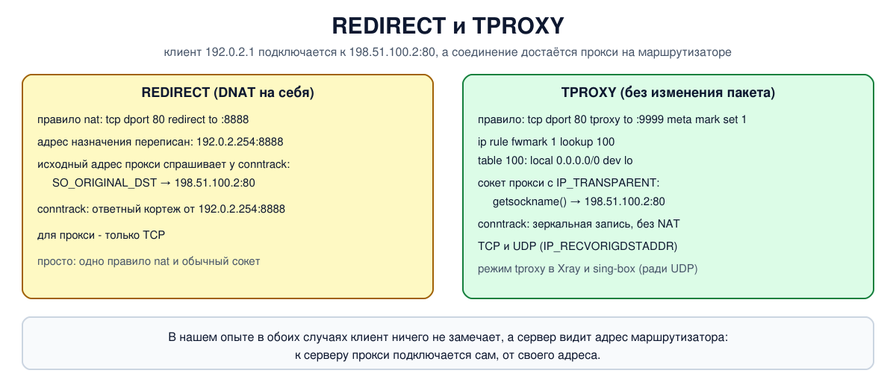

# Урок 59. Прозрачное проксирование: REDIRECT и TPROXY

Обычный прокси клиент знает в лицо: в настройках браузера или программы указан его адрес, и программа сама отправляет запросы ему. **Прозрачный прокси** работает иначе: клиент ничего о нём не знает и обращается к серверу напрямую, а маршрутизатор на пути перехватывает соединение и отдаёт его прокси-программе. Так устроены кэширующие прокси провайдеров, системы фильтрации в организациях и - что нам особенно важно для последних блоков курса - режимы прозрачного прокси у Xray и sing-box на маршрутизаторах с OpenWrt. В Linux для этого есть два механизма: **REDIRECT** и **TPROXY**.

Учебники по сетям эти механизмы Linux не описывают; источники - документация ядра (Documentation/networking/tproxy.rst), `man 8 nft`, `man 8 iptables-extensions`, ссылки в конце урока.

## Главный вопрос прозрачного прокси

Прокси получает соединение, которое клиент открывал **не к нему**. Чтобы выполнить работу, прокси нужно узнать, куда клиент хотел попасть на самом деле: адрес и порт исходного получателя. REDIRECT и TPROXY по-разному решают, как доставить соединение прокси и как сообщить ему этот адрес.

## REDIRECT

`redirect to :8888` - это частный случай DNAT из урока 57: адрес получателя заменяется адресом самой машины (основным адресом интерфейса, куда пришёл пакет; для пакетов, созданных самой машиной, - 127.0.0.1), порт - заданным. Соединение попадает на обычный сокет прокси, слушающий порт 8888.

Адрес получателя при этом **переписан**, но conntrack помнит исходный кортеж (урок 55). Прокси спрашивает его опцией сокета `SO_ORIGINAL_DST` - ядро отвечает исходным адресом и портом из записи conntrack.

Особенности REDIRECT:

- для прокси - только TCP: `SO_ORIGINAL_DST` ядро поддерживает только для TCP (и SCTP), для UDP возвращает ошибку, и узнать исходный адрес дейтаграммы так нельзя. Для UDP REDIRECT годится, только когда исходный адрес не нужен - например, чтобы завернуть все запросы DNS на свой резолвер;
- это NAT, значит, нужен conntrack, а адрес назначения в пакете меняется;
- настройка простая: одно правило в цепочке типа nat и обычный сокет.

## TPROXY

**TPROXY** (transparent proxy) доставляет пакет сокету прокси **без изменений**: адрес и порт назначения остаются прежними, NAT не применяется. Как это возможно, если пакет адресован чужому серверу? Нужны три части:

1. **правило с выражением `tproxy`** на хуке prerouting (цепочка типа filter, обычно с приоритетом mangle): оно находит прозрачный сокет прокси на заданном порту и привязывает к нему пакет, а выражение `meta mark set 1` в том же правиле ставит пакету метку (в iptables то же делает опция `--tproxy-mark`). Если подходящего сокета нет, правило не срабатывает и пакет идёт дальше как обычно;
2. **маршрут local для помеченных пакетов**: по правилу policy routing из урока 48 (`ip rule add fwmark 1 lookup 100`) пакеты с меткой ищут маршрут в таблице 100, где стоит `local 0.0.0.0/0 dev lo`, - "любой адрес считать своим". Без этого ядро сочло бы пакет транзитным и отправило в FORWARD (урок 52), а там пакет, уже привязанный к сокету прокси, отбрасывается - соединение не установилось бы;
3. **сокет с опцией `IP_TRANSPARENT`**: обычный сокет не принимает соединения на чужие адреса, а прозрачный - принимает. Опция требует привилегий (`CAP_NET_ADMIN` или `CAP_NET_RAW`).

Прокси узнаёт исходный адрес просто: для принятого соединения `getsockname()` возвращает тот адрес и порт, на которые клиент подключался. Для UDP есть опция `IP_RECVORIGDSTADDR`, которая сообщает адрес назначения каждой дейтаграммы, поэтому **TPROXY работает и с UDP** - в этом его главное преимущество перед REDIRECT. С `IP_TRANSPARENT` прокси может и отправлять пакеты от чужого адреса, например ответы на UDP от имени настоящего сервера.

Поэтому в Xray и sing-box есть оба режима прозрачного прокси, redirect и tproxy, и документация Xray прямо пишет: redirect - только TCP, tproxy - TCP и UDP. Чтобы через прокси на маршрутизаторе шли и TCP, и UDP (например, DNS и QUIC), выбирают tproxy. Об этом - в блоках 11 и 12.



## Как это увидеть в Linux

Три пространства имён: клиент `a` (`192.0.2.1`), маршрутизатор `r` и сервер `s` (`198.51.100.2`) с сайтом на порту 80, который отвечает, кого видит. На `r` работает маленький прокси на Python: принимает перехваченное соединение, узнаёт исходный адрес назначения, сам подключается к серверу и возвращает клиенту ответ сервера со своей пометкой. Сначала клиент обратится к серверу напрямую, потом через REDIRECT, потом через TPROXY; после каждого способа посмотрим запись conntrack. Нужны Linux (подойдёт WSL2), права sudo, python3, nftables и conntrack (`sudo apt install python3 nftables conntrack`); всё создаётся в пространствах имён `hbh-*` и в конце удаляется.

Создай файл `tproxy-lab.sh` и запусти `bash tproxy-lab.sh`:
```
set -u
for c in python3 nft conntrack; do
  command -v $c >/dev/null || { echo "нужен $c: sudo apt install python3 nftables conntrack"; exit 1; }
done
ns="hbh-a hbh-r hbh-s"
# убрать остатки прошлого запуска
for n in $ns; do
  sudo ip netns pids $n 2>/dev/null | xargs -r sudo kill
  sudo ip netns del $n 2>/dev/null
done
d=$(mktemp -d)
chmod 755 "$d"
# клиент a (192.0.2.1) - маршрутизатор r с прокси - сервер s (198.51.100.2)
for n in $ns; do sudo ip netns add $n; sudo ip -n $n link set lo up; done
A="sudo ip netns exec hbh-a"
R="sudo ip netns exec hbh-r"
S="sudo ip netns exec hbh-s"
sudo ip link add eth0 netns hbh-a type veth peer name eth0 netns hbh-r
sudo ip link add eth0 netns hbh-s type veth peer name eth1 netns hbh-r
$A ip addr add 192.0.2.1/24 dev eth0
$R ip addr add 192.0.2.254/24 dev eth0
$R ip addr add 198.51.100.254/24 dev eth1
$S ip addr add 198.51.100.2/24 dev eth0
for n in $ns; do sudo ip netns exec $n ip link set eth0 up; done
$R ip link set eth1 up
$A ip route add default via 192.0.2.254
$S ip route add default via 198.51.100.254
$R sysctl -qw net.ipv4.ip_forward=1
# сервер на s: сообщает, кого видит
cat > "$d/web.py" <<'EOF'
import socket
l = socket.socket(); l.setsockopt(socket.SOL_SOCKET, socket.SO_REUSEADDR, 1)
l.bind(("0.0.0.0", 80)); l.listen()
while True:
    c, peer = l.accept(); c.recv(100); c.sendall(f"server sees {peer[0]}".encode()); c.close()
EOF
# прокси на r: принимает перехваченное соединение, узнаёт, куда клиент хотел попасть, и сам идёт туда
cat > "$d/proxy.py" <<'EOF'
import socket, struct, sys
mode, port = sys.argv[1], int(sys.argv[2])
l = socket.socket(); l.setsockopt(socket.SOL_SOCKET, socket.SO_REUSEADDR, 1)
if mode == "tproxy":
    l.setsockopt(socket.SOL_IP, 19, 1)              # IP_TRANSPARENT: принимать соединения на чужие адреса
l.bind(("0.0.0.0", port)); l.listen()
while True:
    c, peer = l.accept()
    if mode == "redirect":                          # адрес назначения переписан, оригинал - у conntrack
        raw = c.getsockopt(socket.SOL_IP, 80, 16)   # SO_ORIGINAL_DST
        dport, dst = struct.unpack("!H", raw[2:4])[0], socket.inet_ntoa(raw[4:8])
        local = c.getsockname()
    else:                                           # TPROXY: сокет и так знает настоящий адрес назначения
        dst, dport = c.getsockname()
        local = (dst, dport)
    data = c.recv(100)
    up = socket.create_connection((dst, dport), timeout=2); up.sendall(data)
    answer = up.recv(100).decode()
    c.sendall(f"[{mode}: socket local address {local[0]}:{local[1]}, original destination {dst}:{dport}] {answer}".encode())
    c.close()
EOF
cat > "$d/get.py" <<'EOF'
import socket
c = socket.create_connection(("198.51.100.2", 80), timeout=2); c.sendall(b"GET")
print("  client got:", c.recv(300).decode())
EOF
$S python3 "$d/web.py" &
sleep 0.5
echo '--- 1. no proxy: the client talks to the server directly'
$A python3 "$d/get.py"
echo '--- 2. REDIRECT: DNAT to the router itself, port 8888'
$R python3 "$d/proxy.py" redirect 8888 &
sleep 0.5
$R nft add table ip lab
$R nft add chain ip lab prerouting '{ type nat hook prerouting priority dstnat; }'
$R nft add rule ip lab prerouting iifname eth0 tcp dport 80 redirect to :8888
$A python3 "$d/get.py"
echo '  conntrack on r (the incoming connection):'
$R conntrack -L -p tcp -s 192.0.2.1 2>/dev/null | sed -E 's/ +/ /g; s/(mark|zone|use)=[0-9]+ ?//g; s/^/    /'
$R nft delete table ip lab
$R conntrack -F 2>/dev/null
echo '--- 3. TPROXY: the packet is delivered to the proxy socket unchanged'
$R python3 "$d/proxy.py" tproxy 9999 &
sleep 0.5
# пакеты с меткой 1 доставлять на саму машину: маршрут local на всё в отдельной таблице
$R ip rule add fwmark 1 lookup 100
$R ip route add local 0.0.0.0/0 dev lo table 100
$R nft add table ip lab
$R nft add chain ip lab tproxy_pre '{ type filter hook prerouting priority mangle; }'
$R nft add rule ip lab tproxy_pre iifname eth0 tcp dport 80 tproxy to :9999 meta mark set 1 accept
# правило со ct, чтобы conntrack был включён и мы увидели запись
$R nft add chain ip lab input '{ type filter hook input priority filter; }'
$R nft add rule ip lab input ct state new counter
$A python3 "$d/get.py"
echo '  conntrack on r (the incoming connection):'
$R conntrack -L -p tcp -s 192.0.2.1 2>/dev/null | sed -E 's/ +/ /g; s/(mark|zone|use)=[0-9]+ ?//g; s/^/    /'
echo '  the rule and the route that make it work:'
$R ip rule show | grep fwmark | sed 's/^/    /'
$R ip route show table 100 | sed 's/^/    /'
echo '--- cleanup'
for n in $ns; do
  sudo ip netns pids $n 2>/dev/null | xargs -r sudo kill
  sudo ip netns del $n
done
rm -rf "$d"
ip netns list | grep -cE '^hbh-(a|r|s)( |$)'
```

Вот что получилось на нашем сервере:
```
--- 1. no proxy: the client talks to the server directly
  client got: server sees 192.0.2.1
--- 2. REDIRECT: DNAT to the router itself, port 8888
  client got: [redirect: socket local address 192.0.2.254:8888, original destination 198.51.100.2:80] server sees 198.51.100.254
  conntrack on r (the incoming connection):
    tcp 6 119 TIME_WAIT src=192.0.2.1 dst=198.51.100.2 sport=52222 dport=80 src=192.0.2.254 dst=192.0.2.1 sport=8888 dport=52222 [ASSURED] 
--- 3. TPROXY: the packet is delivered to the proxy socket unchanged
  client got: [tproxy: socket local address 198.51.100.2:80, original destination 198.51.100.2:80] server sees 198.51.100.254
  conntrack on r (the incoming connection):
    tcp 6 119 TIME_WAIT src=192.0.2.1 dst=198.51.100.2 sport=37350 dport=80 src=198.51.100.2 dst=192.0.2.1 sport=80 dport=37350 [ASSURED] 
  the rule and the route that make it work:
    32765:	from all fwmark 0x1 lookup 100
    local default dev lo scope host 
--- cleanup
0
```

Разберём.

**Шаг 1: без прокси.** Сервер видит клиента `192.0.2.1`: маршрутизатор просто пересылает пакеты.

**Шаг 2: REDIRECT.** Клиент подключался к `198.51.100.2:80`, а соединение принял прокси на `r`: локальный адрес его сокета - `192.0.2.254:8888`, адрес `r` на стороне клиента и порт прокси. Исходный адрес `198.51.100.2:80` прокси узнал через `SO_ORIGINAL_DST`, подключился к серверу сам - и сервер видит уже `198.51.100.254`, адрес `r`. Клиент при этом ничего не заметил: ответ пришёл ему от `198.51.100.2:80`. Запись conntrack показывает, что это NAT: исходный кортеж - к `198.51.100.2:80`, а ответный - от `192.0.2.254:8888`.

**Шаг 3: TPROXY.** Теперь локальный адрес сокета прокси - **`198.51.100.2:80`**, адрес настоящего сервера: пакет пришёл к прокси без изменений, и `getsockname()` сразу дал исходный адрес. Запись conntrack - зеркальная, без трансляции: ответный кортеж от `198.51.100.2:80`, никакого `192.0.2.254`. Работу обеспечили правило `fwmark 0x1 lookup 100` и маршрут `local default dev lo` в таблице 100. Сервер по-прежнему видит `198.51.100.254`: в нашем опыте прокси подключается к серверу сам, от своего адреса (с `IP_TRANSPARENT` он мог бы подключаться и от адреса клиента, если ответы сервера тоже маршрутизируются через `r`). (Цепочку input с правилом `ct state new` мы добавили только ради наблюдения: tproxy сам conntrack не использует, и без NAT и правил с состоянием ядро не включает conntrack в этом пространстве имён - записи не было бы вовсе. В шаге 2 его включала цепочка типа nat.)

В конце `0`: пространства имён удалены.

## Итог

- Прозрачный прокси перехватывает соединения, которые клиент открывал прямо к серверу; главный вопрос - как узнать исходный адрес назначения.
- REDIRECT - DNAT на адрес самой машины: адрес назначения переписан, исходный прокси узнаёт через `SO_ORIGINAL_DST` из conntrack; по-нормальному работает только для TCP.
- TPROXY доставляет пакет сокету прокси без изменений: правило `tproxy` на prerouting с меткой, `ip rule fwmark ... lookup ...` и маршрут `local 0.0.0.0/0 dev lo`, сокет с `IP_TRANSPARENT`; исходный адрес - это просто локальный адрес сокета; работает и для UDP.
- Xray и sing-box умеют оба режима; режим tproxy выбирают, когда через прокси нужно пустить и UDP.

## Что почитать

- Документация ядра: Documentation/networking/tproxy.rst.
- `man 8 nft` (TPROXY STATEMENT, REDIRECT), `man 8 iptables-extensions` (TPROXY, REDIRECT), `man 7 ip` (`IP_TRANSPARENT`, `IP_RECVORIGDSTADDR`; в новых man-pages - `man 2const IP_TRANSPARENT`).
- Вики nftables: Performing Network Address Translation (redirect), Tproxy.
