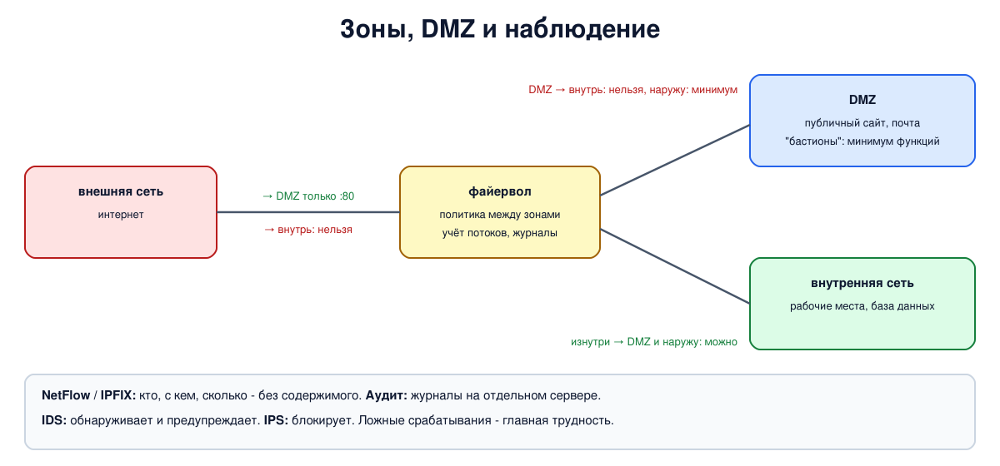

# Урок 60. IDS/IPS, NetFlow, аудит, сегментация сети и DMZ

Последний урок блока 6. Файервол, даже идеально настроенный, - лишь одна линия обороны: он не видит, что происходит внутри разрешённых соединений, а сетевой файервол на границе бессилен, если враг уже внутри (урок 51). Поэтому вокруг него строят систему: сеть делят на зоны, чтобы взлом одной не открывал остальные; трафик учитывают потоками, чтобы видеть, кто с кем и сколько обменивается; журналы собирают и анализируют; а системы обнаружения вторжений ищут признаки атак. Об этом и пойдёт речь.

## Сегментация и DMZ

**Сегментация** - деление сети на зоны так, чтобы внутри каждой были ресурсы со сходными требованиями к защите, а связи между зонами шли только через файервол и только те, что действительно нужны (Олифер, гл. 28, с. 895-896). Цель простая: взлом одного узла не должен давать доступ ко всей сети.

Самая известная зона - **DMZ** ("демилитаризованная зона"): отдельная подсеть для серверов, к которым обращаются извне, - сайта, почты, публичного DNS (Олифер, с. 896; Таненбаум, разд. 8.3.1, с. 845-846). Классическая схема (Олифер, с. 896-898, рис. 28.12):

- из внешней сети разрешено только к службам DMZ и только на нужные порты;
- **из DMZ во внутреннюю сеть - строже, чем даже из внешней сети**: серверы в DMZ доступны всему интернету, их взламывают первыми, и взломанный сервер не должен становиться мостом внутрь;
- из внутренней сети в DMZ и наружу - разрешено, а внутрь пропускаются только ответы;
- сами серверы DMZ ("бастионы") настраиваются на минимум функций.

В больших организациях зон больше: внутренние серверы, рабочие места, партнёры, удалённые сотрудники, администрирование (Олифер, с. 898-900, рис. 28.13), и прямой связи между ними нет - всё через файервол по принципу минимальных привилегий. Современное развитие этой идеи - **микросегментация** (правила на уровне отдельных серверов и контейнеров, а не подсетей) и **zero trust** ("нулевое доверие", NIST SP 800-207): доступ проверяется для каждого сеанса работы с ресурсом по тому, кто обращается и в каком состоянии его устройство, а не по тому, в какой части сети он находится.

## Учёт потоков: NetFlow и IPFIX

Чтобы видеть, что происходит в сети, не обязательно читать содержимое пакетов. **NetFlow** (Cisco) и его стандартный преемник **IPFIX** (RFC 7011) собирают сведения о **потоках**: последовательностях пакетов с общими свойствами - обычно одинаковыми адресами, портами и протоколом. О каждом потоке записывается, когда он начался и закончился, сколько было пакетов и байт (Олифер, с. 889-891). Схема из трёх звеньев:

- **экспортёр** - маршрутизатор, коммутатор или отдельный датчик - ведёт учёт и по окончании потока (или раз в заданный период) отправляет запись;
- **коллектор** принимает и хранит записи;
- **анализатор** ищет в них аномалии и строит картину трафика.

Олифер (с. 890) сравнивает это с телефонным счётом: видно, с кем и сколько говорили, но не о чём. И именно поэтому учёт потоков стал главным способом видеть трафик сегодня: содержимое почти всего трафика зашифровано (урок 47; подробно о TLS - в блоке 9), а метаданные остаются. По записям потоков видно, например, что рабочая станция вдруг начала открывать тысячи соединений или передала наружу гигабайты в три часа ночи.

В Linux основа для такого учёта уже есть - записи conntrack (урок 55): если включить счётчики (`net.netfilter.nf_conntrack_acct=1`), каждая запись хранит пакеты и байты в обе стороны, а при удалении записи событие `conntrack -E` выдаёт итог. Есть оговорка: в современных ядрах (у нас 6.8) `net.netfilter.nf_conntrack_events` по умолчанию равен 2, это режим auto, и события получают только записи, созданные при работающем слушателе. Экспортёры NetFlow и IPFIX для Linux ведут такой же учёт сами (softflowd - по захваченным пакетам, модуль ipt_NETFLOW - в ядре) и отправляют записи коллектору.

## Аудит и журналы

**Аудит** - учёт и анализ событий, значимых для безопасности: входов, ошибок входа, смены прав, изменений правил, срабатываний файервола (Олифер, с. 894-895). Его задача - подотчётность: по журналу можно установить, что произошло и кто это сделал. Олифер подчёркивает, что аудит - реактивная мера, "последний рубеж": он не предотвращает атаку, но помогает её обнаружить, разобрать и закрыть уязвимость, а сам факт аудита сдерживает нарушителей.

Важные требования к журналам: записывать отобранные события, а не всё подряд; защищать журнал от изменения и удаления (лучше всего - сразу отправлять на отдельный сервер, где взломщик узла до него не дотянется); синхронизировать время на всех узлах; анализировать журналы автоматически - вручную их не прочитать. Сегодня это задача систем сбора и анализа журналов (SIEM).

## Обнаружение и предотвращение вторжений

**IDS** (intrusion detection system, система обнаружения вторжений) наблюдает за трафиком или за событиями на узлах и поднимает тревогу, заметив признаки атаки. **IPS** (система предотвращения вторжений) стоит прямо на пути трафика и сама блокирует то, что сочла атакой, или поручает это файерволу (Олифер, с. 891-894; Таненбаум, разд. 8.3.2, с. 847-851).

По месту работы:

- **сетевые** (NIDS) смотрят на трафик - обычно копию с зеркального порта коммутатора (урок 47); видят сразу много узлов и связи между событиями;
- **хостовые** (HIDS) работают на самом узле: видят данные уже после расшифровки и события системы, но тратят ресурсы узла. Их современный потомок - системы EDR.

По способу обнаружения:

- **сигнатурные** ищут известные признаки атак - конкретно и уверенно, но только то, что уже известно и описано;
- **поиск аномалий** сравнивает поведение с нормой (Олифер называет её базовым уровнем, baseline) и замечает необычное: узел, который всегда говорил только с почтовым сервером, вдруг обращается к сотням незнакомых адресов (пример Таненбаума, с. 849). Ловит и новое, но тревога расплывчатая - "что-то не так".

Широко используемые открытые системы - **Suricata** (IDS и IPS), **Snort** и **Zeek** (подробные журналы протоколов для анализа).



## Как это увидеть в Linux

Четыре пространства имён: файервол `fw` и вокруг него три зоны - внутренняя сеть `in` (`10.0.10.0/24`) с базой данных на порту 5432, `dmz` (`10.0.20.0/24`) с сайтом на порту 80 и внешняя сеть `out` (`198.51.100.0/24`) со своим сайтом. На `fw` загрузим политику между зонами в nftables: словарь вердиктов по паре "входящий интерфейс - выходящий интерфейс" (урок 54) и счётчики с комментариями на каждом запрете. Проверим, кто к кому может обратиться, посмотрим на счётчики запретов как на простейший аудит и на итоговые записи conntrack как на записи потоков в духе NetFlow. Нужны Linux (подойдёт WSL2), права sudo, python3, nftables и conntrack (`sudo apt install python3 nftables conntrack`); всё создаётся в пространствах имён `hbh-*` и в конце удаляется.

Создай файл `zones-lab.sh` и запусти `bash zones-lab.sh`:
```
set -u
for c in python3 nft conntrack; do
  command -v $c >/dev/null || { echo "нужен $c: sudo apt install python3 nftables conntrack"; exit 1; }
done
ns="hbh-in hbh-dmz hbh-fw hbh-out"
# убрать остатки прошлого запуска
for n in $ns; do
  sudo ip netns pids $n 2>/dev/null | xargs -r sudo kill
  sudo ip netns del $n 2>/dev/null
done
d=$(mktemp -d)
chmod 755 "$d"
# три зоны вокруг файервола fw: внутренняя сеть in (10.0.10.0/24), DMZ (10.0.20.0/24) и внешняя сеть out
for n in $ns; do sudo ip netns add $n; sudo ip -n $n link set lo up; done
FW="sudo ip netns exec hbh-fw"
IN="sudo ip netns exec hbh-in"
DMZ="sudo ip netns exec hbh-dmz"
OUT="sudo ip netns exec hbh-out"
sudo ip link add eth0 netns hbh-in type veth peer name lan netns hbh-fw
sudo ip link add eth0 netns hbh-dmz type veth peer name dmz netns hbh-fw
sudo ip link add eth0 netns hbh-out type veth peer name wan netns hbh-fw
$IN ip addr add 10.0.10.5/24 dev eth0
$DMZ ip addr add 10.0.20.5/24 dev eth0
$OUT ip addr add 198.51.100.2/24 dev eth0
$FW ip addr add 10.0.10.1/24 dev lan
$FW ip addr add 10.0.20.1/24 dev dmz
$FW ip addr add 198.51.100.1/24 dev wan
for n in hbh-in hbh-dmz hbh-out; do sudo ip netns exec $n ip link set eth0 up; done
for i in lan dmz wan; do $FW ip link set $i up; done
$IN ip route add default via 10.0.10.1
$DMZ ip route add default via 10.0.20.1
$OUT ip route add default via 198.51.100.1
$FW sysctl -qw net.ipv4.ip_forward=1
# считать байты и пакеты в записях conntrack - основа учёта потоков
$FW sysctl -qw net.netfilter.nf_conntrack_acct=1
# службы: сайт в DMZ (80), база данных во внутренней сети (5432), сайт во внешней сети (80)
cat > "$d/srv.py" <<'EOF'
import socket, sys, threading
def serve(port):
    l = socket.socket(); l.setsockopt(socket.SOL_SOCKET, socket.SO_REUSEADDR, 1)
    l.bind(("0.0.0.0", port)); l.listen()
    while True:
        c, _ = l.accept(); c.recv(100); c.sendall(b"x" * 1000); c.close()
for p in sys.argv[1:]:
    threading.Thread(target=serve, args=(int(p),)).start()
EOF
cat > "$d/try.py" <<'EOF'
import socket, sys
c = socket.socket(); c.settimeout(1)
try:
    c.connect((sys.argv[1], int(sys.argv[2]))); c.sendall(b"hi"); n = len(c.recv(2000)); print(f"allowed ({n} bytes)")
except OSError:
    print("blocked")
EOF
$DMZ python3 "$d/srv.py" 80 &
$IN python3 "$d/srv.py" 5432 &
$OUT python3 "$d/srv.py" 80 &
sleep 0.5
echo '--- 1. the policy between zones on fw'
$FW nft -f - <<'EOF'
table inet zones {
    chain forward_filter {
        type filter hook forward priority filter; policy drop;
        ct state established,related accept
        ct state invalid drop
        iifname . oifname vmap {
            "lan" . "wan" : accept,
            "lan" . "dmz" : accept,
            "wan" . "dmz" : jump from_wan_to_dmz,
            "dmz" . "lan" : jump from_dmz_to_lan,
        }
        counter drop comment "other zone pairs: denied"
    }
    chain from_wan_to_dmz {
        tcp dport 80 accept
        counter drop comment "wan to dmz, not the site: denied"
    }
    chain from_dmz_to_lan {
        counter drop comment "dmz to lan: denied"
    }
}
EOF
echo '  loaded; the full rules are printed at the end (step 5)'
echo '--- 2. who can reach whom'
check() { printf '  %-36s' "$1"; sudo ip netns exec $2 python3 "$d/try.py" $3 $4; }
check 'outside -> site in DMZ :80' hbh-out 10.0.20.5 80
check 'outside -> database inside :5432' hbh-out 10.0.10.5 5432
check 'inside -> site in DMZ :80' hbh-in 10.0.20.5 80
check 'inside -> internet :80' hbh-in 198.51.100.2 80
check 'DMZ -> database inside :5432' hbh-dmz 10.0.10.5 5432
check 'DMZ -> internet :80' hbh-dmz 198.51.100.2 80
echo '--- 3. audit: how many packets each "denied" counter caught'
$FW nft list table inet zones | grep -E 'counter packets' | sed -E 's/^\s+//; s/counter packets ([0-9]+) bytes [0-9]+ drop comment "(.*)"/\2: \1 packets/; s/^/  /'
echo '--- 4. flow records, like NetFlow: who talked to whom and how much'
$FW conntrack -E -e DESTROY -o timestamp > "$d/flows" 2>/dev/null &
cpid=$!
sleep 0.5
$IN python3 "$d/try.py" 198.51.100.2 80 >/dev/null
$OUT python3 "$d/try.py" 10.0.20.5 80 >/dev/null
sleep 0.5
$FW conntrack -F 2>/dev/null     # закрыть учёт: записи удаляются, и для каждой выдаётся итог
sleep 0.5
sudo kill $cpid 2>/dev/null
sed -E 's/^\[[0-9.]+\] *//; s/ +/ /g; s/ (mark|zone|use)=[0-9]+//g; s/\[DESTROY\] //' "$d/flows" | sort -u | awk '{
  split($0, f, " "); out = "  ";
  for (i = 1; i <= NF; i++) if ((f[i] ~ /^(src|dst|dport)=/ && !seen[substr(f[i], 1, index(f[i], "="))]++) || f[i] ~ /^(packets|bytes)=/) out = out f[i] " ";
  print out; delete seen }'
echo '--- 5. the rules'
$FW nft list table inet zones | grep -vE '^\s*$'
echo '--- cleanup'
for n in $ns; do
  sudo ip netns pids $n 2>/dev/null | xargs -r sudo kill
  sudo ip netns del $n
done
rm -rf "$d"
ip netns list | grep -cE '^hbh-(in|dmz|fw|out)( |$)'
```

Вот что получилось на нашем сервере:
```
--- 1. the policy between zones on fw
  loaded; the full rules are printed at the end (step 5)
--- 2. who can reach whom
  outside -> site in DMZ :80          allowed (1000 bytes)
  outside -> database inside :5432    blocked
  inside -> site in DMZ :80           allowed (1000 bytes)
  inside -> internet :80              allowed (1000 bytes)
  DMZ -> database inside :5432        blocked
  DMZ -> internet :80                 blocked
--- 3. audit: how many packets each "denied" counter caught
  other zone pairs: denied: 2 packets
  wan to dmz, not the site: denied: 0 packets
  dmz to lan: denied: 1 packets
--- 4. flow records, like NetFlow: who talked to whom and how much
  src=10.0.10.5 dst=198.51.100.2 dport=80 packets=5 bytes=270 packets=5 bytes=1268 
  src=198.51.100.2 dst=10.0.20.5 dport=80 packets=5 bytes=270 packets=5 bytes=1268 
--- 5. the rules
table inet zones {
	chain forward_filter {
		type filter hook forward priority filter; policy drop;
		ct state established,related accept
		ct state invalid drop
		iifname . oifname vmap { "dmz" . "lan" : jump from_dmz_to_lan, "lan" . "wan" : accept, "lan" . "dmz" : accept, "wan" . "dmz" : jump from_wan_to_dmz }
		counter packets 2 bytes 120 drop comment "other zone pairs: denied"
	}
	chain from_wan_to_dmz {
		tcp dport 80 accept
		counter packets 0 bytes 0 drop comment "wan to dmz, not the site: denied"
	}
	chain from_dmz_to_lan {
		counter packets 1 bytes 60 drop comment "dmz to lan: denied"
	}
}
--- cleanup
0
```

Разберём.

**Шаг 1: политика.** Вся логика зон умещается в один словарь вердиктов: `lan` → `wan` и `lan` → `dmz` разрешены, `wan` → `dmz` - через цепочку с разрешением только порта 80, `dmz` → `lan` - в цепочку, где пакет считается и отбрасывается. Всё, что не перечислено, отбрасывает последнее правило со счётчиком. Каждое правило-запрет само выносит вердикт `drop`: без него пакет вернулся бы из цепочки по `jump` (урок 54) и был бы сосчитан ещё раз последним правилом. Ответы на разрешённые соединения пропускает `established,related`.

**Шаг 2: кто к кому.** Снаружи открыт только сайт в DMZ, база данных внутри недоступна. Изнутри можно и в DMZ, и в интернет. А из DMZ - **никуда**: ни к базе данных внутри, ни в интернет. Второе тоже важно: если сайт в DMZ взломают, он не сможет ни дотянуться до внутренней сети, ни связаться с внешним сервером злоумышленника и скачать что-то ещё. Сайту в нашем опыте нужно только отвечать на запросы, поэтому ничего больше ему не разрешено. На практике серверу DMZ открывают наружу ровно то, что требует его служба (почтовому - отправку почты другим серверам, всем - обновления, лучше через прокси), а внутрь - ничего.

**Шаг 3: аудит по счётчикам.** Каждый запрет сосчитан отдельно: "dmz to lan" - 1 пакет (попытка DMZ обратиться к базе), "other zone pairs" - 2: попытка снаружи к базе и попытка из DMZ в интернет; если клиент успеет повторить SYN за секунду ожидания, число будет больше. Ненулевой счётчик "dmz to lan" на настоящем файерволе - повод разобраться немедленно: сервер DMZ не должен даже пытаться обращаться внутрь. Счётчики с комментариями - самый простой аудит; в настоящей системе такие события ещё и журналируют (`log`, урок 54) и отправляют в систему анализа.

**Шаг 4: записи потоков.** Когда запись удаляется (по таймауту, для закрытого TCP - через 120 секунд `TIME_WAIT`, а в опыте - сразу, командой `conntrack -F`), conntrack выдаёт итоговую запись. Соединений шага 2 в выводе нет: они созданы до запуска `conntrack -E`. Итоговая запись: кто (`src`), куда (`dst`, `dport`), сколько пакетов и байт в одну и в другую сторону (две пары `packets` и `bytes`). Например, запрос изнутри к внешнему сайту: 5 пакетов и 270 байт туда, 5 пакетов и 1268 байт обратно. Это ровно то, что экспортёр NetFlow отправил бы коллектору: без содержимого, но с полной картиной, кто с кем и сколько.

**Шаг 5: правила целиком.** Политика, которую легко прочитать: зоны и разрешённые направления в одной строке, запреты с понятными комментариями и счётчиками.

В конце `0`: пространства имён удалены.

## Безопасность: обнаружение вторжений

Принцип: **предотвращение не бывает идеальным, поэтому обнаружение обязательно**. Олифер (с. 894) приводит именно эту формулу. Файервол, сегментация и обновления уменьшают вероятность взлома, но не сводят её к нулю; важно заметить атаку как можно раньше и ограничить её последствия.

Что важно понимать о системах обнаружения:

- **Ложные срабатывания.** Таненбаум (с. 849-851) разбирает ошибку базовой оценки: настоящие атаки редки, поэтому даже очень точная система выдаёт тревоги, большая часть которых ложные. Если тревог слишком много, их перестают читать, и настоящая тоже потеряется. Поэтому IDS настраивают под свою сеть, отсекают шум и доводят до людей только значимое.
- **IPS может навредить.** Ложное срабатывание IPS обрывает легитимное соединение, а сама IPS на пути трафика может стать узким местом (Таненбаум, с. 849). Поэтому часто начинают с режима обнаружения и включают блокировку только для уверенных правил.
- **Шифрование ослепляет сетевые IDS.** В зашифрованном трафике сигнатуры по содержимому не работают; остаются метаданные потоков, имена в SNI, поведение. Поэтому сетевое наблюдение дополняют хостовым.
- **Сама система - цель.** IDS видит весь трафик и журналы, и её компрометация опасна (Таненбаум, с. 848). Её размещают в отдельной зоне администрирования и защищают как самый ценный узел.

Как защищаться, складывая всё вместе (эшелонированная защита, Таненбаум, с. 851):

- **сегментация**: зоны по уровню доверия, DMZ для публичных служб, строгие правила из DMZ внутрь и наружу, минимум связей;
- **учёт потоков** (NetFlow, IPFIX, conntrack) - чтобы видеть необычные объёмы, соединения и направления;
- **журналы** с защищённым хранением на отдельном сервере, синхронизированным временем и автоматическим анализом;
- **IDS/IPS** на ключевых участках, настроенные под свою сеть, плюс хостовая защита на серверах;
- **готовность действовать**: заранее понятно, кто разбирает тревогу и что делает - изолирует узел, меняет правила, восстанавливает службу.

## Итог

- Сегментация делит сеть на зоны с разным уровнем доверия; DMZ - зона для публичных служб, из неё внутрь и наружу разрешено минимум. Развитие идеи - микросегментация и zero trust.
- NetFlow и IPFIX учитывают потоки: кто, с кем, когда, сколько - без содержимого. В Linux основа для этого - записи conntrack со счётчиками.
- Аудит - учёт событий безопасности с защищённым хранением журналов и автоматическим анализом (SIEM).
- IDS обнаруживает и предупреждает, IPS блокирует; бывают сетевые и хостовые, сигнатурные и по аномалиям. Главные трудности - ложные срабатывания, шифрование и защита самой системы.
- Обнаружение обязательно, потому что предотвращение не идеально: защита строится слоями.

## Что почитать

- Олифер, гл. 28, с. 889-900: NetFlow, системы обнаружения вторжений, аудит, типовые архитектуры, DMZ и зоны.
- Таненбаум, разд. 8.3.1, с. 845-846 (DMZ) и 8.3.2, с. 847-851 (обнаружение и предотвращение вторжений, ложные срабатывания).
- RFC 7011 (IPFIX), NIST SP 800-207 (Zero Trust Architecture), документация Suricata и Zeek.
