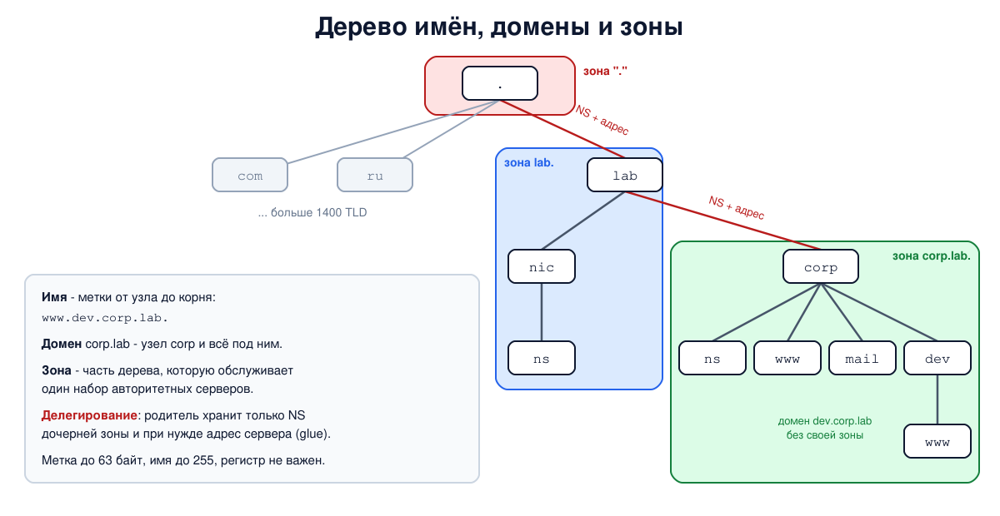

# Урок 61. Зачем DNS: пространство имён, зоны

Начинаем блок 7 - о системе доменных имён. Людям удобны имена вроде `www.example.com`, а пакеты адресуются по IP-адресам (блок 3). Кто-то должен переводить одно в другое, причём для миллиардов имён, которые постоянно меняются и принадлежат миллионам разных владельцев. В этом уроке - как устроено пространство имён DNS и как его поделили между владельцами: домены, зоны и делегирование. Как именно резолвер находит ответ, разберём в уроке 62.

## Сначала был один файл

В ARPANET соответствие имён и адресов хранилось в одном файле `hosts.txt`: его вели централизованно, а хосты регулярно скачивали свежую копию (Таненбаум, разд. 7.1.1, с. 685; Олифер, гл. 13, с. 421, описывает ту же проблему роста файла). Пока хостов были сотни, это работало. Потом файл стал слишком большим, обновления - слишком частыми, а следить, чтобы два хоста не получили одно имя, централизованно стало невозможно. Остаток той схемы есть в каждой системе до сих пор - файл `/etc/hosts`.

В 1983 году появилась **DNS** (Domain Name System); действующие основные стандарты - RFC 1034 и RFC 1035 (1987), с важными уточнениями в RFC 2181. Идея: вместо одного файла - **распределённая база данных**, в которой за каждую часть имён отвечает её владелец.

## Дерево имён

Пространство имён DNS - это **дерево** (Олифер, с. 419-420; Таненбаум, разд. 7.1.3, с. 688-692). Каждый узел имеет **метку** (label), а имя узла - это метки от него до корня через точку. Имя читается справа налево от общего к частному: в `www.corp.lab.` корень - пустая метка в самом конце, `lab` - домен верхнего уровня, `corp` - второго, `www` - имя узла.

- **Домен** - узел дерева вместе со всем поддеревом под ним: домен `corp.lab` включает `www.corp.lab`, `dev.corp.lab`, `www.dev.corp.lab` и так далее.
- **Полное имя** (FQDN, fully qualified domain name) строго оканчивается точкой - это и есть корень: `www.corp.lab.`. Без точки имя **относительное**, и к нему что-то может быть дописано. Обычно точку можно не набирать: система допишет корень сама (иногда сначала попробовав домены поиска из настроек, урок 64).
- **Ограничения**: метка - не длиннее 63 байт, имя целиком - не длиннее 255 байт в том виде, в каком оно передаётся в пакете (RFC 1035, разд. 2.3.4); в привычной записи с точками это не больше 253 символов без завершающей точки.
- **Регистр букв не важен**: `WWW.Corp.LAB` и `www.corp.lab` - одно имя (RFC 4343). При этом регистр сохраняется там, где его записали.

Верхний уровень дерева - **домены верхнего уровня** (TLD, top-level domains). Они бывают общими (gTLD: `com`, `org`, `net`, `edu`, `gov`, а после программы ICANN 2012 года - сотни новых вроде `app` или `online`) и национальными (ccTLD: двухбуквенные коды стран по ISO 3166, `ru`, `de`, `jp`; есть и национальные домены на своём алфавите, например `рф`) (Таненбаум, с. 688-690). Всего TLD сейчас больше 1400, точный список ведёт IANA. Корень дерева - один на весь мир; изменения в нём ведёт IANA (её функции выполняет PTI, дочерняя организация ICANN).

## Зоны и делегирование

Главная идея DNS - не только дерево, но и то, как его **поделили на части** (Олифер, с. 422; Таненбаум, с. 691-692 и 698-699). Владелец домена может **делегировать** поддомен другому владельцу: тогда тот сам ведёт свою часть и сам решает, что в ней будет, никого не спрашивая. Создать поддомен в `com` можно только через тех, кто управляет `com`, а вот внутри своего домена - свободно.

Часть дерева, которой управляют как одним целым, - **зона**. Её данные хранятся в **файле зоны** на **авторитетных серверах** (authoritative) этой зоны. Граница зоны проходит там, где начинается делегирование: родительская зона хранит не данные поддомена, а только **указатель** - записи NS с именами серверов дочерней зоны (RFC 1034, разд. 4.2).

Домен и зона - не одно и то же:

- **домен** - это часть дерева имён, всё, что ниже узла;
- **зона** - это часть, которую обслуживает один набор серверов: домен минус делегированные из него поддомены.

Зона `com` не содержит сайтов компаний - в ней только указатели на серверы зон вроде `example.com`. А домен `corp.lab` может целиком быть одной зоной вместе со всеми поддоменами, если их не делегировали. Например, университет может держать поддомен кафедры у себя, а другой кафедре, которая хочет свой сервер, - делегировать (так устроен пример у Таненбаума, с. 698-699).

У родителя хранится и **связующая запись** (glue): если сервер дочерней зоны называется именем внутри самой этой зоны (`ns.corp.lab` для зоны `corp.lab`), то узнать его адрес, не зная адреса, нельзя - замкнутый круг. Поэтому родитель хранит рядом с NS и адрес такого сервера.

На вершине - **корневые серверы**. Их 13 имён, от `a.root-servers.net` до `m.root-servers.net`, доступных через **anycast** - один адрес объявляется из многих мест, и запрос приходит в ближайшее с точки зрения маршрутизации (Таненбаум, разд. 7.1.5, с. 700). Обслуживают их 12 организаций, а физически за этими именами стоят около двух тысяч экземпляров серверов по всему миру (данные root-servers.org). Корень отвечает только про TLD: какие серверы обслуживают `com`, `ru` и остальные.



## Как это увидеть в Linux

Построим свой маленький интернет имён: в пространстве имён `hbh-dns` три адреса и три сервера BIND (`named`) - корень (`10.53.0.1`), сервер зоны `lab.` (`10.53.0.2`) и сервер зоны `corp.lab.` (`10.53.0.3`). Корень делегирует `lab.`, а `lab.` - `corp.lab.`. Поддомен `dev.corp.lab` никому не делегирован и живёт в зоне `corp.lab.`. Будем задавать вопросы каждому серверу по отдельности утилитой `dig` с ключом `+norec`: "не ищи ответ за меня, скажи, что знаешь сам" (подробно о `dig` - в уроке 63).

Нужны Linux (подойдёт WSL2), права sudo, BIND и dig: `sudo apt install bind9 bind9-dnsutils`. Пакет `bind9` сразу запускает свой сервер; для опыта он не нужен, его можно выключить: `sudo systemctl disable --now named`. В Ubuntu `named` из пакета ограничен профилем AppArmor: свои файлы он может читать только в нескольких каталогах, поэтому скрипт на всякий случай создаёт рабочий каталог в `/var/cache/bind` (если BIND не из пакета и такого каталога нет - во временном). Всё создаётся в этом каталоге и в пространстве имён `hbh-dns` и в конце удаляется.

Создай файл `dns-zones.sh` и запусти `bash dns-zones.sh`:
```
set -u
umask 022
NAMED=$(command -v named || ls /opt/hbh-dns/usr/sbin/named 2>/dev/null)
CHECKZONE=$(command -v named-checkzone || ls /opt/hbh-dns/usr/bin/named-checkzone 2>/dev/null)
for c in "$NAMED" "$CHECKZONE" dig; do
  [ -n "$c" ] && command -v "$c" >/dev/null || { echo "нужен BIND: sudo apt install bind9 bind9-dnsutils, затем sudo systemctl disable --now named"; exit 1; }
done
ns=hbh-dns
sudo ip netns pids $ns 2>/dev/null | xargs -r sudo kill
sudo ip netns del $ns 2>/dev/null
# named из пакета Ubuntu ограничен профилем AppArmor: свои файлы он читает и пишет
# только в /etc/bind, /var/cache/bind и нескольких других каталогах
if [ -d /var/cache/bind ]; then d=$(sudo mktemp -d /var/cache/bind/hbh.XXXXXX); else d=$(mktemp -d); fi
sudo chmod 777 "$d"
# одно пространство имён, три адреса - три сервера: корень, зона lab. и зона corp.lab.
sudo ip netns add $ns
N="sudo ip netns exec $ns"
$N ip link set lo up
$N ip link add dns0 type dummy
$N ip link set dns0 up
for a in 1 2 3; do $N ip addr add 10.53.0.$a/24 dev dns0; done
# зона корня: делегирует lab. серверу ns.nic.lab. и даёт его адрес (glue)
cat > "$d/root.db" <<'EOF'
$TTL 3600
.             SOA  a.root. admin.root. 1 3600 600 86400 3600
.             NS   a.root.
a.root.       A    10.53.0.1
lab.          NS   ns.nic.lab.
ns.nic.lab.   A    10.53.0.2
EOF
# зона lab.: делегирует corp.lab. серверу ns.corp.lab.
cat > "$d/lab.db" <<'EOF'
$TTL 3600
@             SOA  ns.nic.lab. admin.nic.lab. 1 3600 600 86400 3600
@             NS   ns.nic.lab.
ns.nic        A    10.53.0.2
corp          NS   ns.corp.lab.
ns.corp       A    10.53.0.3
EOF
# зона corp.lab.: поддомен dev без своей зоны и запись с забытой точкой в конце
cat > "$d/corp.db" <<'EOF'
$TTL 3600
@             SOA  ns.corp.lab. admin.corp.lab. 1 3600 600 86400 3600
@             NS   ns.corp.lab.
ns            A    10.53.0.3
www           A    10.0.0.80
www.dev       A    10.0.0.81
mail          CNAME www.corp.lab
EOF
srv() {   # srv имя адрес зона файл
  mkdir -m 777 "$d/$1"
  cat > "$d/$1/named.conf" <<EOF
options {
    directory "$d/$1";
    pid-file "$d/$1/pid";
    session-keyfile "$d/$1/session.key";
    listen-on { $2; };
    listen-on-v6 { none; };
    recursion no;
    notify no;
};
zone "$3" { type primary; file "$d/$4"; };
EOF
  $N "$NAMED" -g -c "$d/$1/named.conf" > "$d/$1/log" 2>&1 &
}
srv root 10.53.0.1 . root.db
srv lab 10.53.0.2 lab. lab.db
srv corp 10.53.0.3 corp.lab. corp.db
sleep 2
ask() {   # ask сервер имя: флаги ответа и все секции, кроме вопроса
  $N dig @$1 $2 +norec +noall +comments +answer +authority +additional | grep -vE '^;; (Got answer|->>HEADER|OPT|QUESTION)|^; EDNS|^$|^;; WARNING|COOKIE' \
    | sed -E 's/;; flags: ([a-z ]*);.*/flags: \1/; s/^;; (ANSWER|AUTHORITY|ADDITIONAL) SECTION:/\1:/; s/\s+/ /g; s/^/  /'
}
echo '--- 1. three zone files checked by named-checkzone'
for z in ". root.db" "lab. lab.db" "corp.lab. corp.db"; do set -- $z; $CHECKZONE -i local $1 "$d/$2" | sed "s/^/  /"; done
echo '--- 2. ask the root server about www.corp.lab'
ask 10.53.0.1 www.corp.lab
echo '--- 3. ask the lab. server about www.corp.lab'
ask 10.53.0.2 www.corp.lab
echo '--- 4. ask the corp.lab. server about www.corp.lab'
ask 10.53.0.3 www.corp.lab
echo '--- 5. www.dev.corp.lab: a subdomain without its own zone'
ask 10.53.0.3 www.dev.corp.lab | grep -E 'flags|ANSWER|^  www'
echo '--- 6. the root about a name in a TLD it does not have'
$N dig @10.53.0.1 www.corp.home +norec | grep -oE 'status: [A-Z]+|flags: [a-z ]+' | sed 's/^/  /'
echo '--- 7. the forgotten dot: mail CNAME www.corp.lab'
ask 10.53.0.3 mail.corp.lab | grep CNAME
$N dig @10.53.0.3 www.corp.lab.corp.lab +norec | grep -oE 'status: [A-Z]+' | sed 's/^/  www.corp.lab.corp.lab: /'
echo '--- 8. case does not matter, but is preserved'
$N dig @10.53.0.3 WwW.CoRp.LaB +norec +noall +question +answer | sed -E 's/\s+/ /g; s/^/  /'
echo '--- 9. label length limit: 63 and 64 characters'
l63=$(printf 'a%.0s' $(seq 63)); l64=${l63}a
$N dig @10.53.0.3 $l63.corp.lab +norec | grep -oE 'status: [A-Z]+' | sed 's/^/  63: /'
$N dig @10.53.0.3 $l64.corp.lab +norec 2>&1 | grep -iE 'label|too long|status' | head -1 | sed 's/^/  64: /'
echo '--- cleanup'
sudo ip netns pids $ns 2>/dev/null | xargs -r sudo kill
sleep 0.5
sudo ip netns del $ns
sudo rm -rf "$d"
ip netns list | grep -c "^$ns"
```

Вот что получилось на нашем сервере:
```
--- 1. three zone files checked by named-checkzone
  zone ./IN: loaded serial 1
  OK
  zone lab/IN: loaded serial 1
  OK
  zone corp.lab/IN: loaded serial 1
  OK
--- 2. ask the root server about www.corp.lab
  flags: qr
  AUTHORITY:
  lab. 3600 IN NS ns.nic.lab.
  ADDITIONAL:
  ns.nic.lab. 3600 IN A 10.53.0.2
--- 3. ask the lab. server about www.corp.lab
  flags: qr
  AUTHORITY:
  corp.lab. 3600 IN NS ns.corp.lab.
  ADDITIONAL:
  ns.corp.lab. 3600 IN A 10.53.0.3
--- 4. ask the corp.lab. server about www.corp.lab
  flags: qr aa
  ANSWER:
  www.corp.lab. 3600 IN A 10.0.0.80
  AUTHORITY:
  corp.lab. 3600 IN NS ns.corp.lab.
  ADDITIONAL:
  ns.corp.lab. 3600 IN A 10.53.0.3
--- 5. www.dev.corp.lab: a subdomain without its own zone
  flags: qr aa
  ANSWER:
  www.dev.corp.lab. 3600 IN A 10.0.0.81
--- 6. the root about a name in a TLD it does not have
  status: NXDOMAIN
  flags: qr aa
--- 7. the forgotten dot: mail CNAME www.corp.lab
  mail.corp.lab. 3600 IN CNAME www.corp.lab.corp.lab.
  www.corp.lab.corp.lab: status: NXDOMAIN
--- 8. case does not matter, but is preserved
  ;WwW.CoRp.LaB. IN A
  www.corp.lab. 3600 IN A 10.0.0.80
--- 9. label length limit: 63 and 64 characters
  63: status: NXDOMAIN
  64: dig: 'aaaaaaaaaaaaaaaaaaaaaaaaaaaaaaaaaaaaaaaaaaaaaaaaaaaaaaaaaaaaaaaa.corp.lab' is not a legal name (label too long)
--- cleanup
0
```

Разберём.

**Шаг 1: файлы зон.** Три зоны - три файла. В каждом запись SOA (главная запись зоны: кто её первичный сервер и параметры обновления, подробно - в уроке 63) и NS (серверы зоны). В корне - делегирование `lab.` с адресом сервера, в `lab.` - делегирование `corp.lab.`, в `corp.lab.` - уже сами адреса узлов. Обрати внимание: в зоне `lab.` строки начинаются с `@` (сама зона) и с относительных имён `ns.nic`, `corp` - к ним дописывается имя зоны. `named-checkzone` проверяет файл и сообщает, что зона загружена.

**Шаг 2: корень.** Корень не знает адреса `www.corp.lab` и не пытается его узнать. Он отвечает **направлением** (referral): ответа нет, а в разделе `AUTHORITY` - "этим занимается `lab.`, его сервер - `ns.nic.lab.`", и в `ADDITIONAL` - адрес этого сервера (связующая запись). Во флагах только `qr` (это ответ), флага `aa` нет: корень не авторитетен для этого имени.

**Шаг 3: сервер `lab.`** делает то же самое на уровень ниже: направляет к серверу зоны `corp.lab.` и сообщает его адрес.

**Шаг 4: сервер `corp.lab.`** наконец даёт ответ - адрес `10.0.0.80` - и ставит флаг `aa` (authoritative answer): "это моя зона, ответ из первых рук". Заодно он сообщил NS своей зоны и адрес этого сервера. Пройдя три шага, мы вручную сделали то, что резолвер делает автоматически (урок 62).

**Шаг 5: поддомен без своей зоны.** `www.dev.corp.lab` - имя в домене `dev.corp.lab`, но отдельной зоны у него нет, и тот же сервер отвечает авторитетно. Домен есть, зоны нет. Если бы `dev` захотели вести отдельно, в зону `corp.lab.` добавили бы NS для `dev` - и сервер `corp.lab.` начал бы отвечать на такие вопросы направлением.

**Шаг 6: несуществующий TLD.** Про `www.corp.home` корень отвечает `NXDOMAIN` ("такого имени нет") с флагом `aa`: корень авторитетен для своей зоны и точно знает, что `home.` в ней не делегирован.

**Шаг 7: забытая точка.** В зоне `corp.lab.` записано `mail CNAME www.corp.lab` - без точки в конце. Для сервера это относительное имя, и к нему дописалось имя зоны: получилось `www.corp.lab.corp.lab.`. Такого имени в зоне нет (следующая строка вывода - `NXDOMAIN`), и `mail.corp.lab` теперь ведёт в никуда. Это одна из самых частых ошибок в файлах зон: к имени без точки в конце всегда дописывается имя зоны, поэтому пишут либо полное имя с точкой (`www.corp.lab.`), либо только относительную часть (`www`). `named-checkzone` такую запись пропускает - синтаксически она правильная.

**Шаг 8: регистр.** Вопрос `WwW.CoRp.LaB` получил тот же ответ: сравнение имён не зависит от регистра. В разделе вопроса регистр сохранился в точности, а имя в ответе BIND записал так, как оно хранится в зоне.

**Шаг 9: длина метки.** Метка из 63 букв - допустима, сервер отвечает `NXDOMAIN` (такого имени просто нет). Метку из 64 букв `dig` отказался даже отправлять: такое имя невозможно закодировать - на длину метки в пакете отводится 6 бит.

В конце `0`: пространство имён удалено.

## Безопасность: кто управляет вашим именем

Принцип: **тот, кто управляет зоной или делегированием выше по дереву, управляет и вашим именем**. Доверие в DNS идёт сверху вниз: если изменить NS-записи домена у родителя (например, через учётную запись у регистратора), все запросы к домену пойдут на чужие серверы - и сайт, и почта, и проверки сертификатов для этого имени окажутся в чужих руках. Поэтому учётная запись у регистратора - одна из самых ценных целей, и защищать её нужно не хуже, чем сами серверы.

Вторая частая проблема - **висячие записи**: в зоне осталась запись NS или CNAME, указывающая на сервер или облачный ресурс, которым вы больше не пользуетесь. Если кто-то другой сможет занять этот ресурс, он начнёт отвечать за ваш поддомен.

Как защищаться:

- **защитить учётную запись у регистратора**: двухфакторная аутентификация, отдельная почта для восстановления, блокировка изменений домена (registrar lock) для важных доменов;
- **следить за сроком регистрации** домена и продлевать заранее: истёкший домен может зарегистрировать кто угодно;
- **проверять зоны**: регулярно сверять NS у родителя с тем, что ожидается, и удалять записи, указывающие на ресурсы, которых больше нет;
- **писать файлы зон внимательно**: полные имена с точкой или только относительная часть, проверка `named-checkzone` перед загрузкой;
- **не открывать лишнего**: авторитетный сервер не должен заодно выполнять рекурсивный поиск для всех желающих (`recursion no`, как в опыте) - почему это важно, разберём в уроке 65.

Атаки на сам протокол DNS (подмена ответов, отравление кэша) и защита от них - в уроках 65 и 66.

## Итог

- DNS заменила общий файл `hosts.txt` распределённой базой данных, в которой каждой частью имён управляет её владелец.
- Имена образуют дерево: метки до 63 байт, имя до 255 байт, регистр не важен; полное имя оканчивается точкой - корнем.
- Домен - часть дерева; зона - часть, которую обслуживает один набор авторитетных серверов. Родитель делегирует поддомен записями NS и связующими адресами.
- Корень знает только TLD и направляет дальше; авторитетный сервер своей зоны отвечает с флагом `aa`.
- Кто управляет делегированием выше по дереву, управляет и именем: защищайте доступ к регистратору и чистите висячие записи.

## Что почитать

- Олифер, гл. 13, с. 419-423: служба DNS, пространство имён, домены и зоны.
- Таненбаум, разд. 7.1.1-7.1.3, с. 684-692, и с. 698-700 (разд. 7.1.4-7.1.5): история, пространство имён, домены верхнего уровня, зоны, корневые серверы.
- RFC 1034 (понятия и устройство DNS), RFC 1035 (формат и файлы зон), RFC 2181 (уточнения), RFC 4343 (регистр), IANA Root Zone Database.
