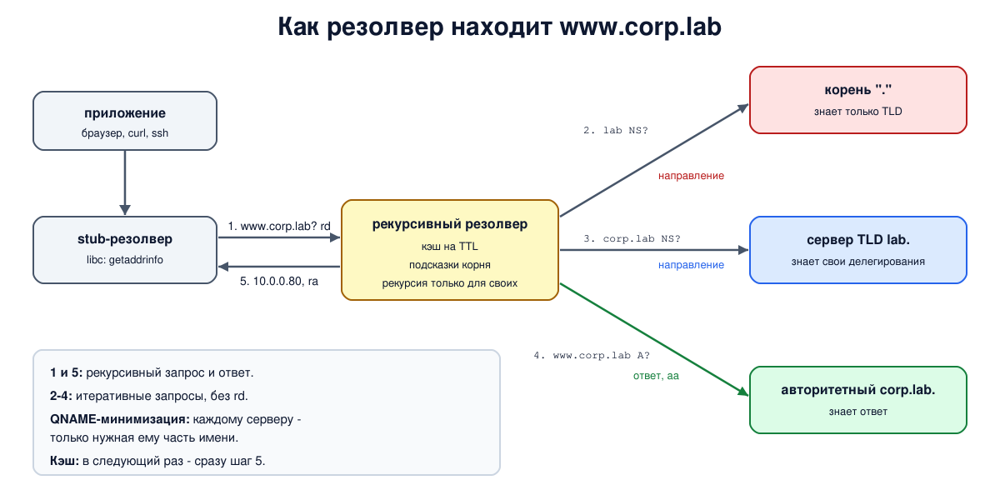

# Урок 62. Разрешение имени: stub, рекурсивный резолвер, root, TLD, authoritative

В уроке 61 мы сами, шаг за шагом, спросили корень, сервер `lab.` и сервер `corp.lab.` и получили адрес. Приложения так не делают: браузер не обходит дерево DNS. В этом уроке - кто на самом деле проделывает эту работу, как он экономит запросы и почему серверы делятся на две совсем разные роли.

## Четыре участника

Разрешение имени (resolution) - путь от вопроса "какой адрес у `www.corp.lab`?" до ответа. В нём участвуют (Таненбаум, разд. 7.1.2, с. 685-687; Олифер, гл. 13, с. 422-425):

- **stub-резолвер** (stub resolver, "заглушка") - маленькая часть ОС или библиотеки, к которой обращается приложение (в Linux - функция `getaddrinfo` из libc). Сам по дереву он не ходит: отправляет **рекурсивный запрос** (с флагом `rd`, recursion desired - "найди ответ за меня") одному серверу и ждёт готового ответа. Адрес этого сервера задан в настройках ОС, часто приходит по DHCP (урок 64 - о настройке в Linux);
- **рекурсивный резолвер** (recursive resolver) - сервер у провайдера, в организации или публичный. Получив рекурсивный запрос, он сам опрашивает серверы дерева **итеративными запросами** (без `rd`) и возвращает клиенту окончательный ответ или ошибку - не направление;
- **корневые серверы** (root) - знают только серверы доменов верхнего уровня и отвечают направлениями;
- **серверы TLD** и ниже, до серверов нужной зоны. Корень, TLD и сервер `corp.lab.` - все **авторитетные**, каждый для своей зоны: на вопрос об имени из делегированной ниже зоны они отвечают направлением (без `aa`), а сервер зоны, где лежит имя, - окончательным ответом с флагом `aa`.

Корневые серверы и серверы TLD рекурсивных запросов не выполняют - им пришлось бы делать работу за весь интернет. Олифер (с. 423-425) описывает три схемы: итеративную, рекурсивную по цепочке серверов и смешанную; на практике работает смешанная - stub спрашивает резолвер рекурсивно, а резолвер обходит дерево итеративно (RFC 1034, разд. 4.3.1 и 5). Иногда между ними стоит ещё пересылающий сервер, например на домашнем роутере или systemd-resolved (урок 64): он тоже передаёт запрос дальше рекурсивно.

## С чего начинает резолвер

Чтобы спросить корень, резолвер должен знать его адреса. Они записаны в **файле подсказок** (root hints) - короткий список имён и адресов корневых серверов, который поставляется вместе с программой (Таненбаум, разд. 7.1.5, с. 700). Подсказки могут устареть, поэтому, начиная работу, резолвер спрашивает у любого корневого сервера из списка актуальный список корневых серверов (запрос NS для `.`) и дальше пользуется уже им. Это называется **priming** (RFC 8109).

## Кэш: почему обход дерева - редкость

Резолвер запоминает всё, что узнал: и окончательные ответы, и направления. Каждая запись живёт в кэше не дольше, чем разрешил её владелец, - это **TTL** (time to live) в секундах (Таненбаум, с. 686-687). Поэтому для популярных имён резолвер почти никогда не идёт к корню: адреса серверов `com` и `ru` у него давно в кэше, а часто и сам ответ. Запоминаются и отрицательные ответы - "такого имени нет" (RFC 2308). Подробно о кэше и TTL - в уроке 64.

## Минимизация имени в запросах

Раньше резолвер отправлял полное имя на каждый уровень: корень узнавал, что кто-то ищет `www.corp.lab`, хотя ему достаточно было знать только `lab`. **QNAME-минимизация** (RFC 9156, раньше RFC 7816) исправляет это: каждому серверу резолвер сообщает только ту часть имени, которая нужна ему для направления (Таненбаум, с. 687). Корень видит `lab`, сервер `lab.` - `corp.lab`, и только авторитетный сервер зоны - полное имя. Это защищает приватность пользователей от серверов верхних уровней. В BIND она включена по умолчанию - мы увидим это в опыте.

## Транспорт

DNS работает поверх UDP, порт 53: вопрос и ответ обычно умещаются в один пакет. TCP на том же порту используется для больших ответов (сервер ставит флаг `TC`, "обрезано", и клиент повторяет запрос по TCP) и для передачи зон; поддержка TCP обязательна для всех реализаций (RFC 7766). Связь между stub и резолвером всё чаще шифруют: DNS поверх TLS (DoT, порт 853) и поверх HTTPS (DoH) (Таненбаум, с. 687); подробно о них - в уроке 67.



## Как это увидеть в Linux

Возьмём три зоны из урока 61 (корень, `lab.`, `corp.lab.`) и добавим четвёртый сервер BIND - **рекурсивный резолвер** `10.53.0.53` с файлом подсказок, указывающим на наш корень. Рекурсию он выполняет только для своей сети `10.53.0.0/24`. Первый адрес пространства имён - `10.53.0.100`, с него ядро отправляет запросы приложений: это наш "клиент". Все серверы ведут журнал полученных вопросов (`querylog`), чтобы было видно, кто кого о чём спросил. Проверку DNSSEC выключаем: у нашего корня нет подписей (о DNSSEC - урок 66).

Нужны Linux (подойдёт WSL2), права sudo, BIND и dig: `sudo apt install bind9 bind9-dnsutils`; службу `named` для опыта можно выключить: `sudo systemctl disable --now named`. Как и в уроке 61, рабочий каталог создаётся в `/var/cache/bind` (из-за профиля AppArmor) или во временном каталоге, а серверы работают в пространстве имён `hbh-dns`; в конце всё удаляется.

Создай файл `dns-resolve.sh` и запусти `bash dns-resolve.sh`:
```
set -u
umask 022
NAMED=$(command -v named || ls /opt/hbh-dns/usr/sbin/named 2>/dev/null)
for c in "$NAMED" dig getent; do
  [ -n "$c" ] && command -v "$c" >/dev/null || { echo "нужен BIND: sudo apt install bind9 bind9-dnsutils, затем sudo systemctl disable --now named"; exit 1; }
done
ns=hbh-dns
sudo ip netns pids $ns 2>/dev/null | xargs -r sudo kill
sudo ip netns del $ns 2>/dev/null
# named из пакета Ubuntu ограничен профилем AppArmor: читать он может из /etc/bind,
# а писать - в /var/cache/bind и ещё несколько каталогов
if [ -d /var/cache/bind ]; then d=$(sudo mktemp -d /var/cache/bind/hbh.XXXXXX); else d=$(mktemp -d); fi
sudo chmod 777 "$d"
# те же три зоны, что в уроке 61, и рекурсивный резолвер 10.53.0.53
sudo ip netns add $ns
N="sudo ip netns exec $ns"
$N ip link set lo up
$N ip link add dns0 type dummy
$N ip link set dns0 up
# первый адрес - адрес "клиента": с него ядро отправляет запросы приложений
for a in 100 1 2 3 53; do $N ip addr add 10.53.0.$a/24 dev dns0; done
$N ip addr add 192.0.2.7/24 dev dns0     # "чужой" адрес для шага 6
cat > "$d/root.db" <<'EOF'
$TTL 3600
.             SOA  a.root. admin.root. 1 3600 600 86400 3600
.             NS   a.root.
a.root.       A    10.53.0.1
lab.          NS   ns.nic.lab.
ns.nic.lab.   A    10.53.0.2
EOF
cat > "$d/lab.db" <<'EOF'
$TTL 3600
@             SOA  ns.nic.lab. admin.nic.lab. 1 3600 600 86400 3600
@             NS   ns.nic.lab.
ns.nic        A    10.53.0.2
corp          NS   ns.corp.lab.
ns.corp       A    10.53.0.3
EOF
cat > "$d/corp.db" <<'EOF'
$TTL 3600
@             SOA  ns.corp.lab. admin.corp.lab. 1 3600 600 86400 3600
@             NS   ns.corp.lab.
ns            A    10.53.0.3
www           A    10.0.0.80
EOF
# файл подсказок резолвера: где искать корень
# проверку DNSSEC выключаем: у нашего корня нет подписей (урок 66)
: > "$d/empty.keys"
cat > "$d/root.hint" <<'EOF'
.             3600000  NS  a.root.
a.root.       3600000  A   10.53.0.1
EOF
srv() {   # srv имя адрес "настройки" "зона"
  mkdir -m 777 "$d/$1"
  cat > "$d/$1/named.conf" <<EOF
options {
    directory "$d/$1";
    pid-file "$d/$1/pid";
    session-keyfile "$d/$1/session.key";
    listen-on { $2; };
    listen-on-v6 { none; };
    querylog yes;
    notify no;
    dnssec-validation no;
    bindkeys-file "$d/empty.keys";
    $3
};
$4
EOF
  $N "$NAMED" -g -c "$d/$1/named.conf" > "$d/$1/log" 2>&1 &
}
srv root 10.53.0.1 "recursion no;" "zone \".\" { type primary; file \"$d/root.db\"; };"
srv lab 10.53.0.2 "recursion no;" "zone \"lab.\" { type primary; file \"$d/lab.db\"; };"
srv corp 10.53.0.3 "recursion no;" "zone \"corp.lab.\" { type primary; file \"$d/corp.db\"; };"
# резолвер: рекурсия только для своей сети
srv resolver 10.53.0.53 "recursion yes; allow-recursion { 10.53.0.0/24; }; query-source address 10.53.0.53;" \
  "zone \".\" { type hint; file \"$d/root.hint\"; };"
sleep 2
queries() {   # какие вопросы получил сервер
  grep 'query:' "$d/$1/log" | sed -E 's/.*client @\S+ ([0-9.]+)#[0-9]+ .*query: (\S+ IN \S+) .*/\1 asked: \2/' | awk '!seen[$0]++' | sed 's/^/    /'
}
echo '--- 1. the stub resolver: an application asks for www.corp.lab'
echo 'nameserver 10.53.0.53' > "$d/resolv.conf"
# своё пространство монтирования: resolv.conf подменяется только внутри этой команды
$N sh -c "mount --bind '$d/resolv.conf' /etc/resolv.conf && getent ahostsv4 www.corp.lab | head -1" | sed 's/^/  /'
echo '--- 2. what each server was asked'
for s in resolver root lab corp; do echo "  $s:"; queries $s; done
echo '--- 3. the same name again: from the cache'
for s in root lab corp; do : > "$d/$s/log.mark"; wc -l < "$d/$s/log" > "$d/$s/log.mark"; done
sleep 2
$N dig @10.53.0.53 www.corp.lab +noall +answer | sed -E 's/\s+/ /g; s/^/  /'
sleep 0.5
for s in root lab corp; do echo "  new queries to $s: $(( $(wc -l < "$d/$s/log") - $(cat "$d/$s/log.mark") ))"; done
echo '--- 4. dig +trace: dig itself walks from the root'
$N sh -c "mount --bind '$d/resolv.conf' /etc/resolv.conf && dig +trace www.corp.lab" | grep -E '^[a-z.]|^;; Received' | sed -E 's/^;; Received [0-9]+ bytes from ([0-9.]+)#53\(([^)]+)\).*/    (answered by \2, \1)/; s/\s+/ /g; s/^/  /'
echo '--- 5. recursion: the resolver and an authoritative server'
$N dig @10.53.0.53 www.corp.lab | grep -oE 'status: [A-Z]+|flags: [a-z ]+' | tr '\n' ' ' | sed 's/^/  resolver: /; s/$/\n/'
$N dig @10.53.0.3 www.corp.lab | grep -oE 'status: [A-Z]+|flags: [a-z ]+' | tr '\n' ' ' | sed 's/^/  corp.lab server: /; s/$/\n/'
$N dig @10.53.0.3 example.com | grep -oE 'status: [A-Z]+|WARNING.*' | sed 's/^/  corp.lab server, other name: /'
echo '--- 6. the resolver and a client from another network'
$N dig @10.53.0.53 -b 192.0.2.7 www.corp.lab | grep -oE 'status: [A-Z]+' | sed 's/^/  /'
echo '--- cleanup'
sudo ip netns pids $ns 2>/dev/null | xargs -r sudo kill
sleep 0.5
sudo ip netns del $ns
sudo rm -rf "$d"
ip netns list | grep -c "^$ns"
```

Вот что получилось на нашем сервере:
```
--- 1. the stub resolver: an application asks for www.corp.lab
  10.0.0.80       STREAM www.corp.lab
--- 2. what each server was asked
  resolver:
    10.53.0.100 asked: www.corp.lab IN A
  root:
    10.53.0.53 asked: . IN NS
    10.53.0.53 asked: lab IN NS
    10.53.0.53 asked: ns.nic.lab IN AAAA
    10.53.0.53 asked: ns.corp.lab IN AAAA
  lab:
    10.53.0.53 asked: corp.lab IN NS
    10.53.0.53 asked: ns.nic.lab IN AAAA
    10.53.0.53 asked: ns.corp.lab IN AAAA
  corp:
    10.53.0.53 asked: www.corp.lab IN A
    10.53.0.53 asked: ns.corp.lab IN AAAA
--- 3. the same name again: from the cache
  www.corp.lab. 3598 IN A 10.0.0.80
  new queries to root: 0
  new queries to lab: 0
  new queries to corp: 0
--- 4. dig +trace: dig itself walks from the root
  . 3598 IN NS a.root.
   (answered by 10.53.0.53, 10.53.0.53)
  lab. 3600 IN NS ns.nic.lab.
   (answered by a.root, 10.53.0.1)
  corp.lab. 3600 IN NS ns.corp.lab.
   (answered by ns.nic.lab, 10.53.0.2)
  www.corp.lab. 3600 IN A 10.0.0.80
  corp.lab. 3600 IN NS ns.corp.lab.
   (answered by ns.corp.lab, 10.53.0.3)
--- 5. recursion: the resolver and an authoritative server
  resolver: status: NOERROR flags: qr rd ra 
  corp.lab server: status: NOERROR flags: qr aa rd 
  corp.lab server, other name: status: REFUSED
  corp.lab server, other name: WARNING: recursion requested but not available
--- 6. the resolver and a client from another network
  status: REFUSED
--- cleanup
0
```

Разберём.

**Шаг 1: stub-резолвер.** Команда `getent ahostsv4` обращается к libc так же, как любое приложение. Чтобы libc спрашивала наш резолвер, внутри одной команды подменяем `/etc/resolv.conf` (строка `nameserver 10.53.0.53`): `ip netns exec` создаёт для команды своё пространство монтирования, и подмена не видна больше никому. Приложение получило адрес `10.0.0.80` и ничего не знает о том, как он был найден.

**Шаг 2: кто кого спрашивал.** Это главная картина урока:

- резолвер получил **один** вопрос от клиента (`10.53.0.100`) - полное имя `www.corp.lab`;
- корень получил от резолвера (`10.53.0.53`) вопрос `. IN NS` - это priming, обновление списка корневых серверов, - и вопрос `lab IN NS`. Не полное имя, а только `lab`: это QNAME-минимизация. Первые два вопроса резолвер отправляет почти одновременно, и их порядок в журнале может меняться;
- сервер `lab.` получил вопрос `corp.lab IN NS`, и только сервер `corp.lab.` - полное имя `www.corp.lab IN A`.

Вопросы `AAAA` о `ns.nic.lab` и `ns.corp.lab` - служебные: в направлениях резолвер получил только IPv4-адреса серверов имён и заодно выясняет, нет ли у них IPv6-адресов. Обрати внимание: эти служебные вопросы резолвер задал полными именами, и корень увидел `ns.corp.lab`. Минимизация скрыла от корня имя, которое искал клиент, но не имена серверов имён из направлений. Один вопрос клиента обернулся девятью разными запросами резолвера (повторы в выводе убраны) - но только в первый раз.

**Шаг 3: из кэша.** Тот же вопрос через пару секунд: резолвер ответил сразу, а ни один авторитетный сервер не получил нового вопроса. TTL в ответе - `3598`, а не `3600`, как в зоне: резолвер отдаёт оставшееся время жизни записи в кэше.

**Шаг 4: `dig +trace`.** Здесь `dig` сам играет роль резолвера: спрашивает у настроенного резолвера список корневых серверов, а дальше идёт по дереву итеративно, как мы вручную в уроке 61. Видно, кто что ответил: резолвер - список корня (TTL уже меньше `3600`, запись из кэша), корень - направление на `lab.`, сервер `lab.` - на `corp.lab.`, и сервер `corp.lab.` - окончательный ответ (и NS своей зоны). `dig +trace` - удобный способ найти, на каком уровне ломается разрешение имени.

**Шаг 5: две роли.** У ответа резолвера флаги `rd` (рекурсию просили) и `ra` (recursion available - рекурсия доступна), флага `aa` нет: резолвер не авторитетен для `corp.lab`, он лишь нашёл ответ. Авторитетный сервер `corp.lab.` отвечает про свою зону с `aa`, но без `ra`. А на вопрос о чужом имени `example.com` с просьбой о рекурсии он ответил `REFUSED`, и `dig` предупредил: рекурсию просили, но она недоступна. Авторитетный сервер отвечает только про свои зоны.

**Шаг 6: чужой клиент.** Запрос к резолверу с адреса `192.0.2.7`, не входящего в разрешённую сеть, получил `REFUSED`: этот резолвер **закрытый**, он работает только для своих клиентов.

В конце `0`: пространство имён удалено.

## Безопасность: роли серверов и открытые резолверы

Принцип: **авторитетный сервер и рекурсивный резолвер - разные роли, и у каждой свои правила доступа**. Авторитетный сервер должен отвечать всему интернету, но только про свои зоны. Резолвер должен искать ответы про любые имена интернета, но только для своих клиентов.

Почему это важно:

- **открытый резолвер**, отвечающий на рекурсивные запросы всех, - ошибка конфигурации (кроме специально построенных публичных служб). Небольшой запрос с подделанным адресом отправителя превращается в большой ответ, который уходит жертве: такие серверы используют для атак с усилением (Олифер, с. 425 называет открытые и закрытые серверы; подробно об атаках - урок 65);
- **кэш резолвера - общий для всех клиентов**: если в него попадёт подделанная запись, её получат все (урок 65). Чем меньше посторонних может слать резолверу запросы, тем меньше возможностей для атак на кэш;
- **резолвер видит все имена**, которые ищут его клиенты, - это чувствительные данные о каждом пользователе. QNAME-минимизация защищает их от серверов верхних уровней, а DoT и DoH - от наблюдателя на пути между клиентом и резолвером. Но сам резолвер всё видит, поэтому выбирать его надо осознанно.

Как защищаться:

- **разделять роли**: авторитетные серверы - с `recursion no`, резолверы - отдельно;
- **ограничивать рекурсию своей сетью** (RFC 5358): `allow-recursion` в BIND, `access-control` в Unbound, правила файервола на порт 53 (блок 6);
- **ограничивать частоту ответов** на авторитетных серверах (Response Rate Limiting, `rate-limit` в BIND): они обязаны отвечать всем, поэтому их тоже пытаются использовать для усиления (урок 65);
- **проверять себя**: запрос к своему резолверу снаружи должен получать `REFUSED` или не получать ответа вовсе;
- **включать QNAME-минимизацию и проверку DNSSEC** на резолвере (в современном BIND обе включены по умолчанию);
- **шифровать путь от клиента до резолвера** (DoT, DoH, урок 67), если путь проходит через недоверенные сети.

## Итог

- Приложение спрашивает stub-резолвер ОС, тот отправляет рекурсивный запрос одному резолверу.
- Рекурсивный резолвер начинает с подсказок корня (priming) и обходит дерево итеративно: корень, TLD, авторитетный сервер; клиенту возвращает только окончательный ответ.
- Кэш с TTL делает полный обход редкостью; QNAME-минимизация показывает каждому уровню только нужную ему часть имени.
- Авторитетный сервер отвечает про свои зоны (`aa`), резолвер ищет ответы для своих клиентов (`ra`). Открытый резолвер - ошибка конфигурации.
- DNS работает по UDP и TCP на порту 53, а путь до резолвера всё чаще шифруют (DoT, DoH).

## Что почитать

- Олифер, гл. 13, с. 422-425: иерархическая организация DNS, итеративная и рекурсивная схемы, открытые и закрытые серверы.
- Таненбаум, разд. 7.1.2, с. 685-687 (процесс поиска, кэш, QNAME-минимизация, транспорт) и 7.1.5, с. 699-701 (разрешение имён, корневые серверы).
- RFC 1034 (разд. 5, резолверы), RFC 2308 (отрицательное кэширование), RFC 8109 (priming), RFC 9156 (QNAME-минимизация), RFC 7766 (DNS по TCP), RFC 5358 (рекурсия и открытые резолверы).
