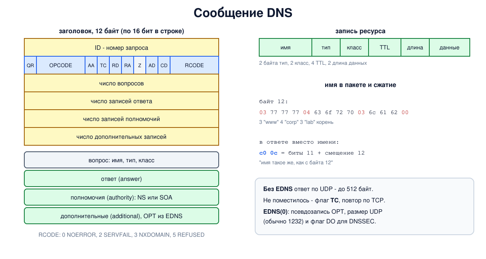

# Урок 63. Сообщения и записи DNS; dig и drill

В уроках 61 и 62 мы читали ответы `dig`, не вдаваясь в их устройство. Теперь разберём, из чего состоит сообщение DNS, какие бывают записи и что означает каждое поле вывода `dig`, - вплоть до отдельных байтов в пакете.

## Записи ресурсов

Всё, что хранит DNS, - это **записи ресурсов** (resource records, RR). У каждой записи пять частей (Таненбаум, разд. 7.1.4, с. 694-695):

- **имя** (owner) - к какому узлу дерева относится запись;
- **TTL** - сколько секунд её можно хранить в кэше (урок 64);
- **класс** - почти всегда `IN` (интернет);
- **тип** - что за данные;
- **данные** (RDATA) - содержимое, формат зависит от типа.

Записи с одинаковыми именем, классом и типом образуют **набор** (RRset): например, несколько адресов одного сайта. Набор передаётся и кэшируется целиком (RFC 2181).

Главные типы (Таненбаум, с. 695-698, илл. 7.4):

- **A** - адрес IPv4, **AAAA** - адрес IPv6 (RFC 3596);
- **NS** - имя авторитетного сервера зоны (урок 61);
- **CNAME** - "это имя - псевдоним другого": резолвер продолжает поиск по каноническому имени. У имени с CNAME не может быть других данных, кроме служебных записей DNSSEC (RFC 2181, разд. 10.1; RFC 4035), поэтому CNAME нельзя поставить на вершину зоны, где обязательны SOA и NS;
- **SOA** (start of authority) - главная запись зоны: первичный сервер, почта администратора (с точкой вместо `@`), серийный номер версии зоны и таймеры для вторичных серверов (`refresh`, `retry`, `expire`); последнее поле, `minimum`, вместе с TTL самой SOA задаёт, сколько кэшировать отрицательные ответы (берётся меньшее, RFC 2308);
- **MX** - почтовый сервер домена с приоритетом: меньшее число - выше приоритет;
- **TXT** - произвольный текст; сегодня в основном машиночитаемый: правила SPF (какие серверы вправе отправлять почту домена, RFC 7208), подтверждение владения доменом и т.п. Отдельный тип SPF, который ещё есть в таблице Таненбаума, отменён - SPF публикуют только в TXT;
- **PTR** - обратная запись: имя по адресу. Адрес записывается в обратном порядке в специальном домене: `10.0.0.80` - это `80.0.0.10.in-addr.arpa` (Олифер, гл. 13, с. 425-426); для IPv6 - полубайты в `ip6.arpa` (RFC 3596);
- **SRV** - где искать службу: имя вида `_служба._протокол.домен`, данные - приоритет, вес, порт и имя сервера (RFC 2782);
- **CAA** - какие удостоверяющие центры вправе выпускать сертификаты для домена (RFC 8659, подробно - в уроке 73);
- новые **SVCB** и **HTTPS** (RFC 9460) сообщают клиенту параметры подключения к службе заранее, ещё до соединения (блок 9).

## Сообщение DNS

Вопрос и ответ имеют один формат (RFC 1035, разд. 4.1). Сначала - **заголовок** из 12 байт:

- **ID** - 16-битный номер запроса: по нему клиент сопоставляет ответ с вопросом (Таненбаум, с. 693);
- **флаги**: `QR` (0 - запрос, 1 - ответ), `OPCODE` (вид запроса, обычно 0 - стандартный), `AA` (ответ авторитетный), `TC` (ответ обрезан), `RD` (нужна рекурсия), `RA` (рекурсия доступна), позже добавлены `AD` (данные проверены DNSSEC) и `CD` (не проверять) - урок 66; ещё один бит, `Z`, зарезервирован и должен быть нулём;
- **RCODE** - код результата: `NOERROR` (0), `SERVFAIL` (2, сервер не смог ответить), `NXDOMAIN` (3, имени нет), `REFUSED` (5, отказ);
- **четыре счётчика** - сколько записей в каждом разделе.

Дальше идут четыре раздела: **вопрос** (имя, тип, класс), **ответ**, **полномочия** (authority: NS или SOA зоны) и **дополнительные** записи (additional: например, адреса серверов из раздела полномочий). Отдельный случай - **NODATA**: имя есть, но записей нужного типа нет. Такого кода нет, ответ - `NOERROR` с пустым разделом ответа и записью SOA в разделе полномочий.

**Имена в пакете** записываются метками: байт длины, затем символы, в конце нулевой байт (корень). Чтобы не повторять одно и то же имя, используется **сжатие**: вместо имени или его хвоста - 2-байтный **указатель** на место в сообщении, где это имя уже встречалось. Указатель начинается с двух единичных битов (`11`), остальные 14 бит - смещение от начала сообщения (RFC 1035, разд. 4.1.4). Поэтому длина метки - не больше 63: два старших бита байта длины заняты.

**Размер.** Без расширений ответ по UDP ограничен 512 байтами; не поместилось - сервер ставит флаг `TC`, и клиент повторяет запрос по TCP (урок 62). Расширение **EDNS(0)** (RFC 6891) добавляет в раздел дополнительных записей псевдозапись `OPT`: в ней клиент сообщает, какой размер ответа по UDP он примет (сегодня обычно 1232 байта, чтобы пакет не фрагментировался), и флаги вроде `DO` (нужны подписи DNSSEC).



## dig и drill

`dig` (из пакета BIND) и `drill` (из ldns) - главные инструменты диагностики DNS. Таненбаум (разд. 7.1.6, с. 701) советует поэкспериментировать с `dig` самому - этим и займёмся. Полезные приёмы:

- `dig @сервер имя тип` - спросить конкретный сервер о записи конкретного типа;
- `+norec` - без рекурсии (как спрашивает резолвер), `+trace` - обход от корня (урок 62);
- `+short` - только данные, `+noall +answer` - только раздел ответа;
- `-x адрес` - обратный запрос (PTR);
- `+tcp`, `+noedns`, `+bufsize=N` - транспорт и размер;
- у `drill` похожие ключи: `drill -x` (обратный запрос), `drill -T` (обход от корня), `-t` (TCP), `-o` для флагов заголовка (прописная буква ставит флаг, строчная снимает: `-o rd`).

## Как это увидеть в Linux

Один авторитетный сервер BIND (`10.53.0.3`) с зоной `corp.lab.`, в которой записи разных типов, и обратной зоной `0.0.10.in-addr.arpa.`. Спросим его через `dig` и `drill`, а потом отправим запрос, собранный вручную на Python, и разберём ответ побайтово. В конце проверим, что происходит с большим ответом по UDP без EDNS.

Нужны Linux (подойдёт WSL2), права sudo, BIND, dig, drill и python3: `sudo apt install bind9 bind9-dnsutils ldnsutils python3`; службу `named` для опыта можно выключить: `sudo systemctl disable --now named`. Рабочий каталог, как в уроке 61, создаётся в `/var/cache/bind` (из-за профиля AppArmor) или во временном каталоге; всё удаляется в конце.

Создай файл `dns-messages.sh` и запусти `bash dns-messages.sh`:
```
set -u
umask 022
NAMED=$(command -v named || ls /opt/hbh-dns/usr/sbin/named 2>/dev/null)
for c in "$NAMED" dig drill python3; do
  [ -n "$c" ] && command -v "$c" >/dev/null || { echo "нужны BIND и drill: sudo apt install bind9 bind9-dnsutils ldnsutils python3, затем sudo systemctl disable --now named"; exit 1; }
done
ns=hbh-dns
sudo ip netns pids $ns 2>/dev/null | xargs -r sudo kill
sudo ip netns del $ns 2>/dev/null
# named из пакета Ubuntu ограничен профилем AppArmor: читать он может из /etc/bind,
# а писать - в /var/cache/bind и ещё несколько каталогов
if [ -d /var/cache/bind ]; then d=$(sudo mktemp -d /var/cache/bind/hbh.XXXXXX); else d=$(mktemp -d); fi
sudo chmod 777 "$d"
sudo ip netns add $ns
N="sudo ip netns exec $ns"
$N ip link set lo up
$N ip link add dns0 type dummy
$N ip link set dns0 up
for a in 100 3; do $N ip addr add 10.53.0.$a/24 dev dns0; done
# зона с записями разных типов
cat > "$d/corp.db" <<'EOF'
$TTL 3600
@        SOA    ns.corp.lab. admin.corp.lab. 2026100201 7200 900 1209600 300
@        NS     ns.corp.lab.
ns       A      10.53.0.3
www      A      10.0.0.80
www      AAAA   2001:db8::80
mail     A      10.0.0.25
web      CNAME  www.corp.lab.
@        MX     10 mail.corp.lab.
@        TXT    "v=spf1 mx -all"
_sip._tcp SRV   10 60 5060 sip.corp.lab.
sip      A      10.0.0.50
@        CAA    0 issue "ca.example"
big      TXT    "0123456789012345678901234567890123456789012345678901234567890123456789012345678901234567890123456789" "0123456789012345678901234567890123456789012345678901234567890123456789012345678901234567890123456789" "0123456789012345678901234567890123456789012345678901234567890123456789012345678901234567890123456789" "0123456789012345678901234567890123456789012345678901234567890123456789012345678901234567890123456789" "0123456789012345678901234567890123456789012345678901234567890123456789012345678901234567890123456789" "0123456789012345678901234567890123456789012345678901234567890123456789012345678901234567890123456789"
EOF
# обратная зона: адрес -> имя
cat > "$d/rev.db" <<'EOF'
$TTL 3600
@        SOA    ns.corp.lab. admin.corp.lab. 2026100201 7200 900 1209600 300
@        NS     ns.corp.lab.
80       PTR    www.corp.lab.
25       PTR    mail.corp.lab.
EOF
mkdir -m 777 "$d/srv"
cat > "$d/srv/named.conf" <<EOF
options {
    directory "$d/srv";
    pid-file "$d/srv/pid";
    session-keyfile "$d/srv/session.key";
    listen-on { 10.53.0.3; };
    listen-on-v6 { none; };
    recursion no;
    notify no;
};
zone "corp.lab." { type primary; file "$d/corp.db"; };
zone "0.0.10.in-addr.arpa." { type primary; file "$d/rev.db"; };
EOF
$N "$NAMED" -g -c "$d/srv/named.conf" > "$d/srv/log" 2>&1 &
sleep 2
D="$N dig @10.53.0.3 +norec"
# убрать из вывода то, что меняется от запуска к запуску
norm() { sed -E 's/id: [0-9]+/id: NNNNN/; s/COOKIE: [0-9a-f]+/COOKIE: .../; /Query time|WHEN|MSG SIZE|SERVER:|^;; global|^; <<>>|server found|^$/d; s/\s+/ /g; s/^/  /'; }
echo '--- 1. a full answer: header, flags and four sections'
$D www.corp.lab | norm
echo '--- 2. records of different types'
for q in "corp.lab SOA" "corp.lab NS" "www.corp.lab AAAA" "web.corp.lab A" "corp.lab MX" "corp.lab TXT" "_sip._tcp.corp.lab SRV" "corp.lab CAA"; do
  $D $q +noall +answer | sed -E 's/\s+/ /g; s/^/  /'
done
echo '--- 3. reverse lookup: dig -x 10.0.0.80'
$D -x 10.0.0.80 +noall +answer | sed -E 's/\s+/ /g; s/^/  /'
echo '--- 4. NXDOMAIN and NODATA'
for q in "nosuch.corp.lab A" "www.corp.lab MX"; do
  echo "  $q:"; $D $q +noall +comments +authority | grep -E 'status|SOA' | sed -E 's/.*(status: [A-Z]+).*/\1/; s/\s+/ /g; s/^/    /'
done
echo '--- 5. the same question in drill'
$N drill @10.53.0.3 -o rd www.corp.lab | sed -E 's/id: [0-9]+/id: NNNNN/; /Query time|WHEN|MSG SIZE|SERVER:|^$/d; s/\s+/ /g; s/^/  /'
echo '--- 6. the bytes of a query and an answer'
cat > "$d/raw.py" <<'EOF'
import socket, struct
qname = b"".join(bytes([len(l)]) + l.encode() for l in "www.corp.lab".split(".")) + b"\0"
query = struct.pack(">HHHHHH", 0x1234, 0, 1, 0, 0, 0) + qname + struct.pack(">HH", 1, 1)
s = socket.socket(socket.AF_INET, socket.SOCK_DGRAM); s.settimeout(2)
s.sendto(query, ("10.53.0.3", 53)); r = s.recv(4096)
def dump(title, b):
    print(f"  {title}, {len(b)} bytes:")
    for i in range(0, len(b), 16):
        print(f"    {i:3d}: " + " ".join(f"{x:02x}" for x in b[i:i+16]))
dump("query", query); dump("answer", r)
i, f, qd, an, au, ad = struct.unpack(">HHHHHH", r[:12])
print(f"  header: id=0x{i:04x} qr={f>>15} opcode={(f>>11)&15} aa={(f>>10)&1} tc={(f>>9)&1} rd={(f>>8)&1} ra={(f>>7)&1} rcode={f&15}")
print(f"  counts: question={qd} answer={an} authority={au} additional={ad}")
o = 12 + len(qname) + 4
ptr, typ, cls, ttl, rdlen = struct.unpack(">HHHIH", r[o:o+12])
print(f"  answer at byte {o}: name=0x{ptr:04x} (pointer to byte {ptr & 0x3fff}) type={typ} class={cls} ttl={ttl} rdlength={rdlen} rdata={socket.inet_ntoa(r[o+12:o+16])}")
EOF
$N python3 "$d/raw.py"
echo '--- 7. a big answer over UDP without EDNS: the TC flag'
$D big.corp.lab TXT +noedns +noadflag +ignore | grep -oE 'flags: [a-z ]+' | sed 's/^/  udp: /'
$D big.corp.lab TXT +noedns +noadflag 2>&1 | grep -E 'Truncated|flags:' | sed -E 's/;; flags: ([a-z ]+);.*/flags: \1/; s/^/  /'
echo '--- cleanup'
sudo ip netns pids $ns 2>/dev/null | xargs -r sudo kill
sleep 0.5
sudo ip netns del $ns
sudo rm -rf "$d"
ip netns list | grep -c "^$ns"
```

Вот что получилось на нашем сервере (меняющиеся от запуска к запуску номер запроса и cookie заменены):
```
--- 1. a full answer: header, flags and four sections
  ;; Got answer:
  ;; ->>HEADER<<- opcode: QUERY, status: NOERROR, id: NNNNN
  ;; flags: qr aa; QUERY: 1, ANSWER: 1, AUTHORITY: 1, ADDITIONAL: 2
  ;; OPT PSEUDOSECTION:
  ; EDNS: version: 0, flags:; udp: 1232
  ; COOKIE: ... (good)
  ;; QUESTION SECTION:
  ;www.corp.lab. IN A
  ;; ANSWER SECTION:
  www.corp.lab. 3600 IN A 10.0.0.80
  ;; AUTHORITY SECTION:
  corp.lab. 3600 IN NS ns.corp.lab.
  ;; ADDITIONAL SECTION:
  ns.corp.lab. 3600 IN A 10.53.0.3
--- 2. records of different types
  corp.lab. 3600 IN SOA ns.corp.lab. admin.corp.lab. 2026100201 7200 900 1209600 300
  corp.lab. 3600 IN NS ns.corp.lab.
  www.corp.lab. 3600 IN AAAA 2001:db8::80
  web.corp.lab. 3600 IN CNAME www.corp.lab.
  www.corp.lab. 3600 IN A 10.0.0.80
  corp.lab. 3600 IN MX 10 mail.corp.lab.
  corp.lab. 3600 IN TXT "v=spf1 mx -all"
  _sip._tcp.corp.lab. 3600 IN SRV 10 60 5060 sip.corp.lab.
  corp.lab. 3600 IN CAA 0 issue "ca.example"
--- 3. reverse lookup: dig -x 10.0.0.80
  80.0.0.10.in-addr.arpa. 3600 IN PTR www.corp.lab.
--- 4. NXDOMAIN and NODATA
  nosuch.corp.lab A:
    status: NXDOMAIN
    corp.lab. 300 IN SOA ns.corp.lab. admin.corp.lab. 2026100201 7200 900 1209600 300
  www.corp.lab MX:
    status: NOERROR
    corp.lab. 300 IN SOA ns.corp.lab. admin.corp.lab. 2026100201 7200 900 1209600 300
--- 5. the same question in drill
  ;; ->>HEADER<<- opcode: QUERY, rcode: NOERROR, id: NNNNN
  ;; flags: qr aa ; QUERY: 1, ANSWER: 1, AUTHORITY: 1, ADDITIONAL: 1 
  ;; QUESTION SECTION:
  ;; www.corp.lab. IN A
  ;; ANSWER SECTION:
  www.corp.lab. 3600 IN A 10.0.0.80
  ;; AUTHORITY SECTION:
  corp.lab. 3600 IN NS ns.corp.lab.
  ;; ADDITIONAL SECTION:
  ns.corp.lab. 3600 IN A 10.53.0.3
--- 6. the bytes of a query and an answer
  query, 30 bytes:
      0: 12 34 00 00 00 01 00 00 00 00 00 00 03 77 77 77
     16: 04 63 6f 72 70 03 6c 61 62 00 00 01 00 01
  answer, 79 bytes:
      0: 12 34 84 00 00 01 00 01 00 01 00 01 03 77 77 77
     16: 04 63 6f 72 70 03 6c 61 62 00 00 01 00 01 c0 0c
     32: 00 01 00 01 00 00 0e 10 00 04 0a 00 00 50 c0 10
     48: 00 02 00 01 00 00 0e 10 00 05 02 6e 73 c0 10 c0
     64: 3a 00 01 00 01 00 00 0e 10 00 04 0a 35 00 03
  header: id=0x1234 qr=1 opcode=0 aa=1 tc=0 rd=0 ra=0 rcode=0
  counts: question=1 answer=1 authority=1 additional=1
  answer at byte 30: name=0xc00c (pointer to byte 12) type=1 class=1 ttl=3600 rdlength=4 rdata=10.0.0.80
--- 7. a big answer over UDP without EDNS: the TC flag
  udp: flags: qr aa tc
  ;; Truncated, retrying in TCP mode.
  flags: qr aa
--- cleanup
0
```

Разберём.

**Шаг 1: полный ответ `dig`.** Строка `HEADER` - заголовок: `opcode: QUERY`, `status: NOERROR` (это RCODE) и ID. Строка `flags` - флаги (`qr` - ответ, `aa` - авторитетный) и четыре счётчика. В разделе дополнительных записей счётчик `2`, хотя запись видна одна: вторая - псевдозапись `OPT` из EDNS, `dig` показывает её отдельно (`OPT PSEUDOSECTION`): версия EDNS 0, размер UDP 1232 (в ответе это размер, который готов принимать сам сервер) и cookie - защитный механизм, о нём в уроке 65. Дальше четыре раздела: вопрос (с `;` в начале), ответ, полномочия (NS зоны) и дополнительные (адрес этого NS).

**Шаг 2: записи разных типов.** SOA зоны: первичный сервер `ns.corp.lab.`, почта администратора `admin.corp.lab.` (то есть `admin@corp.lab`), серийный номер `2026100201` (принято писать дату и номер правки), `refresh` 7200, `retry` 900, `expire` 1209600 (две недели) и `minimum` 300. Вопрос об `A` для `web.corp.lab` вернул **две** записи: CNAME на `www.corp.lab.` и адрес канонического имени - сервер сам продолжил поиск внутри своей зоны. MX с приоритетом 10, SPF в TXT ("почту домена отправляют только серверы из MX, остальным - отказ"), SRV для SIP на порт 5060, CAA.

**Шаг 3: обратный запрос.** `dig -x 10.0.0.80` сам превратил адрес в имя `80.0.0.10.in-addr.arpa.` и спросил PTR. Обратная зона - отдельная зона, и ведёт её владелец адресов, а не владелец имени: поэтому PTR часто не совпадает с прямыми записями или отсутствует.

**Шаг 4: NXDOMAIN и NODATA.** Для `nosuch.corp.lab` - `NXDOMAIN`, для MX у `www.corp.lab` - `NOERROR`, но ответа нет: имя есть, записи такого типа нет. В обоих случаях в разделе полномочий SOA - по ней резолвер решает, сколько помнить отрицательный ответ. TTL у неё `300`, а не `3600`: для отрицательного ответа берётся меньшее из TTL записи SOA и её поля `minimum` (RFC 2308).

**Шаг 5: `drill`.** Тот же вопрос (с выключенным флагом `rd`: `-o rd` в нижнем регистре снимает флаг), тот же ответ в похожем формате. Разница в счётчике дополнительных записей: `drill` по умолчанию не добавляет EDNS (в его выводе нет строки `EDNS`), поэтому сервер не вернул `OPT` и запись там одна.

**Шаг 6: байты.** Запрос - 30 байт:

- `12 34` - ID, который мы выбрали сами; `00 00` - флаги (обычный запрос без рекурсии); `00 01` - один вопрос, остальные счётчики нули;
- с байта 12 - имя: `03 77 77 77` ("3, www"), `04 63 6f 72 70` ("4, corp"), `03 6c 61 62` ("3, lab"), `00` - корень;
- `00 01` - тип A, `00 01` - класс IN.

Ответ - 79 байт. Тот же ID `12 34`, флаги `84 00`: старший бит - `qr=1`, бит `aa=1`, остальное - нули, `rcode=0`. Счётчики: по одной записи в вопросе, ответе, полномочиях и дополнительных. Вопрос повторён целиком, а запись ответа (с байта 30) начинается с `c0 0c` - это **указатель**: биты `11` и смещение 12, то есть "имя такое же, как в вопросе". Дальше тип `00 01`, класс `00 01`, TTL `00 00 0e 10` (3600), длина данных `00 04` и сам адрес `0a 00 00 50` (10.0.0.80). В записи NS имя - `c0 10`, указатель на байт 16, где начинается `corp.lab`; данные - `02 6e 73 c0 10`: метка "ns" и указатель на тот же `corp.lab`. Запись в дополнительном разделе начинается с `c0 3a` - ссылки на это `ns` (байт 58). Хвост `corp.lab` нужен в пакете пять раз, а записан один: остальные четыре раза его заменяют 2-байтные указатели.

**Шаг 7: флаг TC.** Запись `big` содержит 600 байт текста, а без EDNS по UDP можно передать только 512. Сервер ответил с флагом `tc` (с ключом `+ignore` `dig` показывает этот обрезанный ответ; `+noadflag` убирает из запроса флаг `ad`, который `dig` ставит по умолчанию). Без `+ignore` `dig` сам сообщил "Truncated, retrying in TCP mode" и получил полный ответ по TCP - так же поступает любой резолвер.

В конце `0`: пространство имён удалено.

## Безопасность: что раскрывают записи DNS

Принцип: **всё, что опубликовано в публичной зоне, видно всем**, и записи DNS часто рассказывают о внутреннем устройстве организации больше, чем нужно: имена и адреса внутренних серверов, используемые службы (SRV), почтовые и облачные сервисы (MX, TXT с подтверждениями владения), даже версии программ. Сбор такой информации - первый шаг любой разведки, и он ничего не стоит.

Вторая сторона - **записи DNS как средство защиты**: SPF (и связанные с ним DKIM и DMARC) защищают домен от подделки отправителя почты, CAA ограничивает, кто может выпустить сертификат для домена.

Как защищаться:

- **разделять внешнюю и внутреннюю зоны** (split-horizon): наружу публиковать только то, что нужно внешним клиентам, внутренние имена держать на внутренних серверах;
- **запрещать передачу зоны посторонним**: полная копия зоны по запросу AXFR должна отдаваться только вторичным серверам (`allow-transfer` в BIND, лучше с ключами TSIG);
- **не раскрывать версию сервера**: в BIND - `version "none";`, чтобы ответ на служебный запрос о версии не облегчал подбор уязвимостей;
- **публиковать защитные записи**: SPF с `-all`, DMARC, CAA с перечнем своих удостоверяющих центров;
- **регулярно просматривать свои зоны** и удалять записи о выведенных из работы серверах (урок 61, висячие записи).

## Итог

- Данные DNS - записи ресурсов: имя, TTL, класс, тип и данные; одинаковые по имени, классу и типу записи образуют набор.
- Основные типы: A, AAAA, NS, CNAME, SOA, MX, TXT, PTR, SRV, CAA, HTTPS.
- Сообщение: заголовок из 12 байт (ID, флаги, RCODE, счётчики) и четыре раздела - вопрос, ответ, полномочия, дополнительные. NODATA - это `NOERROR` с пустым ответом и SOA.
- Имена в пакете сжимаются указателями; без EDNS ответ по UDP ограничен 512 байтами, больший обрезается флагом TC и повторяется по TCP.
- `dig` и `drill` показывают всё это; полезные ключи - `@сервер`, тип, `+norec`, `+trace`, `-x`, `+short`.

## Что почитать

- Таненбаум, разд. 7.1.4, с. 692-699 (запросы и EDNS, записи ресурсов, типы, пример файла зоны) и 7.1.6, с. 701 (практика с dig). В примере файла зоны на с. 698 имена в CNAME записаны без завершающей точки - в настоящем файле зоны к ним дописалось бы имя зоны (урок 61).
- Олифер, гл. 13, с. 422-426: типы записей, обратная зона (на с. 423 опечатка: MS вместо MX).
- RFC 1035 (формат сообщения и сжатие имён), RFC 2181 (наборы записей, CNAME), RFC 2308 (отрицательное кэширование), RFC 6891 (EDNS), RFC 3596, 2782, 7208, 8659, 9460 (AAAA, SRV, SPF, CAA, SVCB/HTTPS); `man dig`, `man drill`.
