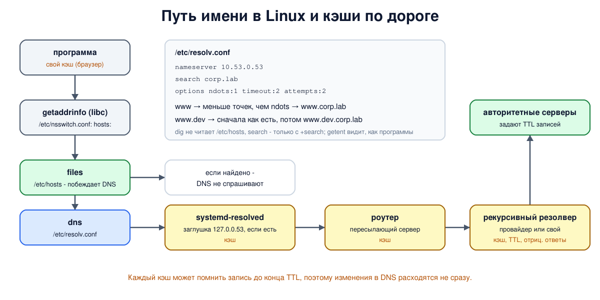

# Урок 64. Кэш и TTL; как устроен резолвинг в Linux

В уроке 62 резолвер ответил на повторный вопрос из кэша, не спрашивая никого. Здесь разберём кэш подробнее: сколько живут записи, почему изменения в DNS приходят не сразу и как запоминаются отрицательные ответы. А затем спустимся на сторону клиента: что именно делает Linux, когда программа просит адрес по имени, и какие файлы на это влияют.

## TTL: сколько можно помнить

У каждой записи есть **TTL** - сколько секунд её разрешено хранить в кэше (Таненбаум, разд. 7.1.2, с. 686-687). Резолвер, получив запись, запоминает её и отсчитывает время; отвечая из кэша, он сообщает **оставшийся** TTL, поэтому число в ответе со временем уменьшается. Когда TTL истёк, запись забывается, и следующий вопрос снова идёт к авторитетным серверам. Записи из кэша не авторитетны: авторитетный ответ - только из первых рук (Таненбаум, разд. 7.1.5, с. 699).

TTL выбирает владелец зоны, и это компромисс:

- **длинный TTL** (часы, сутки) - меньше запросов к авторитетным серверам, быстрее ответы, сеть переживает недолгую недоступность этих серверов; но изменения расходятся медленно: пока не истёк TTL, кто-то получит старый адрес;
- **короткий TTL** (секунды, минуты) - изменения видны почти сразу, на этом построены балансировка и быстрое переключение; но больше запросов и сильнее зависимость от доступности серверов.

Отсюда практическое правило: **перед переездом сервера TTL заранее уменьшают**, ждут, пока истечёт старый, меняют адрес и потом возвращают TTL обратно. Резолверы ещё и ограничивают TTL сверху своим максимумом (в BIND - `max-cache-ttl`, для отрицательных ответов - `max-ncache-ttl`) и могут забыть запись раньше, если кэш переполнен.

Кэшируются и **отрицательные ответы** - "такого имени нет" (NXDOMAIN) и "записей такого типа нет" (NODATA). Срок берётся из записи SOA, которую сервер прикладывает к отрицательному ответу: меньшее из её TTL и её последнего поля (RFC 2308, урок 63). Поэтому только что созданное имя может "не существовать" для тех, кто недавно о нём спрашивал.

## Сколько кэшей между программой и сервером

Кэш есть не только у резолвера провайдера. Ответ может быть запомнен:

- в самой программе (браузеры держат свой кэш имён);
- в локальной службе ОС - в Ubuntu это **systemd-resolved**, иногда nscd или dnsmasq;
- на домашнем роутере, который часто работает как пересылающий DNS-сервер;
- на рекурсивном резолвере.

Поэтому после изменения записи "у меня ещё старый адрес" - нормально: где-то по пути не истёк TTL. Очистить можно только свои кэши (`resolvectl flush-caches` для systemd-resolved).

## Как Linux превращает имя в адрес

Программа вызывает `getaddrinfo` из libc. Дальше (`man nsswitch.conf`, `man resolv.conf`):

- **`/etc/nsswitch.conf`**, строка `hosts:` - в каком порядке опрашивать источники: `files` (файл `/etc/hosts`), `dns` (DNS по `/etc/resolv.conf`), `resolve` (напрямую systemd-resolved), `mdns4_minimal` (локальные имена `.local`), `myhostname` (своё имя). Обычно `files` идёт первым (а если первым стоит `resolve`, `/etc/hosts` читает сам systemd-resolved);
- **`/etc/hosts`** - локальная таблица "адрес - имена", наследник `hosts.txt` (урок 61). При обычном порядке (`files` первым) запись в нём побеждает DNS;
- **`/etc/resolv.conf`** - настройки stub-резолвера libc:
  - `nameserver` - адрес резолвера, до трёх строк; следующий спрашивается, если предыдущий не ответил или ответил отказом;
  - `search` - домены поиска: они дописываются к коротким именам;
  - `options ndots:N` - если в имени меньше N точек, сначала пробуются домены поиска, иначе сначала имя как есть (по умолчанию N = 1);
  - `options timeout:T attempts:A` - сколько ждать ответа и сколько делать попыток (по умолчанию 5 секунд и 2 попытки).

В современной Ubuntu `/etc/resolv.conf` - обычно символьная ссылка на файл systemd-resolved, где записан один `nameserver 127.0.0.53`: это **локальная заглушка** systemd-resolved. Он кэширует ответы, знает DNS-серверы каждого интерфейса (полученные по DHCP или заданные в netplan) и сам ходит к ним; его состояние показывает `resolvectl status`, спросить через него - `resolvectl query имя`. Но бывает и иначе: на нашем сервере `/etc/resolv.conf` - обычный файл с публичными резолверами, а в WSL2 этот файл создаёт сама WSL. Что стоит на твоей машине, покажет последний шаг опыта.

Важное следствие: **`dig` не пользуется ни `/etc/hosts`, ни `nsswitch.conf`**, а домены поиска применяет только с ключом `+search`. Он спрашивает DNS-сервер напрямую - указанный через `@` или серверы `nameserver` из `/etc/resolv.conf` по порядку. Чтобы увидеть то, что видят обычные программы, используй `getent ahosts имя`.



## Как это увидеть в Linux

Возьмём корень, зоны `lab.`, `corp.lab.` и резолвер из урока 62. У `www.corp.lab` TTL всего 8 секунд, а отрицательные ответы зоны живут 30 секунд. Посмотрим, как убывает TTL в кэше, как резолвер продолжает раздавать старый адрес после изменения зоны и как он помнит, что имени нет. Затем подменим для клиента `/etc/resolv.conf` (с доменом поиска и `ndots:1`) и `/etc/hosts` - только внутри одной команды, через собственное пространство монтирования, как в уроке 62, - и посмотрим, какие вопросы на самом деле уходят резолверу. В конце - как устроено разрешение имён на самой машине (только чтение).

Нужны Linux (подойдёт WSL2), права sudo, BIND и dig: `sudo apt install bind9 bind9-dnsutils`; службу `named` для опыта можно выключить: `sudo systemctl disable --now named`. Рабочий каталог, как в уроке 61, создаётся в `/var/cache/bind` (из-за профиля AppArmor) или во временном каталоге; всё удаляется в конце.

Создай файл `dns-cache.sh` и запусти `bash dns-cache.sh`:
```
set -u
umask 022
NAMED=$(command -v named || ls /opt/hbh-dns/usr/sbin/named 2>/dev/null)
for c in "$NAMED" dig getent; do
  [ -n "$c" ] && command -v "$c" >/dev/null || { echo "нужен BIND: sudo apt install bind9 bind9-dnsutils, затем sudo systemctl disable --now named"; exit 1; }
done
ns=hbh-dns
sudo ip netns pids $ns 2>/dev/null | xargs -r sudo kill
sudo ip netns del $ns 2>/dev/null
# named из пакета Ubuntu ограничен профилем AppArmor: читать он может из /etc/bind,
# а писать - в /var/cache/bind и ещё несколько каталогов
if [ -d /var/cache/bind ]; then d=$(sudo mktemp -d /var/cache/bind/hbh.XXXXXX); else d=$(mktemp -d); fi
sudo chmod 777 "$d"
# корень, зона lab., зона corp.lab. и резолвер 10.53.0.53, как в уроке 62
sudo ip netns add $ns
N="sudo ip netns exec $ns"
$N ip link set lo up
$N ip link add dns0 type dummy
$N ip link set dns0 up
for a in 100 1 2 3 53; do $N ip addr add 10.53.0.$a/24 dev dns0; done
cat > "$d/root.db" <<'EOF'
$TTL 3600
.             SOA  a.root. admin.root. 1 3600 600 86400 3600
.             NS   a.root.
a.root.       A    10.53.0.1
lab.          NS   ns.nic.lab.
ns.nic.lab.   A    10.53.0.2
EOF
cat > "$d/lab.db" <<'EOF'
$TTL 3600
@             SOA  ns.nic.lab. admin.nic.lab. 1 3600 600 86400 3600
@             NS   ns.nic.lab.
ns.nic        A    10.53.0.2
corp          NS   ns.corp.lab.
ns.corp       A    10.53.0.3
EOF
# у www короткий TTL - 8 секунд; отрицательные ответы зоны живут 30 секунд (последнее поле SOA)
zone() {   # zone адрес-www
  cat > "$d/corp.db" <<EOF
\$TTL 3600
@             SOA  ns.corp.lab. admin.corp.lab. $2 3600 600 86400 30
@             NS   ns.corp.lab.
ns            A    10.53.0.3
www       8   A    $1
www.dev       A    10.0.0.90
EOF
}
zone 10.0.0.80 1
: > "$d/empty.keys"     # без ключей настоящего корня: у нашего корня нет подписей (урок 66)
cat > "$d/root.hint" <<'EOF'
.             3600000  NS  a.root.
a.root.       3600000  A   10.53.0.1
EOF
srv() {   # srv имя адрес "настройки" "зона"
  mkdir -m 777 "$d/$1"
  cat > "$d/$1/named.conf" <<EOF
options {
    directory "$d/$1";
    pid-file "$d/$1/pid";
    session-keyfile "$d/$1/session.key";
    listen-on { $2; };
    listen-on-v6 { none; };
    querylog yes;
    notify no;
    dnssec-validation no;
    bindkeys-file "$d/empty.keys";
    $3
};
$4
EOF
  $N "$NAMED" -g -c "$d/$1/named.conf" > "$d/$1/log" 2>&1 &
}
srv root 10.53.0.1 "recursion no;" "zone \".\" { type primary; file \"$d/root.db\"; };"
srv lab 10.53.0.2 "recursion no;" "zone \"lab.\" { type primary; file \"$d/lab.db\"; };"
srv corp 10.53.0.3 "recursion no;" "zone \"corp.lab.\" { type primary; file \"$d/corp.db\"; };"
srv resolver 10.53.0.53 "recursion yes; allow-recursion { 10.53.0.0/24; }; query-source address 10.53.0.53;" \
  "zone \".\" { type hint; file \"$d/root.hint\"; };"
sleep 2
R="$N dig @10.53.0.53"
ans() { $R "$@" +noall +answer | sed -E 's/\s+/ /g'; }
echo '--- 1. TTL counts down in the cache'
echo "  t=0: $(ans www.corp.lab)"
sleep 3
echo "  t=3: $(ans www.corp.lab)"
echo '--- 2. the owner changes the address, the cache still has the old one'
zone 10.0.0.81 2
sudo kill -HUP $(cat "$d/corp/pid")      # сервер зоны перечитывает файлы
sleep 1
echo "  authoritative: $($N dig @10.53.0.3 www.corp.lab +norec +noall +answer | sed -E 's/\s+/ /g')"
echo "  resolver:      $(ans www.corp.lab)"
sleep 5
echo "  after TTL:     $(ans www.corp.lab)"
echo '--- 3. negative caching: NXDOMAIN is remembered too'
for t in 0 2; do
  [ $t = 2 ] && sleep 2
  echo "  t=$t: $($R nosuch.corp.lab +noall +comments +authority | grep -E 'status|SOA' | sed -E 's/.*(status: [A-Z]+).*/\1/; s/\s+/ /g' | tr '\n' ' ')"
done
echo "  queries for nosuch at the corp.lab server: $(grep -c 'query: nosuch' "$d/corp/log")"
echo '--- 4. the stub: resolv.conf with search and ndots'
printf 'nameserver 10.53.0.53\nsearch corp.lab\noptions ndots:1 timeout:2 attempts:2\n' > "$d/resolv.conf"
printf '127.0.0.1 localhost\n' > "$d/hosts"
stub() {   # своё пространство монтирования: resolv.conf и hosts подменяются только для этой команды
  $N sh -c "mount --bind '$d/resolv.conf' /etc/resolv.conf && mount --bind '$d/hosts' /etc/hosts && $1"
}
mark=$(wc -l < "$d/resolver/log")
for name in www www.dev; do
  echo "  getent $name: $(stub "getent ahostsv4 $name" | head -1 | sed -E 's/\s+/ /g')"
done
echo "  what the resolver was asked, in order:"
tail -n +$((mark + 1)) "$d/resolver/log" | grep 'query:' | sed -E 's/.*query: (\S+ IN \S+) .*/    \1/'
echo '--- 5. /etc/hosts comes before DNS'
printf '127.0.0.1 localhost\n10.9.9.9 www.corp.lab\n' > "$d/hosts"
echo "  getent: $(stub 'getent ahostsv4 www.corp.lab' | head -1 | sed -E 's/\s+/ /g')"
echo "  dig:    $(stub 'dig +short www.corp.lab')"
echo '--- 6. on this host'
echo "  /etc/resolv.conf -> $(readlink /etc/resolv.conf || echo 'a regular file')"
grep -E '^(nameserver|search|options)' /etc/resolv.conf | sed 's/^/  /'
grep -E '^hosts:' /etc/nsswitch.conf | sed -E 's/\s+/ /g; s/^/  /'
echo '--- cleanup'
sudo ip netns pids $ns 2>/dev/null | xargs -r sudo kill
sleep 0.5
sudo ip netns del $ns
sudo rm -rf "$d"
ip netns list | grep -c "^$ns"
```

Вот что получилось на нашем сервере:
```
--- 1. TTL counts down in the cache
  t=0: www.corp.lab. 8 IN A 10.0.0.80
  t=3: www.corp.lab. 5 IN A 10.0.0.80
--- 2. the owner changes the address, the cache still has the old one
  authoritative: www.corp.lab. 8 IN A 10.0.0.81
  resolver:      www.corp.lab. 4 IN A 10.0.0.80
  after TTL:     www.corp.lab. 8 IN A 10.0.0.81
--- 3. negative caching: NXDOMAIN is remembered too
  t=0: status: NXDOMAIN corp.lab. 30 IN SOA ns.corp.lab. admin.corp.lab. 2 3600 600 86400 30 
  t=2: status: NXDOMAIN corp.lab. 28 IN SOA ns.corp.lab. admin.corp.lab. 2 3600 600 86400 30 
  queries for nosuch at the corp.lab server: 1
--- 4. the stub: resolv.conf with search and ndots
  getent www: 10.0.0.81 STREAM www.corp.lab
  getent www.dev: 10.0.0.90 STREAM www.dev.corp.lab
  what the resolver was asked, in order:
    www.corp.lab IN A
    www.dev IN A
    www.dev.corp.lab IN A
--- 5. /etc/hosts comes before DNS
  getent: 10.9.9.9 STREAM www.corp.lab
  dig:    10.0.0.81
--- 6. on this host
  /etc/resolv.conf -> a regular file
  nameserver 8.8.8.8
  nameserver 1.1.1.1
  hosts: files dns
--- cleanup
0
```

Разберём.

**Шаг 1: TTL убывает.** Первый ответ резолвер получил от авторитетного сервера - TTL `8`, как в зоне. Через 3 секунды тот же вопрос: TTL `5`, адрес из кэша. Время в ответе может отличаться на секунду - резолвер считает целыми секундами.

**Шаг 2: старый адрес в кэше.** Владелец поменял адрес `www` на `10.0.0.81` и увеличил серийный номер в SOA, сервер зоны перечитал файл по сигналу `HUP`. Авторитетный сервер сразу отвечает новым адресом, а резолвер продолжает отдавать старый `10.0.0.80` - TTL записи в кэше ещё не истёк. Когда истёк, резолвер спросил заново и получил новый адрес. С TTL в сутки это ожидание могло бы длиться до суток - отсюда правило уменьшать TTL перед переездом.

**Шаг 3: отрицательный кэш.** На вопрос о `nosuch.corp.lab` - `NXDOMAIN` и SOA с TTL `30`: столько резолвер будет помнить, что имени нет. Через 2 секунды - `28`, ответ из кэша, и сервер `corp.lab.` получил о `nosuch` всего один вопрос. Если в эти 30 секунд владелец создаст такое имя, клиенты этого резолвера его ещё не увидят.

**Шаг 4: search и ndots.** Клиент спросил короткое имя `www` - точек в нём 0, меньше `ndots:1`, поэтому stub сразу дописал домен поиска: резолвер получил вопрос `www.corp.lab`, и `getent` показал полное имя. Для `www.dev` точка одна, не меньше `ndots`, поэтому сначала имя пробуется как есть: резолвер получил вопрос `www.dev` (в нашем учебном корне такого TLD нет, ответ - "имени нет", и stub перешёл к следующему варианту), и только потом - `www.dev.corp.lab`. Каждое короткое имя может стоить нескольких запросов, и часть из них уходит туда, куда никто не собирался: здесь вопрос о `www.dev` ушёл корневому серверу. В настоящем интернете `.dev` существует, и такой вопрос дошёл бы до её серверов.

**Шаг 5: `/etc/hosts` побеждает.** Строка `10.9.9.9 www.corp.lab` в `/etc/hosts`: `getent`, как любая программа, получил `10.9.9.9` - `files` в `nsswitch.conf` стоит перед `dns`. А `dig` показал адрес из DNS: он `/etc/hosts` не читает. Если "сайт открывается не там", а `dig` показывает правильный адрес, первым делом стоит заглянуть в `/etc/hosts`.

**Шаг 6: на этой машине.** На нашем сервере `/etc/resolv.conf` - обычный файл с двумя публичными резолверами, а `nsswitch.conf` опрашивает сначала `/etc/hosts`, потом DNS. На свежей Ubuntu увидишь ссылку `../run/systemd/resolve/stub-resolv.conf` и `nameserver 127.0.0.53`, в WSL2 - ссылку на файл `/mnt/wsl/resolv.conf`, который создаёт WSL, и адрес резолвера, через который WSL ходит к Windows.

В конце `0`: пространство имён удалено.

## Безопасность: кто решает, куда ведёт имя

Принцип: **адрес, к которому подключится программа, определяется цепочкой локальных настроек и кэшей, и каждое звено - точка влияния**. Кто может изменить `/etc/hosts`, `/etc/resolv.conf` или выдать адрес DNS-сервера по DHCP, тот решает, куда пойдут соединения, - не трогая ни сайт, ни его DNS. А испорченная запись в кэше живёт до конца своего TTL (атаки на кэш - урок 65).

Отдельная тонкость - **домены поиска и короткие имена**: вопрос о коротком имени может уйти с неожиданным доменом, в том числе в публичный DNS, раскрыв внутренние имена, а ответ на такой вопрос может прийти из чужой зоны.

Как защищаться:

- **следить за целостностью** `/etc/hosts`, `/etc/resolv.conf` и `/etc/nsswitch.conf`: менять их может только root, изменения стоит отслеживать (вредоносные программы любят дописывать строки в `/etc/hosts`);
- **знать, чьим резолвером пользуешься**: DNS-серверы, полученные по DHCP в чужой сети, - чужие; для недоверенных сетей - зашифрованный путь к своему резолверу (урок 67);
- **в настройках и скриптах писать полные имена**, лучше с точкой в конце, и держать список `search` коротким и своим;
- **при переезде сервисов** уменьшать TTL заранее, а после инцидента с DNS - очищать кэши (`resolvectl flush-caches`, перезапуск резолвера), иначе испорченные записи доживут до конца TTL;
- **для диагностики сравнивать** `getent` (что видят программы) и `dig` (что отвечает DNS): расхождение указывает на `/etc/hosts`, домены поиска или локальный кэш.

## Итог

- TTL - сколько секунд можно хранить запись; из кэша резолвер отдаёт оставшееся время, поэтому изменения расходятся не мгновенно. Перед переездом TTL уменьшают заранее.
- Отрицательные ответы тоже кэшируются - на меньшее из TTL записи SOA и её последнего поля.
- Кэши есть на нескольких уровнях: в программе, в systemd-resolved, на роутере, на резолвере.
- В Linux `getaddrinfo` следует `nsswitch.conf`: обычно сначала `/etc/hosts`, потом DNS по `/etc/resolv.conf` (`nameserver`, `search`, `ndots`, `timeout`, `attempts`); в Ubuntu часто через заглушку systemd-resolved на `127.0.0.53`.
- `dig` спрашивает DNS напрямую, `getent` показывает то, что видят программы.

## Что почитать

- Таненбаум, разд. 7.1.2, с. 686-687 (кэширование и TTL) и 7.1.5, с. 699 (авторитетные и кэшированные записи).
- Олифер, гл. 13, с. 425: кэширование на DNS-серверах.
- RFC 1034 (разд. 3.6 - TTL записи, 5.3.3 - кэш резолвера; 4.3.4 - первоначальное необязательное отрицательное кэширование, его заменил RFC 2308), RFC 2308 (отрицательное кэширование), RFC 8767 (выдача устаревших записей при недоступности серверов).
- `man resolv.conf`, `man nsswitch.conf`, `man getaddrinfo`, `man systemd-resolved`, `man resolvectl`.
