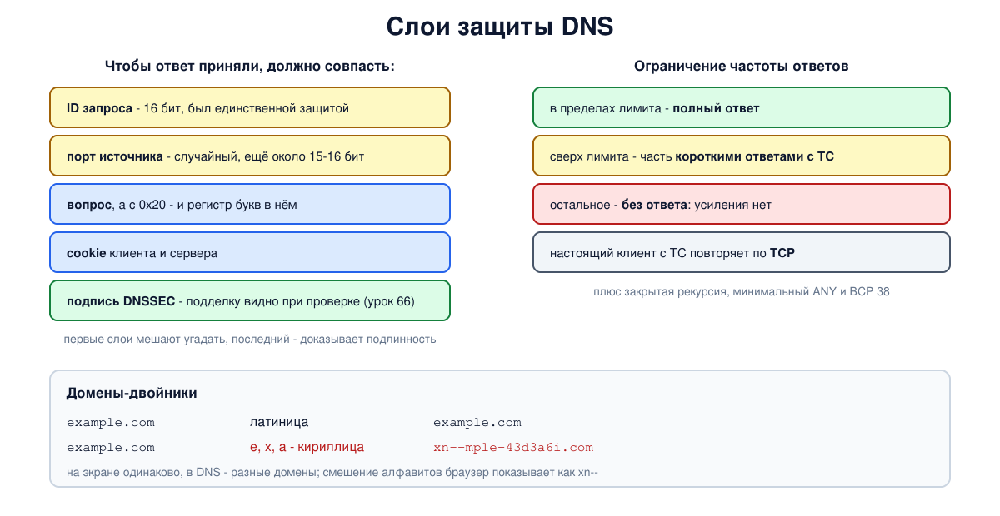

# Урок 65. Атаки на DNS: спуфинг, отравление кэша, атака Каминского, усиление

DNS создавалась в доверенной сети, и в исходном протоколе нет ни шифрования, ни проверки подлинности ответов. В этом уроке разберём, какие слабости из этого следуют, на уровне идеи, а главное - как от них защищаются резолверы, авторитетные серверы и пользователи. В опыте посмотрим на сами механизмы защиты. Подписи DNSSEC, которые решают проблему подлинности по существу, - тема урока 66.

## Подмена ответа и отравление кэша

Запрос и ответ DNS обычно идут по UDP - без соединения и без подтверждения, кто отправил пакет. Клиент принимает первый ответ, который **совпал** с его вопросом: тот же ID, тот же порт, тот же вопрос, нужный адрес отправителя (Таненбаум, разд. 8.2.3, с. 829, 832; Олифер, гл. 29, с. 912-913; RFC 5452). Значит, если посторонний сумеет прислать подходящий ответ раньше настоящего, клиент поверит ему. Это **подмена ответа** (DNS spoofing).

Особенно опасна подмена ответа **рекурсивному резолверу**: ложная запись попадает в его кэш и раздаётся всем его клиентам до конца TTL. Это **отравление кэша** (cache poisoning). Один удачный обман - и тысячи пользователей идут не туда.

Что мешает подмене: посторонний не видит запроса и должен **угадать** его параметры. В исходном DNS это был фактически только 16-битный ID - всего 65 536 вариантов, а порт источника у многих резолверов был постоянным (Таненбаум, с. 829, 832). При большом числе попыток угадать 16 бит вполне реально.

## Атака Каминского

В 2008 году Дэн Каминский показал, как сделать попытки почти бесконечными (Таненбаум, с. 830-832). Раньше на одно имя приходилось одно окно для попыток: если подделка не успела, настоящий ответ оседал в кэше, и до конца TTL пробовать снова было бесполезно. Идея Каминского в том, чтобы заставлять резолвер спрашивать каждый раз **новые несуществующие имена** в атакуемом домене: кэш не мешает, и попыток сколько угодно. А подменяется не адрес одного имени, а **направление**: ответ сообщает, что серверы всего домена находятся по другому адресу, и в кэш попадает власть над всей зоной.

Ответ индустрии - срочное обновление резолверов всего мира в 2008 году: **случайный порт источника** для каждого запроса. Теперь угадывать нужно и ID, и порт - вместе около 32 бит, что делает подбор вслепую непрактичным (RFC 5452). Дополнительно применяют:

- **случайный регистр букв в имени** (кодирование 0x20): сервер отвечает с тем же регистром, и это ещё несколько бит, которые нужно угадать (Таненбаум, с. 691, 693, 832; применяется не везде, в BIND и Unbound по умолчанию выключено);
- **DNS cookies** (RFC 7873, 9018): клиент выбирает случайное значение, сервер вычисляет своё из секрета и адреса клиента, и ответ без правильного cookie сразу виден;
- **осторожное отношение к записям в ответе**: резолвер не верит записям о чужих зонах (проверка bailiwick, RFC 2181) и не заменяет уже проверенные данные записями из дополнительной части ответа;
- и главное - **DNSSEC** (урок 66): ответ подписан, и подделку видно независимо от того, удалось ли угадать ID и порт, - если зона подписана, а резолвер проверяет подписи.

Случайный порт - не абсолютная защита: позже находили способы узнать его по побочным признакам (например, работа SAD DNS 2020 года), их закрывали обновлениями ядер и резолверов. Поэтому защита строится слоями.

## Атаки на доступность и усиление

DNS - критическая служба: без неё не работает почти ничего. Олифер (с. 913-914) описывает DDoS-атаки на корневые серверы в 2002 и 2007 годах. В 2002 году атаковали все 13 серверов, но пользователи заметили лишь небольшие задержки. В 2007-м атаке подверглись четыре пула серверов, и у двух из них канал был почти полностью забит. После атаки 2002 года серверов стало больше и их распределили по разным сетям; сегодня устойчивость корня держится на anycast (урок 61).

Другая беда - **отражение с усилением** (Таненбаум, с. 842; Олифер, с. 915-916). Принцип: маленький запрос по UDP с подделанным адресом отправителя - адресом жертвы - уходит серверу, который отвечает большим ответом уже жертве. Ответ DNS может быть в десятки раз больше запроса, а тысячи **открытых резолверов** (урок 62) и авторитетных серверов, отвечающих всем, складывают этот поток в атаку на сотни гигабит. Олифер разбирает атаку 2013 года на Spamhaus, в которой участвовали десятки тысяч открытых резолверов.

Защита от этого - ответственность всех участников:

- **закрыть рекурсию** от посторонних (RFC 5358, урок 62);
- **ограничить частоту ответов** на авторитетных серверах (Response Rate Limiting): одинаковые ответы одному адресу или одной сети клиентов сверх лимита отбрасываются или заменяются короткими обрезанными (с флагом TC) - настоящий клиент повторит запрос по TCP, а по TCP подделать адрес практически нельзя: нужно завершить рукопожатие;
- **отвечать на запросы ANY минимально** (RFC 8482) - ответы на ANY бывают особенно большими, поэтому их сокращают;
- **фильтровать поддельные адреса отправителя** у провайдеров (BCP 38, RFC 2827): пакет с чужим адресом источника не должен выходить из сети клиента. Из сети, где такая фильтрация есть, пакет с подделанным адресом не выйдет; чем больше таких сетей, тем меньше мест, откуда можно запустить отражение.

## Домены-двойники

Ещё одна атака на имена обходится вообще без взлома DNS: зарегистрировать имя, **похожее** на настоящее. Опечатки (`exmaple.com`), другой домен верхнего уровня, лишнее слово - и пользователь не заметит подмены.

Особый случай - **интернационализированные имена** (IDN). Имена хостов в DNS по-прежнему состоят только из латиницы, цифр и дефиса, а имена на других алфавитах кодируются в **punycode** с префиксом `xn--` (RFC 3492, RFC 5890-5893): `пример.рф` в DNS - это `xn--e1afmkfd.xn--p1ai`. Но многие буквы разных алфавитов выглядят одинаково: кириллические `а`, `е`, `о`, `р`, `с`, `х` неотличимы от латинских. Имя из таких букв - **гомограф**: на экране то же самое, а в DNS - совсем другой домен.

Защита на стороне ПО: браузеры показывают имя в виде `xn--...`, если в одной метке смешаны алфавиты или имя подозрительно похоже на известное; регистратуры ограничивают допустимые символы для своих зон.



## Как это увидеть в Linux

Возьмём корень, зоны и резолвер из урока 62 и посмотрим на защитные механизмы в работе: какие ID и порты выбирает резолвер, обмен cookies, ограничение частоты ответов на авторитетном сервере (`rate-limit` в BIND, 5 одинаковых ответов в секунду) и то, как имена с нелатинскими буквами выглядят в DNS. Ничего, кроме наших собственных серверов в пространстве имён, опыт не затрагивает.

Нужны Linux (подойдёт WSL2), права sudo, BIND, dig, tcpdump и python3: `sudo apt install bind9 bind9-dnsutils tcpdump python3`; службу `named` для опыта можно выключить: `sudo systemctl disable --now named`. Рабочий каталог, как в уроке 61, создаётся в `/var/cache/bind` (из-за профиля AppArmor) или во временном каталоге; всё удаляется в конце.

Создай файл `dns-defense.sh` и запусти `bash dns-defense.sh`:
```
set -u
umask 022
NAMED=$(command -v named || ls /opt/hbh-dns/usr/sbin/named 2>/dev/null)
for c in "$NAMED" dig tcpdump python3; do
  [ -n "$c" ] && command -v "$c" >/dev/null || { echo "нужны BIND, dig, tcpdump и python3: sudo apt install bind9 bind9-dnsutils tcpdump python3, затем sudo systemctl disable --now named"; exit 1; }
done
ns=hbh-dns
sudo ip netns pids $ns 2>/dev/null | xargs -r sudo kill
sudo ip netns del $ns 2>/dev/null
# named из пакета Ubuntu ограничен профилем AppArmor: читать он может из /etc/bind,
# а писать - в /var/cache/bind и ещё несколько каталогов
if [ -d /var/cache/bind ]; then d=$(sudo mktemp -d /var/cache/bind/hbh.XXXXXX); else d=$(mktemp -d); fi
sudo chmod 777 "$d"
# корень, зона lab., зона corp.lab. и резолвер 10.53.0.53, как в уроке 62
sudo ip netns add $ns
N="sudo ip netns exec $ns"
$N ip link set lo up
$N ip link add dns0 type dummy
$N ip link set dns0 up
for a in 100 1 2 3 53; do $N ip addr add 10.53.0.$a/24 dev dns0; done
cat > "$d/root.db" <<'EOF'
$TTL 3600
.             SOA  a.root. admin.root. 1 3600 600 86400 3600
.             NS   a.root.
a.root.       A    10.53.0.1
lab.          NS   ns.nic.lab.
ns.nic.lab.   A    10.53.0.2
EOF
cat > "$d/lab.db" <<'EOF'
$TTL 3600
@             SOA  ns.nic.lab. admin.nic.lab. 1 3600 600 86400 3600
@             NS   ns.nic.lab.
ns.nic        A    10.53.0.2
corp          NS   ns.corp.lab.
ns.corp       A    10.53.0.3
EOF
cat > "$d/corp.db" <<'EOF'
$TTL 3600
@             SOA  ns.corp.lab. admin.corp.lab. 1 3600 600 86400 300
@             NS   ns.corp.lab.
ns            A    10.53.0.3
www           A    10.0.0.80
EOF
: > "$d/empty.keys"     # без ключей настоящего корня: у нашего корня нет подписей (урок 66)
cat > "$d/root.hint" <<'EOF'
.             3600000  NS  a.root.
a.root.       3600000  A   10.53.0.1
EOF
srv() {   # srv имя адрес "настройки" "зона"
  mkdir -m 777 "$d/$1"
  cat > "$d/$1/named.conf" <<EOF
options {
    directory "$d/$1";
    pid-file "$d/$1/pid";
    session-keyfile "$d/$1/session.key";
    listen-on { $2; };
    listen-on-v6 { none; };
    notify no;
    dnssec-validation no;
    bindkeys-file "$d/empty.keys";
    $3
};
$4
EOF
  $N "$NAMED" -g -c "$d/$1/named.conf" > "$d/$1/log" 2>&1 &
}
srv root 10.53.0.1 "recursion no;" "zone \".\" { type primary; file \"$d/root.db\"; };"
srv lab 10.53.0.2 "recursion no;" "zone \"lab.\" { type primary; file \"$d/lab.db\"; };"
# авторитетный сервер ограничивает частоту одинаковых ответов одному клиенту (точнее, одной сети /24): 5 в секунду
srv corp 10.53.0.3 "recursion no; rate-limit { responses-per-second 5; };" "zone \"corp.lab.\" { type primary; file \"$d/corp.db\"; };"
srv resolver 10.53.0.53 "recursion yes; allow-recursion { 10.53.0.0/24; }; query-source address 10.53.0.53;" \
  "zone \".\" { type hint; file \"$d/root.hint\"; };"
sleep 2
echo '--- 1. the resolver asks with a random ID and a random source port'
$N dig @10.53.0.53 www.corp.lab +short >/dev/null      # корень и lab. уже в кэше
$N tcpdump -i lo -nn -l -c 5 'udp and src host 10.53.0.53 and dst host 10.53.0.3 and dst port 53' > "$d/cap" 2>/dev/null &
sleep 1
for i in 1 2 3 4 5; do $N dig @10.53.0.53 n$i.corp.lab +short >/dev/null; done
sleep 1
sed -E 's/.*10\.53\.0\.53\.([0-9]+) > [0-9.]+: ([0-9]+)\S* .*(A\? \S+).*/  source port \1, ID \2, \3/' "$d/cap"
echo '--- 2. DNS cookies between the client and the resolver'
$N dig @10.53.0.53 www.corp.lab | grep COOKIE | awk '{ printf "  COOKIE of %d bytes %s\n", length($3)/2, $4 }'
echo '--- 3. response rate limiting: 40 identical queries in 0.4 s'
cat > "$d/burst.py" <<'EOF'
import socket, struct, time
qname = b"".join(bytes([len(l)]) + l.encode() for l in "www.corp.lab".split(".")) + b"\0"
s = socket.socket(socket.AF_INET, socket.SOCK_DGRAM); s.bind(("10.53.0.100", 0))
for i in range(40):
    s.sendto(struct.pack(">HHHHHH", i, 0, 1, 0, 0, 0) + qname + struct.pack(">HH", 1, 1), ("10.53.0.3", 53))
    time.sleep(0.01)
s.settimeout(0.5); full = tc = 0
while True:
    try:
        r = s.recv(4096)
    except socket.timeout:
        break
    flags, an = struct.unpack(">H", r[2:4])[0], struct.unpack(">H", r[6:8])[0]
    if flags & 0x0200: tc += 1
    elif an: full += 1
print(f"  full answers: {full}, truncated (TC): {tc}, no answer: {40 - full - tc}")
EOF
$N python3 "$d/burst.py"
echo "  the same name over TCP right after: $($N dig @10.53.0.3 www.corp.lab +tcp +short)"
echo '--- 4. internationalized names: what is really in DNS'
cat > "$d/idn.py" <<'EOF'
import unicodedata
def script(ch):
    return unicodedata.name(ch).split()[0] if ch.isalpha() else None
for name in ["пример.рф", "example.com", "ехаmple.com"]:
    ascii_name = name.encode("idna").decode()
    labels = []
    for label in name.split("."):
        scripts = sorted({s for s in map(script, label) if s})
        labels.append("+".join(scripts) + (" MIXED" if len(scripts) > 1 else ""))
    print(f"  {name:12} -> {ascii_name:28} scripts: {', '.join(labels)}")
EOF
python3 "$d/idn.py"
echo '--- cleanup'
sudo ip netns pids $ns 2>/dev/null | xargs -r sudo kill
sleep 0.5
sudo ip netns del $ns
sudo rm -rf "$d"
ip netns list | grep -c "^$ns"
```

Вот что получилось на нашем сервере (номера портов и ID при каждом запуске свои):
```
--- 1. the resolver asks with a random ID and a random source port
  source port 50242, ID 7115, A? n1.corp.lab.
  source port 52051, ID 38497, A? n2.corp.lab.
  source port 38864, ID 64545, A? n3.corp.lab.
  source port 47033, ID 53110, A? n4.corp.lab.
  source port 50372, ID 24459, A? n5.corp.lab.
--- 2. DNS cookies between the client and the resolver
  COOKIE of 24 bytes (good)
--- 3. response rate limiting: 40 identical queries in 0.4 s
  full answers: 5, truncated (TC): 18, no answer: 17
  the same name over TCP right after: 10.0.0.80
--- 4. internationalized names: what is really in DNS
  пример.рф    -> xn--e1afmkfd.xn--p1ai        scripts: CYRILLIC, CYRILLIC
  example.com  -> example.com                  scripts: LATIN, LATIN
  ехаmple.com  -> xn--mple-43d3a6i.com         scripts: CYRILLIC+LATIN MIXED, LATIN
--- cleanup
0
```

Разберём.

**Шаг 1: ID и порт.** `tcpdump` поймал пять запросов резолвера к серверу `corp.lab.` - и у каждого свой порт источника и свой ID, оба выбраны случайно. Ответ будет принят, только если совпадут оба (и сам вопрос): постороннему пришлось бы угадывать около 30 бит (порт здесь берётся из нескольких десятков тысяч значений), то есть порядка миллиарда вариантов и больше, причём успеть до настоящего ответа.

**Шаг 2: cookie.** В ответе резолвера - cookie длиной 24 байта: 8 байт выбрал клиент (`dig`), 16 добавил сервер, и `dig` проверил его - `good`. Клиент, который хранит состояние (например, резолвер), в следующих запросах отправит этот cookie, и ответ без правильного значения будет сразу виден. Это не заменяет подписи, но отсекает слепую подмену и помогает серверу отличать настоящих клиентов от поддельных адресов.

**Шаг 3: ограничение частоты.** 40 одинаковых запросов за 0,4 секунды от одного адреса: 5 получили полный ответ (лимит - 5 в секунду), а остальные 35 сервер ограничил: примерно половину отбросил молча, а на другую половину ответил коротким обрезанным ответом с флагом TC (в BIND это параметр `slip`, по умолчанию каждый второй). Короткий ответ не даёт усиления, а настоящий клиент, получив TC, повторит запрос по TCP - и последняя строка показывает, что по TCP ответ приходит сразу: ограничение действует только на UDP, где адрес отправителя можно подделать.

**Шаг 4: имена на других алфавитах.** `пример.рф` в DNS - `xn--e1afmkfd.xn--p1ai`. А `ехаmple.com` на экране не отличить от `example.com`, но первые три буквы в нём кириллические: в DNS это совсем другой домен `xn--mple-43d3a6i.com`. Простая проверка, как в нашем скрипте, - смешение алфавитов в одной метке (`CYRILLIC+LATIN MIXED`), - и есть основа правил, по которым браузеры решают показывать имя в виде `xn--`. (Встроенный в Python кодек `idna` реализует старый стандарт IDNA2003; для настоящих проверок есть пакет `idna` с IDNA2008.)

В конце `0`: пространство имён удалено.

## Безопасность: как защищаться

Принцип: **в исходном DNS ответ подлинный только потому, что его трудно подделать вслепую**. Вся защита без DNSSEC - это увеличение того, что нужно угадать, и уменьшение того, что можно выиграть. Поэтому:

**Тем, кто держит резолвер:**

- обновлять ПО резолвера и ядро - защита от подмены (случайные порты, проверки) появляется именно в обновлениях;
- закрыть рекурсию для посторонних и включить cookies;
- включить проверку DNSSEC (урок 66).

**Тем, кто держит авторитетные серверы:**

- включить ограничение частоты ответов и минимальные ответы на ANY;
- подписать свои зоны DNSSEC;
- распределять серверы по разным сетям (а для больших зон - anycast), чтобы пережить атаки на доступность.

**Провайдерам и владельцам сетей:** фильтровать исходящие пакеты с чужими адресами отправителя (BCP 38).

**Пользователям и владельцам доменов:**

- пользоваться резолвером, которому доверяешь, а в чужих сетях - зашифрованным путём к нему (урок 67);
- проверять имя сайта, а не его вид: менеджер паролей не подставит пароль на домене-двойнике, закладки надёжнее ссылок из писем;
- владельцам известных брендов - следить за регистрациями похожих имён и за выпуском сертификатов на них (журналы Certificate Transparency, урок 73).

## Итог

- Без DNSSEC подлинность ответа держится на том, что его трудно угадать: ID, порт, вопрос, cookie.
- Подмена ответа резолверу отравляет его кэш для всех клиентов; атака Каминского сделала попытки неограниченными и нацелилась на делегирование целой зоны. Ответ - случайный порт источника (около 32 бит вместе с ID), 0x20, cookies, а по существу - DNSSEC.
- Открытые резолверы и большие ответы позволяют отражение с усилением; защита - закрытая рекурсия, ограничение частоты ответов, минимальные ответы на ANY и фильтрация поддельных адресов (BCP 38).
- Домены-двойники и гомографы IDN обманывают человека, а не протокол; в DNS такие имена - `xn--...`, и браузеры показывают их так при смешении алфавитов и при сходстве с известными именами.

## Что почитать

- Таненбаум, разд. 8.2.3, с. 828-832 (подмена, отравление кэша, атака Каминского, защита) и разд. 8.2.4, с. 842-843 (отражение, усиление, фильтрация); с. 691, 693 (кодирование 0x20).
- Олифер, гл. 29, с. 912-916: атаки на DNS, корневые серверы, отражение, методы защиты. В книге название Spamhaus написано с опечаткой. Передача зоны (AXFR), которую книга называет причиной усиления, идёт по TCP и для отражения с подделанным адресом не годится; по последующим разборам, использовались запросы ANY. Утверждение, что нерекурсивные серверы не дают усиления, устарело: большие ответы (ANY, подписи DNSSEC) дают и авторитетные серверы, поэтому для них и придуман rate-limit.
- RFC 5452 (устойчивость резолверов к подмене), RFC 7873 и 9018 (DNS cookies), RFC 5358 (открытые резолверы), RFC 8482 (ответы на ANY), BCP 38 / RFC 2827 (фильтрация адресов), RFC 3492 и 5890-5893 (IDN и punycode).
