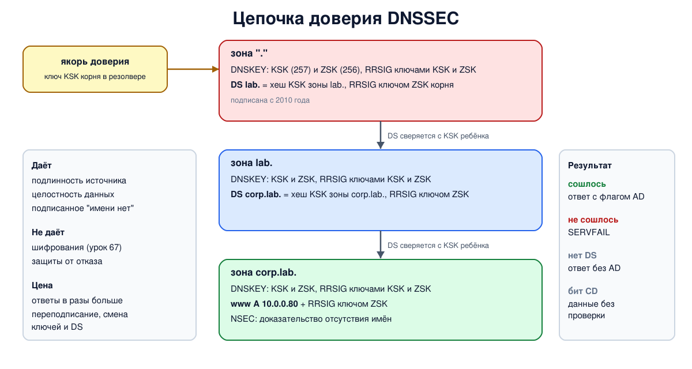

# Урок 66. DNSSEC

В уроке 65 мы видели, что без дополнительных мер подлинность ответа DNS держится только на том, что его трудно угадать. **DNSSEC** (DNS Security Extensions) решает задачу по существу: данные зоны **подписываются**, и резолвер может проверить, что ответ пришёл от владельца зоны и не изменён по дороге. В этом уроке - как устроены подписи и цепочка доверия, а в опыте мы подпишем свой корень, TLD и зону и посмотрим, как валидирующий резолвер ловит подделку.

## Что даёт DNSSEC и чего не даёт

DNSSEC обеспечивает (RFC 4033, разд. 3; у Таненбаума, разд. 8.12.2, с. 929, главная служба - подтверждение источника данных):

- **подлинность источника**: данные действительно подписаны ключом владельца зоны;
- **целостность**: ни одна запись не изменена по пути и в кэшах;
- **доказанное отсутствие**: ответ "такого имени нет" тоже подписан, и его нельзя подделать.

Чего DNSSEC **не** даёт: **конфиденциальности** - запросы и ответы по-прежнему идут открыто, и любой на пути видит, какие имена ищет пользователь (это задача DoT и DoH, урок 67), и защиты от атак на доступность (RFC 4033, разд. 4). Данные DNS считаются публичными, их нужно не скрыть, а заверить (Таненбаум, с. 929).

## Подписи и ключи

Подписывается не каждая запись, а **набор записей** (RRset: одинаковые имя, класс и тип, урок 63). Новые типы записей (RFC 4034):

- **RRSIG** - подпись набора: алгоритм, срок действия, имя подписавшей зоны, номер ключа (key tag) и сама подпись;
- **DNSKEY** - открытый ключ зоны, публикуется в самой зоне;
- **DS** (delegation signer) - хеш ключа дочерней зоны, хранится **у родителя**;
- **NSEC** (или NSEC3) - для доказательства отсутствия имён.

Обычно подписи готовятся **заранее**, при подписании зоны, а не при каждом ответе (Таненбаум, с. 930): сервер просто выдаёт готовые записи RRSIG вместе с данными. Поэтому у подписей есть срок действия, и зону нужно регулярно **переподписывать**: истёкшая подпись так же недействительна, как поддельная.

У зоны обычно два ключа:

- **KSK** (key signing key, флаг 257) подписывает набор DNSKEY (ZSK при этом может подписывать и его). Его хеш лежит у родителя в DS, поэтому смена KSK требует обновить DS у родителя - делают это редко;
- **ZSK** (zone signing key, флаг 256) подписывает все остальные данные. Его можно менять сколько угодно, не беспокоя родителя.

Алгоритмы сегодня - ECDSA P-256 с SHA-256 (номер 13, как в опыте), RSA с SHA-256 (8) и Ed25519 (15); старые RSA/MD5 и RSA/SHA-1 для новых подписей не используются (RFC 8624 и более поздние документы IETF).

## Цепочка доверия

Как резолвер узнаёт, что ключ зоны - настоящий? Через родителя (Таненбаум, с. 697, 930):

- корень подписан, и его ключ KSK резолвер знает заранее - это **якорь доверия** (trust anchor). Корневая зона подписана с 2010 года (Олифер, гл. 29, с. 916), и в каждом валидирующем резолвере есть ключ корня;
- в корне лежит запись DS для `lab.` - хеш ключа KSK зоны `lab.`, подписанная ключом корня;
- в зоне `lab.` - DS для `corp.lab.`, подписанная ключом `lab.`;
- в зоне `corp.lab.` - сами данные, подписанные её ключом.

Резолвер проходит эту цепочку сверху вниз: ключ корня - DS - ключ `lab.` - DS - ключ `corp.lab.` - подпись записи. Если сходятся все звенья, ответ **проверен** (secure), и резолвер ставит в ответе клиенту флаг **AD** (урок 63). Если подпись не сходится, ответ **поддельный** (bogus), и резолвер возвращает `SERVFAIL` - лучше никакого ответа, чем ложный. Если зона просто не подписана (у родителя нет DS, и родитель доказывает это подписанной NSEC), ответ **непроверенный** (insecure): резолвер отдаёт его как обычно, но без AD.

Клиент сообщает, что хочет подписи, битом **DO** в EDNS, а битом **CD** (checking disabled) - что проверит сам и просит отдать данные без проверки.

## Доказательство отсутствия: NSEC и NSEC3

Как подписать ответ "имени нет", если подписи готовятся заранее, а несуществующих имён бесконечно много? **NSEC**: имена зоны упорядочены, и каждая запись NSEC говорит "после этого имени следующее - такое-то, а у этого имени есть записи таких-то типов". Ответ на вопрос о несуществующем имени содержит подписанную NSEC, показывающую "промежуток", в который это имя попало бы.

Обратная сторона - по цепочке NSEC можно **перебрать всю зону** (zone walking). **NSEC3** (RFC 5155) использует вместо имён их хеши, что затрудняет перебор; параметры NSEC3 сегодня рекомендуют простые - без соли и дополнительных итераций (RFC 9276).

## Цена DNSSEC

- **Размер ответов** растёт в разы (в опыте - с 118 до 430 байт), отсюда фрагментация UDP и более сильное усиление при отражении (урок 65).
- **Эксплуатация**: регулярное переподписание, смена ключей по правилам (RFC 6781), обновление DS у регистратора. Ошибка - истёкшая подпись или DS, не совпадающий с ключом, - и зона перестаёт открываться у всех, кто проверяет подписи.
- **Последний шаг не защищён**: stub-резолвер обычно не проверяет подписи сам и верит флагу AD от резолвера. Путь от клиента до резолвера защищают отдельно (урок 67).



## Как это увидеть в Linux

Возьмём корень, зоны `lab.` и `corp.lab.` из урока 62 и подпишем все три **снизу вверх**: для каждой зоны создадим пару ключей KSK и ZSK (`dnssec-keygen`, алгоритм ECDSA P-256), подпишем зону (`dnssec-signzone`), а файл с записью DS добавим в родительскую зону перед её подписанием. Ключ KSK корня станет якорем доверия нашего резолвера, и проверку подписей на нём включим (`dnssec-validation yes`). Затем посмотрим на подписи, на проверку всей цепочки утилитой `delv`, на доказательство отсутствия имени и на то, что будет, если изменить подписанную запись без ключа.

Нужны Linux (подойдёт WSL2), права sudo, BIND и его утилиты: `sudo apt install bind9 bind9-utils bind9-dnsutils`; службу `named` для опыта можно выключить: `sudo systemctl disable --now named`. Рабочий каталог, как в уроке 61, создаётся в `/var/cache/bind` (из-за профиля AppArmor) или во временном каталоге; ключи и всё остальное удаляются в конце.

Создай файл `dnssec-lab.sh` и запусти `bash dnssec-lab.sh`:
```
set -u
umask 022
NAMED=$(command -v named || ls /opt/hbh-dns/usr/sbin/named 2>/dev/null)
KEYGEN=$(command -v dnssec-keygen || ls /opt/hbh-dns/usr/bin/dnssec-keygen 2>/dev/null)
SIGNZONE=$(command -v dnssec-signzone || ls /opt/hbh-dns/usr/bin/dnssec-signzone 2>/dev/null)
CHECKZONE=$(command -v named-checkzone || ls /opt/hbh-dns/usr/bin/named-checkzone 2>/dev/null)
for c in "$NAMED" "$KEYGEN" "$SIGNZONE" "$CHECKZONE" dig delv; do
  [ -n "$c" ] && command -v "$c" >/dev/null || { echo "нужен BIND: sudo apt install bind9 bind9-utils bind9-dnsutils, затем sudo systemctl disable --now named"; exit 1; }
done
ns=hbh-dns
sudo ip netns pids $ns 2>/dev/null | xargs -r sudo kill
sudo ip netns del $ns 2>/dev/null
# named из пакета Ubuntu ограничен профилем AppArmor: читать он может из /etc/bind,
# а писать - в /var/cache/bind и ещё несколько каталогов
if [ -d /var/cache/bind ]; then d=$(sudo mktemp -d /var/cache/bind/hbh.XXXXXX); else d=$(mktemp -d); fi
sudo chmod 777 "$d"
cd "$d" || exit 1
# корень, зона lab., зона corp.lab. и резолвер 10.53.0.53, как в уроке 62
sudo ip netns add $ns
N="sudo ip netns exec $ns"
$N ip link set lo up
$N ip link add dns0 type dummy
$N ip link set dns0 up
for a in 100 1 2 3 53; do $N ip addr add 10.53.0.$a/24 dev dns0; done
cat > root.db <<'EOF'
$TTL 3600
.             SOA  a.root. admin.root. 1 3600 600 86400 3600
.             NS   a.root.
a.root.       A    10.53.0.1
lab.          NS   ns.nic.lab.
ns.nic.lab.   A    10.53.0.2
EOF
cat > lab.db <<'EOF'
$TTL 3600
@             SOA  ns.nic.lab. admin.nic.lab. 1 3600 600 86400 3600
@             NS   ns.nic.lab.
ns.nic        A    10.53.0.2
corp          NS   ns.corp.lab.
ns.corp       A    10.53.0.3
EOF
cat > corp.db <<'EOF'
$TTL 3600
@             SOA  ns.corp.lab. admin.corp.lab. 1 3600 600 86400 300
@             NS   ns.corp.lab.
ns            A    10.53.0.3
www           A    10.0.0.80
mail          A    10.0.0.25
EOF
# подписываем снизу вверх: у каждой зоны ключ KSK (подписывает ключи) и ZSK (подписывает данные);
# dnssec-signzone кладёт рядом файл dsset-<зона> - запись DS для родителя
sign() {   # sign зона файл
  k=$("$KEYGEN" -q -a ECDSAP256SHA256 -f KSK "$1"); z=$("$KEYGEN" -q -a ECDSAP256SHA256 "$1")
  cat "$k.key" "$z.key" >> "$2"
  "$SIGNZONE" -q -o "$1" "$2" > /dev/null
}
sign corp.lab corp.db
cat dsset-corp.lab. >> lab.db           # DS зоны corp.lab. - в родительскую зону lab.
sign lab lab.db
cat dsset-lab. >> root.db               # DS зоны lab. - в корень
sign . root.db
# якорь доверия резолвера - ключ KSK корня
rootksk=$(grep -l 'key-signing' K.+013+*.key | head -1)
awk '!/^;/ { printf "trust-anchors { . static-key %s %s %s \"", $4, $5, $6; for (i = 7; i <= NF; i++) printf "%s", $i; print "\"; };" }' "$rootksk" > anchor.conf
srv() {   # srv имя адрес "настройки" "зона"
  mkdir -m 777 "$1"
  cat > "$1/named.conf" <<EOF
options {
    directory "$d/$1";
    pid-file "$d/$1/pid";
    session-keyfile "$d/$1/session.key";
    listen-on { $2; };
    listen-on-v6 { none; };
    notify no;
    $3
};
$4
EOF
  $N "$NAMED" -g -c "$d/$1/named.conf" > "$1/log" 2>&1 &
}
srv root 10.53.0.1 "recursion no;" "zone \".\" { type primary; file \"$d/root.db.signed\"; };"
srv lab 10.53.0.2 "recursion no;" "zone \"lab.\" { type primary; file \"$d/lab.db.signed\"; };"
srv corp 10.53.0.3 "recursion no;" "zone \"corp.lab.\" { type primary; file \"$d/corp.db.signed\"; };"
srv resolver 10.53.0.53 "recursion yes; allow-recursion { 10.53.0.0/24; }; query-source address 10.53.0.53; dnssec-validation yes;" \
  "zone \".\" { type hint; file \"$d/root.hint\"; }; include \"$d/anchor.conf\";"
printf '.  3600000 NS a.root.\na.root. 3600000 A 10.53.0.1\n' > root.hint
sleep 2
short() { sed -E 's/\s+/ /g' | awk '{ if (length($0) > 100) print substr($0, 1, 100) "..."; else print }' | sed 's/^/  /'; }
echo '--- 1. what signing added to the zone corp.lab.'
"$CHECKZONE" -D -o - corp.lab corp.db.signed 2>/dev/null | awk '$3 == "IN" { print $4 }' | sort | uniq -c | sed -E 's/^\s+/  /'
echo '  DS for the parent:'; short < dsset-corp.lab.
echo '--- 2. a validating resolver: the ad flag and the signature'
$N dig @10.53.0.53 www.corp.lab +dnssec | grep -E 'flags:|IN\s+(A|RRSIG)\s' | sed -E 's/;; flags: ([a-z ]+);.*/flags: \1/' | short
echo "  answer size without signatures: $($N dig @10.53.0.3 www.corp.lab +norec | grep -oE 'MSG SIZE.*')"
echo "  answer size with signatures:    $($N dig @10.53.0.3 www.corp.lab +norec +dnssec | grep -oE 'MSG SIZE.*')"
echo '--- 3. delv checks the whole chain itself'
$N delv @10.53.0.53 -a anchor.conf www.corp.lab A 2>&1 | grep -vE '^\s*$' | short
echo '--- 4. proof that a name does not exist: NSEC'
$N dig @10.53.0.53 nosuch.corp.lab +dnssec | grep -E 'status:|IN\s+NSEC\s' | sed -E 's/.*(status: [A-Z]+).*/\1/' | short
echo '--- 5. someone changes a signed record without the key'
sed -i -E 's/^(mail\.corp\.lab\.\s+[0-9]+\s+IN\s+A\s+)10\.0\.0\.25/\110.0.0.66/' corp.db.signed
sudo kill -HUP $(cat corp/pid); sleep 1
echo "  authoritative:       $($N dig @10.53.0.3 mail.corp.lab +norec +short)"
echo "  validating resolver: $($N dig @10.53.0.53 mail.corp.lab | grep -oE 'status: [A-Z]+')"
echo "  with +cd (no check): $($N dig @10.53.0.53 mail.corp.lab +cd +short)"
grep -m1 -oE 'validating mail\.corp\.lab/A: [a-z ]+' resolver/log | sed 's/^/  resolver log: /'
echo '--- cleanup'
cd /
sudo ip netns pids $ns 2>/dev/null | xargs -r sudo kill
sleep 0.5
sudo ip netns del $ns
sudo rm -rf "$d"
ip netns list | grep -c "^$ns"
```

Вот что получилось на нашем сервере (ключи, подписи и номера ключей при каждом запуске свои, даты подписей зависят от дня запуска):
```
--- 1. what signing added to the zone corp.lab.
  3 A
  2 DNSKEY
  1 NS
  4 NSEC
  11 RRSIG
  1 SOA
  DS for the parent:
  corp.lab. IN DS 64000 13 2 41CD80A8D38E016D7890DCB3E18E9419B6B6B7F309799CFAA2E89DB3 A738A12C
--- 2. a validating resolver: the ad flag and the signature
  flags: qr rd ra ad
  ; EDNS: version: 0, flags: do; udp: 1232
  www.corp.lab. 3600 IN A 10.0.0.80
  www.corp.lab. 3600 IN RRSIG A 13 3 3600 20261101094242 20261002094242 58924 corp.lab. A+p6CKGDaxb66d...
  answer size without signatures: MSG SIZE  rcvd: 118
  answer size with signatures:    MSG SIZE  rcvd: 430
--- 3. delv checks the whole chain itself
  ; fully validated
  www.corp.lab. 3600 IN A 10.0.0.80
  www.corp.lab. 3600 IN RRSIG A 13 3 3600 20261101094242 20261002094242 58924 corp.lab. A+p6CKGDaxb66d...
--- 4. proof that a name does not exist: NSEC
  status: NXDOMAIN
  corp.lab. 300 IN NSEC mail.corp.lab. NS SOA RRSIG NSEC DNSKEY
  mail.corp.lab. 300 IN NSEC ns.corp.lab. A RRSIG NSEC
--- 5. someone changes a signed record without the key
  authoritative:       10.0.0.66
  validating resolver: status: SERVFAIL
  with +cd (no check): 10.0.0.66
  resolver log: validating mail.corp.lab/A: no valid signature found
--- cleanup
0
```

Разберём.

**Шаг 1: что добавило подписание.** В зоне `corp.lab.` было 5 записей (SOA, NS и три A). После подписания добавились два ключа DNSKEY (KSK и ZSK), четыре записи NSEC - по одной на каждое имя зоны (`corp.lab`, `mail`, `ns`, `www`), и 11 подписей RRSIG. Наборов записей 10: SOA, NS, DNSKEY и NSEC вершины и пары A и NSEC у `ns`, `www` и `mail`. Каждый набор подписан ключом ZSK, а набор DNSKEY - ещё и ключом KSK, поэтому подписей на одну больше (так `dnssec-signzone` делает по умолчанию; с ключом `-x` набор DNSKEY подписывает только KSK). Файл `dsset-corp.lab.` - запись DS для родителя: номер ключа, алгоритм 13 (ECDSA P-256), тип хеша 2 (SHA-256) и сам хеш ключа KSK. Именно эта запись, добавленная в зону `lab.` и подписанная её ключом, связывает две зоны.

**Шаг 2: проверка на резолвере.** В ответе резолвера флаг `ad` - он прошёл всю цепочку от нашего якоря и убедился в подлинности. `dig +dnssec` выставил бит `do` (сервер вернул его в строке EDNS ответа), поэтому вместе с адресом пришла подпись RRSIG: алгоритм 13, 3 метки в имени, исходный TTL, срок действия - сначала конец, потом начало (30 дней от начала, которое `dnssec-signzone` по умолчанию ставит на час раньше момента подписания), номер ключа и имя зоны `corp.lab.`. Размер ответа авторитетного сервера на тот же вопрос - 118 байт без подписей и 430 с ними.

**Шаг 3: `delv`.** Утилита из BIND, которая проверяет цепочку сама, как валидирующий резолвер, начиная с указанного якоря (`-a`): `fully validated`. Это удобный инструмент, чтобы найти, какое звено цепочки сломано.

**Шаг 4: доказательство отсутствия.** На вопрос о `nosuch.corp.lab` - `NXDOMAIN` и две подписанные записи NSEC. Первая: после `corp.lab` следующее имя - `mail.corp.lab`; это доказывает, что нет и подстановочной записи `*.corp.lab`, которая стояла бы между ними. Вторая: после `mail.corp.lab` идёт `ns.corp.lab`, а `nosuch` по алфавиту лежит как раз между ними - значит, такого имени нет. Заодно видно, как NSEC раскрывает имена зоны.

**Шаг 5: подмена.** Мы изменили адрес `mail` в подписанном файле зоны на `10.0.0.66`, не переподписывая её, - так выглядела бы подделка, сделанная без закрытого ключа: на пути, в кэше или на самом сервере. Авторитетный сервер честно отдаёт изменённые данные. Валидирующий резолвер отвечает `SERVFAIL` и пишет в журнал, что действительной подписи не нашлось. С флагом `cd` (проверку не делать) резолвер отдаёт данные как есть - так клиент может сам разобраться в проблеме, но и защиты тогда нет.

В конце `0`: пространство имён удалено; каталог с ключами удаляется перед этим.

## Безопасность: DNSSEC в эксплуатации

Принцип: **DNSSEC превращает подделку ответа в отказ - и так же поступает с ошибками самого владельца зоны**. Для проверяющего резолвера неверная подпись, истёкшая подпись и DS, не совпадающий с ключом, выглядят одинаково: `SERVFAIL`. Поэтому DNSSEC защищает, только если его аккуратно обслуживают.

Как защищаться:

- **резолверам - включить проверку** (`dnssec-validation auto` в BIND - это значение по умолчанию; `yes` - когда якорь задан вручную, как в опыте; в Unbound - якорь доверия корня) и не выключать её, чтобы "починить" недоступный домен: `SERVFAIL` из-за подписи - признак проблемы, а не повод её скрыть;
- **владельцам зон - подписывать автоматически**: BIND (`dnssec-policy`), Knot и PowerDNS сами переподписывают зону и меняют ключи; ручное подписание, как в опыте, хорошо для понимания, но легко забыть про срок подписей;
- **следить за сроками подписей и за совпадением DS с ключом** - внешним мониторингом, а не только тем, что "у меня открывается" (твой резолвер может не проверять подписи);
- **менять ключи по правилам** (RFC 6781): новый ключ публикуется заранее, старый убирается после истечения TTL; при смене KSK - обновить DS у регистратора и дождаться TTL;
- **беречь закрытый ключ KSK**: кто им владеет, тот может подписать любые данные зоны; его хранят отдельно от сервера, а у корня - в аппаратных модулях на открытых церемониях;
- **защищать последний шаг**: путь от клиента до резолвера - через DoT или DoH (урок 67) или проверка подписей на самой машине.

## Итог

- DNSSEC подписывает наборы записей (RRSIG) ключом зоны (DNSKEY): ответ можно проверить на подлинность и целостность, но он не шифруется.
- Обычно у зоны два ключа: KSK подписывает ключи, ZSK - данные; хеш KSK лежит у родителя в записи DS.
- Цепочка доверия идёт от якоря - ключа корня, подписанного с 2010 года, - через DS каждого родителя. Проверенный ответ получает флаг AD, поддельный - `SERVFAIL`, неподписанный - отдаётся без AD.
- Отсутствие имени доказывают NSEC (раскрывает имена зоны) или NSEC3 (хеши имён).
- Цена - большие ответы, регулярное переподписание и аккуратная смена ключей; ошибки эксплуатации делают зону недоступной.

## Что почитать

- Таненбаум, разд. 8.12.2, с. 928-931 (DNSSEC: службы, наборы записей, DNSKEY и RRSIG), а также с. 696-697 и 832. На с. 930 якорями считаются ключи всех TLD, сегодня якорь один - ключ корня. С. 697 и илл. 8.47 упрощают: в настоящем DNSSEC родитель подписывает не ключ дочерней зоны, а запись DS с его хешем.
- Олифер, гл. 29, с. 916: DNSSEC среди мер защиты DNS, поддержка корневыми серверами с 2010 года.
- RFC 4033-4035 (DNSSEC), RFC 5155 (NSEC3), RFC 6781 (эксплуатация и смена ключей), RFC 8624 (алгоритмы), RFC 9276 (параметры NSEC3), RFC 9364 (обзор документов DNSSEC); `man dnssec-keygen`, `man dnssec-signzone`, `man delv`.
