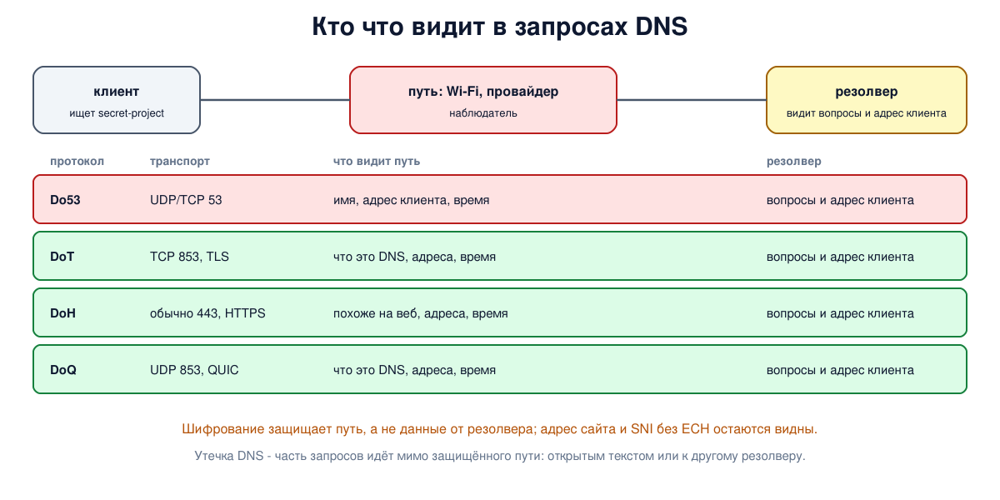

# Урок 67. Приватность DNS: Do53, DoT, DoH, DoQ

Последний урок блока 7. DNSSEC (урок 66) отвечает на вопрос "можно ли верить ответу", но ничего не скрывает: каждое имя, которое ищет устройство, идёт по сети открытым текстом. В этом уроке - кто и что узнаёт из DNS-запросов, как их шифруют (DoT, DoH, DoQ), что шифрование не скрывает и что такое утечка DNS.

## Что раскрывают запросы DNS

Список имён, которые ищет устройство, - почти полный дневник его активности: какие сайты открываются, какие приложения работают, какие устройства есть в доме (Таненбаум, разд. 7.1.7, с. 701-702). Имя медицинского сайта говорит об интересе к здоровью, а запросы умного дома - о том, какие устройства в доме и когда ими пользуются.

Кто это видит в обычном DNS (его называют **Do53** - DNS по UDP и TCP на порту 53):

- **все на пути** между устройством и резолвером: соседи по сети Wi-Fi, владелец точки доступа, провайдер;
- **сам резолвер**: он видит все вопросы и адрес клиента;
- **авторитетные серверы**: они видят вопросы, но от резолвера, а не от клиента. QNAME-минимизация (урок 62) скрывает полное имя от всех серверов, кроме последнего. А расширение **EDNS Client Subnet** (RFC 7871), наоборот, передаёт авторитетному серверу часть адреса клиента, чтобы сеть доставки контента выбрала ближайший узел, - и раскрывает, откуда пришёл вопрос. Резолверы, заботящиеся о приватности, его не отправляют.

## Шифрование пути до резолвера

Чтобы скрыть запросы от наблюдателей на пути, соединение между клиентом и резолвером шифруют:

- **DoT** - DNS поверх TLS (RFC 7858), отдельный порт **853/TCP**. Тот же формат сообщений, но внутри TLS-соединения. Профили RFC 8310 различают **строгий** режим (резолвер обязан предъявить правильный сертификат, иначе отказ) и **оппортунистический** (шифровать, если получится, а нет - откатиться на открытый DNS);
- **DoH** - DNS поверх HTTPS (RFC 8484), обычно порт **443**: запрос - это HTTP-запрос к адресу вида `/dns-query`. Снаружи DoH трудно отличить от обычного веб-трафика;
- **DoQ** - DNS поверх QUIC (RFC 9250), **853/UDP**: QUIC использует рукопожатие TLS 1.3, но обходится без отдельного рукопожатия TCP и без блокировки очереди (QUIC - урок 43).

Как устройство узнаёт, что его резолвер умеет шифровать: настройкой вручную, а также новыми механизмами - запросом `_dns.resolver.arpa` (DDR, RFC 9462) или опциями DHCP и RA (DNR, RFC 9463).

## Что шифрование не скрывает

- **Резолвер по-прежнему видит всё** - вопросы и адрес клиента. Шифрование переносит доверие с сети на оператора резолвера, а не устраняет его (Таненбаум, с. 703). Схема **Oblivious DoH** (RFC 9230) делит знание между двумя сторонами: посредник видит адрес клиента, но не вопрос, резолвер - вопрос, но не адрес, - если посредник и резолвер не сговорились.
- **Адрес назначения**: узнав адрес, устройство к нему подключится, и это видно на пути.
- **Имя в TLS**: при подключении к сайту браузер обычно передаёт имя открыто в поле SNI (блок 9); скрыть его позволяет расширение ECH, которое только начинает распространяться.
- **Время и объём** запросов.

У шифрования DNS есть и общественная сторона, которую разбирает Таненбаум (с. 702-703): если разрешение имён уходит в браузер по DoH к резолверу, выбранному разработчиком браузера, провайдер теряет видимость DNS, на которой строились поиск вредоносных программ и услуги вроде родительского контроля (то же касается сетей организаций). А если браузер по умолчанию отправляет запросы немногим крупным операторам, DNS-трафик миллионов людей сосредотачивается у них. Вопрос здесь не столько в шифровании, сколько в том, **кто выбирает резолвер**. Помимо книги: для управляемых сетей браузеры предусматривают политики и сигналы, позволяющие пользоваться резолвером организации.



## Как это увидеть в Linux

Возьмём корень, зоны и резолвер из урока 62 и научим резолвер BIND принимать запросы тремя способами: обычный DNS на порту 53, DoT на 853 и DoH на 443 (для опыта - с самоподписанным сертификатом, созданным `openssl`). Клиент (`10.53.0.100`) трижды спросит одно и то же имя `secret-project.corp.lab`, а `tcpdump` в это время запишет трафик между клиентом и резолвером; потом поищем имя в записанных пакетах. Наконец, посмотрим в журнал самого резолвера.

Нужны Linux (подойдёт WSL2), права sudo, BIND, dig (версии 9.18 и новее умеют `+tls` и `+https`), tcpdump и openssl: `sudo apt install bind9 bind9-dnsutils tcpdump openssl`; службу `named` для опыта можно выключить: `sudo systemctl disable --now named`. Рабочий каталог, как в уроке 61, создаётся в `/var/cache/bind` (из-за профиля AppArmor) или во временном каталоге; всё удаляется в конце.

Создай файл `dns-privacy.sh` и запусти `bash dns-privacy.sh`:
```
set -u
umask 022
NAMED=$(command -v named || ls /opt/hbh-dns/usr/sbin/named 2>/dev/null)
for c in "$NAMED" dig tcpdump openssl; do
  [ -n "$c" ] && command -v "$c" >/dev/null || { echo "нужны BIND, dig, tcpdump и openssl: sudo apt install bind9 bind9-dnsutils tcpdump openssl, затем sudo systemctl disable --now named"; exit 1; }
done
ns=hbh-dns
sudo ip netns pids $ns 2>/dev/null | xargs -r sudo kill
sudo ip netns del $ns 2>/dev/null
# named из пакета Ubuntu ограничен профилем AppArmor: читать он может из /etc/bind,
# а писать - в /var/cache/bind и ещё несколько каталогов
if [ -d /var/cache/bind ]; then d=$(sudo mktemp -d /var/cache/bind/hbh.XXXXXX); else d=$(mktemp -d); fi
sudo chmod 777 "$d"
# корень, зона lab., зона corp.lab. и резолвер 10.53.0.53, как в уроке 62
sudo ip netns add $ns
N="sudo ip netns exec $ns"
$N ip link set lo up
$N ip link add dns0 type dummy
$N ip link set dns0 up
for a in 100 1 2 3 53; do $N ip addr add 10.53.0.$a/24 dev dns0; done
cat > "$d/root.db" <<'EOF'
$TTL 3600
.             SOA  a.root. admin.root. 1 3600 600 86400 3600
.             NS   a.root.
a.root.       A    10.53.0.1
lab.          NS   ns.nic.lab.
ns.nic.lab.   A    10.53.0.2
EOF
cat > "$d/lab.db" <<'EOF'
$TTL 3600
@             SOA  ns.nic.lab. admin.nic.lab. 1 3600 600 86400 3600
@             NS   ns.nic.lab.
ns.nic        A    10.53.0.2
corp          NS   ns.corp.lab.
ns.corp       A    10.53.0.3
EOF
cat > "$d/corp.db" <<'EOF'
$TTL 3600
@               SOA  ns.corp.lab. admin.corp.lab. 1 3600 600 86400 300
@               NS   ns.corp.lab.
ns              A    10.53.0.3
secret-project  A    10.0.0.77
EOF
: > "$d/empty.keys"     # без ключей настоящего корня: у нашего корня нет подписей (урок 66)
printf '.  3600000 NS a.root.\na.root. 3600000 A 10.53.0.1\n' > "$d/root.hint"
# сертификат резолвера для DoT и DoH (самоподписанный, только для опыта)
openssl req -x509 -newkey ec -pkeyopt ec_paramgen_curve:P-256 -nodes -days 1 -subj "/CN=resolver.lab" -addext "subjectAltName=DNS:resolver.lab" \
  -keyout "$d/key.pem" -out "$d/cert.pem" 2>/dev/null
chmod 644 "$d/key.pem"
srv() {   # srv имя "до options" "настройки" "зона"
  mkdir -m 777 "$d/$1"
  cat > "$d/$1/named.conf" <<EOF
$2
options {
    directory "$d/$1";
    pid-file "$d/$1/pid";
    session-keyfile "$d/$1/session.key";
    listen-on-v6 { none; };
    notify no;
    dnssec-validation no;
    bindkeys-file "$d/empty.keys";
    $3
};
$4
EOF
  $N "$NAMED" -g -c "$d/$1/named.conf" > "$d/$1/log" 2>&1 &
}
srv root "" "listen-on { 10.53.0.1; }; recursion no;" "zone \".\" { type primary; file \"$d/root.db\"; };"
srv lab "" "listen-on { 10.53.0.2; }; recursion no;" "zone \"lab.\" { type primary; file \"$d/lab.db\"; };"
srv corp "" "listen-on { 10.53.0.3; }; recursion no;" "zone \"corp.lab.\" { type primary; file \"$d/corp.db\"; };"
# резолвер слушает три транспорта: обычный DNS (53), DNS поверх TLS (853) и поверх HTTPS (443)
srv resolver "tls local-tls { key-file \"$d/key.pem\"; cert-file \"$d/cert.pem\"; };
http local-http { endpoints { \"/dns-query\"; }; };" \
  "listen-on port 53 { 10.53.0.53; }; listen-on port 853 tls local-tls { 10.53.0.53; };
    listen-on port 443 tls local-tls http local-http { 10.53.0.53; };
    recursion yes; allow-recursion { 10.53.0.0/24; }; query-source address 10.53.0.53; querylog yes;" \
  "zone \".\" { type hint; file \"$d/root.hint\"; };"
sleep 3
# поймать трафик между клиентом (10.53.0.100) и резолвером и посчитать, где в нём видно имя
watch() {   # watch название ключи-dig
  $N tcpdump -i lo -nn -U -w "$d/$1.pcap" 'host 10.53.0.100 and host 10.53.0.53' 2>/dev/null &
  local p=$!; sleep 1
  local a; a=$($N dig @10.53.0.53 secret-project.corp.lab $2 +short)
  sleep 1; sudo kill $p; sleep 0.5
  local pk; pk=$($N tcpdump -r "$d/$1.pcap" -nn 2>/dev/null | wc -l)
  local port; port=$($N tcpdump -r "$d/$1.pcap" -nn 2>/dev/null | grep -oE '> 10\.53\.0\.53\.[0-9]+' | head -1 | sed 's/.*\.//')
  local seen; seen=$($N tcpdump -r "$d/$1.pcap" -nn -A 2>/dev/null | grep -c 'secret-project')
  printf '  %-6s answer %-10s port %-4s packets %-3s lines with the name in clear: %s\n' "$1" "$a" "$port" "$pk" "$seen"
}
echo '--- 1. the same question over three transports'
watch Do53 ""
watch DoT "+tls"
watch DoH "+https"
echo '--- 2. what an observer on the path sees in plain DNS'
$N tcpdump -r "$d/Do53.pcap" -nn 2>/dev/null | grep -oE 'A\? \S+' | head -1 | sed 's/^/  query: /'
echo '--- 3. what the resolver itself sees'
grep 'query:' "$d/resolver/log" | grep -c 'secret-project' | sed 's/^/  queries for secret-project in the resolver log: /'
grep 'query:' "$d/resolver/log" | grep 'secret-project' | grep -oE 'client @\S+ [0-9.]+' | sed -E 's/client @\S+ /from /' | sort | uniq -c | sed -E 's/^\s+/  /'
echo '--- 4. checking the resolver certificate, as in strict mode'
echo "  trusted CA, right name:  $($N dig @10.53.0.53 secret-project.corp.lab +tls +tls-ca="$d/cert.pem" +tls-hostname=resolver.lab +short 2>&1 | head -1)"
echo "  system CAs only:         $($N dig @10.53.0.53 secret-project.corp.lab +tls +tls-ca +tls-hostname=resolver.lab +short +tries=1 2>&1 | head -1)"
echo '--- cleanup'
sudo ip netns pids $ns 2>/dev/null | xargs -r sudo kill
sleep 0.5
sudo ip netns del $ns
sudo rm -rf "$d"
ip netns list | grep -c "^$ns"
```

Вот что получилось на нашем сервере (число пакетов DoT и DoH зависит от версии BIND и TLS):
```
--- 1. the same question over three transports
  Do53   answer 10.0.0.77  port 53   packets 2   lines with the name in clear: 3
  DoT    answer 10.0.0.77  port 853  packets 14  lines with the name in clear: 0
  DoH    answer 10.0.0.77  port 443  packets 20  lines with the name in clear: 0
--- 2. what an observer on the path sees in plain DNS
  query: A? secret-project.corp.lab.
--- 3. what the resolver itself sees
  queries for secret-project in the resolver log: 3
  3 from 10.53.0.100
--- 4. checking the resolver certificate, as in strict mode
  trusted CA, right name:  10.0.0.77
  system CAs only:         ;; TLS peer certificate verification for 10.53.0.53#853 failed: self-signed certificate
--- cleanup
0
```

Разберём.

**Шаг 1: три транспорта.** Ответ один и тот же - `10.0.0.77`. Обычный DNS - 2 пакета (вопрос и ответ по UDP на порт 53), и имя в них видно открытым текстом: строк с именем три - ASCII-дамп вопроса и ответа плюс строка, в которой `tcpdump` сам расшифровал вопрос. DoT - больше десятка пакетов на порт 853: установка TCP-соединения, рукопожатие TLS, сам вопрос и ответ внутри шифрования, закрытие; имени в пакетах нет. DoH - ещё немного больше (поверх TLS идёт HTTP/2) на порт 443, имени тоже нет. За приватность платят задержкой на установку соединения, поэтому клиенты держат его открытым и отправляют по нему много запросов.

Заметь: `dig` по умолчанию не проверяет сертификат резолвера, поэтому наш самоподписанный сертификат подошёл. Такое шифрование защищает от подслушивания, но не от подмены резолвера на пути. Проверку показывает шаг 4.

**Шаг 2: что видит наблюдатель в обычном DNS.** Достаточно одной строки `tcpdump`: `A? secret-project.corp.lab.` - кто угодно на пути знает, что ищет клиент.

**Шаг 3: что видит резолвер.** В журнале резолвера все три запроса - с полным именем и адресом клиента `10.53.0.100`, каким бы транспортом они ни пришли. Шифрование защищает путь, а не данные от того, кому мы их отправили.

**Шаг 4: проверка сертификата.** С ключами `+tls-ca` (кому доверять) и `+tls-hostname` (какое имя должно быть в сертификате) `dig` работает как клиент в строгом режиме: с нашим сертификатом в роли доверенного и правильным именем ответ пришёл, а с одними системными удостоверяющими центрами - отказ: сертификат самоподписанный. Имя из `+tls-hostname` сверяется с полем subjectAltName сертификата - поэтому мы задали его при создании в `openssl`; отказ во второй строке вызван недоверенным удостоверяющим центром, а не именем. Смысл строгого режима: лучше получить ошибку, чем отправить вопрос неизвестно кому.

Заметь и то, что даже для DoT и DoH на пути остаются видны адрес резолвера, порт (в шаге 1: 853 прямо говорит "это DNS") и время пакетов.

В конце `0`: пространство имён удалено.

## Безопасность: утечки DNS

Принцип: **утечка DNS - это когда часть запросов уходит мимо выбранного защищённого пути**, открытым текстом или к другому резолверу. Пользователь думает, что его запросы зашифрованы и идут к доверенному резолверу, а часть из них видна в сети.

Типичные причины:

- **откат на открытый DNS**: оппортунистический режим DoT, второй резолвер из DHCP, временный сбой защищённого резолвера;
- **приложения со своим резолвером**: браузер со своим DoH мимо настроек системы или, наоборот, системный резолвер мимо браузера; устройства с жёстко прописанными адресами резолверов;
- **IPv6**: защищён путь только для IPv4, а резолвер, полученный по IPv6 (RA, DHCPv6), остался прежним;
- **разделённые настройки**: разные резолверы для разных доменов или интерфейсов, ошибки в правилах, какие имена куда отправлять.

Как защищаться:

- **включать строгий режим**: в systemd-resolved - `DNSOverTLS=yes` (а не `opportunistic`) в `resolved.conf` и сервер с именем для проверки сертификата (`DNS=адрес#имя`), на Android - "Частный DNS" с указанием имени сервера; при сбое лучше получить ошибку, чем открытый запрос;
- **один резолвер для всех интерфейсов и обеих версий IP**, и знать, какие приложения пользуются своим;
- **в своей сети** - разрешить исходящий DNS (53/udp, 53/tcp, а также 853 для DoT и DoQ) только от своего резолвера: файервол из блока 6;
- **проверять себя**: `resolvectl status` показывает серверы и режим шифрования, а `sudo tcpdump -ni any port 53` на своей машине во время работы не должен показывать открытых запросов к чужим серверам (обращения к локальной заглушке 127.0.0.53 на интерфейсе `lo` - норма);
- **выбирать резолвер осознанно**: шифрование переносит доверие на его оператора; понимать, где он находится, что записывает и передаёт ли подсеть клиента.

## Итог

- Запросы DNS раскрывают активность устройства: в обычном DNS (Do53) их видят все на пути, резолвер и, частично, авторитетные серверы.
- DoT (853/TCP), DoH (443, внутри HTTPS) и DoQ (853/UDP, QUIC) шифруют путь до резолвера; строгий режим не допускает отката на открытый DNS.
- Резолвер по-прежнему видит всё; Oblivious DoH делит знание между посредником и резолвером. Адрес назначения, SNI без ECH и метаданные остаются видны.
- Шифрование DNS вызывает спор о том, кто выбирает резолвер - пользователь, браузер или сеть.
- Утечка DNS - запросы мимо защищённого пути; защита - строгий режим, один резолвер для всего, контроль исходящего DNS и проверка `tcpdump`.

## Что почитать

- Таненбаум, разд. 7.1.7, с. 701-703: DNS и конфиденциальность, споры о DoH, Oblivious DNS.
- RFC 7858 (DoT), RFC 8310 (профили DoT), RFC 8484 (DoH), RFC 9250 (DoQ), RFC 9230 (Oblivious DoH), RFC 7871 (EDNS Client Subnet), RFC 9156 (QNAME-минимизация), RFC 9462 и 9463 (обнаружение шифрованных резолверов).
- `man resolved.conf`, `man resolvectl`, документация BIND по `tls` и `http`.
