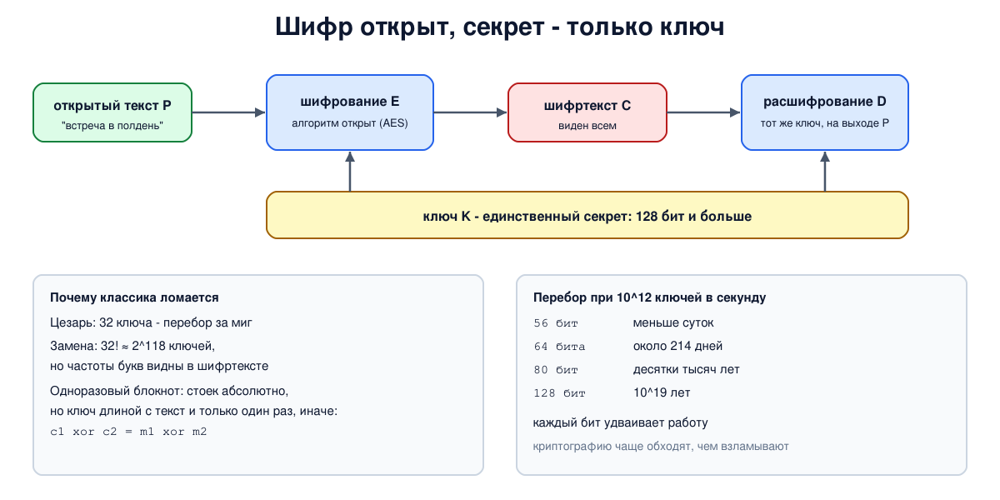

# Урок 68. Основы: шифр, ключ, принцип Керкгоффса

Начинаем блок 8 - криптографию. Всё, что дальше будет в курсе о TLS, VLESS, REALITY и других протоколах, стоит на нескольких криптографических кирпичах: шифрах, хешах, подписях и обмене ключами. В этом уроке - язык, на котором о них говорят, и главная идея современной криптографии: секретом должен быть только ключ.

## Слова и роли

Шифр (алгоритм шифрования) превращает **открытый текст** P в **шифртекст** C с помощью **ключа** K: C = E_K(P). Обратное преобразование с ключом возвращает исходный текст: D_K(C) = P (Таненбаум, разд. 8.4, с. 853; Олифер, гл. 26, с. 822). Без ключа шифртекст должен быть бесполезен.

Чего хотят добиться криптографией (Ристич, гл. 1, с. 5):

- **конфиденциальность** - прочитать сообщение может только тот, у кого есть ключ;
- **целостность** - любое изменение сообщения будет замечено;
- **аутентичность** - понятно, от кого сообщение пришло.

Шифрование само по себе даёт только первое; для остального нужны другие инструменты (уроки 70 и 73).

Противник бывает **пассивным** - только читает перехваченное - и **активным**: меняет, вставляет, повторяет сообщения (Таненбаум, с. 853). По тому, что ему доступно, различают атаки:

- **только шифртекст** - у противника есть лишь перехваченные данные;
- **известный открытый текст** - он знает какие-то пары "открытый текст - шифртекст" (а их часто можно угадать: приветствие протокола, стандартный заголовок);
- **выбранный открытый текст** - он может заставить систему зашифровать свои сообщения.

Современный шифр обязан выдерживать все три; считать достаточной стойкость только к первой Таненбаум (с. 855) называет наивным.

## Принцип Керкгоффса

В 1883 году Огюст Керкгоффс сформулировал: **алгоритм должен быть открытым, секретом остаётся только ключ** (Таненбаум, с. 854; Ристич, с. 6-7). Почему так, а не "чем меньше знают про шифр, тем лучше":

- алгоритм всё равно приходится раздавать - в программы, устройства, документацию, - и рано или поздно он утечёт; ключ же можно сменить за минуту, а алгоритм - нет;
- хороший алгоритм получается только после многих лет попыток его взломать; открытый алгоритм изучают тысячи специалистов бесплатно;
- если все считают алгоритм тайным, а он уже утёк, вред только больше: никто не знает, что пора менять.

Попытку защититься тайной устройства называют **безопасностью через неясность** (security through obscurity), и история полна закрытых "фирменных" шифров, которые разваливались, как только их устройство становилось известно. Поэтому сегодня все стандартные шифры - AES, ChaCha20 - описаны публично до последнего бита (у Олифера на с. 823 в сноске ещё встречается оправдание закрытых алгоритмов - это расходится с принципом, который он формулирует в том же абзаце).

## Классические шифры и почему они ломаются

**Подстановка** заменяет каждую букву другой. Шифр Цезаря сдвигает алфавит на 3 позиции, его обобщение - на k - ключей столько, сколько букв, и их можно просто перебрать. Общая **моноалфавитная замена** использует произвольную перестановку алфавита: для 26 латинских букв это 26! ≈ 4×10^26 ключей, перебором не взять (Таненбаум, с. 857-859). Но она сохраняет **частоты** букв: в русском тексте чаще всего встречаются о, е, а, и, н, т, и та же картина видна в шифртексте, только буквы другие. Частоты букв, сочетаний из двух и трёх букв и подбор вероятных слов раскрывают ключ.

**Перестановка** не меняет букв, а переставляет их (например, текст пишется в таблицу по строкам и читается по столбцам в порядке, заданном ключом). Частоты букв остаются как у обычного текста - это её и выдаёт (Таненбаум, с. 859-860).

Урок отсюда: **большое число ключей необходимо, но не достаточно**. Хороший шифр не оставляет противнику ничего, кроме полного перебора ключей (Ристич, с. 7).

## Одноразовый блокнот

Шифр, абсолютная стойкость которого доказана (теория информации, Шеннон): ключ - **случайная** последовательность длиной с сообщение, шифрование - побитовое исключающее ИЛИ (XOR), ключ используется **один раз** (Таненбаум, с. 860-862). Шифртекст ничего не говорит о тексте: при подходящем ключе он "расшифровывается" в любой текст той же длины.

Плата - практическая: ключей нужно столько же, сколько данных, и их надо заранее и тайно доставить. А если ключ использовать дважды, защита исчезает: XOR двух шифртекстов равен XOR двух открытых текстов, ключ сокращается, и по известной части одного сообщения восстанавливается другое. Ту же ошибку легко совершить и с современными потоковыми шифрами: одно и то же сочетание ключа и одноразового числа нельзя использовать дважды (Ристич, с. 7; урок 69).

## Два принципа Таненбаума

Таненбаум (с. 855-857) добавляет два базовых принципа криптографии:

- **избыточность**: в сообщении должна быть проверяемая структура, иначе активный противник подсунет случайные байты, и получатель примет их за настоящее сообщение (сегодня для этого есть коды аутентичности, урок 70);
- **свежесть** сообщений: нужна защита от **повтора** - противник может записать и позже отправить заново настоящее зашифрованное сообщение ("переведи деньги"); помогают метки времени, номера сообщений, одноразовые числа.

## Длина ключа

Каждый дополнительный бит ключа удваивает работу перебора (Ристич, с. 16-17; Таненбаум, с. 854-855). 56-битный ключ шифра DES перебирали за сутки ещё в конце 1990-х, поэтому сегодня **минимум для симметричных шифров - 128 бит**, а для долгосрочной защиты берут 256. Квантовые компьютеры в теории (алгоритм Гровера) ускоряют перебор квадратично - 2^128 превращается примерно в 2^64 шагов, - и 256-битный ключ сохраняет запас и против них. Асимметричным алгоритмам для той же стойкости нужны ключи длиннее, а квантовые компьютеры угрожают им сильнее (уроки 71-72).

И главное практическое наблюдение Ристича (с. 16): криптографию чаще **обходят**, чем взламывают, - крадут ключ с сервера, ошибаются в протоколе или реализации. Стойкий шифр - необходимое, но не достаточное условие.



## Как это увидеть в Linux

Без сети и без пространств имён: Python и openssl. Сломаем шифр Цезаря перебором, увидим, как частоты букв выдают моноалфавитную замену, проверим свойства одноразового блокнота и что бывает при повторном использовании ключа, зашифруем сообщение открытым алгоритмом AES с секретным ключом и оценим время перебора ключей разной длины. Нужны Linux (подойдёт WSL2), python3 версии 3.9 или новее и openssl (`sudo apt install python3 openssl`); временные файлы удаляются в конце.

Создай файл `crypto-basics.sh` и запусти `bash crypto-basics.sh`:
```
set -u
for c in python3 openssl; do
  command -v "$c" >/dev/null || { echo "нужны python3 и openssl: sudo apt install python3 openssl"; exit 1; }
done
d=$(mktemp -d)
cat > "$d/crypto.py" <<'EOF'
import random, math
ABC = "абвгдежзийклмнопрстуфхцчшщъыьэюя"          # 32 буквы, без ё
TEXT = ("сеть передаёт данные пакетами и каждый узел на пути видит заголовки а без шифрования и содержимое "
        "поэтому всё что должно остаться тайной шифруют алгоритм шифрования известен всем секретом остаётся "
        "только ключ так завещал керкгоффс ещё в девятнадцатом веке если безопасность держится на тайне "
        "устройства то раскрытие устройства ломает защиту навсегда а ключ можно просто заменить хороший шифр "
        "не выдаёт ни одного бита открытого текста тому кто не знает ключа даже если противник видит тысячи "
        "шифртекстов и может подсовывать свои сообщения для шифрования стойкость проверяют годами публичного "
        "анализа и только после этого алгоритм принимают как стандарт").replace("ё", "е")
FREQ = "оеаинтсрвлкмдпуяызьбгчйхжшюцщэфъ"            # буквы русского языка примерно от частых к редким

def shift(s, k):
    return "".join(ABC[(ABC.index(ch) + k) % 32] if ch in ABC else ch for ch in s)

print("--- 1. Caesar cipher: a key of 32 values is found by trying all")
msg = "встреча в полдень у главного входа"
c = shift(msg, 3)
print("  ciphertext:", c)
def score(s):   # насколько текст похож на русский: сумма "весов" букв по частоте
    return sum(32 - FREQ.index(ch) for ch in s if ch in ABC)
best = max(range(32), key=lambda k: score(shift(c, -k)))
print(f"  tried 32 keys, the most Russian-looking is key {best}:", shift(c, -best))

print("--- 2. substitution cipher: 32! keys, but letter frequencies give it away")
rnd = random.Random(68)
perm = list(ABC); rnd.shuffle(perm)
enc = dict(zip(ABC, perm))
ct = "".join(enc.get(ch, ch) for ch in TEXT)
print(f"  keys: 32! = {math.factorial(32):.2e}, about 2^{math.log2(math.factorial(32)):.0f}")
print("  ciphertext:", ct[:70], "...")
counts = sorted(ABC, key=lambda x: -ct.count(x))
print("  most frequent cipher letters:", " ".join(f"{x}:{ct.count(x)}" for x in counts[:6]))
guess = dict(zip(counts, FREQ))
pt = "".join(guess.get(ch, ch) for ch in ct)
right = sum(a == b for a, b in zip(pt, TEXT) if a != " ")
total = sum(1 for a in TEXT if a != " ")
print(f"  frequency guess alone: {right} of {total} letters right ({100 * right // total}%)")
print("  first words:", pt[:70], "...")

print("--- 3. one-time pad: a random key as long as the message, used once")
m1 = "attack at dawn".encode(); m2 = "retreat at six".encode()
pad = random.Random(1).randbytes(len(m1))   # только для повторяемости опыта; настоящий ключ - из os.urandom
c1 = bytes(a ^ b for a, b in zip(m1, pad))
print("  m1 xor pad =", c1.hex())
fake = bytes(a ^ b for a, b in zip(c1, b"hold position!"))
print("  the same ciphertext 'decrypts' to any text with a suitable pad:",
      bytes(a ^ b for a, b in zip(c1, fake)).decode())
c2 = bytes(a ^ b for a, b in zip(m2, pad))
print("  pad reused: c1 xor c2 =", bytes(a ^ b for a, b in zip(c1, c2)).hex(), "= m1 xor m2, the pad is gone")
print("  whoever knows m1 gets m2:", bytes(a ^ b ^ c for a, b, c in zip(c1, c2, m1)).decode())

print("--- 5. brute force: time to try every key at 10^12 keys per second")
year = 365.25 * 24 * 3600
for bits in (40, 56, 64, 80, 128, 256):
    t = 2 ** bits / 1e12
    s = f"{t:.1f} s" if t < 3600 else f"{t / 3600:.1f} h" if t < 2 * 86400 else f"{t / 86400:.0f} days" if t < 2 * year else f"{t / year:.1e} years"
    print(f"  {bits:3d} bits: {s}")
EOF
python3 "$d/crypto.py" | sed -n '1,/^--- 5/{/^--- 5/!p}'
echo '--- 4. a public algorithm (AES) and a secret key: openssl'
K=000102030405060708090a0b0c0d0e0f; IV=00000000000000000000000000000001
printf 'the meeting is at noon' > "$d/msg"
openssl enc -aes-128-ctr -K $K -iv $IV -in "$d/msg" -out "$d/enc"
echo "  ciphertext: $(od -An -tx1 "$d/enc" | tr -d ' \n')"
echo "  right key:  $(openssl enc -d -aes-128-ctr -K $K -iv $IV -in "$d/enc")"
echo "  wrong key:  $(openssl enc -d -aes-128-ctr -K ${K%f}e -iv $IV -in "$d/enc" | od -An -tx1 | tr -d ' \n') (garbage)"
python3 "$d/crypto.py" | sed -n '/^--- 5/,$p'
rm -rf "$d"
```

Вот что получилось на нашем сервере:
```
--- 1. Caesar cipher: a key of 32 values is found by trying all
  ciphertext: ефхуиъг е тсозиря ц жогерсжс ешсзг
  tried 32 keys, the most Russian-looking is key 3: встреча в полдень у главного входа
--- 2. substitution cipher: 32! keys, but letter frequencies give it away
  keys: 32! = 2.63e+35, about 2^118
  ciphertext: овкч евлвхйвк хйььъв ейавкймя я айжхъс иывб ьй еикя фяхяк ыйдшбшфая й  ...
  most frequent cipher letters: ш:61 к:58 й:48 в:44 я:43 о:33
  frequency guess alone: 169 of 557 letters right (30%)
  first words: тиег пиримаие массхи палиеадн н лачмхб зыик са пзен внмне ыаяоковлн а  ...
--- 3. one-time pad: a random key as long as the message, used once
  m1 xor pad = 94c51143293397f0ab4a95b916a3
  the same ciphertext 'decrypts' to any text with a suitable pad: hold position!
  pad reused: c1 xor c2 = 13110013060a5441155444121e16 = m1 xor m2, the pad is gone
  whoever knows m1 gets m2: retreat at six
--- 4. a public algorithm (AES) and a secret key: openssl
  ciphertext: 072e76b5f8a5d16a2015dac30c870d6b3df6e93cf6f5
  right key:  the meeting is at noon
  wrong key:  b6afa150ae6e20e8391095c45fedc0d1901ce984ae29 (garbage)
--- 5. brute force: time to try every key at 10^12 keys per second
   40 bits: 1.1 s
   56 bits: 20.0 h
   64 bits: 214 days
   80 bits: 3.8e+04 years
  128 bits: 1.1e+19 years
  256 bits: 3.7e+57 years
```

Разберём.

**Шаг 1: Цезарь.** Ключей всего 32 (по числу букв алфавита без ё), и программа перебрала их все, выбрав вариант, больше всего похожий на русский текст по частотам букв. Ключ 3 найден мгновенно. Маленькое пространство ключей не защищает ничего.

**Шаг 2: замена.** Ключей 32! - около 2^118, перебором не взять. Но частоты букв в шифртексте сразу видны: на первом месте `ш` (61 раз), дальше `к`, `й`. Простая замена "самая частая буква шифртекста - самая частая буква языка" уже дала 30% букв правильно, хотя текст короткий (557 букв) и его частоты отличаются от средних. Дальше криптоаналитик угадывает короткие слова и сочетания букв, и каждое угаданное слово открывает новые буквы - уже на нескольких сотнях букв, как здесь, шифр обычно раскрывается целиком (Таненбаум, с. 858-859). Огромное число ключей не помогло: шифр протекает статистикой.

**Шаг 3: одноразовый блокнот.** Сообщение, сложенное по XOR со случайным ключом той же длины, - набор байтов, ничего не говорящий о тексте: подобрав другой ключ, этот же шифртекст можно "расшифровать" в `hold position!`. Но когда тот же ключ использован для второго сообщения, XOR двух шифртекстов уже не зависит от ключа (`m1 xor m2`), и тот, кто знает или угадал первое сообщение, читает второе. В опыте ключи берутся из обычного `random` с фиксированным зерном - только чтобы вывод повторялся; настоящий ключ берут из `os.urandom` или `openssl rand`, а для абсолютной стойкости блокнота нужен по-настоящему случайный источник.

**Шаг 4: AES в openssl.** Алгоритм AES известен всем и описан в стандарте, `openssl` его просто реализует. Секрет - только 128-битный ключ `-K`. С правильным ключом текст восстановился, с ключом, отличающимся одним битом в последнем байте, получилась бессмыслица. (Режим CTR и вектор `-iv` разберём в уроке 69; ключ, записанный прямо в команде, допустим только в опыте.)

**Шаг 5: перебор.** При фантастической скорости 10^12 ключей в секунду 40 бит перебираются за секунду, 56 бит (как у DES) - меньше чем за сутки, 64 бита - примерно за семь месяцев (это полный перебор, в среднем ключ находится вдвое быстрее). 80 бит - десятки тысяч лет, а 128 бит - 10^19 лет, почти в миллиард раз больше возраста Вселенной. Поэтому стойкость современных шифров держится не на тайне алгоритма, а на длине ключа и на том, что практически значимой атаки лучше перебора для них не известно.

## Безопасность: что защищает, а что нет

Принцип: **секретом должен быть только ключ, и защищать нужно именно его**. Всё остальное - алгоритм, протокол, формат - считается известным противнику.

Как это применять:

- **пользоваться стандартными открытыми алгоритмами и библиотеками** (AES, ChaCha20, OpenSSL, libsodium) и не придумывать свои шифры: самодельная криптография почти всегда ломается;
- **выбирать ключи не короче 128 бит**, а для долгосрочных секретов - 256;
- **генерировать ключи настоящим криптографическим генератором случайных чисел** (`/dev/urandom`, `openssl rand`), а не напрямую из паролей, дат или обычного `random` (для паролей есть специальные функции выработки ключа) - ключ, который можно угадать, равносилен короткому;
- **никогда не использовать одноразовые ключи и одноразовые числа повторно** - это разрушает защиту даже идеального шифра;
- **беречь ключи**: не хранить их в коде и репозиториях, ограничивать доступ к файлам ключей, менять их при подозрении на утечку - криптографию обходят чаще, чем взламывают.

## Итог

- Шифр с ключом превращает открытый текст в шифртекст; цели криптографии - конфиденциальность, целостность, аутентичность.
- Противник может быть пассивным или активным и знать только шифртекст, известные или выбранные им открытые тексты; хороший шифр выдерживает всё это.
- Принцип Керкгоффса: алгоритм открыт, секрет - только ключ; безопасность через неясность не работает.
- Классические подстановки и перестановки ломаются статистикой даже при огромном числе ключей; одноразовый блокнот абсолютно стоек, но ключ нельзя использовать дважды.
- Каждый бит ключа удваивает перебор: минимум сегодня - 128 бит.

## Что почитать

- Таненбаум, разд. 8.4, с. 852-862: введение в криптографию, принцип Керкгоффса, подстановочные и перестановочные шифры, одноразовые блокноты, два фундаментальных принципа.
- Олифер, гл. 26, с. 822-826: шифрование, правило Керкгоффса, симметричные шифры, проблема распределения ключей. На с. 824 ключ DES назван 64-битным (на с. 825 уже 56) - на деле 56 бит ключа и 8 бит контроля чётности.
- Ристич, "Bulletproof TLS and PKI", гл. 1, с. 4-7 и 16-17: цели криптографии, принцип Керкгоффса, стойкость и длина ключа.
