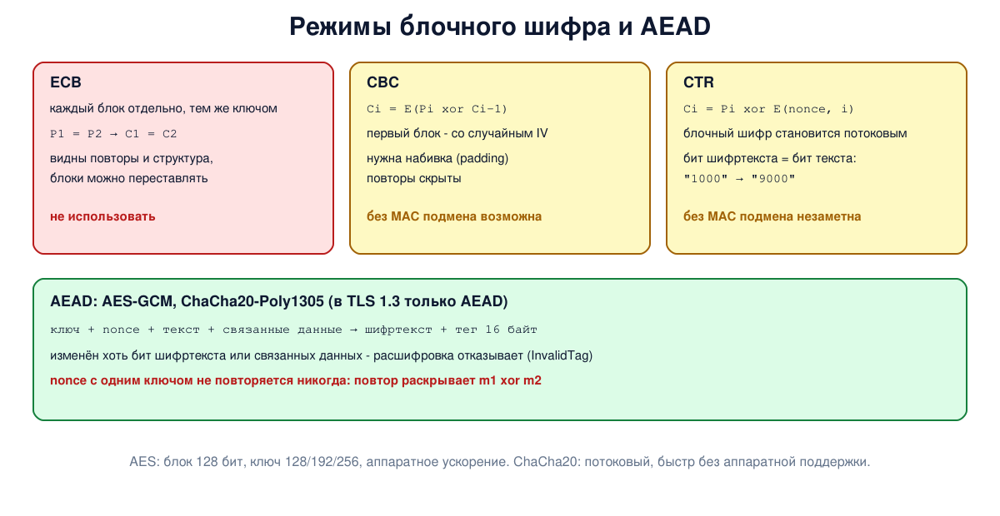

# Урок 69. Симметричные шифры: AES, ChaCha20, режимы, AEAD

В уроке 68 мы узнали, что секретом должен быть только ключ. Теперь - сами шифры, которыми сегодня защищено почти всё в сети: AES и ChaCha20. Шифр - ещё не всё: важно, **как** им пользоваться, и ошибки здесь (режим ECB, повтор одноразового числа, шифрование без проверки целостности) ломают защиту даже при безупречном алгоритме. Итог урока - схема AEAD, которую использует TLS 1.3 и современные прокси-протоколы.

## Блочные и потоковые шифры

**Симметричный** шифр использует один и тот же ключ для шифрования и расшифрования (Таненбаум, разд. 8.5, с. 866). Бывают два вида:

- **блочный** шифр превращает блок фиксированной длины (сегодня 128 бит) в блок той же длины. Внутри - много **раундов** из подстановок и перестановок (S-блоки и P-блоки), так что малое изменение входа сильно меняет результат (Таненбаум, с. 866-867; Ристич, с. 8). Блочный шифр **детерминирован**: при одном ключе одинаковый блок всегда даёт одинаковый результат (Ристич, гл. 1, с. 8);
- **потоковый** шифр вырабатывает из ключа (и одноразового числа) длинный псевдослучайный **ключевой поток** и складывает его с данными по XOR - как одноразовый блокнот, только поток не случайный, а вычисляемый (Ристич, с. 7-8). Отсюда то же правило: один и тот же поток нельзя использовать дважды.

## DES, AES и ChaCha20

**DES** (1977) - блок 64 бита, ключ 56 бит, 16 раундов (Таненбаум, с. 867-868). 56-битный ключ критиковали с самого начала, а уже в 1979 году стало ясно, что он слишком короток (Таненбаум, с. 868), а в 1998 году его подобрали перебором за несколько дней; **3DES** (тройное применение с двумя или тремя ключами) продлил ему жизнь, но он медленный, а блок в 64 бита слишком мал для больших объёмов данных. Сегодня оба выведены из употребления и не входят в TLS 1.3.

**AES** - победитель открытого конкурса NIST (1997-2000), алгоритм Rijndael бельгийцев Йоана Дамена и Винсента Рэймена, стандарт FIPS 197 с 2001 года (Таненбаум, с. 869-870). Блок 128 бит, ключ 128, 192 или 256 бит, 10, 12 или 14 раундов. Сейчас в большинстве процессоров есть специальные инструкции (AES-NI и аналоги), и AES шифрует гигабайты в секунду на одном ядре. Олифер (гл. 26, с. 825) упоминает и российские стандарты "Магма" и "Кузнечик".

**ChaCha20** (Даниэль Бернштейн) - потоковый шифр: ключ 256 бит, одноразовое число 96 бит, внутри только сложения, циклические сдвиги и XOR (RFC 8439). Без аппаратной поддержки он быстрее AES и легко реализуется без утечек по времени выполнения, поэтому его любят на телефонах и в протоколах вроде WireGuard.

## Режимы работы блочного шифра

Блочный шифр шифрует один блок. Чтобы шифровать сообщения любой длины, его используют в одном из **режимов** (Таненбаум, с. 870-874; NIST SP 800-38A):

- **ECB** (electronic code book) - каждый блок шифруется отдельно тем же ключом. Это по сути моноалфавитная замена с огромным "алфавитом" из 2^128 блоков: **одинаковые блоки открытого текста дают одинаковые блоки шифртекста**. Видны повторы и структура данных, а зашифрованные блоки можно переставлять и копировать: в примере Таненбаума (с. 871) сотрудник, не зная ключа, переписывает себе блок с чужой премией;
- **CBC** (cipher block chaining) - перед шифрованием блок складывается по XOR с предыдущим блоком шифртекста, а первый - со случайным **вектором инициализации** (IV), который передаётся открыто (Таненбаум, с. 871-872; Ристич, с. 11-12). Одинаковые блоки дают разный шифртекст. Нужна **набивка** (padding) до целого числа блоков;
- **CTR** (counter) - шифруются не данные, а счётчик (одноразовое число + номер блока), и результат складывается с данными по XOR. Это превращает блочный шифр в потоковый: набивка не нужна, блоки можно обрабатывать параллельно. Таненбаум описывает также режим шифрованной обратной связи (CFB) и режим потокового шифра (по сути OFB), с. 872-874; там же разобрано, почему ключевой поток нельзя использовать повторно (с. 874-875).

## Шифрования мало: нужна целостность

Ни один из этих режимов **не защищает от изменения** данных (Ристич, с. 10). В потоковых режимах (CTR, OFB) изменение бита шифртекста меняет тот же бит открытого текста: противник, не зная ключа, но зная формат сообщения, может исправить сумму в платёжке. В CBC изменение бита шифртекста превращает свой блок в мусор, но в следующем блоке меняет ровно тот же бит - подмена тоже возможна. Кроме того, если сервер по-разному сообщает об ошибке набивки и об ошибке данных, такие ответы (**padding oracle**) позволяют постепенно расшифровать сообщение - на этом основан целый ряд атак на старые версии TLS.

Решение - **AEAD** (authenticated encryption with associated data): шифрование и проверка целостности в одной операции. К шифртексту добавляется **тег** (обычно 16 байт), вычисленный из ключа, одноразового числа, шифртекста и **связанных данных** - открытой части, которая не шифруется, но тоже защищается (например, заголовок пакета). Если изменён хоть бит, расшифровка не выдаёт данных вообще, а сообщает об ошибке. Основные схемы:

- **AES-GCM** - AES в режиме счётчика плюс аутентификатор GHASH (NIST SP 800-38D);
- **ChaCha20-Poly1305** - ChaCha20 плюс аутентификатор Poly1305 (RFC 8439).

В TLS 1.3 остались **только** AEAD-шифры (AES-GCM, ChaCha20-Poly1305, AES-CCM); режим CBC и отдельный MAC из протокола убраны.

Главное правило AEAD и всех потоковых режимов: **одноразовое число (nonce) никогда не повторяется с тем же ключом**. Повтор раскрывает XOR открытых текстов, как у одноразового блокнота (урок 68), а в GCM ещё и позволяет восстановить ключ аутентификации и подделывать сообщения. Обычно nonce - счётчик сообщений; если он выбирается случайно, число сообщений на один ключ ограничивают.



## Как это увидеть в Linux

Python с модулем `cryptography` (обёртка над OpenSSL) и `openssl` для замера скорости. Зашифруем повторяющиеся данные в режимах ECB, CBC и CTR, нарисуем "картинку", зашифрованную в ECB, изменим бит шифртекста в CTR без проверки целостности и то же самое в AEAD, повторим nonce и измерим скорость AES-GCM и ChaCha20-Poly1305. Ключи и одноразовые числа в опыте постоянные, чтобы вывод повторялся; в настоящих программах так делать нельзя. Нужны Linux (подойдёт WSL2), python3, `python3-cryptography` и openssl (`sudo apt install python3 python3-cryptography openssl`).

Создай файл `cipher-modes.sh` и запусти `bash cipher-modes.sh`:
```
set -u
for c in python3 openssl; do
  command -v "$c" >/dev/null || { echo "нужны python3, python3-cryptography и openssl: sudo apt install python3 python3-cryptography openssl"; exit 1; }
done
python3 -c 'import cryptography' 2>/dev/null || { echo "нужен модуль: sudo apt install python3-cryptography"; exit 1; }
d=$(mktemp -d)
cat > "$d/modes.py" <<'EOF'
from cryptography.hazmat.primitives.ciphers import Cipher, algorithms, modes
from cryptography.hazmat.primitives.ciphers.aead import AESGCM, ChaCha20Poly1305
from cryptography.exceptions import InvalidTag
KEY = bytes(range(16)); IV = bytes(16); NONCE = bytes(12)
def enc(mode, data):
    e = Cipher(algorithms.AES(KEY), mode).encryptor()
    return e.update(data) + e.finalize()
def blocks(b):
    return [b[i:i + 16] for i in range(0, len(b), 16)]

print("--- 1. eight identical 16-byte blocks in three modes")
pt = b"SALARY 1000 USD." * 8
for name, mode in (("ECB", modes.ECB()), ("CBC", modes.CBC(IV)), ("CTR", modes.CTR(IV))):
    ct = enc(mode, pt)
    print(f"  {name}: {len(set(blocks(ct)))} different blocks of 8, first two: {ct[:4].hex()}.. {ct[16:20].hex()}..")

print("--- 2. a picture, one 16-byte block per pixel")
art = ["..........................",
       ".##..##..####.............",
       ".##..##...##..............",
       ".######...##..............",
       ".##..##...##..............",
       ".##..##..####.............",
       ".........................."]
pix = b"".join((b"\xff" if ch == "#" else b"\x00") * 16 for row in art for ch in row)
for name, mode in (("ECB", modes.ECB()), ("CTR", modes.CTR(IV))):
    ct = blocks(enc(mode, pix))
    first = ct[0]
    print(f"  {name}: ciphertext drawn back, a block equal to the first one is '.', any other is '#'")
    w = len(art[0])
    for r in range(len(art)):
        print("    " + "".join("." if b == first else "#" for b in ct[r * w:(r + 1) * w]))

print("--- 3. CTR without integrity: flipping a ciphertext bit flips the same plaintext bit")
msg = b"pay 1000 to bob"
ct = bytearray(enc(modes.CTR(IV), msg))
ct[4] ^= ord("1") ^ ord("9")          # противник не знает ключа, но знает, где стоит сумма
d = Cipher(algorithms.AES(KEY), modes.CTR(IV)).decryptor()
print("  decrypted after the change:", (d.update(bytes(ct)) + d.finalize()).decode())

print("--- 4. AEAD notices the same change")
for name, aead in (("AES-128-GCM", AESGCM(KEY)), ("ChaCha20-Poly1305", ChaCha20Poly1305(bytes(range(32))))):
    ct = bytearray(aead.encrypt(NONCE, msg, b"header"))
    print(f"  {name}: {len(msg)} bytes of text -> {len(ct)} bytes (+16 byte tag)")
    ok = aead.decrypt(NONCE, bytes(ct), b"header").decode()
    print(f"    untouched: {ok}")
    ct[4] ^= ord("1") ^ ord("9")
    try:
        aead.decrypt(NONCE, bytes(ct), b"header"); print("    changed: accepted")
    except InvalidTag:
        print("    changed: InvalidTag, rejected")
    try:
        n2 = bytes(11) + b"\x01"                 # отдельный nonce: не повторяем его с тем же ключом
        aead.decrypt(n2, aead.encrypt(n2, msg, b"header"), b"other"); print("    other header: accepted")
    except InvalidTag:
        print("    other header: InvalidTag, rejected")

print("--- 5. the same nonce twice in GCM")
g = AESGCM(KEY)
m1, m2 = b"meet at the gate", b"bring the papers"
c1, c2 = g.encrypt(NONCE, m1, None)[:16], g.encrypt(NONCE, m2, None)[:16]
x = bytes(a ^ b for a, b in zip(c1, c2))
print("  c1 xor c2 == m1 xor m2:", x == bytes(a ^ b for a, b in zip(m1, m2)))
print("  knowing m1 gives m2:", bytes(a ^ b for a, b in zip(x, m1)).decode())
EOF
python3 "$d/modes.py"
echo '--- 6. speed on this machine, 16 KB blocks (numbers differ from machine to machine)'
echo "  AES instructions in the CPU: $(grep -m1 -o -w aes /proc/cpuinfo || echo none)"
for a in aes-128-gcm chacha20-poly1305; do
  openssl speed -evp $a -seconds 1 -bytes 16384 2>/dev/null | awk -v a=$a '$1 == a || $1 ~ /^AES-128-GCM|^ChaCha20-Poly1305/ { v = $NF; sub(/k$/, "", v); printf "  %-18s %.0f MB/s\n", a, v / 1000 }' | tail -1
done
rm -rf "$d"
```

Вот что получилось на нашем сервере (скорость на каждой машине своя):
```
--- 1. eight identical 16-byte blocks in three modes
  ECB: 1 different blocks of 8, first two: c9abce62.. c9abce62..
  CBC: 8 different blocks of 8, first two: c9abce62.. be3f0b4a..
  CTR: 8 different blocks of 8, first two: 95e07776.. 20075fd4..
--- 2. a picture, one 16-byte block per pixel
  ECB: ciphertext drawn back, a block equal to the first one is '.', any other is '#'
    ..........................
    .##..##..####.............
    .##..##...##..............
    .######...##..............
    .##..##...##..............
    .##..##..####.............
    ..........................
  CTR: ciphertext drawn back, a block equal to the first one is '.', any other is '#'
    .#########################
    ##########################
    ##########################
    ##########################
    ##########################
    ##########################
    ##########################
--- 3. CTR without integrity: flipping a ciphertext bit flips the same plaintext bit
  decrypted after the change: pay 9000 to bob
--- 4. AEAD notices the same change
  AES-128-GCM: 15 bytes of text -> 31 bytes (+16 byte tag)
    untouched: pay 1000 to bob
    changed: InvalidTag, rejected
    other header: InvalidTag, rejected
  ChaCha20-Poly1305: 15 bytes of text -> 31 bytes (+16 byte tag)
    untouched: pay 1000 to bob
    changed: InvalidTag, rejected
    other header: InvalidTag, rejected
--- 5. the same nonce twice in GCM
  c1 xor c2 == m1 xor m2: True
  knowing m1 gives m2: bring the papers
--- 6. speed on this machine, 16 KB blocks (numbers differ from machine to machine)
  AES instructions in the CPU: aes
  aes-128-gcm        3353 MB/s
  chacha20-poly1305  1622 MB/s
```

Разберём.

**Шаг 1: одинаковые блоки.** Восемь одинаковых блоков `SALARY 1000 USD.` в ECB дали **один** уникальный блок шифртекста, повторённый 8 раз: противник видит, что данные повторяются, даже не зная ключа. В CBC и CTR все 8 блоков разные. Первый блок CBC совпал с ECB, потому что в опыте IV нулевой (а в CBC первый блок - это шифр от P XOR IV); в настоящей программе IV случайный.

**Шаг 2: картинка.** Каждый "пиксель" - отдельный 16-байтный блок: чёрный или белый. После шифрования в ECB блоки фона одинаковы и блоки надписи одинаковы, и надпись `HI` читается по шифртексту так же, как по исходнику, - это известный пример с зашифрованным изображением пингвина. В CTR каждый блок уникален, и картинка превратилась в шум.

**Шаг 3: подмена в CTR.** Противник не знает ключа, но знает, что на позиции 4 стоит первая цифра суммы. Он складывает этот байт шифртекста по XOR с `'1' XOR '9'`, и после расшифровки получатель видит `pay 9000 to bob` - никакой ошибки, никакого признака подмены. Шифрование скрыло содержимое, но не защитило его от изменения.

**Шаг 4: AEAD.** AES-128-GCM и ChaCha20-Poly1305 добавили к 15 байтам текста 16-байтный тег. Неизменённое сообщение расшифровывается, а после той же подмены одного бита - отказ `InvalidTag`, данных получатель не увидит. Отказ и тогда, когда изменены связанные данные (при расшифровке подан `other` вместо `header`): их не шифруют, но защищают. Для этой проверки взят отдельный nonce, чтобы она не зависела от предыдущей подмены. В остальном опыт нарочно повторяет ключи и nonce (см. оговорку перед скриптом); в настоящей программе так нельзя.

**Шаг 5: повтор nonce.** Два сообщения зашифрованы в GCM с тем же ключом и тем же nonce. XOR шифртекстов равен XOR открытых текстов, и, зная первое сообщение, можно прочитать второе. AEAD не спасает от ошибки в использовании: nonce должен быть уникальным.

**Шаг 6: скорость.** Процессор нашего сервера поддерживает инструкции AES (строка `aes`), и AES-128-GCM шифрует больше 3 ГБ/с на одном ядре, ChaCha20-Poly1305 - около 1,6 ГБ/с. На процессорах без поддержки AES ChaCha20 обычно быстрее, поэтому TLS 1.3 предусматривает оба: клиент без аппаратного AES ставит ChaCha20-Poly1305 первым в списке, а сервер может учесть это при выборе.

## Безопасность: почему режим ECB опасен

Принцип: **стойкий шифр, используемый неправильно, не защищает**. Режим ECB раскрывает повторы и структуру данных и позволяет переставлять и копировать зашифрованные блоки, не зная ключа. Шифрование без проверки целостности позволяет незаметно менять данные. Повтор nonce разрушает и конфиденциальность, и целостность.

Как защищаться:

- **не использовать ECB** вообще - ни для файлов, ни для полей базы данных, ни для токенов: даже один блок, зашифрованный детерминированно, выдаёт, что значения равны;
- **использовать AEAD** (AES-GCM, ChaCha20-Poly1305) вместо "голых" режимов CBC и CTR; если по историческим причинам используется CBC - только вместе с MAC по схеме "сначала шифрование, потом MAC" и с одинаковым ответом на любые ошибки расшифровки, без подсказок о набивке;
- **никогда не повторять nonce с тем же ключом**: использовать счётчик, вовремя менять ключ, а там, где повтор возможен по устройству системы, - режимы, устойчивые к нему (AES-GCM-SIV, RFC 8452);
- **не писать криптографию самостоятельно**: брать высокоуровневые интерфейсы библиотек (AEAD в `cryptography`, libsodium), где режим и проверка уже выбраны правильно;
- **не использовать устаревшие шифры** - DES, 3DES, RC4, - и отключать их в настройках серверов.

## Итог

- Симметричный шифр использует один ключ; блочный шифрует блоки по 128 бит, потоковый складывает данные с ключевым потоком.
- AES (блок 128 бит, ключи 128-256 бит) - главный стандарт с 2001 года, ускоренный аппаратно; ChaCha20 - быстрый потоковый шифр без аппаратной поддержки. DES и 3DES устарели.
- Режимы: ECB раскрывает повторы и непригоден; CBC требует случайного IV и набивки; CTR делает из блочного шифра потоковый.
- Шифрование не защищает от изменения данных; AEAD (AES-GCM, ChaCha20-Poly1305) добавляет тег и отвергает любую подмену. В TLS 1.3 остались только AEAD.
- Nonce с одним ключом не должен повторяться никогда.

## Что почитать

- Таненбаум, разд. 8.5, с. 866-875: DES, 3DES, AES, режимы ECB, CBC, CFB и режим потокового шифра (по сути OFB).
- Ристич, "Bulletproof TLS and PKI", гл. 1, с. 7-12: потоковые и блочные шифры, режимы, набивка, почему нужна целостность.
- Олифер, гл. 26, с. 824-825: DES, 3DES, AES и отечественные стандарты. "Ключ 64 бита" у DES - это 56 бит ключа и 8 бит чётности.
- NIST FIPS 197 (AES), SP 800-38A (режимы), SP 800-38D (GCM), RFC 8439 (ChaCha20-Poly1305), RFC 5116 (интерфейс AEAD).
