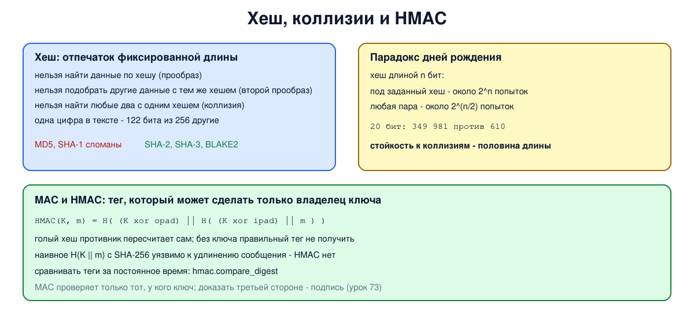

# Урок 70. Хеш-функции, MAC, HMAC

В уроке 69 мы видели, что шифрование не защищает от изменения данных, и AEAD решает это тегом. Откуда берутся такие теги и как вообще проверить, что данные не изменены? Ответ - **хеш-функции** и построенные на них **коды аутентичности сообщений** (MAC). Они же лежат в основе цифровых подписей (урок 73), TLS, проверки обновлений и Git.

## Криптографическая хеш-функция

Хеш-функция превращает данные любой длины в короткий результат фиксированной длины - **хеш** или **дайджест**, своего рода отпечаток данных (Олифер, гл. 26, с. 832; Ристич, гл. 1, с. 9-10). Для криптографии нужны свойства, которых нет у обычных хешей для таблиц (вроде остатка от деления):

- **стойкость к нахождению прообраза**: по хешу нельзя найти данные, которые его дают;
- **стойкость к нахождению второго прообраза**: для данного сообщения нельзя подобрать другое с тем же хешем;
- **стойкость к коллизиям**: нельзя найти вообще никакие два разных сообщения с одинаковым хешем;
- **лавинный эффект**: изменение одного бита входа меняет примерно половину бит результата, и по хешам нельзя понять, насколько похожи данные (Таненбаум, разд. 8.7.3, с. 883-884).

Хеш легко вычислить, а все "обратные" задачи должны быть не легче универсального перебора (для коллизий - атаки "дней рождения").

## Семейства хешей

- **MD5** (128 бит) и **SHA-1** (160 бит) - **сломаны**: коллизии MD5 нашли в 2004 году и потом использовали для подделки сертификата удостоверяющего центра, для SHA-1 первую коллизию (два разных PDF-файла) показали в 2017 году (Таненбаум, с. 885), а к 2020 году - и более опасные коллизии с выбранным началом. Для безопасности их применять нельзя; они остаются разве что как контрольные суммы от случайных ошибок.
- **SHA-2** (SHA-224, SHA-256, SHA-384, SHA-512, стандарт FIPS 180-4) - основной стандарт сегодня; SHA-256 используется повсюду, от TLS до Bitcoin.
- **SHA-3** (Keccak, FIPS 202, 2015) - победитель конкурса NIST 2007-2012 годов, устроен совсем иначе, чем SHA-2, - запасной вариант на случай, если в SHA-2 найдут слабость (Таненбаум, с. 885-886). SHA-2 при этом остаётся в силе.
- **BLAKE2** и **BLAKE3** - быстрые современные хеши, популярные в программах (BLAKE2s, например, в WireGuard).

## Парадокс дней рождения

В группе из 23 человек с вероятностью больше половины найдутся двое с одним днём рождения, хотя дней 365: важно не совпадение с **конкретным** человеком, а **любая** пара, а пар растёт квадратично. С хешами так же (Таненбаум, с. 886-888):

- найти **другое** сообщение с тем же хешем, что у данного (второй прообраз; для прообраза столько же), - около 2^n попыток для хеша длины n бит;
- найти **любые два** сообщения с одинаковым хешем (коллизию) - около 2^(n/2) попыток.

Поэтому стойкость хеша к коллизиям - **половина его длины** (Ристич, с. 10): у 128-битного MD5 даже без слабостей она была бы лишь 2^64, у SHA-256 - 2^128. Таненбаум показывает, чем это опасно: тот, кто заранее подготовит много вариантов "хорошего" и "плохого" документа, найдёт пару с одинаковым хешем, получит подпись под хорошим и подставит плохой.

## MAC и HMAC

Голый хеш защищает от **случайных** ошибок всегда, а от подмены - только если сам хеш получен по надёжному каналу (например, опубликован на сайте с TLS): иначе противник заменит и данные, и хеш (Ристич, с. 10). Для защиты от активного противника нужен **ключ**: **MAC** (message authentication code) вычисляется из сообщения и общего секретного ключа, и правильный тег может создать только тот, кто знает ключ (Олифер, с. 832-833, рис. 26.11).

Самая распространённая конструкция - **HMAC** (RFC 2104): HMAC(K, m) = H((K ⊕ opad) || H((K ⊕ ipad) || m)), где K дополнен нулями до длины блока хеша (64 байта у SHA-256), а ipad и opad - байты 0x36 и 0x5c, повторённые на длину блока. Два вложенных вызова хеша нужны не случайно: наивная схема H(K || m) с MD5, SHA-1, SHA-256 и SHA-512 уязвима - по готовому тегу можно вычислить правильный тег для сообщения с дописанным концом, не зная ключа (атака удлинения сообщения). HMAC, а также SHA-3, BLAKE2 с ключом и усечённые варианты SHA-2 (SHA-384, SHA-512/256) этой слабости лишены.

MAC - симметричный: проверить его может только тот, кто знает ключ, и он же может его создать. Поэтому MAC доказывает подлинность получателю, но не третьей стороне; для этого нужны цифровые подписи (урок 73). В AEAD-режимах (урок 69) тег тоже является MAC, но построен не на SHA, а на быстрых универсальных хешах с одноразовым ключом: GHASH в GCM и Poly1305 в ChaCha20-Poly1305.



## Как это увидеть в Linux

Python (`hashlib`, `hmac`), `openssl` и `sha256sum`. Посмотрим на лавинный эффект, сравним длины хешей, на 20-битном хеше сравним поиск второго прообраза и коллизии, вычислим и проверим HMAC (и сверим его с `openssl`) и проверим файл по сохранённому хешу. Нужны Linux (подойдёт WSL2), python3, openssl и coreutils (`sudo apt install python3 openssl coreutils`); временные файлы удаляются в конце.

Создай файл `hashes.sh` и запусти `bash hashes.sh`:
```
set -u
for c in python3 openssl sha256sum; do
  command -v "$c" >/dev/null || { echo "нужны python3, openssl и coreutils: sudo apt install python3 openssl coreutils"; exit 1; }
done
d=$(mktemp -d)
cat > "$d/hash.py" <<'EOF'
import hashlib, hmac
def bits(h):
    return bin(int.from_bytes(h, "big")).count("1")

print("--- 1. avalanche: one character changed")
a, b = hashlib.sha256(b"transfer 100 rubles"), hashlib.sha256(b"transfer 900 rubles")
print("  ", a.hexdigest()); print("  ", b.hexdigest())
diff = bits(bytes(x ^ y for x, y in zip(a.digest(), b.digest())))
print(f"   {diff} of 256 bits differ")

print("--- 2. digest sizes")
for name in ("md5", "sha1", "sha256", "sha512", "sha3_256", "blake2b"):
    print(f"   {name:9s} {hashlib.new(name, b'').digest_size * 8:4d} bits")

print("--- 3. a 20-bit hash: second preimage versus collision")
def h20(m):
    return int.from_bytes(hashlib.sha256(m).digest()[:3], "big") >> 4
target = h20(b"original contract")
i = 0
while True:
    i += 1
    if h20(b"fake %d" % i) == target:
        break
print(f"   a message with the same hash as a given one: found after {i} tries (2^20 = {2**20})")
seen = {}
j = 0
while True:
    j += 1
    v = h20(b"msg %d" % j)
    if v in seen:
        break
    seen[v] = j
print(f"   any two messages with the same hash: found after {j} tries (2^10 = {2**10}):")
print(f"   'msg {seen[v]}' and 'msg {j}' -> {v:05x}")

print("--- 4. HMAC: only the key holder can compute the tag")
key = b"shared secret key 32 bytes long!"
msg = b"pay 1000 to bob"
tag = hmac.new(key, msg, hashlib.sha256).hexdigest()
print("   tag:", tag)
for m in (b"pay 1000 to bob", b"pay 9000 to bob"):
    ok = hmac.compare_digest(hmac.new(key, m, hashlib.sha256).hexdigest(), tag)
    print(f"   check {m.decode()!r}: {'valid' if ok else 'INVALID'}")
EOF
python3 "$d/hash.py"
printf 'pay 1000 to bob' > "$d/msg"
echo "   openssl, same key and text: $(openssl dgst -sha256 -hmac 'shared secret key 32 bytes long!' "$d/msg" | awk '{print $NF}')"
echo '--- 5. checking a file against a stored digest'
cd "$d"
printf 'firmware v1.2\n' > fw.bin
sha256sum fw.bin > fw.sha256
sha256sum -c fw.sha256 | sed 's/^/   /'
printf 'firmware v1.2 with a backdoor\n' > fw.bin
sha256sum -c fw.sha256 2>/dev/null | sed 's/^/   /'
cd /
rm -rf "$d"
```

Вот что получилось на нашем сервере:
```
--- 1. avalanche: one character changed
   c3e66d885977e734c123ec8d97df987374bebcaef7dd17f7b73c90d8581009e9
   e6f5a928d5660286cccb8717beb024de26397e643e98773f4e87550fd867bcb9
   122 of 256 bits differ
--- 2. digest sizes
   md5        128 bits
   sha1       160 bits
   sha256     256 bits
   sha512     512 bits
   sha3_256   256 bits
   blake2b    512 bits
--- 3. a 20-bit hash: second preimage versus collision
   a message with the same hash as a given one: found after 349981 tries (2^20 = 1048576)
   any two messages with the same hash: found after 610 tries (2^10 = 1024):
   'msg 218' and 'msg 610' -> 7611a
--- 4. HMAC: only the key holder can compute the tag
   tag: 7d85402d470e207281488128dfb5a91be46ffde6dcc085502c964de53adc714a
   check 'pay 1000 to bob': valid
   check 'pay 9000 to bob': INVALID
   openssl, same key and text: 7d85402d470e207281488128dfb5a91be46ffde6dcc085502c964de53adc714a
--- 5. checking a file against a stored digest
   fw.bin: OK
   fw.bin: FAILED
```

Разберём.

**Шаг 1: лавинный эффект.** В тексте изменилась одна цифра (`100` на `900`), а хеши не имеют ничего общего: различаются 122 бита из 256, около половины, как и должно быть у хорошего хеша. По хешам нельзя понять, что сообщения почти одинаковы.

**Шаг 2: длины.** MD5 - 128 бит, SHA-1 - 160, SHA-256 и SHA3-256 - 256, SHA-512 и BLAKE2b - 512. Стойкость к коллизиям - половина: 64, 80, 128 и 256 бит соответственно (для MD5 и SHA-1 на деле ещё меньше из-за найденных слабостей).

**Шаг 3: второй прообраз и коллизия.** Чтобы атака уложилась в секунды, мы взяли от SHA-256 только 20 бит. Подобрать "фальшивку" с тем же хешем, что у заданного `original contract`, удалось за 349 981 попытку - порядка 2^20 (в среднем нужно около миллиона, здесь повезло). А **любые два** сообщения с одинаковым хешем (`msg 218` и `msg 610`) нашлись всего за 610 попыток - порядка 2^10 (в среднем нужно около 1,25 × 2^10, то есть около 1300; здесь тоже повезло). Так 20-битный хеш даёт лишь 10 бит стойкости к коллизиям, а 256-битный - 128.

**Шаг 4: HMAC.** Тег вычислен из сообщения и 32-байтного ключа. Исходное сообщение проходит проверку, а `pay 9000 to bob` - нет: старый тег к изменённому сообщению не подходит, а вычислить новый без ключа нельзя. Сравнение тегов сделано функцией `hmac.compare_digest`, которая работает за постоянное время. `openssl dgst -hmac` с тем же ключом дал тот же тег: HMAC-SHA256 - стандарт, и любые реализации совместимы.

**Шаг 5: проверка файла.** `sha256sum -c` сверяет файл с сохранённым хешем: исходный - `OK`, изменённый - `FAILED`. Так проверяют загруженные образы и обновления, но помни: если хеш скачан оттуда же, откуда файл, противник подменит оба; хеш должен прийти по надёжному каналу, а лучше быть подписан (урок 73).

## Безопасность: атака "дней рождения"

Принцип: **найти любую пару с одинаковым хешем намного легче, чем подобрать сообщение под заданный хеш, - стойкость к коллизиям вдвое меньше длины хеша**. Если система подписывает или сверяет по хешу документы, которые может подготовить противник, он может заранее сделать много вариантов безобидного и вредного документа, найти пару с одинаковым хешем и подменить один другим после подписи. По этому принципу в 2008 году коллизию MD5 превратили в поддельный сертификат удостоверяющего центра (тогда понадобилась ещё и криптоаналитическая слабость MD5); после этого центры стали вписывать в сертификаты случайный серийный номер, который противник не может знать заранее.

Как защищаться:

- **использовать хеши с запасом**: не меньше 256 бит (SHA-256, SHA-384, SHA3-256, BLAKE2); MD5 и SHA-1 - только там, где безопасность не нужна;
- **для проверки подлинности использовать MAC, а не голый хеш**: HMAC-SHA256 или режимы AEAD, и никогда не придумывать свои схемы вроде H(ключ || сообщение);
- **сравнивать теги за постоянное время** (`hmac.compare_digest`, `CRYPTO_memcmp`), иначе по времени ответа можно подбирать тег;
- **получать эталонные хеши по надёжному каналу** или проверять подписи, а не хеш, лежащий рядом с файлом;
- **при подписании чужих документов** добавлять в них своё случайное значение - это лишает атаку "дней рождения" смысла, потому что противник не может заранее подготовить пару;
- **пароли не хранить быстрыми хешами** вроде SHA-256 - для них есть специальные медленные функции (урок 74).

## Итог

- Криптографическая хеш-функция даёт короткий отпечаток данных; она стойка к нахождению прообраза, второго прообраза и коллизий и обладает лавинным эффектом.
- MD5 и SHA-1 сломаны; сегодня - SHA-2, SHA-3, BLAKE2/BLAKE3.
- Из-за парадокса дней рождения стойкость к коллизиям - половина длины хеша.
- MAC - тег из сообщения и секретного ключа; HMAC - стандартная конструкция, защищённая от удлинения сообщения. Голый хеш не защищает от активного противника.
- Проверять теги нужно за постоянное время, а эталонные хеши получать по надёжному каналу.

## Что почитать

- Таненбаум, разд. 8.7.3-8.7.4, с. 883-888: профили сообщений, SHA-1, SHA-2, SHA-3, атака "дней рождения". В примере на с. 888 оценка 2^80 соответствует 160-битному хешу, для SHA-256 нужна была бы 2^128. Конкурс SHA-3 фактически объявлен в 2007 году.
- Олифер, гл. 26, с. 832-833: односторонние функции шифрования, проверка целостности с общим ключом. Названные там "самые популярные" MD-хеши давно устарели, а пример с остатком от деления - не криптографический хеш.
- Ристич, "Bulletproof TLS and PKI", гл. 1, с. 9-10: свойства хешей, MAC и HMAC.
- RFC 2104 (HMAC), FIPS 180-4 (SHA-2), FIPS 202 (SHA-3), RFC 7693 (BLAKE2).
