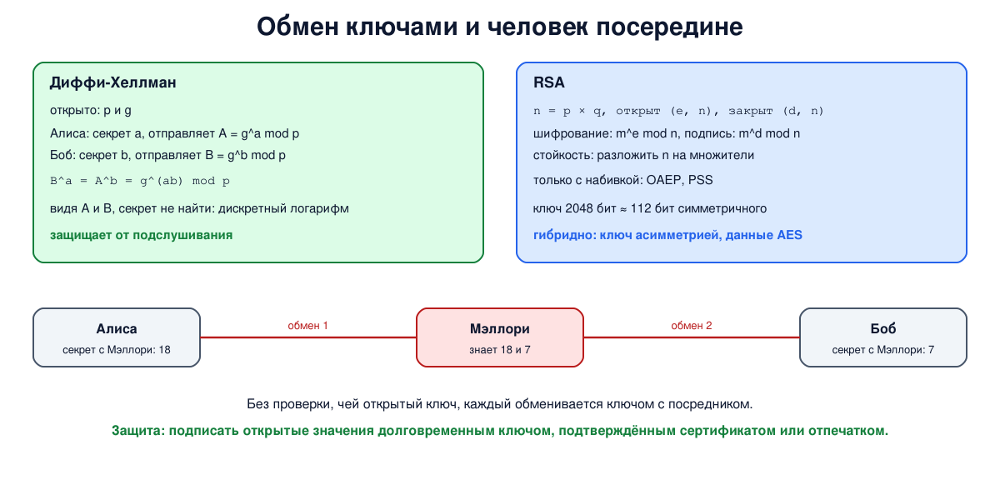

# Урок 71. Асимметричная криптография: RSA, Диффи-Хеллман

Симметричные шифры (урок 69) быстры и надёжны, но у них есть фундаментальная проблема: как двум сторонам получить общий секретный ключ, если до этого они никогда не встречались, а сеть между ними прослушивается? В этом уроке - асимметричная криптография, которая эту проблему решает: RSA и протокол Диффи-Хеллмана. И главная ловушка: обмен ключами без проверки, **с кем** ты его ведёшь.

## Проблема распределения ключей

При симметричном шифровании каждой паре участников нужен свой ключ, и его надо как-то передать тайно. Для n участников это n(n-1)/2 ключей: для 10 человек - 45, для 1000 - почти полмиллиона (Олифер, гл. 26, с. 826; Ристич, гл. 1, с. 12). В интернете, где браузер встречает сайт впервые, заранее договориться о ключе практически невозможно (Таненбаум, разд. 8.6, с. 875).

## Открытый и закрытый ключ

В 1976 году Уитфилд Диффи и Мартин Хеллман предложили схему, в которой ключей **два**: **открытый** (public) знают все, **закрытый** (private) хранит только владелец (Таненбаум, с. 875-876; Олифер, с. 830). Требования к такой схеме:

- расшифровав закрытым ключом то, что зашифровано открытым, получаем исходный текст;
- по открытому ключу практически невозможно вычислить закрытый;
- схема выдерживает атаку с выбранным открытым текстом (урок 68) - ведь открытый ключ есть у всех, и шифровать им может кто угодно.

Основа шифрования с открытым ключом - **односторонние функции с секретом** (Диффи-Хеллману хватает просто односторонней функции g^x mod p): в одну сторону вычислить легко, в обратную - практически невозможно, если не знать дополнительного секрета. Каждому участнику нужна одна пара ключей, всего 2n ключей вместо n(n-1)/2, и открытые ключи можно передавать открыто (Олифер, с. 830-831). Позже выяснилось, что британские криптографы спецслужбы GCHQ пришли к тем же идеям несколькими годами раньше, но работа была засекречена до 1997 года (Олифер, с. 828).

Обычно асимметричная криптография делает две вещи:

- **обмен ключами** - две стороны получают общий секрет, не передавая его;
- **цифровая подпись** - действие закрытым ключом, которое любой проверит открытым (урок 73). Подпись даёт то, чего не даёт MAC (урок 70): доказательство авторства для третьей стороны.

## RSA

RSA (Ривест, Шамир, Адлеман; придуман в 1977, опубликован в 1978) построен на трудности **разложения на множители** (Таненбаум, с. 876-877; Олифер, с. 831-832):

- выбрать два больших простых числа p и q и перемножить: n = p × q;
- вычислить φ = (p - 1)(q - 1);
- выбрать открытый показатель e, взаимно простой с φ (на практике почти всегда 65537);
- найти закрытый показатель d такой, что e × d даёт остаток 1 при делении на φ.

Открытый ключ - (e, n), закрытый - (d, n). Шифрование: c = m^e mod n; расшифрование: m = c^d mod n. Подпись - наоборот: s = m^d mod n, проверка: s^e mod n = m. Зная p и q, d вычислить легко; зная только n, нужно разложить его на множители, а для 2048-битного n это за пределами возможностей любых известных методов. Таненбаум (с. 876) выбирает сначала d, а потом e; на практике делают наоборот.

"Учебный" RSA в чистом виде опасен: он **детерминирован**, одинаковый текст всегда даёт одинаковый шифртекст, как ECB (Таненбаум, с. 878), и у него есть математические слабости. Поэтому перед шифрованием сообщение дополняют случайной **набивкой** по стандарту: для шифрования - **OAEP**, для подписей - **PSS** (RFC 8017). Старая набивка PKCS#1 v1.5 для шифрования оказалась уязвимой (серия атак, начиная с работы Бляйхенбахера 1998 года), и в новых системах её не используют.

RSA медленный и требует длинных ключей: 2048 бит дают стойкость, сравнимую с 112-битным симметричным ключом, 3072 - со 128-битным (Ристич, с. 13, 16-18). Поэтому применяют **гибридную схему**: асимметрией согласуют или передают короткий симметричный ключ, а данные шифруют AES или ChaCha20 (Таненбаум, с. 878).

## Протокол Диффи-Хеллмана

Протокол позволяет двум сторонам получить общий секрет, обмениваясь только открытыми значениями (Таненбаум, разд. 8.9.2, с. 902-903; Олифер, с. 826-828):

- стороны открыто договариваются о большом простом числе p и основании g;
- Алиса выбирает секретное число a и отправляет A = g^a mod p;
- Боб выбирает секретное число b и отправляет B = g^b mod p;
- Алиса вычисляет B^a mod p, Боб - A^b mod p; оба результата равны g^(ab) mod p.

Наблюдатель видит p, g, A и B, а известный способ получить общий секрет - найти a по g^a mod p, то есть решить **задачу дискретного логарифма**, для больших p (2048 бит и больше) неразрешимая на практике. Сегодня используют стандартные проверенные группы, например ffdhe2048 из RFC 7919, или вариант на эллиптических кривых (урок 72).

Если стороны каждый раз выбирают **новые** секретные числа (эфемерный Диффи-Хеллман), то кража долговременного ключа сервера в будущем не раскроет записанный сегодня трафик - это **прямая секретность** (Ристич, с. 20-21; подробно - урок 72). Обмен ключами через RSA такого свойства не даёт, поэтому в TLS 1.3 его убрали.

## Человек посередине

Диффи-Хеллман защищает от **пассивного** наблюдателя, но сам по себе не говорит, **с кем** получен общий секрет (Таненбаум, с. 903-904). Если активный противник встанет между сторонами, он подменит A и B своими значениями и проведёт два отдельных обмена: один с Алисой, другой с Бобом. Каждая сторона получит общий ключ - но с ним, а не друг с другом, и он будет расшифровывать, читать и при желании менять весь трафик, перешифровывая его. Поэтому обмен ключами всегда **аутентифицируют**: подписывают свои открытые значения долговременным ключом, подлинность которого подтверждена сертификатом или известна заранее (Ристич, с. 15, 21; Олифер, с. 832).



## Как это увидеть в Linux

Python и `openssl`. Сначала "учебный" RSA на маленьких числах, чтобы увидеть всю арифметику, и рост работы при разложении n на множители. Затем настоящий RSA-2048 с набивкой OAEP и подписью. Потом Диффи-Хеллман: на маленьких числах и в стандартной группе ffdhe2048. И наконец, на маленьких числах - схема "человека посередине": как два обмена с посредником выглядят для сторон как один. Нужны Linux (подойдёт WSL2), python3 версии 3.8 или новее и openssl 3.0 или новее (Ubuntu 22.04+, Debian 12+; `sudo apt install python3 openssl`, версию покажет `openssl version`); ключи создаются во временном каталоге и удаляются в конце.

Создай файл `asymmetric.sh` и запусти `bash asymmetric.sh`:
```
set -u
for c in python3 openssl; do
  command -v "$c" >/dev/null || { echo "нужны python3 и openssl: sudo apt install python3 openssl"; exit 1; }
done
d=$(mktemp -d)
cat > "$d/toy.py" <<'EOF'
# учебные числа: настоящие ключи в сотни раз длиннее
print("--- 1. textbook RSA on tiny numbers")
p, q, e = 61, 53, 17
n, phi = p * q, (p - 1) * (q - 1)
dd = pow(e, -1, phi)
print(f"  p={p} q={q} n={n} phi={phi} public e={e} private d={dd}")
m = 65
c = pow(m, e, n)
print(f"  encrypt m={m}: c = m^e mod n = {c}; decrypt: c^d mod n = {pow(c, dd, n)}")
s = pow(m, dd, n)
print(f"  sign m={m}: s = m^d mod n = {s}; verify: s^e mod n = {pow(s, e, n)}")
print(f"  the same m always gives the same c: {pow(m, e, n) == c} (textbook RSA has no randomness)")

print("--- 2. factoring n by trial division gets hard fast")
def is_prime(x):
    if x < 2: return False
    for k in (2, 3, 5, 7, 11, 13, 17, 19, 23, 29, 31, 37):
        if x % k == 0: return x == k
    dd_, r = x - 1, 0
    while dd_ % 2 == 0: dd_ //= 2; r += 1
    for a in (2, 3, 5, 7, 11, 13, 17, 19, 23, 29, 31, 37):
        y = pow(a, dd_, x)
        if y in (1, x - 1): continue
        for _ in range(r - 1):
            y = y * y % x
            if y == x - 1: break
        else: return False
    return True
def next_prime(x):
    while not is_prime(x): x += 1
    return x
for bits in (24, 32, 40, 48):
    a = next_prime(3 << (bits // 2 - 2)); b = next_prime(a + 1000)
    N = a * b; k = 3; tries = 1
    while N % k: k += 2; tries += 1
    print(f"  n of {N.bit_length()} bits: factor {k} found after {tries} divisions")
print("  each 2 extra bits of n double the work; 2048-bit n is out of reach of any known method")

print("--- 4. textbook Diffie-Hellman on tiny numbers")
P, G = 23, 5
a, b = 6, 15
A, B = pow(G, a, P), pow(G, b, P)
print(f"  public p={P} g={G}; Alice sends g^a={A}, Bob sends g^b={B}")
print(f"  Alice computes B^a={pow(B, a, P)}, Bob computes A^b={pow(A, b, P)}: the same secret")

print("--- 5. a man in the middle, when nobody checks whose key it is")
mm = 13
M = pow(G, mm, P)
print(f"  Mallory replaces both public values with her g^m={M}")
print(f"  Alice's secret {pow(M, a, P)} = Mallory's with Alice {pow(A, mm, P)}")
print(f"  Bob's secret {pow(M, b, P)} = Mallory's with Bob {pow(B, mm, P)}")
print("  Alice and Bob think they share a key, but each shares it with Mallory")
EOF
python3 "$d/toy.py" | sed -n '1,/^--- 4/{/^--- 4/!p}'
echo '--- 3. real RSA in openssl: 2048 bits, OAEP padding, signatures'
cd "$d"
openssl genpkey -algorithm RSA -pkeyopt rsa_keygen_bits:2048 -out rsa.key 2>/dev/null
openssl pkey -in rsa.key -pubout -out rsa.pub
echo "  key: $(openssl pkey -in rsa.key -text -noout | grep -m1 -oE '[0-9]+ bit') modulus"
printf 'session key 0123456789abcdef' > msg
for i in 1 2; do
  openssl pkeyutl -encrypt -pubin -inkey rsa.pub -pkeyopt rsa_padding_mode:oaep -in msg -out c$i
done
echo "  ciphertext: $(stat -c %s c1) bytes; two encryptions of the same text equal: $(cmp -s c1 c2 && echo yes || echo no)"
echo "  decrypted: $(openssl pkeyutl -decrypt -inkey rsa.key -pkeyopt rsa_padding_mode:oaep -in c1)"
printf 'release 1.0, sha256 of the build is 3f...' > doc
openssl dgst -sha256 -sign rsa.key -sigopt rsa_padding_mode:pss -out doc.sig doc
echo "  RSA-PSS signature check: $(openssl dgst -sha256 -verify rsa.pub -sigopt rsa_padding_mode:pss -signature doc.sig doc)"
printf 'release 1.0, sha256 of the build is 4f...' > doc
echo "  after changing one character: $(openssl dgst -sha256 -verify rsa.pub -sigopt rsa_padding_mode:pss -signature doc.sig doc 2>/dev/null | head -1)"
python3 "$d/toy.py" | sed -n '/^--- 4/,/^--- 5/{/^--- 5/!p}'
echo '--- 4b. real Diffie-Hellman in openssl: group ffdhe2048'
for who in alice bob; do
  openssl genpkey -algorithm DH -pkeyopt group:ffdhe2048 -out $who.key 2>/dev/null
  openssl pkey -in $who.key -pubout -out $who.pub
done
openssl pkeyutl -derive -inkey alice.key -peerkey bob.pub -pkeyopt dh_pad:1 -out s_alice
openssl pkeyutl -derive -inkey bob.key -peerkey alice.pub -pkeyopt dh_pad:1 -out s_bob
echo "  each side used only its private key and the other's public key"
echo "  shared secret: $(stat -c %s s_alice) bytes; Alice and Bob got the same: $(cmp -s s_alice s_bob && echo yes || echo no)"
python3 "$d/toy.py" | sed -n '/^--- 5/,$p'
cd /
rm -rf "$d"
```

Вот что получилось на нашем сервере:
```
--- 1. textbook RSA on tiny numbers
  p=61 q=53 n=3233 phi=3120 public e=17 private d=2753
  encrypt m=65: c = m^e mod n = 2790; decrypt: c^d mod n = 65
  sign m=65: s = m^d mod n = 588; verify: s^e mod n = 65
  the same m always gives the same c: True (textbook RSA has no randomness)
--- 2. factoring n by trial division gets hard fast
  n of 24 bits: factor 3079 found after 1539 divisions
  n of 32 bits: factor 49157 found after 24578 divisions
  n of 40 bits: factor 786433 found after 393216 divisions
  n of 48 bits: factor 12582917 found after 6291458 divisions
  each 2 extra bits of n double the work; 2048-bit n is out of reach of any known method
--- 3. real RSA in openssl: 2048 bits, OAEP padding, signatures
  key: 2048 bit modulus
  ciphertext: 256 bytes; two encryptions of the same text equal: no
  decrypted: session key 0123456789abcdef
  RSA-PSS signature check: Verified OK
  after changing one character: Verification failure
--- 4. textbook Diffie-Hellman on tiny numbers
  public p=23 g=5; Alice sends g^a=8, Bob sends g^b=19
  Alice computes B^a=2, Bob computes A^b=2: the same secret
--- 4b. real Diffie-Hellman in openssl: group ffdhe2048
  each side used only its private key and the other's public key
  shared secret: 256 bytes; Alice and Bob got the same: yes
--- 5. a man in the middle, when nobody checks whose key it is
  Mallory replaces both public values with her g^m=21
  Alice's secret 18 = Mallory's with Alice 18
  Bob's secret 7 = Mallory's with Bob 7
  Alice and Bob think they share a key, but each shares it with Mallory
```

Разберём.

**Шаг 1: учебный RSA.** p = 61, q = 53, n = 3233, φ = 3120, e = 17, d = 2753 (`pow(e, -1, phi)` в Python находит обратное по модулю). Число 65 превращается в 2790 и обратно; подпись 588 проверяется открытым ключом и даёт 65. И та же беда, что у ECB: одно и то же сообщение всегда даёт один и тот же шифртекст - без набивки противник может просто перебрать вероятные сообщения и сравнить.

**Шаг 2: разложение.** Для n из 24 бит делитель найден за 1539 делений, для 48 бит - уже за 6 291 458, примерно в 4000 раз больше: 24 лишних бита - 12 удвоений, каждые 2 бита n удваивают работу перебора (делить нужно до √n). Настоящие методы разложения гораздо умнее перебора, но и они бессильны против 2048-битных ключей.

**Шаг 3: настоящий RSA.** Ключ 2048 бит, шифртекст - 256 байт, ровно длина модуля. Два шифрования одного и того же текста дали **разные** шифртексты: набивка OAEP добавляет случайность, и противник не может сравнивать. Подпись RSA-PSS с SHA-256 проверяется (`Verified OK`; без `-sigopt rsa_padding_mode:pss` `openssl dgst` подписывал бы со старой набивкой PKCS#1 v1.5), а после изменения одного символа документа - `Verification failure`.

**Шаг 4: Диффи-Хеллман.** На маленьких числах (p = 23, g = 5): Алиса отправила 8, Боб - 19, и оба получили один и тот же секрет 2, хотя ни a, ни b не передавались. В группе ffdhe2048 то же самое с 2048-битными числами: по командам `-inkey alice.key -peerkey bob.pub` видно, что каждая сторона использовала только свой закрытый ключ и чужой открытый, и 256-байтные секреты совпали. Опция `dh_pad:1` дополняет секрет нулями слева до длины p, как требует TLS 1.3; без неё OpenSSL отбрасывает ведущие нули, и изредка секрет оказался бы на байт короче.

**Шаг 5: человек посередине.** Мэллори подменила оба открытых значения своим 21. У Алисы получился секрет 18 - такой же Мэллори вычислила для разговора с Алисой; у Боба - 7, и его Мэллори тоже знает. Алиса и Боб уверены, что у них общий ключ, но ключи у них **разные**, и оба известны Мэллори. Сам протокол не может этого обнаружить - только проверка, чей это открытый ключ.

## Безопасность: человек посередине при обмене ключами

Принцип: **обмен ключами без проверки подлинности защищает только от подслушивания, но не от подмены**. Активный противник на пути проводит два обмена вместо одного и становится невидимым посредником. Математика при этом не нарушена - нарушено доверие к тому, чей открытый ключ получен.

Как защищаться:

- **аутентифицировать обмен ключами**: открытые значения Диффи-Хеллмана подписываются (в TLS 1.3 - вместе со всем рукопожатием) долговременным ключом сервера (а при необходимости и клиента), как в TLS;
- **проверять подлинность долговременных ключей**: сертификатами от доверенного центра (урок 73) или заранее известными отпечатками - так работает SSH при первом подключении (сверь отпечаток по независимому каналу), так работают закреплённые ключи в клиентах прокси-протоколов;
- **не игнорировать предупреждения** о недействительном сертификате или изменившемся ключе хоста - это ровно тот момент, когда посредник может быть на пути;
- **использовать эфемерный обмен** (DHE, ECDHE) ради прямой секретности и не использовать обмен ключами через RSA;
- **выбирать достаточные длины и стандартные группы**: RSA не меньше 2048 бит (лучше 3072 для долгосрочных ключей), группы Диффи-Хеллмана не меньше 2048 бит из RFC 7919 или эллиптические кривые; 512-битные группы взламываются (атака Logjam, 2015), 1024-битные считаются недостаточными;
- **беречь закрытые ключи**: кто владеет закрытым ключом сервера, тот может выдать себя за сервер.

Отдельно стоит помнить о будущем: достаточно мощный квантовый компьютер сможет ломать и RSA, и Диффи-Хеллман (алгоритм Шора), поэтому уже сейчас внедряют постквантовые схемы обмена ключами (ML-KEM), обычно в паре с классическими.

## Итог

- Асимметричная криптография решает проблему распределения ключей: открытый ключ знают все, закрытый - только владелец.
- RSA основан на трудности разложения n = p × q; его используют с набивкой (OAEP, PSS) и ключами от 2048 бит, обычно в гибридной схеме.
- Диффи-Хеллман даёт общий секрет по открытому каналу; стойкость - задача дискретного логарифма. Эфемерный DH даёт прямую секретность.
- Сам по себе обмен ключами не защищает от человека посередине: открытые ключи нужно аутентифицировать подписями и сертификатами.

## Что почитать

- Таненбаум, разд. 8.6, с. 875-879 (RSA, идея открытых ключей) и разд. 8.9.2, с. 901-904 (обмен ключами Диффи-Хеллмана, атака "пожарной цепочки"). У Таненбаума модуль обозначен n, секреты - x и y, а n и g названы большими простыми; на деле g берут маленьким (у Олифера, с. 828, - меньше десяти; в группах RFC 7919 g = 2), а большим и простым должен быть модуль.
- Олифер, гл. 26, с. 826-832: алгоритм Диффи-Хеллмана, асимметричное шифрование, RSA.
- Ристич, "Bulletproof TLS and PKI", гл. 1, с. 12-21: асимметричное шифрование, подписи, обмен ключами, прямая секретность, атаки посередине.
- RFC 8017 (PKCS#1: RSA, OAEP, PSS), RFC 7919 (группы Диффи-Хеллмана для TLS).
