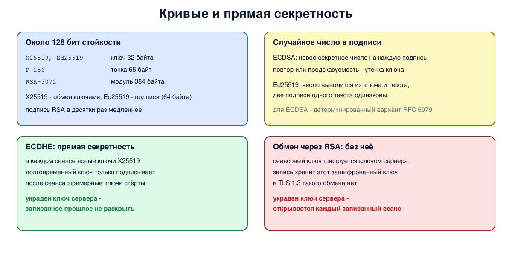

# Урок 72. Эллиптические кривые: X25519, Ed25519; прямая секретность

RSA и классический Диффи-Хеллман (урок 71) надёжны, но требуют чисел в тысячи бит и медленны. Для обмена ключами почти вся современная сеть - TLS 1.3, SSH, WireGuard, прокси-протоколы вроде VLESS с REALITY - использует вместо них **эллиптические кривые**: те же идеи обмена ключами и подписи, но с ключами в 32 байта. В этом уроке - X25519 и Ed25519 и свойство, ради которого обмен ключами делают каждый раз заново: **прямая секретность**.

## Эллиптические кривые без тяжёлой математики

Эллиптическая кривая - множество точек, координаты которых удовлетворяют уравнению вида y² = x³ + ax + b, причём координаты берутся по модулю большого простого числа. На этих точках определена операция "сложения", и точку можно "умножить" на число: сложить её саму с собой k раз. Умножить легко, а вот по точке-результату найти k - **задача дискретного логарифма на кривой** - труднее, чем разложение на множители (Таненбаум, разд. 8.6.2, с. 879); для неё неизвестны и такие быстрые методы, как для обычного дискретного логарифма. (Curve25519 записывают в другой, равносильной форме уравнения.)

Поэтому ключи короче при той же стойкости (Ристич, гл. 1, с. 18, по рекомендациям NIST SP 800-57):

- 128 бит симметричного ключа ≈ RSA или классический DH на 3072 бита ≈ 256 бит на эллиптической кривой;
- 256 бит симметричного ≈ RSA на 15 360 бит ≈ 512 бит на кривой.

Таненбаум (с. 879) пересказывает образ Арьена Ленстры: энергии на взлом ключа RSA определённой длины хватит, чтобы вскипятить чайную ложку воды, а на взлом ключа той же длины на эллиптической кривой - всю воду на Земле. (Правильнее, впрочем, сравнивать не одинаковые длины, а одинаковую стойкость, как в таблице выше.)

## Кривые, которые используют

- **NIST P-256** (secp256r1) - стандарт NIST, широко поддерживается; на ней работают ECDH и подписи **ECDSA**.
- **Curve25519** - кривая Даниэля Бернштейна (2005), спроектированная так, чтобы её было трудно реализовать неправильно: быстрые вычисления без ветвлений по секретным данным и без проверок, которые легко забыть. На ней построены:
  - **X25519** - обмен ключами Диффи-Хеллмана (RFC 7748): закрытый и открытый ключи по 32 байта, общий секрет - 32 байта;
  - **Ed25519** - цифровые подписи по схеме EdDSA (RFC 8032): открытый ключ 32 байта, подпись 64 байта.

X25519 сегодня - основа обмена ключами TLS 1.3 в браузерах (сейчас чаще всего в гибриде X25519MLKEM768, о нём ниже), Curve25519 лежит в основе WireGuard, Ed25519 - распространённый тип ключей SSH, а ключи REALITY (блок 11) - тоже ключи X25519.

## Случайное число в подписи: ECDSA против Ed25519

Подпись ECDSA для каждого сообщения требует нового **секретного случайного числа**. Если оно хоть раз повторится для двух разных сообщений, по этим двум подписям вычисляется **закрытый ключ**; если оно известно противнику, ключ вычисляется по одной подписи; если даже чуть смещено - по множеству подписей. Так в 2010 году был раскрыт ключ, которым производитель игровой приставки подписывал программы: в его реализации это число было постоянным. Отсюда защиты: детерминированный выбор этого числа из ключа и сообщения (RFC 6979 для ECDSA) - и схема Ed25519, где так устроено изначально, поэтому две подписи одного сообщения одинаковы, а ошибка с повтором исключена самой схемой.

## Прямая секретность

Представим, что противник **записывает** весь зашифрованный трафик, а через год получает закрытый ключ сервера - взломом, по решению суда, от бывшего сотрудника. Сможет ли он расшифровать записанное?

- Если сеансовый ключ **передавался, зашифрованный долговременным ключом сервера** (обмен ключами через RSA, урок 71), - да: украденным ключом расшифровывается каждый записанный сеанс. Ристич (с. 20-21) приводит историю почтового сервиса Lavabit: у него потребовали закрытый ключ сервера, с которым можно было бы расшифровать любой перехваченный трафик.
- Если в каждом сеансе обе стороны создают **новые эфемерные** ключи обмена (ECDHE, DHE), выводят из них общий секрет и после сеанса **стирают**, - нет. Долговременный ключ сервера в этой схеме только **подписывает** эфемерный открытый ключ, чтобы не было посредника (урок 71; в TLS 1.3 подписывается всё рукопожатие вместе с ним, урок 79), а секрета сеанса из него не получить. Это и есть **прямая секретность** (forward secrecy).

Записывать трафик впрок, чтобы расшифровать потом, - не теория: Ристич (с. 20) напоминает, что в 2013 году выяснилось, что спецслужбы массово записывают интернет-трафик, и в ответ IETF объявила повсеместное наблюдение атакой (RFC 7258). Поэтому TLS 1.3 убрал обмен ключами через RSA и статический DH: полное рукопожатие идёт только через эфемерный (EC)DHE (возобновление сеанса по ключу без DH - отдельный случай, блок 9). А против будущих квантовых компьютеров, которые смогут решать и задачу на эллиптических кривых, уже применяют гибридный обмен: X25519 вместе с постквантовой схемой ML-KEM, - чтобы и запись, сделанная сегодня, не раскрылась завтра.



## Как это увидеть в Linux

`openssl` и Python с модулем `cryptography`. Сравним размеры открытых ключей X25519, Ed25519, P-256 и RSA-3072, проведём обмен X25519 двумя сторонами, сравним подписи Ed25519 и ECDSA, измерим скорость операций и смоделируем прямую секретность: записанный сеанс с эфемерными ключами и с обменом через RSA, а потом "украдём" ключ сервера. Нужны Linux с OpenSSL 3 (Ubuntu 22.04 или новее, подойдёт WSL2), python3 и `python3-cryptography` (`sudo apt install python3 python3-cryptography openssl`); ключи создаются во временном каталоге и удаляются в конце.

Создай файл `curves.sh` и запусти `bash curves.sh`:
```
set -u
for c in python3 openssl; do
  command -v "$c" >/dev/null || { echo "нужны python3, python3-cryptography и openssl: sudo apt install python3 python3-cryptography openssl"; exit 1; }
done
python3 -c 'import cryptography' 2>/dev/null || { echo "нужен модуль: sudo apt install python3-cryptography"; exit 1; }
openssl version | grep -q '^OpenSSL 3' || { echo "нужен OpenSSL 3 (Ubuntu 22.04 или новее)"; exit 1; }
d=$(mktemp -d); cd "$d" || exit 1
echo '--- 1. public key sizes for about 128-bit security'
openssl genpkey -algorithm X25519 -out x.key
openssl genpkey -algorithm ED25519 -out ed.key
openssl genpkey -algorithm EC -pkeyopt ec_paramgen_curve:P-256 -out p256.key
openssl genpkey -algorithm RSA -pkeyopt rsa_keygen_bits:3072 -out rsa.key 2>/dev/null
for k in x ed p256 rsa; do
  printf '  %-6s public key in DER: %4s bytes\n' $k "$(openssl pkey -in $k.key -pubout -outform DER | wc -c)"
done
echo '--- 2. X25519 key exchange'
for who in alice bob; do
  openssl genpkey -algorithm X25519 -out $who.key
  openssl pkey -in $who.key -pubout -out $who.pub
done
openssl pkeyutl -derive -inkey alice.key -peerkey bob.pub -out sa
openssl pkeyutl -derive -inkey bob.key -peerkey alice.pub -out sb
echo "  shared secret: $(stat -c %s sa) bytes, the same on both sides: $(cmp -s sa sb && echo yes || echo no)"
echo '--- 3. signatures: Ed25519 is deterministic, ECDSA is randomized'
printf 'release 2.0 is genuine' > doc
for k in ed p256; do
  if [ $k = ed ]; then sign="openssl pkeyutl -sign -rawin -inkey ed.key -in doc"; else sign="openssl dgst -sha256 -sign p256.key doc"; fi
  $sign > s1; $sign > s2
  printf '  %-7s signature %3s bytes, two signatures of the same text equal: %s\n' $([ $k = ed ] && echo Ed25519 || echo ECDSA) "$(stat -c %s s1)" "$(cmp -s s1 s2 && echo yes || echo no)"
done
openssl pkey -in ed.key -pubout -out ed.pub
openssl pkeyutl -sign -rawin -inkey ed.key -in doc -out ed.sig
echo "  Ed25519 check: $(openssl pkeyutl -verify -rawin -pubin -inkey ed.pub -in doc -sigfile ed.sig 2>/dev/null)"
printf 'release 2.0 is genuinE' > doc
echo "  after changing one letter: $(openssl pkeyutl -verify -rawin -pubin -inkey ed.pub -in doc -sigfile ed.sig 2>/dev/null | head -1)"
cat > fs.py <<'EOF'
import os, time
from cryptography.hazmat.primitives.asymmetric import x25519, ed25519, ec, rsa, padding
from cryptography.hazmat.primitives import hashes, serialization
from cryptography.hazmat.primitives.kdf.hkdf import HKDF
from cryptography.hazmat.primitives.ciphers.aead import AESGCM

print("--- 4. operations per second on this machine (numbers differ between machines)")
def rate(f):
    n, t0 = 0, time.perf_counter()
    while time.perf_counter() - t0 < 0.5:
        f(); n += 1
    return int(n / (time.perf_counter() - t0))
ed, p256, r3 = ed25519.Ed25519PrivateKey.generate(), ec.generate_private_key(ec.SECP256R1()), rsa.generate_private_key(65537, 3072)
xa, xb = x25519.X25519PrivateKey.generate(), x25519.X25519PrivateKey.generate()
print(f"  Ed25519 sign:     {rate(lambda: ed.sign(b'msg')):>7}")
print(f"  ECDSA P-256 sign: {rate(lambda: p256.sign(b'msg', ec.ECDSA(hashes.SHA256()))):>7}")
print(f"  RSA-3072 sign:    {rate(lambda: r3.sign(b'msg', padding.PKCS1v15(), hashes.SHA256())):>7}")
print(f"  X25519 exchange:  {rate(lambda: xa.exchange(xb.public_key())):>7}")

print("--- 5. forward secrecy: a recorded session and a key stolen later")
def kdf(secret):
    return HKDF(hashes.SHA256(), 32, None, b"lesson 72").derive(secret)
raw = lambda pub: pub.public_bytes(serialization.Encoding.Raw, serialization.PublicFormat.Raw)
server_id = ed25519.Ed25519PrivateKey.generate()          # долговременный ключ сервера: только подписывает
# сеанс с эфемерными ключами: каждая сторона создаёт новый X25519 и потом его стирает
c_eph, s_eph = x25519.X25519PrivateKey.generate(), x25519.X25519PrivateKey.generate()
sig = server_id.sign(raw(s_eph.public_key()))             # сервер подписывает свой эфемерный ключ
server_id.public_key().verify(sig, raw(s_eph.public_key()))  # клиент проверяет: это не посредник
key = kdf(c_eph.exchange(s_eph.public_key()))
nonce = os.urandom(12)
record = {"c_pub": raw(c_eph.public_key()), "s_pub": raw(s_eph.public_key()), "sig": sig,
          "ct": AESGCM(key).encrypt(nonce, b"the password is swordfish", None), "nonce": nonce}
del c_eph, s_eph, key                                      # сеанс окончен, эфемерные ключи стёрты
print("  ECDHE: the record holds", ", ".join(record), "- no private keys")
try:
    c_eph
except NameError:
    print("  the ephemeral private keys are gone; the long-term key only signed and took no part")
    print("  in deriving the session key (in this library Ed25519 keys even lack exchange():",
          not hasattr(server_id, "exchange"), ")")
# для сравнения: сеансовый ключ передан, зашифрованный долговременным RSA-ключом сервера
server_rsa = rsa.generate_private_key(65537, 2048)
oaep = padding.OAEP(padding.MGF1(hashes.SHA256()), hashes.SHA256(), None)
k2, n2 = os.urandom(32), os.urandom(12)
rec2 = {"wrapped": server_rsa.public_key().encrypt(k2, oaep), "ct": AESGCM(k2).encrypt(n2, b"the password is swordfish", None), "nonce": n2}
del k2
stolen = server_rsa                                        # ключ сервера украден позже
k_found = stolen.decrypt(rec2["wrapped"], oaep)
print("  RSA key transport: with the stolen key the recording opens:",
      AESGCM(k_found).decrypt(rec2["nonce"], rec2["ct"], None).decode())
EOF
python3 fs.py
cd /
rm -rf "$d"
```

Вот что получилось на нашем сервере (скорость на каждой машине своя, длина подписи ECDSA в формате DER обычно 70-72 байта):
```
--- 1. public key sizes for about 128-bit security
  x      public key in DER:   44 bytes
  ed     public key in DER:   44 bytes
  p256   public key in DER:   91 bytes
  rsa    public key in DER:  422 bytes
--- 2. X25519 key exchange
  shared secret: 32 bytes, the same on both sides: yes
--- 3. signatures: Ed25519 is deterministic, ECDSA is randomized
  Ed25519 signature  64 bytes, two signatures of the same text equal: yes
  ECDSA   signature  70 bytes, two signatures of the same text equal: no
  Ed25519 check: Signature Verified Successfully
  after changing one letter: Signature Verification Failure
--- 4. operations per second on this machine (numbers differ between machines)
  Ed25519 sign:       15366
  ECDSA P-256 sign:   22073
  RSA-3072 sign:        383
  X25519 exchange:    14363
--- 5. forward secrecy: a recorded session and a key stolen later
  ECDHE: the record holds c_pub, s_pub, sig, ct, nonce - no private keys
  the ephemeral private keys are gone; the long-term key only signed and took no part
  in deriving the session key (in this library Ed25519 keys even lack exchange(): True )
  RSA key transport: with the stolen key the recording opens: the password is swordfish
```

Разберём.

**Шаг 1: размеры.** Открытый ключ X25519 и Ed25519 в формате DER - 44 байта: 32 байта самого ключа плюс 12 байт обёртки: идентификатор алгоритма и служебные заголовки ASN.1. P-256 - 91 байт (65 байт точки: признак и две координаты по 32 байта, плюс описание), RSA-3072 - 422 байта. При примерно одинаковой стойкости между X25519 и RSA-3072 разница почти в 10 раз - это важно и для размера рукопожатия, и для ключей, которые вписывают в настройки и ссылки.

**Шаг 2: X25519.** Каждая сторона взяла свой закрытый ключ и чужой открытый и получила одинаковый 32-байтный секрет - тот же Диффи-Хеллман, что в уроке 71, только на кривой. Сам секрет как ключ шифрования не используют: из него выводят ключи функцией вроде HKDF.

**Шаг 3: подписи.** Подпись Ed25519 - 64 байта, и две подписи одного документа совпали: число для подписи выводится из ключа и сообщения. Подпись ECDSA каждый раз новая - в неё входит случайное число, и от качества этого числа зависит безопасность ключа. Подпись Ed25519 проверяется открытым ключом, а после изменения одной буквы - отказ.

**Шаг 4: скорость.** Подпись Ed25519 и ECDSA P-256 - больше десяти тысяч операций в секунду, обмен X25519 - тоже, а подпись RSA-3072 - сотни: в десятки раз медленнее. (Проверка подписи RSA, наоборот, быстрая. P-256 в OpenSSL сильно оптимизирована, поэтому здесь она даже быстрее Ed25519; разница между кривыми мала, с RSA - больше чем на порядок.) Поэтому сервер, принимающий тысячи соединений в секунду, выигрывает от кривых.

**Шаг 5: прямая секретность.** В первом сеансе долговременный ключ сервера Ed25519 только подписал эфемерный открытый ключ X25519, а клиент проверил подпись. Общий секрет вывели из эфемерных ключей, зашифровали сообщение, и эфемерные закрытые ключи удалили (в модели - командой `del`; настоящие реализации затирают их в памяти). Программа здесь ничего не взламывает: она показывает, что в записи только открытые ключи, подпись, шифртекст и nonce, что эфемерных ключей больше нет и что долговременный ключ в выработке секрета не участвовал: он ничего не шифровал, а только подписал открытый ключ (в этой библиотеке у ключа Ed25519 даже нет метода `exchange()`). Важен не тип ключа, а то, что секрет сеанса от него не зависит: в TLS 1.3 с RSA-сертификатом прямая секретность тоже есть. Что сеансовый ключ из записи и долговременного ключа не получить, следует из устройства схемы. Во втором сеансе сеансовый ключ был зашифрован долговременным RSA-ключом сервера, и с украденным ключом запись открылась: `the password is swordfish`.

## Безопасность: ключи на кривых и прямая секретность

Принцип: **защита записанного трафика не должна зависеть от того, что долговременный ключ никогда не утечёт**. Эфемерный обмен ключами делает каждую сессию независимой: утечка ключа сервера позволяет выдать себя за сервер в будущем, но не раскрывает прошлое.

Как защищаться:

- **использовать только эфемерный обмен** (ECDHE, лучше X25519; при поддержке - гибрид с ML-KEM) и отключать обмен ключами через RSA и статический DH в настройках серверов;
- **предпочитать Ed25519** для новых ключей подписи (SSH, подпись релизов); при использовании ECDSA - только проверенные библиотеки с детерминированным или качественным случайным числом;
- **генерировать ключи надёжным генератором случайности** и только на доверенной машине - слабая случайность губит и кривые, и RSA;
- **беречь долговременные ключи** и менять их при подозрении на утечку - прямая секретность защищает прошлое, но не будущее;
- **не хранить сеансовые секреты дольше нужного**: механизмы возобновления сеансов (TLS session tickets) могут ослабить прямую секретность, если их ключи живут долго (блок 9).

## Итог

- Эллиптические кривые дают ту же стойкость при намного меньших ключах: 256 бит на кривой ≈ 3072 бита RSA ≈ 128 бит симметричного ключа.
- X25519 - обмен ключами на Curve25519 (32 байта), Ed25519 - подписи (64 байта, детерминированные); P-256 с ECDSA - стандарт NIST.
- ECDSA требует уникального секретного случайного числа для каждой подписи; его повтор раскрывает закрытый ключ.
- Прямая секретность: эфемерные ключи каждого сеанса стираются, и кража долговременного ключа не раскрывает записанный трафик. TLS 1.3 не поддерживает обмен через RSA: полное рукопожатие только с эфемерным (EC)DHE.

## Что почитать

- Таненбаум, разд. 8.6.2, с. 878-879: другие алгоритмы с открытым ключом, эллиптические кривые и сравнение Ленстры.
- Ристич, "Bulletproof TLS and PKI", гл. 1, с. 13 и 17-21: место кривых рядом с RSA, таблицы эквивалентной стойкости, повсеместное наблюдение, прямая секретность и случай Lavabit.
- RFC 7258 (повсеместное наблюдение), NIST SP 800-57 ч. 1 (эквивалентная стойкость), RFC 7748 (X25519, X448), RFC 8032 (EdDSA, Ed25519), RFC 6979 (детерминированный ECDSA), RFC 8446 (TLS 1.3).
