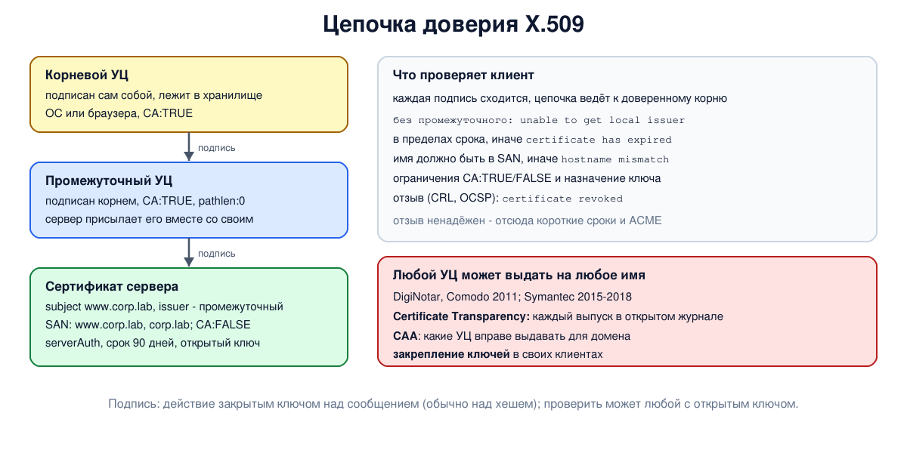

# Урок 73. Подписи, сертификаты, X.509, PKI, цепочка доверия

В уроке 71 мы увидели, что обмен ключами беззащитен против человека посередине, если неизвестно, **чей** открытый ключ получен. Решение, на котором держится весь HTTPS, - **сертификаты**: подписанные утверждения "этот открытый ключ принадлежит этому имени". В этом уроке - цифровые подписи, сертификаты X.509, удостоверяющие центры, цепочки доверия и отзыв, а в разделе безопасности - что бывает, когда доверие подводит, и как с этим борются (Certificate Transparency).

## Цифровая подпись

Подпись решает три задачи (Таненбаум, разд. 8.7, с. 879; Олифер, гл. 27, с. 843):

- получатель может проверить, кто отправил сообщение;
- отправитель не может потом отказаться от подписанного (**неотрицаемость**);
- получатель не может сам подделать подпись под другим текстом.

Подписывают не весь документ, а его **хеш** (урок 70): так быстрее и короче (Таненбаум, с. 883-884; Олифер, с. 844). Подпись создаёт владелец закрытого ключа, а проверить её может любой, у кого есть открытый, - этим подпись отличается от MAC, который проверяет только знающий общий ключ. Для RSA подпись - это действие закрытым ключом над хешем (урок 71), у ECDSA и Ed25519 - своя схема (урок 72); шифрованием подпись в общем случае не является (Ристич, гл. 1, с. 13-14). Подпись не скрывает содержимого: конфиденциальность - отдельная задача.

## Сертификат

Открытый ключ, просто выложенный на сайте, может подменить посредник (Таненбаум, разд. 8.8, с. 888-889). Нужна третья сторона, которой доверяют все, - **удостоверяющий центр** (УЦ, certificate authority). Он проверяет, что заявитель действительно владеет именем, и подписывает **сертификат**: связку "имя - открытый ключ" со сроком действия и другими данными (Таненбаум, с. 889; Олифер, с. 845-847). Сертификат не секретен: его отправляют каждому, кто подключается, а подделать его без закрытого ключа УЦ нельзя.

Стандартный формат - **X.509** версии 3 (RFC 5280). Главные поля (Таненбаум, с. 891; расширения - по RFC 5280):

- **subject** - чей сертификат, **issuer** - кто его выдал;
- **validity** - срок действия (не раньше и не позже);
- **serial number** - номер, уникальный у данного издателя;
- **открытый ключ** субъекта и **подпись** издателя;
- **расширения**: `subjectAltName` - для каких имён сертификат действует (браузеры смотрят именно сюда, а не в поле CN), `basicConstraints` - может ли он сам выдавать сертификаты (`CA:TRUE`) и на какую глубину, `keyUsage` и `extendedKeyUsage` - для чего ключ годится (подпись, выпуск сертификатов, сервер TLS).

## PKI и цепочка доверия

Один удостоверяющий центр на весь мир был бы узким местом и единой целью для атак (Таненбаум, с. 892). Поэтому строят **инфраструктуру открытых ключей** (PKI) - иерархию (с. 892-894):

- **корневой** УЦ подписывает сам себя; его ключ хранят особо тщательно и почти не используют;
- **промежуточные** УЦ получают сертификаты от корня и выдают сертификаты конечным владельцам;
- **сертификат сервера** подписан промежуточным УЦ.

Сервер отправляет клиенту свой сертификат и промежуточные, а корневые сертификаты уже лежат в **хранилище доверенных корней** операционной системы или браузера - их там сотня-другая. Клиент строит **цепочку**: каждая подпись проверяется открытым ключом следующего звена, и цепочка должна закончиться доверенным корнем. По пути проверяются сроки, имя, ограничения `basicConstraints` и назначение ключей. По сути всё сводится к доверию тем, кто составил список корней (Таненбаум, с. 894).

## Отзыв

Если закрытый ключ сервера украден, сертификат нужно **отозвать** до истечения срока:

- **CRL** (certificate revocation list) - подписанный УЦ список серийных номеров отозванных сертификатов, который периодически публикуется (Таненбаум, с. 894-895; Олифер, с. 849);
- **OCSP** (RFC 6960) - запрос к УЦ о статусе конкретного сертификата; **OCSP stapling** - сервер сам прикладывает свежий подписанный ответ.

Отзыв на практике работает плохо: списки отстают, а клиенты при недоступности проверки часто просто продолжают работу. Поэтому индустрия идёт к **коротким срокам** сертификатов: по решению форума УЦ и браузеров (CA/Browser Forum) с 15 марта 2026 года срок не больше 200 дней (раньше было 398), с марта 2027 года будет 100 дней, а с марта 2029 года - 47; выпуск и продление автоматизируют протоколом **ACME** (RFC 8555), как у Let's Encrypt. Крупные центры отказываются от OCSP из-за приватности (сервер OCSP видит, какие сайты посещает пользователь), а браузеры распространяют сведения об отзыве своими механизмами.

Иерархия УЦ - не единственная модель доверия: в PGP пользователи сами подписывают ключи друг друга ("сеть доверия"), а в DNSSEC (урок 66) ключ можно опубликовать в подписанной зоне домена (DANE); в браузерах, однако, работает именно иерархия УЦ.



## Как это увидеть в Linux

Создадим свою маленькую PKI на `openssl`: корневой УЦ, промежуточный УЦ и сертификат сервера для `www.corp.lab` (ключи на кривой P-256). Разберём поля сертификата, проверим цепочку полностью, без промежуточного звена, с чужим именем и "в будущем", после истечения срока. Промежуточный УЦ отзовёт сертификат и опубликует CRL. Наконец, запустим TLS-сервер `openssl s_server` в пространстве имён `hbh-tls` и подключимся к нему клиентом, который проверяет цепочку и имя. Нужны Linux (подойдёт WSL2), права sudo и openssl (`sudo apt install openssl`); ключи создаются во временном каталоге и удаляются в конце.

Создай файл `pki.sh` и запусти `bash pki.sh`:
```
set -u
command -v openssl >/dev/null || { echo "нужен openssl: sudo apt install openssl"; exit 1; }
ns=hbh-tls
sudo ip netns pids $ns 2>/dev/null | xargs -r sudo kill
sudo ip netns del $ns 2>/dev/null
d=$(mktemp -d); cd "$d" || exit 1
key() { openssl genpkey -algorithm EC -pkeyopt ec_paramgen_curve:P-256 -out $1.key 2>/dev/null; }
echo '--- 1. a small PKI: root CA -> intermediate CA -> server'
key root; key inter; key server
openssl req -x509 -new -key root.key -subj "/CN=Lab Root CA" -days 3650 -out root.crt \
  -addext "basicConstraints=critical,CA:TRUE" -addext "keyUsage=critical,keyCertSign,cRLSign"
printf 'basicConstraints=critical,CA:TRUE,pathlen:0\nkeyUsage=critical,keyCertSign,cRLSign\n' > inter.ext
openssl req -new -key inter.key -subj "/CN=Lab Intermediate CA" -out inter.csr
openssl x509 -req -in inter.csr -CA root.crt -CAkey root.key -CAcreateserial -days 1825 -extfile inter.ext -out inter.crt 2>/dev/null
printf 'basicConstraints=critical,CA:FALSE\nkeyUsage=critical,digitalSignature\nextendedKeyUsage=serverAuth\nsubjectAltName=DNS:www.corp.lab,DNS:corp.lab\n' > server.ext
openssl req -new -key server.key -subj "/CN=www.corp.lab" -out server.csr
openssl x509 -req -in server.csr -CA inter.crt -CAkey inter.key -CAcreateserial -days 90 -extfile server.ext -out server.crt 2>/dev/null
openssl x509 -in server.crt -noout -subject -issuer -ext subjectAltName,basicConstraints,keyUsage,extendedKeyUsage | sed 's/^/  /'
echo "  intermediate CA: $(openssl x509 -in inter.crt -noout -ext basicConstraints | tail -1 | sed 's/^ *//')"
echo "  valid for: $(( ($(date -d "$(openssl x509 -in server.crt -noout -enddate | cut -d= -f2)" +%s) - $(date +%s) + 3600) / 86400 )) days"
echo '--- 2. checking the chain'
v() { printf '  %-34s ' "$1"; shift; openssl verify "$@" 2>&1 | grep -E 'OK$|^error' | head -1 | sed -E 's/^error [0-9]+ at [0-9]+ depth lookup: //; s/^server.crt: //'; }
v "full chain:" -CAfile root.crt -untrusted inter.crt server.crt
v "without the intermediate:" -CAfile root.crt server.crt
v "name www.corp.lab:" -CAfile root.crt -untrusted inter.crt -verify_hostname www.corp.lab server.crt
v "name bank.example:" -CAfile root.crt -untrusted inter.crt -verify_hostname bank.example server.crt
v "100 days from now:" -CAfile root.crt -untrusted inter.crt -attime $(( $(date +%s) + 100 * 86400 )) server.crt
echo '--- 3. revocation: the intermediate CA publishes a CRL'
mkdir ca; : > ca/index.txt; echo 1000 > ca/crlnumber
cat > ca.cnf <<EOF
[ ca ]
default_ca = lab
[ lab ]
database = $d/ca/index.txt
crlnumber = $d/ca/crlnumber
certificate = $d/inter.crt
private_key = $d/inter.key
default_md = sha256
default_crl_days = 7
EOF
openssl ca -config ca.cnf -gencrl -out crl0.pem 2>/dev/null
v "before revocation, CRL checked:" -crl_check -CRLfile crl0.pem -CAfile root.crt -untrusted inter.crt server.crt
openssl ca -config ca.cnf -revoke server.crt -crl_reason keyCompromise 2>/dev/null
openssl ca -config ca.cnf -gencrl -out crl1.pem 2>/dev/null
openssl crl -in crl1.pem -noout -text | grep -E 'Serial Number|Key Compromise' | sed -E 's/^\s+/  in the CRL: /; s/(Serial Number: )[0-9A-F]+/\1(random serial of the server certificate)/'
v "after revocation, CRL checked:" -crl_check -CRLfile crl1.pem -CAfile root.crt -untrusted inter.crt server.crt
v "after revocation, no -crl_check:" -CRLfile crl1.pem -CAfile root.crt -untrusted inter.crt server.crt
echo '--- 4. a TLS server and a client that checks it'
sudo ip netns add $ns
N="sudo ip netns exec $ns"
$N ip link set lo up
$N openssl s_server -quiet -accept 127.0.0.1:4433 -cert server.crt -key server.key -cert_chain inter.crt -www >/dev/null 2>&1 &
sleep 1
c() { printf '  %-34s ' "$1"; shift; echo | $N openssl s_client -connect 127.0.0.1:4433 -CAfile root.crt "$@" 2>&1 | grep -m1 -E 'Verify return code' | sed 's/^ *//'; }
c "name www.corp.lab:" -servername www.corp.lab -verify_hostname www.corp.lab
c "name bank.example:" -servername bank.example -verify_hostname bank.example
echo | $N openssl s_client -connect 127.0.0.1:4433 -CAfile root.crt -servername www.corp.lab 2>/dev/null | grep -E '^ *[0-9] s:|^ *i:' | sed -E 's/, (L|O|C)=[^,]*//g; s/^ */  /'
echo '--- cleanup'
cd /
sudo ip netns pids $ns 2>/dev/null | xargs -r sudo kill
sleep 0.3
sudo ip netns del $ns
rm -rf "$d"
ip netns list | grep -c "^$ns"
```

Вот что получилось на нашем сервере (в новых версиях OpenSSL имена печатаются без пробелов вокруг `=`):
```
--- 1. a small PKI: root CA -> intermediate CA -> server
  subject=CN = www.corp.lab
  issuer=CN = Lab Intermediate CA
  X509v3 Basic Constraints: critical
      CA:FALSE
  X509v3 Key Usage: critical
      Digital Signature
  X509v3 Extended Key Usage: 
      TLS Web Server Authentication
  X509v3 Subject Alternative Name: 
      DNS:www.corp.lab, DNS:corp.lab
  intermediate CA: CA:TRUE, pathlen:0
  valid for: 90 days
--- 2. checking the chain
  full chain:                        OK
  without the intermediate:          unable to get local issuer certificate
  name www.corp.lab:                 OK
  name bank.example:                 hostname mismatch
  100 days from now:                 certificate has expired
--- 3. revocation: the intermediate CA publishes a CRL
  before revocation, CRL checked:    OK
  in the CRL: Serial Number: (random serial of the server certificate)
  in the CRL: Key Compromise
  after revocation, CRL checked:     certificate revoked
  after revocation, no -crl_check:   OK
--- 4. a TLS server and a client that checks it
  name www.corp.lab:                 Verify return code: 0 (ok)
  name bank.example:                 Verify return code: 62 (hostname mismatch)
  0 s:CN = www.corp.lab
  i:CN = Lab Intermediate CA
  1 s:CN = Lab Intermediate CA
  i:CN = Lab Root CA
--- cleanup
0
```

Разберём.

**Шаг 1: мини-PKI.** У сертификата сервера `subject` - `www.corp.lab`, `issuer` - промежуточный УЦ. Расширения: `CA:FALSE` - выдавать сертификаты он не может; `Digital Signature` и `TLS Web Server Authentication` - ключ годится для подписи в рукопожатии TLS сервера; `subjectAltName` перечисляет имена `www.corp.lab` и `corp.lab`. Срок - 90 дней. У промежуточного УЦ (строка `intermediate CA`) - `CA:TRUE, pathlen:0`: сертификат другого УЦ, подписанный им, клиент не примет: выдавать он может только конечным владельцам.

**Шаг 2: проверка цепочки.** С корнем как доверенным и промежуточным сертификатом цепочка сходится - `OK`. Без промежуточного - `unable to get local issuer certificate`: клиент не может связать сертификат сервера с корнем. Это самая частая ошибка настройки серверов: администратор указывает только свой сертификат, забыв промежуточный. Браузеры её часто маскируют, догружая промежуточный сертификат сами, а ломаются в первую очередь curl и приложения. Проверка имени: для `www.corp.lab` - `OK`, для `bank.example` - `hostname mismatch`, хотя подпись в порядке: сертификат подлинный, но выдан не на это имя. Через 100 дней (`-attime`) - `certificate has expired`.

**Шаг 3: отзыв.** Промежуточный УЦ опубликовал пустой CRL - проверка проходит. Затем он отозвал сертификат с причиной `Key Compromise` и опубликовал новый CRL, где появился серийный номер сервера, - и та же проверка даёт `certificate revoked`. Последняя строка: тот же CRL передан, но без ключа `-crl_check` openssl его не смотрит, и отозванный сертификат проходит проверку - `OK`. Проверка отзыва - отдельный шаг, который клиент может и не сделать.

**Шаг 4: TLS.** Сервер отдаёт свой сертификат и промежуточный (`-cert_chain`). Клиент, которому дали наш корень (`-CAfile`), получил `Verify return code: 0 (ok)` для имени `www.corp.lab` и `62 (hostname mismatch)` для `bank.example`. Внизу - цепочка, которую прислал сервер: звено 0 - сервер, подписанный промежуточным УЦ, звено 1 - промежуточный, подписанный корнем. Корень наш сервер не присылает, и это правильно: присланный корень ничего не доказывает, клиент доверяет только корню из своего хранилища. Обрати внимание и на то, что `s_client` лишь сообщает код проверки и соединение не рвёт; обрывать его заставляет ключ `-verify_return_error`, а браузер при такой ошибке показывает предупреждение.

В конце `0`: пространство имён удалено.

## Безопасность: компрометация удостоверяющих центров

Принцип: **любой доверенный удостоверяющий центр может выдать сертификат на любое имя, поэтому вся система не прочнее самого слабого УЦ из списка доверенных**. Если центр взломан или ошибся, посредник получает "настоящий" сертификат на чужой сайт, и цепочка у клиента сходится.

Так и случалось:

- **2011, Comodo**: через взломанный партнёрский регистрационный центр (RA) были выпущены сертификаты на сайты Google, Yahoo, Skype и другие; их отозвали и заблокировали в браузерах;
- **2011, DigiNotar**: взломщик выпустил сотни поддельных сертификатов, в том числе на домены Google, и их использовали для перехвата трафика пользователей в Иране. Подделку заметили благодаря тому, что Chrome знал, какими ключами подписаны сертификаты Google (закрепление ключей). DigiNotar удалили из всех хранилищ, и компания обанкротилась;
- **2015-2018, Symantec**: выпуск сертификатов без ведома владельцев домена (в том числе на google.com) и другие нарушения привели к тому, что браузеры поэтапно перестали доверять её корням.

Как защищаются:

- **Certificate Transparency** (CT, RFC 6962): каждый сертификат для сайтов, выпущенный публичным УЦ, записывается (обычно ещё до выдачи, в виде предсертификата) в открытые журналы, куда можно только добавлять записи (журнал устроен как дерево хешей, и подменить запись незаметно нельзя). Журнал выдаёт подписанное обещание (SCT), которое прикладывается к сертификату, и основные браузеры (Chrome, Safari, Firefox) не принимают сертификаты без SCT. CT не запрещает выпуск, но делает любой выпуск **видимым**: владелец домена может следить за журналами (сервисами мониторинга вроде crt.sh) и сразу узнать о сертификате, которого не заказывал. Так обнаружили выпуск Symantec;
- **CAA** (RFC 8659, урок 63): запись в DNS домена, перечисляющая УЦ, которым разрешено выдавать для него сертификаты; удостоверяющие центры обязаны проверять её при каждом выпуске (с 2017 года), а параметр `iodef` указывает, куда сообщать о попытках выпуска в нарушение записи (если УЦ это поддерживает);
- **короткие сроки и автоматическое продление** (ACME): украденный ключ или ошибочно выданный сертификат перестают действовать быстрее, чем помогал бы ненадёжный отзыв;
- **удаление недобросовестных УЦ** из хранилищ корней - браузеры и операционные системы это делают;
- **закрепление ключей** в собственных приложениях и протоколах: клиент, которому заранее известен ключ или сертификат сервера, не примет другой, даже подписанный доверенным УЦ (так делают мобильные приложения и клиенты прокси-протоколов);
- **для своей инфраструктуры** - свой внутренний УЦ и свой список доверия, вместо того чтобы полагаться на публичные; ключи корня - отдельно от сети.

## Итог

- Цифровая подпись - действие закрытым ключом над сообщением (обычно над его хешем), которое любой проверит открытым ключом; она даёт подлинность, целостность и неотрицаемость.
- Сертификат X.509 - подписанная УЦ связка имени и открытого ключа со сроком, серийным номером и расширениями (`subjectAltName`, `basicConstraints`, `keyUsage`).
- PKI - иерархия: корень, промежуточные УЦ, конечные сертификаты; клиент строит цепочку до доверенного корня и проверяет сроки, имя и ограничения.
- Отзыв (CRL, OCSP) работает плохо, поэтому сроки сертификатов сокращаются, а продление автоматизируют (ACME).
- Любой УЦ может выпустить сертификат на любое имя; защита - Certificate Transparency, CAA, короткие сроки, удаление нарушителей, закрепление ключей.

## Что почитать

- Таненбаум, разд. 8.7, с. 879-884 (цифровые подписи) и 8.8, с. 888-895 (сертификаты, X.509, инфраструктуры открытых ключей, списки отзыва). Ссылка на RFC 2459 устарела: действует RFC 5280; "региональными центрами" (RA) Таненбаум называет промежуточные УЦ - не путать с регистрационным центром (Registration Authority) у Олифера на с. 849.
- Олифер, гл. 27, с. 843-849: электронная подпись, сертификаты, инфраструктура открытых ключей.
- Ристич, "Bulletproof TLS and PKI", гл. 1, с. 13-14: подписи и их связь с хешами.
- RFC 5280 (X.509), RFC 6960 (OCSP), RFC 6962 (Certificate Transparency), RFC 8659 (CAA), RFC 8555 (ACME).
