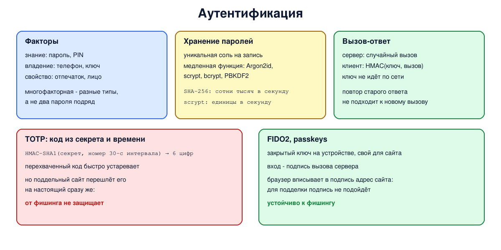

# Урок 74. Аутентификация: пароли, факторы, протоколы

Последний урок блока 8. Шифры, хеши, подписи и сертификаты нужны в конечном счёте для того, чтобы ответить на вопрос "кто на том конце?". Это и есть **аутентификация** - проверка подлинности. В этом уроке - факторы аутентификации, как правильно хранить пароли, протоколы, при которых пароль не уходит в сеть, одноразовые коды и устойчивые к фишингу ключи.

## Кто это и что ему можно

**Аутентификация** отвечает на вопрос "кто это", **авторизация** - "что ему можно" (Таненбаум, разд. 8.9, с. 895-896). Сначала устанавливают личность, потом по ней решают, к чему дать доступ.

Абсолютно надёжной аутентификации человека не бывает: пароль подслушивают или угадывают, ключ крадут, отпечаток подделывают (Олифер, гл. 27, с. 834). Подтвердить личность можно тремя типами **факторов** (Олифер, с. 835):

- **знание** - пароль, PIN;
- **владение** - телефон, аппаратный ключ, смарт-карта;
- **свойство** - отпечаток пальца, лицо.

**Многофакторная** аутентификация требует факторов **разных** типов: пароль и код из приложения на телефоне - это два фактора, а пароль и ответ на контрольный вопрос - один и тот же фактор "знание", дважды.

## Пароли: слабости и хранение

Многоразовый пароль угадывают, подслушивают, выманивают; одинаковый пароль на многих сайтах означает, что утечка на самом слабом из них открывает все остальные (Олифер, с. 835-837). А главная угроза для сервиса - **утечка базы**: если пароли хранились открыто или простым хешем, злоумышленник проверяет миллионы вероятных паролей у себя, не обращаясь к сервису (так ещё в 1988 году червь Морриса подбирал словарные пароли по файлу паролей, Олифер, с. 840).

Как хранят пароли правильно:

- **не сам пароль и не его быстрый хеш**, а результат **медленной функции** выработки ключа, специально рассчитанной на то, чтобы каждая проверка стоила дорого: **Argon2id**, **scrypt**, **bcrypt**, PBKDF2 с большим числом итераций;
- с уникальной случайной **солью** для каждой записи: одинаковые пароли у разных пользователей дают разные хеши, а заранее вычисленные таблицы бесполезны.

Олифер (с. 836) описывает обычные политики паролей: срок действия, список уже использованных паролей, реакцию на неудачные входы, а на с. 837 показывает, что жёсткая блокировка после трёх ошибок позволяет злоумышленнику заблокировать всех. Современные рекомендации (NIST SP 800-63B) идут дальше: не требовать периодической смены без признаков утечки, не навязывать правила "заглавная, цифра, символ", а требовать не меньше 15 символов, если пароль - единственный фактор, разрешать длинные фразы (до 64 символов и больше), не использовать контрольные вопросы, **проверять новые пароли по спискам утёкших** и вместо жёсткой блокировки ограничивать частоту попыток.

## Протоколы: пароль не должен уходить в сеть

Отправлять пароль открытым текстом (как делал PAP в PPP, Олифер, с. 839) опасно. Лучше схема **вызов-ответ** (challenge-response): сервер присылает случайное число, клиент возвращает функцию от этого числа и общего секрета (например, HMAC, урок 70), сервер проверяет (Олифер, с. 838-839; Таненбаум, с. 896-897). Секрет по сети не идёт, а записанный ответ не годится для повтора: на следующий вход будет другой вызов. Но если ключ получен из пароля, по подслушанной паре "вызов + ответ" слабый пароль можно перебирать у себя, как по утёкшей базе. Минус схемы: сервер должен знать тот же секрет или равноценный ему хеш, поэтому утечка его базы равна утечке секретов; схемы с открытым ключом (сертификаты, FIDO2) этого лишены.

Таненбаум (с. 898-900) показывает, как легко ошибиться: "укороченный" протокол взаимной аутентификации ломается **атакой отражения** (у Таненбаума - зеркальная атака) - противник открывает второй сеанс и заставляет сторону саму ответить на свой же вызов. Отсюда правила: инициатор доказывает себя первым, для двух направлений используются разные ключи или разные наборы вызовов, протокол выдерживает параллельные сеансы. Защиту от **повтора** дают одноразовые числа (nonce) и метки времени (с. 905).

На этих идеях построены большие системы:

- **Kerberos** (Таненбаум, с. 907-909; RFC 4120): центр распространения ключей (KDC) выдаёт "билеты" с ограниченным сроком, пароль не передаётся по сети, а один вход открывает доступ ко многим службам (единый вход, SSO). Нужны синхронные часы. Это основа аутентификации в доменах Windows; старый протокол NTLM выводится из употребления;
- **сертификаты** (урок 73): клиент доказывает владение закрытым ключом, а сервер проверяет его сертификат по подписи УЦ и не хранит секретов пользователей (Олифер, с. 845-848; Таненбаум, с. 910);
- в корпоративных сетях - **RADIUS** (доступ пользователей к Wi-Fi и VPN) и **TACACS+** (вход администраторов на сетевое оборудование); их встроенная защита на основе MD5 устарела, поэтому их всё чаще пускают внутри TLS.

## Одноразовые коды и фишингоустойчивые ключи

**Одноразовые пароли** (OTP): приложение на телефоне и сервер знают общий секрет и вычисляют из него код - по счётчику (HOTP, RFC 4226) или по текущему времени с шагом 30 секунд (**TOTP**, RFC 6238) (Олифер, с. 840-842 описывает их предшественников - аппаратные генераторы). Код живёт недолго, перехваченный - быстро бесполезен. Но от **фишинга** OTP не спасает: пользователь вводит код на поддельном сайте, а тот сразу пересылает его на настоящий.

**FIDO2/WebAuthn** и **ключи доступа** (passkeys) решают и эту проблему: на устройстве хранится закрытый ключ, отдельный для каждого сайта, сервер знает только открытый, а вход - это подпись вызова сервера (урок 73). Браузер сам подставляет в подпись адрес сайта, поэтому подпись для поддельного сайта не подойдёт настоящему. Биометрия при этом лишь разблокирует ключ на устройстве и никуда не передаётся.



## Как это увидеть в Linux

Python и `openssl`, без сети. Посмотрим, что делает соль, как выглядит запись пароля в формате `/etc/shadow`, сколько проверок пароля в секунду успевают быстрый хеш и медленные функции и что это значит при утечке базы, проверим схему вызов-ответ и вычислим коды TOTP, сверив их с тестовыми векторами стандарта. Нужны Linux (подойдёт WSL2), python3 и openssl (`sudo apt install python3 openssl`).

Создай файл `auth.sh` и запусти `bash auth.sh`:
```
set -u
for c in python3 openssl; do
  command -v "$c" >/dev/null || { echo "нужны python3 и openssl: sudo apt install python3 openssl"; exit 1; }
done
d=$(mktemp -d)
echo '--- 1. salt: the same password for two users'
python3 - <<'EOF'
import hashlib
for user in ("alice", "bob"):
    print(f"  {user}, no salt:        {hashlib.sha256(b'qwerty').hexdigest()[:32]}...")
for user, salt in (("alice", b"Xq3vT9aL"), ("bob", b"mR7pZ2wK")):
    print(f"  {user}, salt {salt.decode()}: {hashlib.sha256(salt + b'qwerty').hexdigest()[:32]}...")
EOF
echo "  the format of /etc/shadow (SHA-512 crypt, 5000 rounds): $(openssl passwd -6 -salt Xq3vT9aL qwerty | cut -c1-40)..."
cat > "$d/cost.py" <<'EOF'
import hashlib, hmac, os, struct, time
def rate(f, t=2):
    n, t0 = 0, time.perf_counter()
    while time.perf_counter() - t0 < t:
        f(); n += 1
    return n / (time.perf_counter() - t0)

print("--- 2. how many guesses per second one CPU core can check (numbers differ between machines)")
salt = b"Xq3vT9aL"
fns = {
    "SHA-256, one pass": lambda: hashlib.sha256(salt + b"guess").digest(),
    "PBKDF2-SHA256, 600000 iterations": lambda: hashlib.pbkdf2_hmac("sha256", b"guess", salt, 600_000),
    "scrypt, N=2^15 r=8 p=1 (32 MB)": lambda: hashlib.scrypt(b"guess", salt=salt, n=2**15, r=8, p=1, maxmem=64 * 2**20),
}
rates = {}
for name, f in fns.items():
    rates[name] = rate(f)
    print(f"  {name:34s} {rates[name]:>12,.0f}")
print("--- 3. what it means for a stolen database: 10^9 likely passwords per account")
for name, r in rates.items():
    s = 1e9 / r
    when = f"{s / 60:,.0f} minutes" if s < 7200 else f"{s / 86400:,.0f} days, about {s / 86400 / 365:.0f} years"
    print(f"  {name:34s} {when} on one core")

print("--- 4. challenge-response: the password never travels")
key = hashlib.sha256(b"shared secret of alice").digest()
c1 = os.urandom(16)
r1 = hmac.new(key, c1, "sha256").hexdigest()
print("  server sends a random challenge, client answers HMAC(key, challenge)")
print("  answer accepted:", hmac.compare_digest(r1, hmac.new(key, c1, "sha256").hexdigest()))
c2 = os.urandom(16)
print("  an eavesdropper replays the old answer to a new challenge:",
      "accepted" if hmac.compare_digest(r1, hmac.new(key, c2, "sha256").hexdigest()) else "rejected")

print("--- 5. TOTP (RFC 6238): a code from a shared secret and the current time")
def totp(secret, t, digits=8, step=30):
    msg = struct.pack(">Q", int(t // step))
    h = hmac.new(secret, msg, "sha1").digest()
    o = h[-1] & 0x0F
    code = (struct.unpack(">I", h[o:o + 4])[0] & 0x7FFFFFFF) % 10 ** digits
    return f"{code:0{digits}d}"
secret = b"12345678901234567890"          # тестовый ключ из RFC 6238
for t, expected in ((59, "94287082"), (1111111109, "07081804"), (1234567890, "89005924")):
    print(f"  time {t:>10}: {totp(secret, t)} (RFC 6238 says {expected})")
print("  the code changes every 30 seconds; apps show the last 6 digits")
EOF
python3 "$d/cost.py"
rm -rf "$d"
```

Вот что получилось на нашем сервере (скорость на каждой машине своя):
```
--- 1. salt: the same password for two users
  alice, no salt:        65e84be33532fb784c48129675f9eff3...
  bob, no salt:        65e84be33532fb784c48129675f9eff3...
  alice, salt Xq3vT9aL: 7db0de73fbe2db9b880b814919eeb80b...
  bob, salt mR7pZ2wK: 48bb2e6970e16530d66e9498e7dc0f81...
  the format of /etc/shadow (SHA-512 crypt, 5000 rounds): $6$Xq3vT9aL$6QWnkNcuAyAwQNRg/5gLB7JkbfS4...
--- 2. how many guesses per second one CPU core can check (numbers differ between machines)
  SHA-256, one pass                       929,610
  PBKDF2-SHA256, 600000 iterations              2
  scrypt, N=2^15 r=8 p=1 (32 MB)                3
--- 3. what it means for a stolen database: 10^9 likely passwords per account
  SHA-256, one pass                  18 minutes on one core
  PBKDF2-SHA256, 600000 iterations   5,954 days, about 16 years on one core
  scrypt, N=2^15 r=8 p=1 (32 MB)     3,494 days, about 10 years on one core
--- 4. challenge-response: the password never travels
  server sends a random challenge, client answers HMAC(key, challenge)
  answer accepted: True
  an eavesdropper replays the old answer to a new challenge: rejected
--- 5. TOTP (RFC 6238): a code from a shared secret and the current time
  time         59: 94287082 (RFC 6238 says 94287082)
  time 1111111109: 07081804 (RFC 6238 says 07081804)
  time 1234567890: 89005924 (RFC 6238 says 89005924)
  the code changes every 30 seconds; apps show the last 6 digits
```

Разберём.

**Шаг 1: соль.** Без соли у Алисы и Боба с паролем `qwerty` хеш одинаковый: в утёкшей базе сразу видно, у кого одинаковые пароли, а популярный пароль узнаётся по заранее вычисленной таблице. С солью хеши разные. Строка в формате `/etc/shadow`: `$6$` - алгоритм SHA-512-crypt (5000 раундов по умолчанию), затем соль `Xq3vT9aL`, затем хеш; соль хранится открыто рядом с хешем - её задача не быть секретом, а быть уникальной. В современных дистрибутивах в `/etc/shadow` чаще встречается `$y$` - функция yescrypt.

**Шаг 2: скорость.** Один проход SHA-256 в нашем цикле на Python - сотни тысяч проверок в секунду; программа на C выжмет из ядра в десятки раз больше, а видеокарта - миллиарды. PBKDF2 с 600 000 итераций и scrypt с 32 МБ памяти - единицы, от силы десяток проверок в секунду: каждая попытка стоит дорого. (В опыте у scrypt N = 2^15, чтобы не ждать; OWASP рекомендует от N = 2^17, это 128 МБ.) scrypt и Argon2 к тому же требуют много памяти, что мешает массовому перебору на видеокартах и специализированных чипах. Для пользователя задержка в доли секунды при входе незаметна.

**Шаг 3: цена утечки.** Пусть у злоумышленника утёкшая база и список из миллиарда вероятных паролей. Для быстрого хеша проверка одного аккаунта - 15-20 минут в нашем опыте (у программы на C - минута-другая), для медленных функций - годы на одном ядре. Видеокарты ускорят перебор в тысячи раз - и быстрого хеша, и PBKDF2 (ему не нужна память), так что разрыв в сотни тысяч раз сохранится; scrypt и Argon2 на видеокартах ускоряются заметно меньше. Медленная функция не спасает слабый пароль из первых строк такого списка, но превращает массовый подбор по всей базе в очень дорогое дело и даёт время сменить пароли.

**Шаг 4: вызов-ответ.** Сервер прислал случайный вызов, клиент ответил HMAC от него на общем ключе - ответ принят (сервер вычислил то же самое у себя), а сам ключ по сети не передавался. Подслушанный ответ, повторённый на новый вызов, отвергнут: вызов каждый раз новый.

**Шаг 5: TOTP.** Наша функция в десяток строк - HMAC-SHA1 от номера 30-секундного интервала и "динамическое усечение" до цифр - дала ровно коды из тестовых векторов RFC 6238. Приложения-аутентификаторы делают то же самое и показывают последние 6 цифр; поэтому так важно хранить общий секрет (QR-код при подключении) в тайне и иметь точные часы.

## Безопасность: перебор и утечки паролей

Принцип: **пароль - слабейшее звено, и утечка базы паролей позволяет перебирать их без ограничений, у себя**. Против перебора на самом сервисе помогает ограничение частоты попыток, против перебора утёкшей базы - только то, как пароли хранились, и то, насколько они уникальны.

Как защищаться:

- **сервисам - хранить пароли медленными функциями с солью** (Argon2id, scrypt, bcrypt, PBKDF2 с большим числом итераций) и никогда - открыто или быстрым хешем;
- **ограничивать частоту попыток входа** и следить за аномалиями, а не блокировать учётные записи намертво;
- **проверять новые пароли по спискам утёкших** и разрешать длинные парольные фразы;
- **пользователям - уникальный пароль для каждого сервиса** через менеджер паролей: утечка одного сайта не откроет остальные;
- **включать второй фактор**, лучше фишингоустойчивый (аппаратный ключ, passkey); TOTP-код лучше SMS, но и его можно выманить;
- **не передавать пароли по сети открытым текстом**: только внутри TLS; старые схемы вызов-ответ на пароле (CHAP, NTLM) тоже пускать внутри TLS или заменять на Kerberos, сертификаты, FIDO2.

## Итог

- Аутентификация устанавливает, кто это, авторизация - что ему можно; факторы - знание, владение, свойство, многофакторная требует разных типов.
- Пароли хранят медленными функциями с уникальной солью; современные правила - длина, проверка по спискам утечек, без принудительной смены.
- Вызов-ответ не передаёт секрет и не допускает повтора; протоколы легко ошибочно построить (атака отражения); Kerberos даёт единый вход по билетам.
- TOTP - код из общего секрета и времени, не защищает от фишинга; FIDO2/passkeys привязаны к сайту и устойчивы к нему.

## Что почитать

- Олифер, гл. 27, с. 834-848: аутентификация, факторы, пароли, строгая аутентификация, одноразовые пароли, сертификаты; с. 861-863 - единый вход. Советы о периодической смене паролей устарели.
- Таненбаум, разд. 8.9, с. 895-910: протоколы аутентификации на общем ключе, атака отражения, Диффи-Хеллман, центр распространения ключей, Нидхэм-Шрёдер, Kerberos, аутентификация с открытым ключом.
- NIST SP 800-63B (рекомендации по аутентификации), RFC 4226 (HOTP), RFC 6238 (TOTP), RFC 4120 (Kerberos), спецификации FIDO2/WebAuthn.
