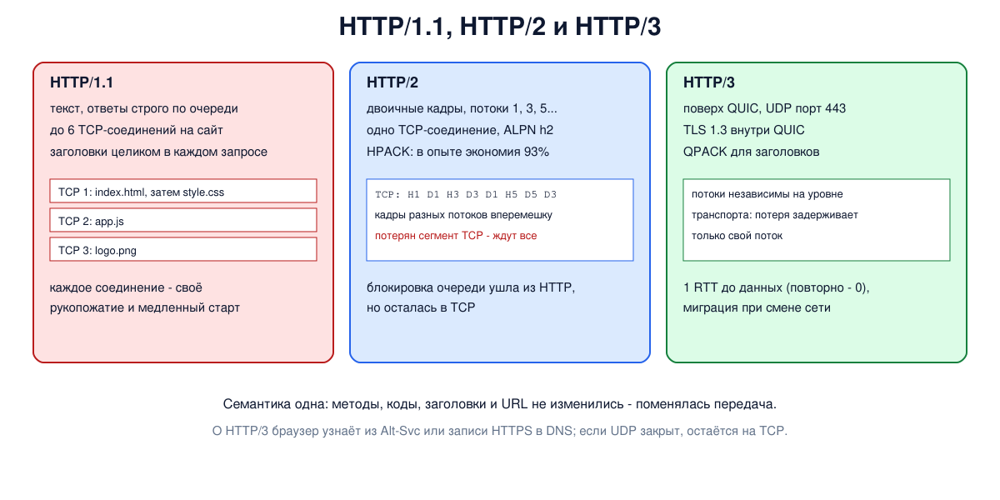

# Урок 76. HTTP/2 и HTTP/3

В уроке 75 мы видели, что HTTP/1.1 передаёт запросы по одному соединению строго по очереди, а заголовки - длинным текстом при каждом запросе. Современная страница - это десятки и сотни файлов, и эти ограничения стали узким местом. **HTTP/2** решил их внутри одного TCP-соединения, а **HTTP/3** перенёс HTTP на QUIC (урок 43), чтобы избавиться и от ограничений самого TCP. Смысл запросов при этом не изменился: те же методы, коды, заголовки и URL - поменялось только то, как они передаются.

## Чем плох HTTP/1.1

- **Блокировка очереди**: по одному соединению ответы идут строго в порядке запросов; медленный ответ задерживает все следующие (Таненбаум, разд. 7.3.4, с. 751-752, илл. 7.30). Конвейер этого не решает - он лишь не ждёт ответа перед следующим запросом.
- Поэтому браузеры открывали к одному сайту **по шесть соединений** (а с несколькими доменами и больше). Но каждое соединение отдельно проходит рукопожатие и медленный старт, а их контроль перегрузки конкурирует друг с другом (Таненбаум, с. 750).
- **Заголовки** повторяются в каждом запросе почти без изменений - `User-Agent`, `Accept`, длинные `Cookie` - и занимают сотни байт.

## HTTP/2

HTTP/2 вырос из протокола SPDY компании Google и стал стандартом в 2015 году (RFC 7540, сейчас RFC 9113) (Таненбаум, с. 750-751; Олифер, гл. 24, с. 772). Главное:

- **двоичные кадры** (frames) вместо текстовых строк: у каждого кадра длина, тип, флаги и номер **потока**. Типы кадров: `HEADERS` (заголовки), `DATA` (тело), `SETTINGS` (параметры соединения), `WINDOW_UPDATE` (управление потоком данных), `GOAWAY` (завершение) и другие;
- **потоки и мультиплексирование**: каждый запрос с ответом - отдельный поток со своим номером (запросы клиента - нечётные номера, служебные кадры соединения - поток 0). Кадры разных потоков перемежаются в одном TCP-соединении, и ответы приходят в удобном серверу порядке - блокировки очереди на уровне HTTP больше нет;
- **сжатие заголовков HPACK** (RFC 7541): обе стороны помнят уже переданные заголовки в таблице, и повторяющиеся (и самые частые - из встроенной таблицы) отправляются ссылкой в один-два байта, а новые - литералом, обычно сжатым кодом Хаффмана;
- **одно соединение** на сайт вместо шести, с общим контролем перегрузки.

Стандарт предусматривает ещё **проталкивание** (server push): сервер отправляет CSS и скрипты, не дожидаясь запроса (Таненбаум, с. 751). На практике оно чаще мешало, чем помогало, и Chrome и Firefox его отключили; вместо него используют ответ `103 Early Hints` (RFC 8297) - подсказку, что скоро понадобится.

Как клиент и сервер договариваются о версии? Внутри TLS - расширением **ALPN** (RFC 7301): клиент в рукопожатии перечисляет протоколы (`h2`, `http/1.1`), сервер выбирает один. Стандарт допускает HTTP/2 и без шифрования (`h2c`: клиент сразу начинает говорить по HTTP/2 - так в нашем опыте), но браузеры поддерживают HTTP/2 только поверх TLS (Таненбаум, с. 752).

## Что осталось: блокировка очереди в TCP

HTTP/2 убрал блокировку очереди на уровне HTTP, но не на уровне **TCP**: TCP доставляет байты строго по порядку, и если потерялся один сегмент, все потоки ждут его повторной передачи, даже те, чьи данные уже пришли. На сетях с потерями (мобильные) одно соединение HTTP/2 может работать хуже нескольких соединений HTTP/1.1.

## HTTP/3 поверх QUIC

**HTTP/3** (RFC 9114, 2022) работает поверх **QUIC** (RFC 9000) - транспорта на основе UDP, о котором шла речь в уроке 43 (Таненбаум, с. 655, 752-753):

- **потоки на уровне транспорта**: потеря пакета задерживает только те потоки, чьи данные в нём были, остальные продолжают идти;
- **TLS 1.3 встроен в QUIC**: установка соединения и шифрование - одно рукопожатие, новое соединение - за один круг передачи вместо двух у TCP + TLS, а повторное - даже без ожидания (0-RTT, урок 79);
- **шифруется почти всё**, включая большую часть служебных полей транспорта;
- **миграция соединения**: идентификатор соединения не зависит от IP-адреса и порта, поэтому при переходе телефона с Wi-Fi на мобильную сеть соединение продолжается;
- сжатие заголовков **QPACK** (RFC 9204) - вариант HPACK, рассчитанный на то, что потоки приходят не по порядку.

Как браузер узнаёт, что сайт умеет HTTP/3? Сервер сообщает об этом заголовком `Alt-Svc: h3=":443"` в ответе по HTTP/1.1 или HTTP/2 (тогда QUIC пробуется для следующих соединений) или записью HTTPS в DNS (урок 63, тогда сразу); если UDP блокируется, браузер остаётся на TCP. HTTP/3 используется только с шифрованием.



## Как это увидеть в Linux

Поднимем в пространстве имён `hbh-h2` сервер HTTP/2 `nghttpd` из пакета nghttp2 - поверх TLS (порт 8443, с самоподписанным сертификатом) и без шифрования, h2c (порт 8080), чтобы можно было разобрать кадры. Посмотрим на согласование ALPN, кадры и потоки клиентом `nghttp`, три файла в одном соединении и сжатие заголовков в `h2load`. Нужны Linux (подойдёт WSL2), права sudo, пакеты `nghttp2-server`, `nghttp2-client`, curl и openssl (`sudo apt install nghttp2-server nghttp2-client curl openssl`); всё создаётся в пространстве имён и во временном каталоге и удаляется в конце.

Создай файл `h2.sh` и запусти `bash h2.sh`:
```
set -u
NGHTTPD=$(command -v nghttpd || ls /opt/hbh-http/usr/sbin/nghttpd 2>/dev/null)
for c in "$NGHTTPD" nghttp h2load curl openssl; do
  [ -n "$c" ] && command -v "$c" >/dev/null || { echo "нужны nghttp2 и curl: sudo apt install nghttp2-server nghttp2-client curl openssl"; exit 1; }
done
ns=hbh-h2
sudo ip netns pids $ns 2>/dev/null | xargs -r sudo kill
sudo ip netns del $ns 2>/dev/null
d=$(mktemp -d); chmod 755 "$d"
sudo ip netns add $ns
N="sudo ip netns exec $ns"
$N ip link set lo up
mkdir "$d/www"
printf '<html><head><link rel="stylesheet" href="/style.css"><script src="/app.js"></script></head><body>Hop-by-Hop</body></html>\n' > "$d/www/index.html"
printf 'body { font-family: sans-serif; }\n' > "$d/www/style.css"
printf 'console.log("hello");\n' > "$d/www/app.js"
openssl req -x509 -newkey ec -pkeyopt ec_paramgen_curve:P-256 -nodes -days 1 -subj "/CN=lab" \
  -addext "subjectAltName=IP:127.0.0.1" -keyout "$d/key.pem" -out "$d/cert.pem" 2>/dev/null
# два сервера: HTTP/2 поверх TLS (порт 8443) и HTTP/2 без шифрования, h2c (порт 8080)
$N "$NGHTTPD" -d "$d/www" 8443 "$d/key.pem" "$d/cert.pem" >/dev/null 2>&1 &
$N "$NGHTTPD" -d "$d/www" --no-tls 8080 >/dev/null 2>&1 &
sleep 1
echo '--- 1. TLS negotiates the protocol with ALPN'
for a in h2,http/1.1 http/1.1; do
  printf '  client offers %-12s -> %s\n' "$a" "$(echo | $N openssl s_client -connect 127.0.0.1:8443 -alpn $a 2>/dev/null | grep -m1 -E 'ALPN')"
done
echo "  curl --http2: HTTP/$($N curl -s --cacert "$d/cert.pem" --http2 -o /dev/null -w '%{http_version}' https://127.0.0.1:8443/index.html)"
echo '--- 2. inside an HTTP/2 connection: frames and streams'
$N nghttp -nv --no-dep http://127.0.0.1:8080/index.html | grep -E '(send|recv) [A-Z_]+ frame' | sed -E 's/^\[ *[0-9.]+\] //; s/ frame <length=([0-9]+), flags=(0x[0-9a-f]+), stream_id=([0-9]+)>/  stream \3, \1 bytes, flags \2/; s/^/  /'
echo '--- 3. three files, one connection, three streams'
$N nghttp -nv --no-dep http://127.0.0.1:8080/index.html http://127.0.0.1:8080/style.css http://127.0.0.1:8080/app.js | grep -E 'send HEADERS frame' | grep -oE 'stream_id=[0-9]+' | tr '\n' ' ' | sed 's/^/  requests went as /; s/$/\n/'
echo '--- 4. header compression (HPACK): 100 requests over one connection'
$N h2load -n 100 -c 1 http://127.0.0.1:8080/index.html | grep -E 'requests:|traffic:' | sed -E 's/^ *//; s/^/  /'
echo '--- 5. HTTP/3 in this curl'
curl --version | grep -qi 'HTTP3' && echo '  curl supports HTTP/3' || echo '  this curl has no HTTP/3 support'
echo '--- cleanup'
sudo ip netns pids $ns 2>/dev/null | xargs -r sudo kill
sleep 0.3
sudo ip netns del $ns
rm -rf "$d"
ip netns list | grep -c "^$ns"
```

Вот что получилось на нашем сервере (размеры и порядок служебных кадров зависят от версии nghttp2):
```
--- 1. TLS negotiates the protocol with ALPN
  client offers h2,http/1.1  -> ALPN protocol: h2
  client offers http/1.1     -> No ALPN negotiated
  curl --http2: HTTP/2
--- 2. inside an HTTP/2 connection: frames and streams
  recv SETTINGS  stream 0, 6 bytes, flags 0x00
  send SETTINGS  stream 0, 12 bytes, flags 0x00
  send SETTINGS  stream 0, 0 bytes, flags 0x01
  send HEADERS  stream 1, 33 bytes, flags 0x05
  recv SETTINGS  stream 0, 0 bytes, flags 0x01
  recv HEADERS  stream 1, 92 bytes, flags 0x04
  recv DATA  stream 1, 122 bytes, flags 0x01
  send GOAWAY  stream 0, 8 bytes, flags 0x00
--- 3. three files, one connection, three streams
  requests went as stream_id=1 stream_id=3 stream_id=5 
--- 4. header compression (HPACK): 100 requests over one connection
  requests: 100 total, 100 started, 100 done, 100 succeeded, 0 failed, 0 errored, 0 timeout
  traffic: 14.85KB (15205) total, 1.15KB (1181) headers (space savings 93.29%), 11.91KB (12200) data
--- 5. HTTP/3 in this curl
  this curl has no HTTP/3 support
--- cleanup
0
```

Разберём.

**Шаг 1: ALPN.** Клиент `openssl s_client` предложил серверу `h2,http/1.1`, и сервер выбрал `h2`. Когда клиент предложил только `http/1.1`, протокол не согласован: наш `nghttpd` умеет только HTTP/2. Обычные веб-серверы в таком случае выбирают HTTP/1.1, и клиент работает по старой версии - так HTTP/2 внедрялся, ничего не ломая. `curl --http2` получил ответ по HTTP/2.

**Шаг 2: кадры.** Внутри одного соединения: обмен `SETTINGS` в потоке 0 (параметры соединения; кадр с флагом `0x01` - подтверждение), затем запрос - кадр `HEADERS` в потоке 1, всего 33 байта: заголовки запроса сжаты HPACK (клиент не обязан ждать подтверждения настроек: в другой версии nghttp запрос уходит раньше `SETTINGS` сервера). Ответ - `HEADERS` и `DATA` в том же потоке 1; флаг `0x01` у `DATA` - конец потока. В конце клиент закрывает соединение кадром `GOAWAY`. Флаги - битовая маска, их смысл зависит от типа кадра: у `SETTINGS` `0x01` - подтверждение, у `HEADERS` и `DATA` `0x01` - конец потока, у `HEADERS` ещё `0x04` - конец заголовков. У запроса `0x05` = `0x04` + `0x01`: заголовки целиком в одном кадре, а тела нет, поэтому клиент сразу закрывает свою сторону потока; у ответа `0x04` - заголовки закончились, дальше идёт тело. Ключ `--no-dep` в опыте отключает кадры `PRIORITY` старой схемы приоритетов, которую RFC 9113 объявил устаревшей.

**Шаг 3: потоки.** Три файла запрошены в одном соединении тремя потоками - 1, 3 и 5 (нечётные номера открывает клиент; в новом соединении нумерация снова началась бы с 1). В HTTP/1.1 для параллельной загрузки понадобилось бы три соединения.

**Шаг 4: HPACK.** `h2load` считает заголовки ответов, которые получил клиент: на 100 ответов ушло 1181 байт, на 93% меньше, чем занимали бы те же имена и значения без сжатия. Первый ответ занял 92 байта (как в шаге 2), а каждый следующий - всего около 11: одинаковые заголовки уходят ссылками на таблицу.

**Шаг 5: HTTP/3.** Наш curl собран без поддержки HTTP/3 (так в пакетах Ubuntu 24.04), поэтому проверить его в этом опыте не получится; в других сборках `curl --version` покажет HTTP3 в списке возможностей, а браузеры и многие крупные сайты HTTP/3 уже используют.

В конце `0`: пространство имён удалено.

## Безопасность

Отдельной темы безопасности у этого урока нет, но два наблюдения важны для следующих блоков:

- **версию протокола обычно можно определить**: список ALPN клиент передаёт в ClientHello открыто (урок 80; выбор сервера в TLS 1.3 зашифрован, но почти всегда угадывается), если не используется ECH (урок 82); HTTP/3 узнаётся по заголовкам пакетов QUIC (обычно UDP 443), а его первые пакеты защищены ключами, которые может вычислить любой наблюдатель (RFC 9001), поэтому их ClientHello виден так же, как в TCP; системы фильтрации трафика могут блокировать QUIC, вынуждая клиентов вернуться на TCP;
- **сложность протокола - это поверхность атаки**: в реализациях HTTP/2 находили уязвимости, позволяющие перегрузить сервер (например, быстрое открытие и отмена потоков в 2023 году). Защита - своевременные обновления серверов и прокси, а также ограничение частоты открытия и сброса потоков и служебных кадров: при превышении сервер закрывает соединение кадром `GOAWAY`.

## Итог

- HTTP/1.1 страдает от блокировки очереди, множества соединений и повторяющихся заголовков.
- HTTP/2: двоичные кадры, потоки в одном соединении, сжатие заголовков HPACK; версия согласуется расширением TLS ALPN; браузеры используют его только поверх TLS.
- Блокировка очереди осталась на уровне TCP: потеря одного сегмента задерживает все потоки.
- HTTP/3 работает поверх QUIC (UDP): независимые потоки, встроенный TLS 1.3, быстрое установление и миграция соединения, сжатие QPACK; о поддержке сообщают Alt-Svc и записи HTTPS в DNS.

## Что почитать

- Таненбаум, разд. 7.3.4, с. 750-753 (HTTP/2, HTTP/3) и разд. 6.6.1, с. 655 (QUIC). Утверждение, что HTTP/1.1 появился в 2007 году, неверно (1997-1999); QUIC - отдельный транспорт поверх UDP, а не "версия UDP"; надёжную доставку QUIC обеспечивает сам; для нового соединения нужен один круг передачи, ноль - только при повторном; HTTP/3 встроен в nginx с версии 1.25 (2023), а браузеры давно поддерживают QUIC.
- Олифер, гл. 24, с. 772: HTTP/2 и HTTP/3 кратко; утверждение, что HTTP/3 не стандартизован, устарело (RFC 9114, 2022).
- RFC 9113 (HTTP/2), RFC 7541 (HPACK), RFC 7301 (ALPN), RFC 9000 (QUIC), RFC 9001 (TLS в QUIC), RFC 9114 (HTTP/3), RFC 9204 (QPACK), RFC 7838 (Alt-Svc), RFC 9460 (запись HTTPS), RFC 8297 (103 Early Hints).
