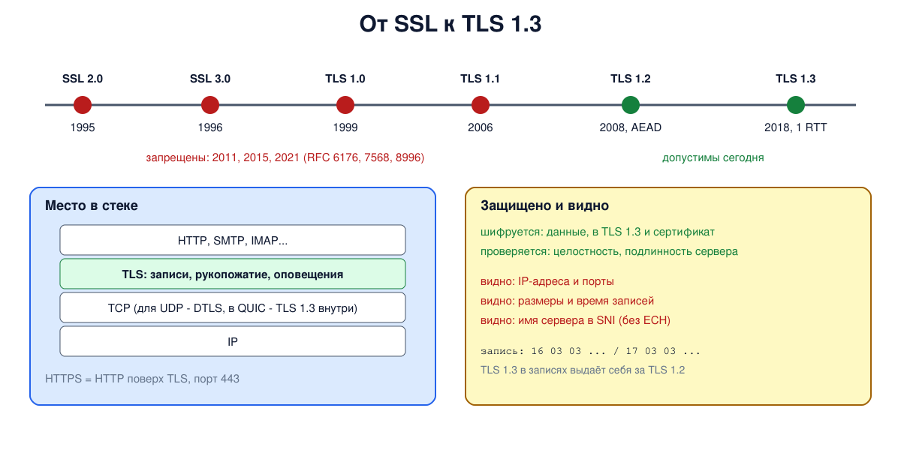

# Урок 77. История: SSL, TLS, место TLS в стеке

Мы видели, что открытый HTTP раскрывает всё (урок 75), и разобрали кирпичи криптографии (блок 8). **TLS** (Transport Layer Security) собирает их в протокол, который защищает HTTPS, почту, VPN и многие прокси-протоколы из блоков 10-11. В этом уроке - что TLS даёт, где он находится в стеке, как он развивался от SSL до TLS 1.3 и почему старые версии сегодня запрещены. Следующие уроки разберут рукопожатия TLS 1.2 и 1.3 по сообщениям.

## Что даёт TLS

TLS создаёт между двумя программами защищённый канал поверх ненадёжной и прослушиваемой сети (Ристич, гл. 1, с. 1-2; Таненбаум, разд. 8.12.3, с. 932):

- **конфиденциальность** - данные зашифрованы;
- **целостность** - любое изменение обнаруживается (сегодня - через AEAD, урок 69);
- **аутентификацию сервера** - клиент проверяет сертификат (урок 73) и знает, что говорит с настоящим сервером, а не с посредником; по желанию - и аутентификацию клиента;
- **согласование параметров** - версии, шифров, расширений.

Ристич (с. 2) называет и цели проекта: криптостойкость, совместимость реализаций, расширяемость (новые шифры добавляются без смены протокола) и эффективность.

## Место в стеке

TLS - отдельный слой между транспортом и приложением: он работает поверх TCP и под HTTP, SMTP, IMAP и другими протоколами (Таненбаум, с. 932, илл. 8.48; Ристич, с. 3). Приложение почти не меняется: HTTP поверх TLS - это **HTTPS**, обычно на порту 443. Для UDP есть вариант **DTLS**, а QUIC (урок 43) использует рукопожатие TLS 1.3 внутри себя (Ристич, с. 2, 4).

Внутри TLS - несколько протоколов:

- **протокол записей** (record) режет данные на записи до 16 КБ, шифрует и защищает их; у каждой записи заголовок: тип содержимого, версия, длина (Таненбаум, с. 934-935, илл. 8.50; состав заголовка - RFC 8446, разд. 5.1);
- **рукопожатие** (handshake) - согласование параметров, проверка сертификата, выработка ключей (уроки 78 и 79);
- **оповещения** (alert) - сообщения об ошибках и закрытии;
- **смена шифра** (change cipher spec) - в TLS 1.3 остался только для совместимости со старыми промежуточными устройствами.

Что TLS **не скрывает**: IP-адреса и порты (это заголовки ниже TLS), размеры и время передачи данных, имя сервера в поле **SNI** рукопожатия (урок 80; скрыть его может расширение ECH), а в версиях до 1.3 - и сертификат сервера.

## История

- **SSL 2.0** - Netscape, 1994-1995 (первая версия так и не вышла). Сделан почти без внешних экспертов и оказался со серьёзными слабостями (Ристич, с. 4; год - Таненбаум, с. 931).
- **SSL 3.0** - 1995-1996, новый дизайн, а не доработка SSL 2.0. Долго был самой распространённой версией.
- **TLS 1.0** - 1999, RFC 2246: SSL передали в IETF, а имя сменили. По сути это SSL 3.1.
- **TLS 1.1** - 2006, RFC 4346: в основном исправления безопасности.
- **TLS 1.2** - 2008, RFC 5246: аутентифицированное шифрование (AEAD), согласуемые хеш-функции вместо жёстко зашитых MD5 и SHA-1.
- **TLS 1.3** - 2018, RFC 8446: почти полная переделка - быстрее (рукопожатие за один круг), проще и без устаревших функций (Ристич, с. 4; Таненбаум, с. 935).



## Как это увидеть в Linux

Запустим в пространстве имён `hbh-tls77` сервер `openssl s_server` с настройками OpenSSL по умолчанию и попробуем подключиться клиентом с разными версиями протокола (клиенту разрешим всё, `@SECLEVEL=0`, чтобы решение принимал сервер). Посмотрим, какие наборы шифров предлагаются по умолчанию, заглянем в слой записей и проверим, что видит наблюдатель в рукопожатии TLS 1.3. Нужны Linux (подойдёт WSL2), права sudo, openssl и tcpdump (`sudo apt install openssl tcpdump`); всё создаётся в пространстве имён и во временном каталоге и удаляется в конце.

Создай файл `tls-versions.sh` и запусти `bash tls-versions.sh`:
```
set -u
for c in openssl tcpdump; do
  command -v "$c" >/dev/null || { echo "нужны openssl и tcpdump: sudo apt install openssl tcpdump"; exit 1; }
done
ns=hbh-tls77
sudo ip netns pids $ns 2>/dev/null | xargs -r sudo kill
sudo ip netns del $ns 2>/dev/null
d=$(mktemp -d); chmod 755 "$d"
sudo ip netns add $ns
N="sudo ip netns exec $ns"
$N ip link set lo up
openssl req -x509 -newkey ec -pkeyopt ec_paramgen_curve:P-256 -nodes -days 1 -subj "/CN=www.corp.lab" \
  -addext "subjectAltName=DNS:www.corp.lab" -keyout "$d/key.pem" -out "$d/cert.pem" 2>/dev/null
chmod 644 "$d/key.pem"
# сервер с настройками OpenSSL по умолчанию
$N openssl s_server -quiet -accept 4433 -cert "$d/cert.pem" -key "$d/key.pem" -www >/dev/null 2>&1 &
sleep 1
cl() { echo | $N openssl s_client -connect 127.0.0.1:4433 "$@" 2>&1; }
echo "--- 1. which versions the default settings agree to ($(openssl version | cut -d' ' -f1-2))"
for v in -ssl3 -tls1 -tls1_1 -tls1_2 -tls1_3; do
  r=$(cl -servername www.corp.lab $v -cipher 'DEFAULT:@SECLEVEL=0' | grep -m1 -ioE 'Protocol *: *TLSv[0-9.]+|New, TLSv[0-9.]+|unknown option|no protocols available|unsupported protocol|alert protocol version|wrong version number' | sed -E 's/Protocol *: */Protocol: /; s/New, /Protocol: /')
  printf '  client %-8s -> %s\n' "$v" "${r:-handshake failed}"
done
echo '--- 2. what is offered by default: TLS 1.3 suites and the TLS 1.2 list'
openssl ciphers -s -tls1_3 | tr ':' '\n' | sed 's/^/  TLS 1.3: /'
echo "  TLS 1.2 suites allowed by default: $(openssl ciphers -s -tls1_2 | tr ':' '\n' | grep -vc '^TLS_')"
echo "    of them CBC (not AEAD): $(openssl ciphers -v -s -tls1_2 | grep -v '^TLS_' | grep -vcE 'GCM|CHACHA|CCM')"
echo "    of them with RSA key exchange, no forward secrecy: $(openssl ciphers -v -s -tls1_2 | grep -v '^TLS_' | grep -c 'Kx=RSA')"
echo '--- 3. the record layer: the first bytes of each record'
cl -servername www.corp.lab -tls1_3 -msg | grep -A1 'RecordHeader' | grep -vE 'RecordHeader|^--' | awk '{print $1, $2, $3}' | sort | uniq -c \
  | awk '{ t = ($2 == "14") ? "change cipher spec" : ($2 == "15") ? "alert" : ($2 == "16") ? "handshake" : "application data"; printf "  %s %s %s  %-18s x%s\n", $2, $3, $4, t, $1 }'
echo '--- 4. what an observer sees in a TLS 1.3 handshake'
$N tcpdump -i lo -nn -U --immediate-mode -w "$d/tls.pcap" 'tcp port 4433' 2>/dev/null &
tp=$!; sleep 1
cl -tls1_3 -servername secret-project.corp.lab >/dev/null
sleep 1; sudo kill $tp; sleep 0.5
echo "  server name (SNI) in clear text: $(grep -a -m1 -o 'secret-project[a-z.]*' "$d/tls.pcap")"
echo "  the certificate name visible:    $(grep -a -o 'www.corp.lab' "$d/tls.pcap" | wc -l) times (TLS 1.3 encrypts the certificate)"
$N tcpdump -i lo -nn -U --immediate-mode -w "$d/tls12.pcap" 'tcp port 4433' 2>/dev/null &
tp=$!; sleep 1
cl -tls1_2 -noservername >/dev/null
sleep 1; sudo kill $tp; sleep 0.5
echo "  the same with TLS 1.2, no SNI:   $(grep -a -o 'www.corp.lab' "$d/tls12.pcap" | wc -l) times (the certificate goes in clear)"
echo '--- cleanup'
sudo ip netns pids $ns 2>/dev/null | xargs -r sudo kill
sleep 0.3
sudo ip netns del $ns
rm -rf "$d"
ip netns list | grep -c "^$ns"
```

Вот что получилось на нашем сервере (число записей с данными зависит от версии OpenSSL):
```
--- 1. which versions the default settings agree to (OpenSSL 3.0.13)
  client -ssl3    -> Unknown option
  client -tls1    -> alert protocol version
  client -tls1_1  -> alert protocol version
  client -tls1_2  -> Protocol: TLSv1.2
  client -tls1_3  -> Protocol: TLSv1.3
--- 2. what is offered by default: TLS 1.3 suites and the TLS 1.2 list
  TLS 1.3: TLS_AES_256_GCM_SHA384
  TLS 1.3: TLS_CHACHA20_POLY1305_SHA256
  TLS 1.3: TLS_AES_128_GCM_SHA256
  TLS 1.2 suites allowed by default: 27
    of them CBC (not AEAD): 16
    of them with RSA key exchange, no forward secrecy: 6
--- 3. the record layer: the first bytes of each record
  14 03 03  change cipher spec x2
  16 03 01  handshake          x1
  16 03 03  handshake          x1
  17 03 03  application data   x9
--- 4. what an observer sees in a TLS 1.3 handshake
  server name (SNI) in clear text: secret-project.corp.lab
  the certificate name visible:    0 times (TLS 1.3 encrypts the certificate)
  the same with TLS 1.2, no SNI:   3 times (the certificate goes in clear)
--- cleanup
0
```

Разберём.

**Шаг 1: версии.** SSL 3.0 даже не попытался: в современных сборках OpenSSL его просто нет, и клиент не знает такого ключа (`Unknown option`). TLS 1.0 и 1.1 сервер отверг сообщением `protocol version`: настройки по умолчанию в OpenSSL 3 и в Ubuntu их не допускают, хотя клиенту мы разрешили всё. Согласовались только TLS 1.2 и 1.3. Так выглядит защита "по умолчанию": администратору не нужно ничего делать, чтобы старые версии были выключены.

**Шаг 2: наборы шифров.** В TLS 1.3 набор определяет только AEAD-шифр и хеш: AES-256-GCM, ChaCha20-Poly1305, AES-128-GCM (ещё два набора с AES-CCM по умолчанию выключены). Обмен ключами и подпись согласуются отдельно. Для TLS 1.2 по умолчанию разрешено 27 наборов - старый формат, где в имени перечислено всё сразу. И среди них не только хорошие: 16 наборов используют CBC, а не AEAD, и 6 - обмен ключами через RSA без прямой секретности. Значения по умолчанию рассчитаны на совместимость, поэтому для TLS 1.2 администратор сужает список сам (ниже, в защите).

**Шаг 3: слой записей.** Каждая запись начинается с типа содержимого и версии: `16` - рукопожатие, `17` - данные приложения, `14` - смена шифра. Версия в записи почти везде `03 03`, то есть TLS 1.2, хотя соединение - TLS 1.3, а в самой первой записи клиента - `03 01`. Это сделано намеренно: старые промежуточные устройства (файерволы, балансировщики) ломались на незнакомых номерах версий, поэтому TLS 1.3 "притворяется" TLS 1.2, а настоящую версию сообщает в расширении рукопожатия. После ServerHello почти всё идёт как `17` - даже зашифрованная часть самого рукопожатия.

**Шаг 4: что видит наблюдатель.** Имя `secret-project.corp.lab`, которое клиент указал в SNI, лежит в записанном трафике открытым текстом. А имени из сертификата сервера `www.corp.lab` в трафике нет ни разу: в TLS 1.3 сертификат передаётся уже зашифрованным. Для сравнения то же соединение по TLS 1.2 (без SNI, чтобы считать только сертификат): имя встречается 3 раза - сертификат идёт открытым текстом.

В конце `0`: пространство имён удалено.

## Безопасность: почему SSL и ранние TLS запрещены

Принцип: **протокол безопасности стареет**: слабости находят и в шифрах, и в самом устройстве протокола, а поддержка старой версии позволяет противнику на пути заставить стороны договориться о самой слабой из общих (атаки отката). Поэтому старые версии не "чуть хуже", а опасны, пока остаются включёнными.

Что было не так (на уровне идей):

- **SSL 2.0** - слабая проверка целостности на MD5, экспортные шифры с 40-битными ключами (они остались и в SSL 3.0, Таненбаум, с. 932), нет защиты рукопожатия от подмены; запрещён в 2011 году (RFC 6176). Даже включённая поддержка SSL 2.0 на сервере с тем же ключом ставила под угрозу его соединения по TLS (DROWN, 2016);
- **SSL 3.0** - набивка в режиме CBC не проверяется и не защищена MAC (POODLE, 2014) и подверженность откату; запрещён в 2015 году (RFC 7568);
- **TLS 1.0 и 1.1** - предсказуемый вектор инициализации в CBC (BEAST, 2011, для TLS 1.0), зависимость от MD5 и SHA-1, нет AEAD; запрещены в 2021 году (RFC 8996), браузеры отключили их в 2020 году;
- **RC4** - потоковый шифр со слабыми ключами (Таненбаум, с. 935) и статистическими смещениями в выходе, запрещён в TLS отдельно (RFC 7465).

Как защищаться:

- **оставлять на серверах только TLS 1.2 и 1.3** (а где возможно - только 1.3);
- **для TLS 1.2 - только AEAD-наборы с обменом ECDHE** (прямая секретность, урок 72), без CBC, RC4, 3DES и SHA-1;
- **не включать старые версии "для совместимости"**: клиентов, которым они нужны, лучше обновить, а не ослаблять сервер для всех;
- **регулярно обновлять** OpenSSL и серверы и проверять свои настройки (например, тем же `openssl s_client` с разными версиями, как в опыте).

## Итог

- TLS даёт конфиденциальность, целостность, аутентификацию сервера и согласование параметров; работает между транспортом и приложением (HTTPS - HTTP поверх TLS, порт 443).
- Внутри TLS - протокол записей, рукопожатие, оповещения и смена шифра.
- IP-адреса, порты, размеры и время, SNI (без ECH) остаются видны; в TLS 1.3 сертификат шифруется.
- SSL 2.0 и 3.0 (1995-1996), TLS 1.0 (1999), 1.1 (2006), 1.2 (2008), 1.3 (2018); всё, что старше 1.2, запрещено.
- Записи TLS 1.3 выдают себя за TLS 1.2 ради совместимости с промежуточными устройствами.

## Что почитать

- Таненбаум, разд. 8.12.3, с. 931-935: SSL, место в стеке, установление соединения, передача данных, TLS. Утверждение, что TLS шифрует SNI, неточно: в TLS 1.3 SNI идёт открыто, скрыть его может только ECH; "март 2018" для TLS 1.3 - одобрение IETF, RFC 8446 вышел в августе; RFC 5246 - это TLS 1.2, а TLS 1.0 - RFC 2246.
- Ристич, "Bulletproof TLS and PKI", гл. 1, с. 1-4: цели TLS, место в стеке, история протокола.
- RFC 8446 (TLS 1.3), RFC 5246 (TLS 1.2), RFC 6176, 7568, 8996 (запрет SSL 2.0, SSL 3.0, TLS 1.0 и 1.1), RFC 7465 (запрет RC4).
