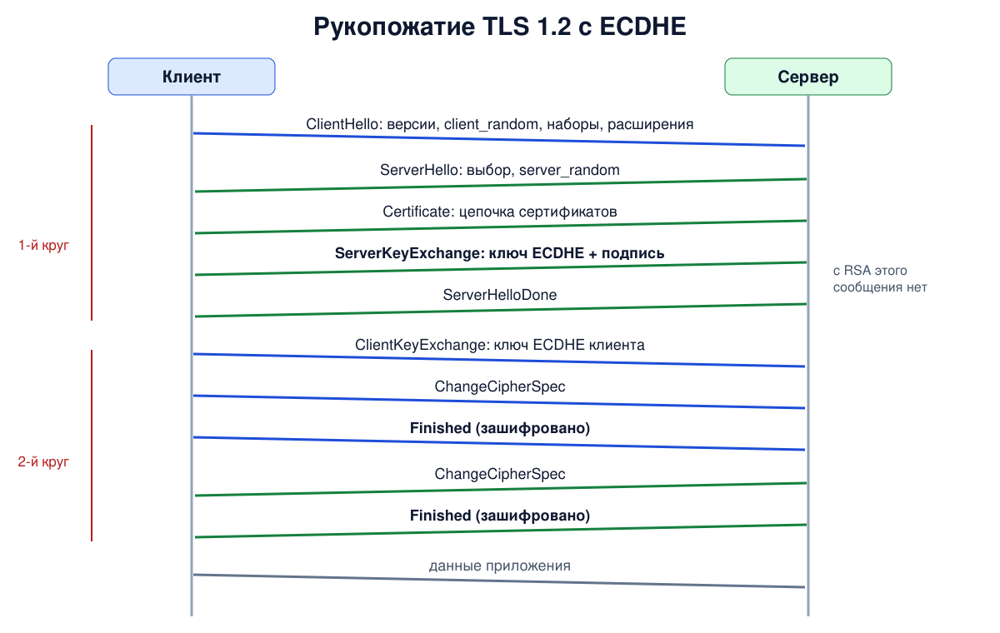

# Урок 78. Рукопожатие TLS 1.2

В прошлом уроке мы увидели TLS снаружи: версии, слой записей, что остаётся открытым. Теперь разберём **рукопожатие TLS 1.2** по сообщениям: как клиент и сервер договариваются о параметрах, как клиент убеждается, что говорит с владельцем сертификата, и как из открытого обмена получаются общие секретные ключи. TLS 1.2 до сих пор широко используется, а его устройство помогает понять, что и зачем изменили в TLS 1.3 (урок 79).

## Задачи рукопожатия

За несколько сообщений стороны должны:

- **договориться о параметрах** - версии, наборе шифров, расширениях;
- **аутентифицировать сервер** - проверить его сертификат (урок 73) и убедиться, что собеседник владеет закрытым ключом этого сертификата;
- **выработать общий секрет**, которого не знает наблюдатель на пути, и получить из него ключи шифрования;
- **проверить, что рукопожатие никто не подменил**: противник на пути мог бы, например, вычеркнуть сильные шифры из списка клиента.

## Сообщения по порядку

Полное рукопожатие с обменом ключами ECDHE (урок 72) выглядит так (RFC 5246, разд. 7.3; RFC 8422 для эллиптических кривых):

1. **ClientHello** - клиент сообщает старшую версию, которую умеет, 32 случайных байта **client_random**, список наборов шифров в порядке предпочтения и расширения: имя сервера (SNI, урок 80), поддерживаемые группы (кривые), алгоритмы подписи, ALPN и другие.
2. **ServerHello** - сервер выбирает версию и один набор шифров и присылает свои 32 случайных байта **server_random**.
3. **Certificate** - цепочка сертификатов сервера.
4. **ServerKeyExchange** - временный (эфемерный) открытый ключ ECDHE сервера и выбранная кривая, **подписанные закрытым ключом сертификата**. Подпись охватывает и оба случайных числа, поэтому её нельзя переиграть в другом соединении. Именно эта подпись доказывает, что сервер владеет закрытым ключом сертификата, а не просто переслал чужой сертификат.
5. **ServerHelloDone** - сервер закончил свою часть (в рукопожатии могут быть ещё CertificateStatus с ответом OCSP - сразу после Certificate - и CertificateRequest перед ServerHelloDone, если сервер просит сертификат клиента).
6. **ClientKeyExchange** - временный открытый ключ ECDHE клиента. Теперь обе стороны вычисляют один и тот же общий секрет (pre-master secret), а наблюдатель, видевший оба открытых ключа, - нет.
7. **ChangeCipherSpec** - клиент объявляет: дальше мои записи зашифрованы. Формально это не сообщение рукопожатия, а отдельный протокол (свой тип записи, 20), поэтому в хеш для Finished оно не входит.
8. **Finished** - первое зашифрованное сообщение клиента: 12 байт, вычисленных из главного секрета и хеша **всех предыдущих сообщений рукопожатия**. Сервер проверяет его и тем самым убеждается, что обе стороны видели одно и то же рукопожатие и получили одинаковые ключи.
9. Сервер отвечает своими **ChangeCipherSpec** и **Finished** (перед ними может идти NewSessionTicket - билет для быстрого возобновления сессии, урок 81).

Только после этого идут данные приложения. Выходит **два круга передачи** (2-RTT) до первого байта данных - ещё один довод в пользу TLS 1.3, где круг один.



Таненбаум (разд. 8.12.3, с. 932-934, илл. 8.49) разбирает упрощённое рукопожатие SSL из девяти сообщений - с вариантом обмена через RSA, о котором ниже.

## Откуда берутся ключи

- Из общего секрета ECDHE (pre-master secret) стороны получают **главный секрет** (master secret) длиной 48 байт. В исходной схеме RFC 5246 (разд. 8.1) в его вычисление входят client_random и server_random, а в современной - **хеш сообщений рукопожатия от ClientHello до ClientKeyExchange включительно** (расширение extended master secret, RFC 7627; случайные числа входят в этот хеш). Второй вариант привязывает секрет к конкретному рукопожатию и закрывает класс атак, где противник сводит два разных соединения к одному секрету.
- Из главного секрета функция PRF (на основе HMAC с хешем набора, SHA-256 или SHA-384) "растягивает" **блок ключей**: отдельные ключи шифрования и части nonce для каждого направления (для старых наборов с CBC - ещё и ключи MAC). Клиент и сервер шифруют разными ключами.

## Обмен через RSA: без прямой секретности

В старом варианте нет ServerKeyExchange: клиент сам выбирает pre-master secret из 48 байт (2 байта версии и 46 случайных), **шифрует их открытым ключом из сертификата сервера** и отправляет в ClientKeyExchange (у Таненбаума - сообщение 5 на илл. 8.49). Сервер расшифровывает их своим закрытым ключом.

Проблема в том, что всё держится на долговременном ключе сервера. Кто однажды запишет трафик, а через год получит закрытый ключ (утечка, изъятие, взлом), тот расшифрует все записанные сессии. У ECDHE временные ключи живут одно рукопожатие и потом забываются: утечка ключа сертификата позволяет выдавать себя за сервер в будущем, но не открывает прошлое. Это и есть **прямая секретность** (forward secrecy, урок 72). В TLS 1.3 обмен через RSA убран совсем.

## Как это увидеть в Linux

Запустим в пространстве имён `hbh-tls78` два сервера `openssl s_server`: один с сертификатом на ключе ECDSA (обмен ECDHE), другой с сертификатом на ключе RSA, которому разрешён только набор `AES128-GCM-SHA256` с обменом через RSA. Клиент `openssl s_client -trace` знает ключи и печатает каждое сообщение рукопожатия: свои до шифрования, серверные после расшифровки; из этого вывода оставим только названия. Затем посмотрим согласованные параметры, запишем секреты в журнал ключей и проверим, что из рукопожатия видно наблюдателю. Нужны Linux (подойдёт WSL2), права sudo, openssl и tcpdump (`sudo apt install openssl tcpdump`); всё создаётся в пространстве имён и во временном каталоге и удаляется в конце.

Создай файл `tls12-handshake.sh` и запусти `bash tls12-handshake.sh`:
```
set -u
for c in openssl tcpdump; do
  command -v "$c" >/dev/null || { echo "нужны openssl и tcpdump: sudo apt install openssl tcpdump"; exit 1; }
done
ns=hbh-tls78
sudo ip netns pids $ns 2>/dev/null | xargs -r sudo kill
sudo ip netns del $ns 2>/dev/null
d=$(mktemp -d); chmod 755 "$d"
sudo ip netns add $ns
N="sudo ip netns exec $ns"
$N ip link set lo up
# два сертификата: с ключом ECDSA (для ECDHE-ECDSA) и с ключом RSA (для обмена через RSA)
openssl req -x509 -newkey ec -pkeyopt ec_paramgen_curve:P-256 -nodes -days 1 -subj "/CN=www.corp.lab" \
  -addext "subjectAltName=DNS:www.corp.lab" -keyout "$d/ec.key" -out "$d/ec.crt" 2>/dev/null
openssl req -x509 -newkey rsa:2048 -nodes -days 1 -subj "/CN=rsa.corp.lab" \
  -addext "subjectAltName=DNS:rsa.corp.lab" -keyout "$d/rsa.key" -out "$d/rsa.crt" 2>/dev/null
$N openssl s_server -quiet -accept 4433 -cert "$d/ec.crt" -key "$d/ec.key" -www >/dev/null 2>&1 &
$N openssl s_server -quiet -accept 4434 -cert "$d/rsa.crt" -key "$d/rsa.key" -cipher 'AES128-GCM-SHA256' -www >/dev/null 2>&1 &
sleep 1
msgs() {   # msgs порт набор: последовательность сообщений рукопожатия
  echo | $N openssl s_client -connect 127.0.0.1:$1 -tls1_2 -cipher "$2" -trace 2>/dev/null \
    | awk '/^Sent( TLS)? Record/ { who = "client" } /^Received( TLS)? Record/ { who = "server" }
           /Content Type = ChangeCipherSpec/ { printf "  %s -> ChangeCipherSpec\n", who }
           /^    [A-Za-z]+, Length=/ { n = $1; sub(/,/, "", n); sub(/.*=/, "", $2)
             printf "  %s -> %s%s\n", who, n, (n == "Finished" ? " (" $2 " bytes)" : "") }'
}
echo '--- 1. a full TLS 1.2 handshake with ECDHE'
msgs 4433 'ECDHE-ECDSA-AES128-GCM-SHA256'
echo '--- 2. the same with RSA key exchange (no forward secrecy)'
msgs 4434 'AES128-GCM-SHA256'
echo '--- 3. the negotiated parameters'
echo | $N openssl s_client -connect 127.0.0.1:4433 -tls1_2 2>/dev/null | grep -E '^ +(Protocol|Cipher) +:|Temp Key|signature type|Extended master secret' \
  | sed -E 's/^ */  /; s/(Server|Peer) Temp Key/Temp Key/; s/Peer signature type/Signature/' | sort -u
echo '--- 4. the secrets: client_random and the master secret in the key log'
echo | $N openssl s_client -connect 127.0.0.1:4433 -tls1_2 -keylogfile "$d/keys.log" >/dev/null 2>&1
grep '^CLIENT_RANDOM' "$d/keys.log" | awk '{ printf "  %s client_random=%s... master_secret=%s... (%d bytes)\n", $1, substr($2, 1, 16), substr($3, 1, 16), length($3) / 2 }'
echo '--- 5. what an observer sees: the TLS 1.2 handshake is not encrypted'
$N tcpdump -i lo -nn -U --immediate-mode -w "$d/tls12.pcap" 'tcp port 4433' 2>/dev/null &
tp=$!; sleep 1
echo | $N openssl s_client -connect 127.0.0.1:4433 -tls1_2 -noservername >/dev/null 2>&1   # без SNI: считаем только сертификат
sleep 1; sudo kill $tp; sleep 0.5
echo "  certificate name in the capture: $(grep -a -o 'www.corp.lab' "$d/tls12.pcap" | wc -l) times"
echo '--- cleanup'
sudo ip netns pids $ns 2>/dev/null | xargs -r sudo kill
sleep 0.3
sudo ip netns del $ns
rm -rf "$d"
ip netns list | grep -c "^$ns"
```

Вот что получилось на нашем сервере (случайные значения в шаге 4 каждый раз свои):
```
--- 1. a full TLS 1.2 handshake with ECDHE
  client -> ClientHello
  server -> ServerHello
  server -> Certificate
  server -> ServerKeyExchange
  server -> ServerHelloDone
  client -> ClientKeyExchange
  client -> ChangeCipherSpec
  client -> Finished (12 bytes)
  server -> NewSessionTicket
  server -> ChangeCipherSpec
  server -> Finished (12 bytes)
--- 2. the same with RSA key exchange (no forward secrecy)
  client -> ClientHello
  server -> ServerHello
  server -> Certificate
  server -> ServerHelloDone
  client -> ClientKeyExchange
  client -> ChangeCipherSpec
  client -> Finished (12 bytes)
  server -> NewSessionTicket
  server -> ChangeCipherSpec
  server -> Finished (12 bytes)
--- 3. the negotiated parameters
  Cipher    : ECDHE-ECDSA-AES256-GCM-SHA384
  Extended master secret: yes
  Protocol  : TLSv1.2
  Signature: ECDSA
  Temp Key: X25519, 253 bits
--- 4. the secrets: client_random and the master secret in the key log
  CLIENT_RANDOM client_random=fbc2bdcdaab3bcbf... master_secret=992894aadc9e5812... (48 bytes)
--- 5. what an observer sees: the TLS 1.2 handshake is not encrypted
  certificate name in the capture: 3 times
--- cleanup
0
```

Разберём.

**Шаг 1: полное рукопожатие с ECDHE.** Ровно та последовательность, что описана выше: ClientHello, четыре сообщения сервера, затем ClientKeyExchange, ChangeCipherSpec и Finished клиента, и в ответ ChangeCipherSpec и Finished сервера. Перед ChangeCipherSpec сервер прислал NewSessionTicket (RFC 5077, урок 81). Finished у обеих сторон - 12 байт, как и положено в TLS 1.2. Finished мы видим только потому, что клиент знает ключи: свой Finished он печатает до шифрования, серверный после расшифровки. После ChangeCipherSpec каждой стороны её записи уже зашифрованы. NewSessionTicket идёт ещё до ChangeCipherSpec сервера, то есть открыто, но сам билет (внутри него главный секрет сессии) сервер зашифровал своим ключом.

**Шаг 2: обмен через RSA.** Сообщения **ServerKeyExchange нет**: серверу нечего подписывать, временного ключа нет. В ClientKeyExchange клиент отправил pre-master secret, зашифрованный ключом из сертификата. Остальное совпадает. В опыте мы задали набор явно, но и без этого OpenSSL 3 его допускает (урок 77: такие наборы есть в списке по умолчанию), поэтому выключать его - задача администратора.

**Шаг 3: согласованные параметры.** Без ограничений клиент и сервер выбрали `ECDHE-ECDSA-AES256-GCM-SHA384`. Имя набора TLS 1.2 читается по частям: обмен ключами ECDHE, подпись ECDSA (ключ сертификата), шифр AES-256 в режиме GCM, хеш SHA-384 для PRF. `Temp Key: X25519` - кривая, на которой был временный ключ ECDHE. `Extended master secret: yes` - главный секрет привязан к хешу рукопожатия (RFC 7627). Формат строки с подписью зависит от версии OpenSSL: в OpenSSL 3.5 там `ecdsa_secp256r1_sha256`.

**Шаг 4: секреты.** С ключом `-keylogfile` клиент записывает строку `CLIENT_RANDOM`: случайное число клиента (по нему находят соединение) и главный секрет - 48 байт. Это формат журнала ключей, который понимает Wireshark: с ним можно расшифровать записанный трафик этого соединения (урок 83). Мы печатаем только начало значений.

**Шаг 5: что видит наблюдатель.** Клиент подключился без SNI, чтобы в трафике было только имя из сертификата. `www.corp.lab` нашлось 3 раза: в имени владельца, в имени издателя (сертификат самоподписанный) и в расширении SAN. В TLS 1.2 всё до ChangeCipherSpec идёт открытым текстом, и сертификат может прочитать любой на пути; в TLS 1.3 его не было видно ни разу (урок 77).

В конце `0`: пространство имён удалено.

## Безопасность: что защищает рукопожатие и что его ослабляет

Принцип: **рукопожатие защищено целиком, только если проверяются все его части**. Подпись в ServerKeyExchange связывает временный ключ с сертификатом, Finished - весь ход переговоров с общими ключами, а проверка сертификата - ключ с именем сервера. Выпадает любое звено - и посредник может встать посередине или навязать слабые параметры. Отдельно стоит вопрос, что будет при утечке ключа сервера: с обменом через RSA она раскрывает и прошлый трафик.

Как защищаться:

- **только наборы с ECDHE** (или DHE с достаточной группой) и AEAD: прямая секретность и никакого обмена через RSA;
- **extended master secret** (RFC 7627) и безопасное повторное согласование (RFC 5746): современные библиотеки поддерживают и предлагают их по умолчанию; важно не отключать их и обновлять старые библиотеки и устройства, которые их не умеют;
- **клиент всегда проверяет сертификат и имя** - без этого вся криптография рукопожатия ничего не гарантирует (урок 73);
- **ключи билетов сессий регулярно меняют** (или отключают билеты): внутри билета лежит главный секрет сессии, поэтому утечка ключа билетов раскрывает все сессии, для которых им выдавались билеты, и исходные, и возобновлённые: прямая секретность сводится к сроку жизни этого ключа;
- **журнал ключей - секрет**: файл `-keylogfile` или переменная `SSLKEYLOGFILE` открывают весь трафик; их используют только для отладки на своих стендах и удаляют после;
- **закрытый ключ сервера хранят как самое ценное**: права доступа, а где возможно - аппаратные модули;
- где клиенты позволяют, **переходить на TLS 1.3**, где всё это встроено в протокол.

## Итог

- Рукопожатие TLS 1.2: ClientHello, ServerHello, Certificate, ServerKeyExchange, ServerHelloDone, ClientKeyExchange, ChangeCipherSpec и Finished с обеих сторон; два круга передачи до данных.
- Подпись в ServerKeyExchange доказывает владение закрытым ключом сертификата; Finished (12 байт) подтверждает, что рукопожатие не подменено.
- Главный секрет (48 байт) получается из общего секрета и случайных чисел или хеша рукопожатия (extended master secret); из него - ключи для каждого направления.
- Обмен через RSA не даёт прямой секретности: утечка ключа сервера раскрывает записанный трафик. ECDHE её даёт.
- В TLS 1.2 сертификат идёт открыто, а журнал ключей позволяет расшифровать сессию.

## Что почитать

- Таненбаум, разд. 8.12.3, с. 932-934, илл. 8.49: упрощённое рукопожатие SSL с обменом через RSA. Подготовительный ключ в 384 бита - те же 48 байт pre-master secret.
- RFC 5246 (TLS 1.2), разд. 7.3-7.4 (рукопожатие) и 8.1 (главный секрет); RFC 8422 (ECDHE и ECDSA в TLS 1.2); RFC 7627 (extended master secret); RFC 5077 (билеты сессий).
- Ристич, "Bulletproof TLS and PKI", гл. 3 "TLS 1.2": протокол записей, рукопожатие, обмен ключами.
