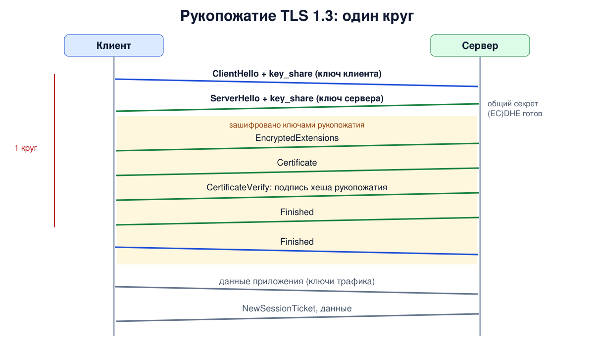
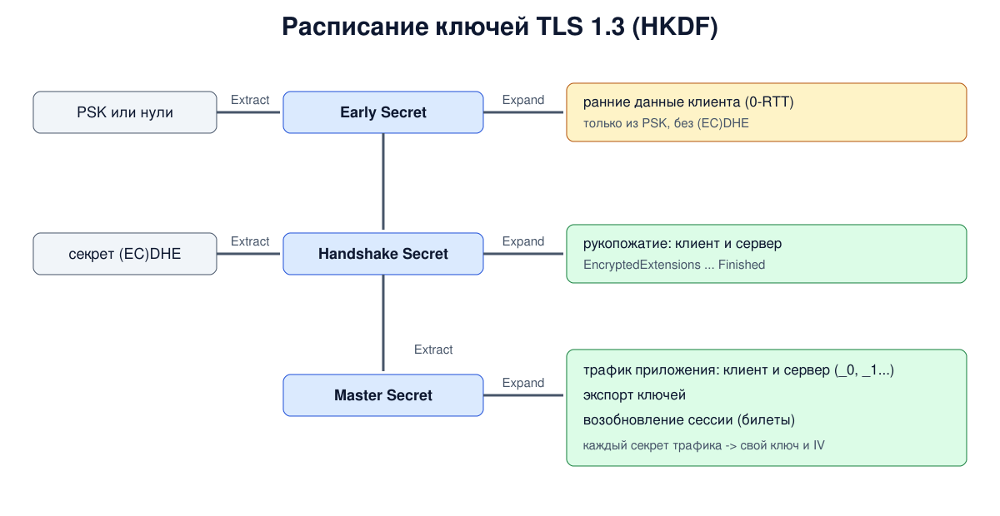

# Урок 79. TLS 1.3: рукопожатие, расписание ключей, 0-RTT

В прошлом уроке мы разобрали рукопожатие TLS 1.2: два круга передачи, сертификат открытым текстом и вариант обмена через RSA без прямой секретности. **TLS 1.3** (RFC 8446, 2018) переделал протокол: рукопожатие за один круг, всё после ServerHello зашифровано, а из протокола убрано всё, что оказалось слабым. В этом уроке - рукопожатие TLS 1.3 по сообщениям, расписание ключей (key schedule) и режим 0-RTT, где данные идут уже в первом пакете клиента, со своими рисками.

## Что изменилось по сравнению с TLS 1.2

Главное (RFC 8446, разд. 1.2; о запрете повторного согласования - разд. 4.1.2):

- **убрано**: обмен ключами через RSA и статический DH, шифры не-AEAD (CBC, RC4), сжатие, повторное согласование, произвольные группы DH; ChangeCipherSpec остался только для совместимости;
- **обмен ключами** - всегда эфемерный (EC)DHE или заранее известный ключ (PSK), обычно вместе с (EC)DHE, поэтому прямая секретность есть по умолчанию (в режиме только PSK, без (EC)DHE, её нет; урок 81);
- **наборы шифров** задают только AEAD и хеш (урок 77): в RFC 8446 их пять, OpenSSL по умолчанию включает три;
- **всё после ServerHello шифруется**, включая сертификат;
- **полное рукопожатие - за один круг** (1-RTT), а при возобновлении сессии данные можно отправить сразу (0-RTT);
- **ключи выводятся через HKDF** - функцию выработки ключей на основе HMAC (уроки 70 и 72) по строгому расписанию, а не одной функцией PRF;
- **версия согласуется в расширении** supported_versions, а в заголовках записей стоит 03 03 (кроме первого ClientHello, где часто 03 01; урок 77).

## Рукопожатие по сообщениям

1. **ClientHello** - как и раньше, случайное число, наборы шифров и расширения: поддерживаемые версии, группы, алгоритмы подписи, SNI, ALPN. Главная новинка - расширение **key_share**: клиент **угадывает** группу и сразу отправляет свой открытый ключ (EC)DHE. Именно это экономит круг передачи: серверу не нужно сначала сообщать параметры.
2. **ServerHello** - выбранный набор и ключ сервера в key_share. После этого сообщения обе стороны вычисляют общий секрет (EC)DHE и получают **ключи рукопожатия**. Всё дальнейшее зашифровано (кроме ChangeCipherSpec для совместимости).
3. **EncryptedExtensions** - расширения, не нужные для выработки ключей (например, выбранный ALPN).
4. **Certificate** - цепочка сертификатов (перед ним может быть CertificateRequest).
5. **CertificateVerify** - подпись закрытым ключом сертификата над **хешем всех сообщений рукопожатия до этого момента** (transcript hash). В TLS 1.2 подписывались только параметры DH и случайные числа; теперь подпись покрывает весь ход переговоров.
6. **Finished** сервера - HMAC над хешем рукопожатия. Сразу после него сервер уже может отправлять данные.
7. **Finished** клиента. После него клиент отправляет данные - через **один круг** после начала.

После рукопожатия сервер присылает один или несколько **NewSessionTicket** - билеты для возобновления сессии (урок 81).

Если клиент угадал группу неверно (сервер не поддерживает ни одну из групп в key_share, но поддерживает другую из списка supported_groups), сервер отвечает **HelloRetryRequest** с нужной группой, и клиент повторяет ClientHello. Это стоит лишнего круга.



## Расписание ключей

TLS 1.3 выводит ключи цепочкой HKDF (RFC 8446, разд. 7.1): шаг **Extract** смешивает новый секретный материал, шаг **Expand** с меткой и хешем рукопожатия выводит отдельный секрет для каждой цели.

- **Early Secret** - из PSK (при возобновлении) или из нулей. Из него - секрет для ранних данных 0-RTT.
- **Handshake Secret** - Early Secret плюс общий секрет (EC)DHE. Из него - **секреты рукопожатия** клиента и сервера: ими шифруются сообщения от EncryptedExtensions до Finished.
- **Master Secret** - следующий шаг цепочки. Из него - **секреты трафика** приложения клиента и сервера, секрет для экспорта ключей другим протоколам и секрет для возобновления сессии.

Из каждого секрета трафика выводятся уже сами ключ и IV для AEAD. У каждого направления и каждой стадии свои ключи, а метки и хеш рукопожатия привязывают их к конкретному соединению. Длина секретов равна длине выхода хеша набора: 32 байта для SHA-256, 48 для SHA-384. Секреты трафика можно обновлять прямо в соединении сообщением KeyUpdate.



## 0-RTT: ранние данные

Если у клиента есть билет от прошлой сессии и сервер разрешил в нём ранние данные, клиент может отправить данные приложения **прямо вместе с ClientHello** - ещё до ответа сервера. Они шифруются ключом, выведенным из PSK этого билета и хеша ClientHello, без (EC)DHE. Цена такого ускорения (RFC 8446, разд. 2.3 и 8):

- **ранние данные можно повторить**: TLS не гарантирует, что ранние данные не будут приняты сервером ещё раз, в другом соединении, - в отличие от остальных данных;
- **у ранних данных нет прямой секретности** относительно ключа билетов: они защищены только PSK.

## Как это увидеть в Linux

Запустим в пространстве имён `hbh-tls79` три сервера `openssl s_server`: обычный, сервер, который знает только группу P-256, и сервер, принимающий ранние данные (`-early_data`). Клиент `openssl s_client -trace` знает ключи и печатает каждое сообщение рукопожатия; оставим названия сообщений и группы в key_share. Затем посмотрим секреты расписания ключей в журнале и попробуем 0-RTT. Нужны Linux (подойдёт WSL2), права sudo и openssl; всё создаётся в пространстве имён и во временном каталоге и удаляется в конце.

Создай файл `tls13.sh` и запусти `bash tls13.sh`:
```
set -u
command -v openssl >/dev/null || { echo "нужен openssl: sudo apt install openssl"; exit 1; }
ns=hbh-tls79
sudo ip netns pids $ns 2>/dev/null | xargs -r sudo kill
sudo ip netns del $ns 2>/dev/null
d=$(mktemp -d); chmod 755 "$d"
sudo ip netns add $ns
N="sudo ip netns exec $ns"
$N ip link set lo up
openssl req -x509 -newkey ec -pkeyopt ec_paramgen_curve:P-256 -nodes -days 1 -subj "/CN=www.corp.lab" \
  -addext "subjectAltName=DNS:www.corp.lab" -keyout "$d/ec.key" -out "$d/ec.crt" 2>/dev/null
# 4433 - обычный сервер, 4434 - знает только группу P-256, 4435 - принимает ранние данные (0-RTT)
$N openssl s_server -quiet -accept 4433 -cert "$d/ec.crt" -key "$d/ec.key" -www >/dev/null 2>&1 &
$N openssl s_server -quiet -accept 4434 -cert "$d/ec.crt" -key "$d/ec.key" -groups P-256 -www >/dev/null 2>&1 &
sleep 60 | $N openssl s_server -accept 4435 -cert "$d/ec.crt" -key "$d/ec.key" -early_data >/dev/null 2>&1 &
sleep 1
cl() { (sleep 1; echo) | $N openssl s_client -connect 127.0.0.1:$1 -tls1_3 "${@:2}" 2>/dev/null; }
msgs() {   # сообщения рукопожатия и группа в key_share по выводу -trace
  awk '/^Sent( TLS)? Record/ { who = "client" } /^Received( TLS)? Record/ { who = "server" }
       /Content Type = ChangeCipherSpec/ { printf "  %s -> ChangeCipherSpec (compatibility)\n", who }
       /^    [A-Za-z]+, Length=/ { n = $1; sub(/,/, "", n); ks = 0; printf "  %s -> %s\n", who, n }
       /extension_type=/ { ks = /key_share/
         if (ks && n == "ServerHello" && /length=2$/) print "       it is a HelloRetryRequest: the server asks for another group" }
       ks && /NamedGroup:/ { g = $0; sub(/.*NamedGroup: /, "", g); printf "       key_share: %s\n", g }'
}
echo '--- 1. a full TLS 1.3 handshake'
cl 4433 -trace | msgs
echo '--- 2. the client guessed the wrong group'
cl 4434 -groups X25519:P-256 -trace | msgs | head -11
echo '--- 3. the key schedule: secrets in the key log'
cl 4433 -keylogfile "$d/keys.log" >/dev/null
grep -v '^#' "$d/keys.log" | awk '{ printf "  %-32s %d bytes\n", $1, length($3) / 2 }'
echo '--- 4. 0-RTT: resume the session and send a request in the first flight'
cl 4435 -sess_out "$d/sess.pem" >/dev/null
printf 'GET / HTTP/1.0\r\n\r\n' > "$d/early.txt"
cl 4435 -sess_in "$d/sess.pem" -early_data "$d/early.txt" | grep -E '^(New|Reused),|^Early data' | sed 's/^/  /'
echo '--- 5. the same ticket with early data once more'
cl 4435 -sess_in "$d/sess.pem" -early_data "$d/early.txt" | grep -E '^(New|Reused),|^Early data' | sed 's/^/  /'
echo '--- cleanup'
sudo ip netns pids $ns 2>/dev/null | xargs -r sudo kill
sleep 0.3
sudo ip netns del $ns
rm -rf "$d"
ip netns list | grep -c "^$ns"
```

Вот что получилось на нашем сервере (OpenSSL 3.0.13):
```
--- 1. a full TLS 1.3 handshake
  client -> ClientHello
       key_share: ecdh_x25519 (29)
  server -> ServerHello
       key_share: ecdh_x25519 (29)
  server -> ChangeCipherSpec (compatibility)
  server -> EncryptedExtensions
  server -> Certificate
  server -> CertificateVerify
  server -> Finished
  client -> ChangeCipherSpec (compatibility)
  client -> Finished
  server -> NewSessionTicket
  server -> NewSessionTicket
--- 2. the client guessed the wrong group
  client -> ClientHello
       key_share: ecdh_x25519 (29)
  server -> ServerHello
       it is a HelloRetryRequest: the server asks for another group
       key_share: secp256r1 (P-256) (23)
  client -> ChangeCipherSpec (compatibility)
  client -> ClientHello
       key_share: secp256r1 (P-256) (23)
  server -> ChangeCipherSpec (compatibility)
  server -> ServerHello
       key_share: secp256r1 (P-256) (23)
--- 3. the key schedule: secrets in the key log
  SERVER_HANDSHAKE_TRAFFIC_SECRET  48 bytes
  EXPORTER_SECRET                  48 bytes
  SERVER_TRAFFIC_SECRET_0          48 bytes
  CLIENT_HANDSHAKE_TRAFFIC_SECRET  48 bytes
  CLIENT_TRAFFIC_SECRET_0          48 bytes
--- 4. 0-RTT: resume the session and send a request in the first flight
  Reused, TLSv1.3, Cipher is TLS_AES_256_GCM_SHA384
  Early data was accepted
--- 5. the same ticket with early data once more
  New, TLSv1.3, Cipher is TLS_AES_256_GCM_SHA384
  Early data was rejected
--- cleanup
0
```

Разберём.

**Шаг 1: полное рукопожатие.** Клиент отправил ClientHello с ключом на кривой X25519, сервер ответил ServerHello с ключом на той же кривой - и дальше пошли EncryptedExtensions, Certificate, CertificateVerify и Finished сервера, а затем Finished клиента. Это и есть один круг. Сообщения после ServerHello зашифрованы ключами рукопожатия; мы видим их только потому, что клиент печатает расшифрованное. ChangeCipherSpec с обеих сторон - тот самый режим совместимости с промежуточными устройствами (RFC 8446, прил. D.4): шифрование он не включает. Два NewSessionTicket - OpenSSL по умолчанию выдаёт два билета.

В WSL с OpenSSL 3.5 картина другая: клиент отправил **два** ключа - `X25519MLKEM768` и `ecdh_x25519`, а сервер выбрал первый. Это **гибридная постквантовая группа**: общий секрет - это секреты ML-KEM-768 (урок 72) и X25519, записанные подряд. Даже если когда-нибудь квантовый компьютер взломает X25519, записанный сегодня трафик останется защищён ML-KEM. OpenSSL 3.5 включил её по умолчанию; так же поступили современные браузеры.

**Шаг 2: неверная догадка.** Клиент знает X25519 и P-256, но ключ отправил только для X25519. Сервер знает только P-256 и отвечает сообщением, которое `-trace` называет ServerHello, но в его key_share нет ключа, только имя группы: это **HelloRetryRequest** (формально - ServerHello со специальным значением random). Клиент повторяет ClientHello, теперь с ключом P-256, и рукопожатие продолжается. ChangeCipherSpec сервер отправил сразу после HelloRetryRequest, а в выводе он стоит позже только потому, что клиент прочитал его уже после отправки второго ClientHello. Цена - лишний круг передачи, поэтому клиенты отправляют ключи для самых распространённых групп.

**Шаг 3: расписание ключей.** В журнале ключей не один главный секрет, как в TLS 1.2, а пять: секреты рукопожатия клиента и сервера, секреты трафика приложения (`_0` - первое поколение; после KeyUpdate идут следующие, в журнал они не пишутся) и секрет экспорта. Все по 48 байт: согласован тот же набор по умолчанию, что виден в шагах 4 и 5 (настройки шифров у всех трёх серверов одинаковые), `TLS_AES_256_GCM_SHA384`, а длина секрета равна выходу SHA-384.

**Шаг 4: 0-RTT.** Первое соединение получило билет (`-sess_out`). Второе возобновило сессию по билету (`Reused`) и отправило запрос `GET /` в первом же пакете - сервер его принял (`Early data was accepted`).

**Шаг 5: тот же билет ещё раз.** Сервер не принял ни билет, ни ранние данные: соединение пошло полным рукопожатием (`New`), а ранние данные отклонены. Это **защита от повтора** в OpenSSL: по умолчанию сервер с включёнными ранними данными делает каждый билет одноразовым, и повторная попытка, даже без ранних данных, идёт полным рукопожатием. Отклонённые ранние данные приложение отправляет заново уже обычным образом, после рукопожатия.

В конце `0`: пространство имён удалено.

## Безопасность: повтор ранних данных

Принцип: **ранние данные 0-RTT могут прийти на сервер больше одного раза**. Обычные данные нельзя перенести в другое соединение: их ключи зависят от случайного вклада сервера. Ключ ранних данных выводится только из PSK и ClientHello, ещё до ответа сервера, поэтому тот же ClientHello с ранними данными сервер может принять повторно, как новое соединение (RFC 8446, разд. 2.3 и 8). Если запрос что-то меняет (платёж, заказ, изменение настроек), его повтор - это повтор действия. Кроме того, ранние данные защищены только ключом билетов, без прямой секретности.

Как защищаться:

- **не включать 0-RTT без необходимости**: во многих серверах (например, nginx) он выключен по умолчанию;
- **разрешать в ранних данных только безопасные, идемпотентные запросы**: чтение страницы можно повторить, платёж - нет;
- **для HTTP - механизм RFC 8470**: прокси помечает ранние запросы заголовком `Early-Data: 1`, а сервер приложения может ответить `425 Too Early`, и клиент повторит запрос после рукопожатия;
- **включать защиту от повтора на сервере**: одноразовые билеты, запоминание уже виденных ClientHello, проверка свежести билета (RFC 8446, разд. 8);
- **регулярно менять ключи билетов**, чтобы ограничить, сколько трафика зависит от одного ключа.

## Итог

- TLS 1.3: только AEAD и эфемерный обмен ключами, всё после ServerHello зашифровано, рукопожатие за один круг.
- Клиент сразу отправляет ключ в key_share; при неверной догадке - HelloRetryRequest и лишний круг.
- CertificateVerify подписывает хеш всего рукопожатия, Finished подтверждает его HMAC.
- Расписание ключей: Early, Handshake, Master Secret через HKDF; свои секреты для рукопожатия, трафика каждого направления, экспорта и возобновления.
- 0-RTT отправляет данные в первом пакете, но их можно повторить; разрешать только для идемпотентных запросов и с защитой от повтора на сервере.
- Новые версии OpenSSL и браузеры по умолчанию используют гибридную постквантовую группу X25519MLKEM768.

## Что почитать

- Ристич, "Bulletproof TLS and PKI", гл. 2 "TLS 1.3": рукопожатие, HelloRetryRequest, хеш рукопожатия, расписание ключей, 0-RTT и повтор.
- RFC 8446 (TLS 1.3): разд. 2 (обзор и 0-RTT), 4 (сообщения), 7.1 (расписание ключей), 8 (защита от повтора), прил. D.4 (совместимость с промежуточными устройствами); RFC 8470 (ранние данные в HTTP).
- Таненбаум, разд. 8.12.3, с. 935: о TLS 1.3 - одна фраза, а утверждение о шифровании SNI неверно (урок 77).
