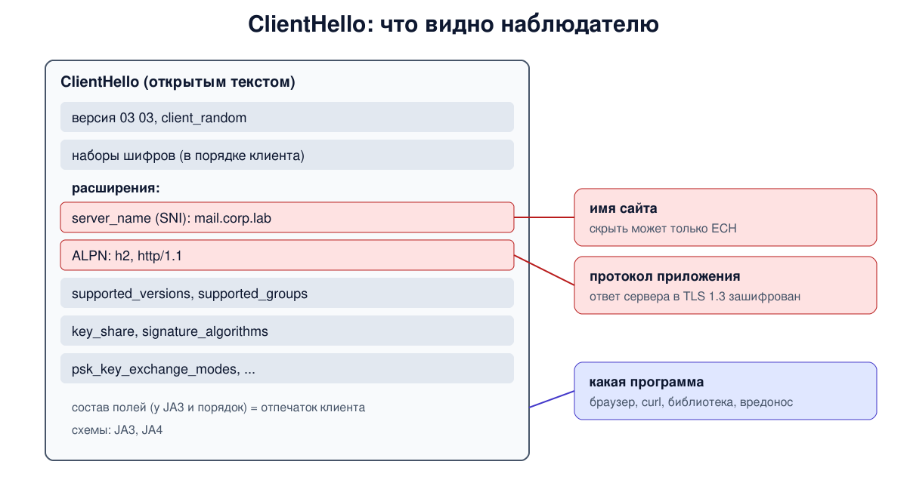

# Урок 80. SNI, ALPN, расширения, наборы шифров

В уроках 78 и 79 мы прошли рукопожатия TLS по сообщениям. Теперь посмотрим внимательнее на самое информативное из них - **ClientHello**. В нём клиент говорит, к какому сайту идёт (SNI), каким протоколом приложения хочет пользоваться (ALPN), какие версии, группы, подписи и наборы шифров умеет. Всё это идёт открытым текстом, и это же - главный источник сведений для систем анализа трафика.

## Расширения

С 2003 года (RFC 3546, ещё для TLS 1.0) в конец ClientHello и ServerHello можно добавлять **расширения** (extensions): тип, длина, данные; в основную спецификацию они вошли в TLS 1.2. Так протокол растёт без смены версии - в TLS 1.3 через расширения согласуется почти всё, даже сама версия. Главные (список для TLS 1.3 - RFC 8446, разд. 4.2; SNI - RFC 6066):

- **server_name (SNI)** - имя сервера, к которому идёт клиент;
- **application_layer_protocol_negotiation (ALPN)** - список протоколов приложения;
- **supported_versions** - версии TLS (урок 77);
- **supported_groups** и **key_share** - группы для обмена ключами и сами ключи (урок 79);
- **signature_algorithms** - какими подписями клиент готов проверять сертификат и CertificateVerify;
- **psk_key_exchange_modes**, **pre_shared_key**, **early_data** - возобновление и 0-RTT (уроки 79 и 81);
- **extended_master_secret**, **encrypt_then_mac**, **session_ticket**, **ec_point_formats** - для TLS 1.2 (урок 78; каждое описано в своём RFC).

Незнакомые расширения сервер обязан просто пропускать. Чтобы серверы не ломались на новых значениях, Chrome и другие клиенты на BoringSSL добавляют в ClientHello случайные "пустышки" из зарезервированных значений - в том числе среди расширений, наборов шифров, групп, версий (**GREASE**, RFC 8701; серверам это тоже разрешено): неправильная реализация, которая на них спотыкается, обнаруживается сразу, а не в день выхода нового расширения.

## SNI: несколько сайтов на одном адресе

На одном IP-адресе часто живут десятки сайтов. В HTTP имя сайта есть в заголовке Host (урок 75), но он приходит уже **внутри** TLS, а сертификат сервер должен выбрать **до** этого. Поэтому клиент сообщает имя в расширении **SNI** (Server Name Indication, RFC 6066, разд. 3), и сервер выбирает по нему сертификат и настройки сайта. Если имя незнакомо, сервер отдаёт сертификат сайта по умолчанию или обрывает рукопожатие.

Если клиент отправил SNI (при подключении по IP-адресу его нет), оно идёт в ClientHello **открытым текстом** во всех версиях TLS, включая 1.3. Скрыть его может только **ECH** (Encrypted Client Hello, урок 82): внешний ClientHello несёт общее публичное имя фронтального сервера (обычно провайдера), а настоящий зашифрован его открытым ключом, опубликованным в DNS (запись HTTPS).

## ALPN: какой протокол пойдёт внутри

**ALPN** (RFC 7301) решает задачу из урока 76: как на одном порту 443 договориться о HTTP/2 или HTTP/1.1, не тратя лишнего круга. Клиент перечисляет протоколы в порядке предпочтения (`h2`, `http/1.1`), сервер выбирает один и сообщает его в ответе: в TLS 1.2 - в ServerHello открыто, в TLS 1.3 - в зашифрованном EncryptedExtensions. Если общего протокола нет, RFC 7301 предписывает оборвать рукопожатие оповещением `no_application_protocol`.



## Наборы шифров

Список наборов клиент тоже передаёт в ClientHello, в порядке своих предпочтений, а сервер выбирает один (урок 77: в TLS 1.3 набор задаёт только AEAD и хеш, в TLS 1.2 - всё сразу). Чей порядок главнее, решает сервер: по умолчанию OpenSSL берёт первый подходящий **из списка клиента**, а с настройкой предпочтения сервера (`-serverpref`, в nginx `ssl_prefer_server_ciphers on`) - первый подходящий **из своего списка**. Предпочтение сервера полезно, когда в списке TLS 1.2 есть наборы разного качества; клиенту же оставляют выбор, когда все наборы сильные (например, ChaCha20 быстрее на устройствах без аппаратного AES).

## Как это увидеть в Linux

Запустим в пространстве имён `hbh-tls80` сервер `openssl s_server` с двумя сертификатами (`www.corp.lab` и, по SNI, `mail.corp.lab`) и списком ALPN `h2,http/1.1`, а также два сервера TLS 1.2 - с порядком наборов клиента и с `-serverpref`. Проверим выбор сертификата по SNI, согласование ALPN, перечислим расширения ClientHello и посмотрим, что из них видно в записанном трафике. Нужны Linux (подойдёт WSL2), права sudo, openssl и tcpdump (`sudo apt install openssl tcpdump`); всё создаётся в пространстве имён и во временном каталоге и удаляется в конце.

Создай файл `client-hello.sh` и запусти `bash client-hello.sh`:
```
set -u
for c in openssl tcpdump; do
  command -v "$c" >/dev/null || { echo "нужны openssl и tcpdump: sudo apt install openssl tcpdump"; exit 1; }
done
ns=hbh-tls80
sudo ip netns pids $ns 2>/dev/null | xargs -r sudo kill
sudo ip netns del $ns 2>/dev/null
d=$(mktemp -d); chmod 755 "$d"
sudo ip netns add $ns
N="sudo ip netns exec $ns"
$N ip link set lo up
mk() {   # mk имя: самоподписанный сертификат ECDSA для имени
  openssl req -x509 -newkey ec -pkeyopt ec_paramgen_curve:P-256 -nodes -days 1 -subj "/CN=$1" \
    -addext "subjectAltName=DNS:$1" -keyout "$d/$1.key" -out "$d/$1.crt" 2>/dev/null
}
mk www.corp.lab; mk mail.corp.lab
# 4433: два сайта на одном адресе (выбор сертификата по SNI) и ALPN h2 и http/1.1
$N openssl s_server -quiet -accept 4433 -cert "$d/www.corp.lab.crt" -key "$d/www.corp.lab.key" \
  -servername mail.corp.lab -cert2 "$d/mail.corp.lab.crt" -key2 "$d/mail.corp.lab.key" \
  -alpn h2,http/1.1 -www >/dev/null 2>&1 &
# 4434 и 4435: TLS 1.2, порядок наборов по выбору клиента и по выбору сервера
$N openssl s_server -quiet -accept 4434 -cert "$d/www.corp.lab.crt" -key "$d/www.corp.lab.key" -www >/dev/null 2>&1 &
$N openssl s_server -quiet -accept 4435 -cert "$d/www.corp.lab.crt" -key "$d/www.corp.lab.key" -serverpref -www >/dev/null 2>&1 &
sleep 1
cl() { echo | $N openssl s_client -connect 127.0.0.1:$1 "${@:2}" 2>/dev/null; }
echo '--- 1. SNI: one address, two certificates'
for name in www.corp.lab mail.corp.lab other.corp.lab; do
  printf '  SNI %-15s -> certificate %s\n' "$name" "$(cl 4433 -servername $name | grep -m1 -oE 'subject=.*' | sed -E 's/subject= ?//; s/CN ?= ?//')"
done
echo '--- 2. ALPN: the client offers, the server chooses'
for offer in h2,http/1.1 http/1.1 spdy/3; do
  printf '  client offers %-12s -> %s\n' "$offer" "$(cl 4433 -alpn $offer | grep -m1 -E '^ALPN|^No ALPN' )"
done
echo '--- 3. the ClientHello extensions (all of them go in clear text)'
cl 4433 -servername www.corp.lab -alpn h2,http/1.1 -trace \
  | awk '/ClientHello, Length=/ { on = 1 } /ServerHello, Length=/ { on = 0 }
         on && /extension_type=/ { sub(/^ */, ""); sub(/\(.*/, ""); sub(/extension_type=/, ""); printf "  %s\n", $0 }'
echo '--- 4. what an observer reads in the capture'
$N tcpdump -i lo -nn -U --immediate-mode -w "$d/hello.pcap" 'tcp port 4433' 2>/dev/null &
tp=$!; sleep 1
cl 4433 -servername mail.corp.lab -alpn h2,http/1.1 >/dev/null
sleep 1; sudo kill $tp; sleep 0.5
for s in mail.corp.lab h2 http/1.1; do
  printf '  %-14s occurrences in the capture: %s\n' "$s" "$(grep -a -o -F "$s" "$d/hello.pcap" | wc -l)"
done
echo '--- 5. TLS 1.2 cipher suites: whose order wins'
want='ECDHE-ECDSA-CHACHA20-POLY1305:ECDHE-ECDSA-AES256-GCM-SHA384'
echo "  client order: $want"
echo "  default server         -> $(cl 4434 -tls1_2 -cipher $want | grep -m1 -oE 'Cipher is .*' | cut -d' ' -f3)"
echo "  server with -serverpref -> $(cl 4435 -tls1_2 -cipher $want | grep -m1 -oE 'Cipher is .*' | cut -d' ' -f3)"
echo '--- cleanup'
sudo ip netns pids $ns 2>/dev/null | xargs -r sudo kill
sleep 0.3
sudo ip netns del $ns
rm -rf "$d"
ip netns list | grep -c "^$ns"
```

Вот что получилось на нашем сервере (OpenSSL 3.0.13):
```
--- 1. SNI: one address, two certificates
  SNI www.corp.lab    -> certificate www.corp.lab
  SNI mail.corp.lab   -> certificate mail.corp.lab
  SNI other.corp.lab  -> certificate www.corp.lab
--- 2. ALPN: the client offers, the server chooses
  client offers h2,http/1.1  -> ALPN protocol: h2
  client offers http/1.1     -> ALPN protocol: http/1.1
  client offers spdy/3       -> No ALPN negotiated
--- 3. the ClientHello extensions (all of them go in clear text)
  server_name
  ec_point_formats
  supported_groups
  session_ticket
  application_layer_protocol_negotiation
  encrypt_then_mac
  extended_master_secret
  signature_algorithms
  supported_versions
  psk_key_exchange_modes
  key_share
--- 4. what an observer reads in the capture
  mail.corp.lab  occurrences in the capture: 1
  h2             occurrences in the capture: 1
  http/1.1       occurrences in the capture: 1
--- 5. TLS 1.2 cipher suites: whose order wins
  client order: ECDHE-ECDSA-CHACHA20-POLY1305:ECDHE-ECDSA-AES256-GCM-SHA384
  default server         -> ECDHE-ECDSA-CHACHA20-POLY1305
  server with -serverpref -> ECDHE-ECDSA-AES256-GCM-SHA384
--- cleanup
0
```

Разберём.

**Шаг 1: SNI.** На одном адресе и порту сервер отдал разные сертификаты: для `mail.corp.lab` - свой, для `www.corp.lab` - свой. На незнакомое имя `other.corp.lab` сервер ответил сертификатом по умолчанию, `www.corp.lab` (с опцией `-servername_fatal` s_server оборвал бы рукопожатие оповещением `unrecognized_name`; по TLS 1.2 без неё он прислал бы такое оповещение уровня warning, а в TLS 1.3 таких оповещений нет). Так любой, кто подключится с произвольным SNI или без него, узнает, какой сайт на сервере главный; ниже - как этого избежать.

**Шаг 2: ALPN.** Клиент предложил `h2,http/1.1` - сервер выбрал `h2`; предложил только `http/1.1` - выбран он. На `spdy/3`, которого сервер не знает, `openssl s_server` не оборвал рукопожатие, а просто продолжил без ALPN (`No ALPN negotiated`) - так устроен этот тестовый сервер. Строгая реализация по RFC 7301 ответила бы оповещением `no_application_protocol`.

**Шаг 3: расширения ClientHello.** Клиент OpenSSL 3.0 отправил 11 расширений: имя сервера, ALPN, группы и ключи, алгоритмы подписи, версии, режимы PSK и несколько расширений для TLS 1.2. Клиент OpenSSL 3.5 в WSL добавил ещё два: `renegotiate` (OpenSSL 3.0 сообщает ту же поддержку RFC 5746 особым значением в списке наборов шифров) и `compress_certificate` (сжатие сертификата, RFC 8879). Состав расширений у каждой программы свой, порядок обычно тоже, но Chrome перемешивает его в каждом соединении.

**Шаг 4: что видит наблюдатель.** В записанном трафике имя `mail.corp.lab` из SNI и оба предложенных протокола ALPN лежат открытым текстом. Сертификат при этом зашифрован (по умолчанию договорились о TLS 1.3, уроки 77 и 79), но имя сайта и так известно из SNI. Двухбуквенное `h2` в принципе может случайно совпасть с байтами шифротекста, поэтому при повторных запусках счётчик иногда больше.

**Шаг 5: чей порядок наборов.** Клиент поставил первым ChaCha20. Сервер по умолчанию согласился с ним, а сервер с `-serverpref` выбрал AES-256-GCM - он стоит раньше в его собственном списке.

В конце `0`: пространство имён удалено.

## Безопасность: что видит DPI в ClientHello

Принцип: **ClientHello - открытая визитка соединения**. Из неё наблюдатель на пути без всякой расшифровки узнаёт:

- **имя сайта** из SNI (и чаще всего ещё раньше - из запроса DNS, урок 67);
- **протокол приложения** из ALPN (h2, http/1.1, а в QUIC - h3: там ClientHello защищён ключами, которые может вычислить любой наблюдатель, урок 76);
- **какая программа подключается**: состав версий, шифров, групп и расширений, а у многих программ и их порядок (поэтому JA4 сортирует списки), у браузера, у curl, у библиотеки на Python или у вредоносной программы различаются. Такой **отпечаток** (fingerprint; известные схемы - JA3 и JA4) системы анализа трафика используют, чтобы классифицировать соединения, а защитники - чтобы находить вредоносные клиенты в своей сети. Подробнее - в уроке 88.

Как защищаться:

- **приватность пользователей**: шифровать DNS (урок 67) и включать ECH там, где его поддерживают и клиент, и сервер (урок 82); без обоих мер имя сайта видно;
- **на серверах не выдавать лишнего по SNI**: для незнакомых имён настроить отдельный сервер по умолчанию, который обрывает рукопожатие (в nginx `ssl_reject_handshake on`) или отдаёт нейтральный сертификат, - иначе произвольным SNI можно узнать главный сайт сервера;
- **не считать SNI доказательством**: это просто слово клиента; проверку обеспечивает сертификат, а на уровне HTTP приложение должно сверять Host со своими сайтами;
- **для TLS 1.2 - предпочтение сервера** и только сильные наборы (урок 77);
- **защитникам сети**: собирать SNI и отпечатки ClientHello в журналы (Zeek, Suricata, урок 60) - по ним видно необычные клиенты и обращения к подозрительным именам.

## Итог

- Расширения - механизм роста TLS; незнакомые пропускаются, GREASE держит реализации честными.
- SNI сообщает имя сервера открыто, сервер выбирает по нему сертификат; скрыть имя может только ECH.
- ALPN согласует протокол приложения: клиент предлагает список, сервер выбирает один.
- Набор шифров выбирается по порядку клиента или, с настройкой, сервера.
- ClientHello раскрывает имя сайта, протокол и "почерк" программы-клиента.

## Что почитать

- Ристич, "Bulletproof TLS and PKI", гл. 2 "TLS 1.3", разделы Extensions и Cipher Suites; гл. 3 "TLS 1.2", раздел Extensions: ALPN, Server Name Indication.
- RFC 6066 (SNI и другие расширения), RFC 7301 (ALPN), RFC 8446 разд. 4.2 (расширения TLS 1.3), RFC 8701 (GREASE), RFC 8879 (сжатие сертификатов).
- Документация nginx: директивы `ssl_prefer_server_ciphers` и `ssl_reject_handshake`.
