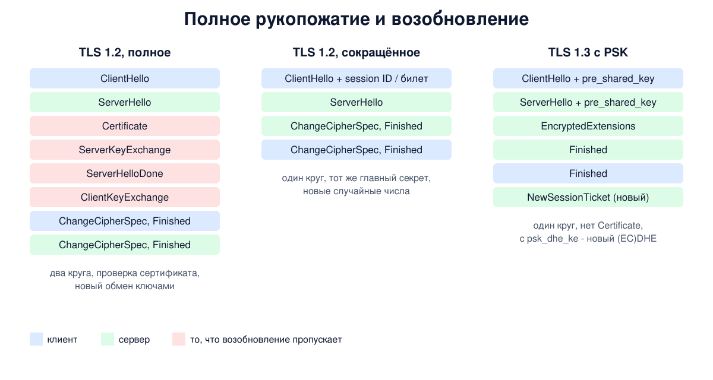

# Урок 81. Возобновление сессий и PSK

Полное рукопожатие TLS дорого: операции с открытыми ключами, проверка цепочки сертификатов, круги передачи. А браузер подключается к одному и тому же сайту десятки раз за минуты. **Возобновление сессии** (session resumption) позволяет второму соединению опереться на секрет, выработанный в первом, и пропустить почти всю тяжёлую часть. В TLS 1.3 этот же механизм обобщён до **PSK** - заранее известного общего ключа, который может прийти из прошлой сессии или быть настроен вручную.

## TLS 1.2: идентификатор сессии

Первый способ (RFC 5246, разд. 7.3): сервер хранит параметры сессии и главный секрет у себя в **кеше** и выдаёт клиенту **идентификатор сессии** (session ID) в ServerHello. В следующий раз клиент присылает этот идентификатор в ClientHello. Если сервер нашёл сессию в кеше, он повторяет идентификатор в ServerHello, и идёт **сокращённое рукопожатие**:

- ClientHello с идентификатором -> ServerHello, ChangeCipherSpec, Finished сервера -> ChangeCipherSpec, Finished клиента;
- нет Certificate, нет обмена ключами: новые ключи выводятся из старого главного секрета и **новых** случайных чисел обеих сторон;
- данные можно отправить через один круг, а не через два, и без операций с открытыми ключами.

Недостаток - кеш на сервере: его нужно хранить, ограничивать, а в кластере из многих серверов - разделять между ними, иначе клиент, попавший на другой сервер, не возобновится.

## TLS 1.2: билеты сессий

Второй способ (RFC 5077) переносит хранение на клиента. Сервер **шифрует состояние сессии** (включая главный секрет) своим **ключом билетов** и отдаёт результат клиенту в сообщении NewSessionTicket (урок 78). Клиент возвращает билет в расширении session_ticket, сервер расшифровывает его и восстанавливает сессию. Сервер не хранит ничего, кроме ключа билетов; в кластере достаточно, чтобы ключ был у всех серверов. Сам билет клиенту непрозрачен, а срок жизни сервер подсказывает полем lifetime hint.

В обоих способах TLS 1.2 возобновлённая сессия использует **тот же главный секрет** без нового обмена (EC)DHE. Значит, её трафик защищён не лучше, чем этот секрет и место, где он хранится: кеш сервера или ключ билетов.

## TLS 1.3: всё через PSK

TLS 1.3 (RFC 8446, разд. 2.2, 4.2.11, 4.6.1) заменил оба механизма одним - **PSK** (pre-shared key):

- После рукопожатия сервер присылает **NewSessionTicket** - уже зашифрованным. В нём непрозрачный билет, срок жизни (не больше 7 дней), случайная добавка к возрасту билета и nonce. PSK для следующего раза выводится из секрета возобновления (resumption master secret, урок 79) и этого nonce, так что у каждого билета свой PSK.
- В следующий раз клиент кладёт в ClientHello расширение **pre_shared_key**: идентификатор (сам билет), его "замаскированный" возраст и **binder** - HMAC над ClientHello (без самого списка binder) на ключе из PSK. Binder доказывает, что клиент действительно знает PSK, а не просто переслал чужой билет. Это расширение обязано стоять последним.
- Расширение **psk_key_exchange_modes** сообщает режим: `psk_ke` - только PSK, без нового обмена ключами, или `psk_dhe_ke` - PSK **вместе с (EC)DHE**. Во втором режиме у возобновлённой сессии есть прямая секретность (кроме ранних данных 0-RTT, урок 79); его и используют браузеры и OpenSSL.
- Если сервер принял PSK, он отвечает ServerHello с pre_shared_key (номер выбранного PSK), и **сообщений Certificate и CertificateVerify нет**: подлинность обеспечивает знание PSK.

**Внешний PSK** настраивают заранее и вне TLS: одна и та же строка-ключ с идентификатором есть у клиента и у сервера. Так связывают устройства интернета вещей или внутренние системы, где сертификаты неудобны. Сертификаты при этом не нужны вовсе.



## Как это увидеть в Linux

Запустим в пространстве имён `hbh-tls81` три сервера `openssl s_server`: обычный с билетами, сервер без билетов (`-no_ticket`, возобновление только через кеш) и сервер только с внешним PSK, без сертификата (`-nocert -psk`). Клиент сохранит сессию в файл (`-sess_out`) и возобновит её (`-sess_in`); сообщения рукопожатия покажем через `-trace`, как в уроках 78 и 79. Учебный PSK генерируется в начале опыта и удаляется вместе с ним. Нужны Linux (подойдёт WSL2), права sudo и openssl; всё создаётся в пространстве имён и во временном каталоге и удаляется в конце.

Создай файл `resume.sh` и запусти `bash resume.sh`:
```
set -u
command -v openssl >/dev/null || { echo "нужен openssl: sudo apt install openssl"; exit 1; }
ns=hbh-tls81
sudo ip netns pids $ns 2>/dev/null | xargs -r sudo kill
sudo ip netns del $ns 2>/dev/null
d=$(mktemp -d); chmod 755 "$d"
sudo ip netns add $ns
N="sudo ip netns exec $ns"
$N ip link set lo up
openssl req -x509 -newkey ec -pkeyopt ec_paramgen_curve:P-256 -nodes -days 1 -subj "/CN=www.corp.lab" \
  -addext "subjectAltName=DNS:www.corp.lab" -keyout "$d/ec.key" -out "$d/ec.crt" 2>/dev/null
psk=$(openssl rand -hex 32)   # учебный общий ключ, живёт только в этом опыте
# 4433 - обычный сервер с билетами, 4434 - без билетов (кеш сессий на сервере), 4435 - только PSK, без сертификата
$N openssl s_server -quiet -accept 4433 -cert "$d/ec.crt" -key "$d/ec.key" -www >/dev/null 2>&1 &
$N openssl s_server -quiet -accept 4434 -cert "$d/ec.crt" -key "$d/ec.key" -no_ticket -www >/dev/null 2>&1 &
$N openssl s_server -quiet -accept 4435 -nocert -psk "$psk" -psk_identity lab-client -tls1_3 -www >/dev/null 2>&1 &
sleep 1
cl() { (sleep 1; echo) | $N openssl s_client -connect 127.0.0.1:$1 "${@:2}" 2>&1; }
msgs() {   # сообщения рукопожатия по выводу -trace
  awk '/^Sent( TLS)? Record/ { who = "client" } /^Received( TLS)? Record/ { who = "server" }
       /Content Type = ChangeCipherSpec/ { printf "  %s -> ChangeCipherSpec\n", who }
       /^    [A-Za-z]+, Length=/ { n = $1; sub(/,/, "", n); printf "  %s -> %s\n", who, n }
       /extension_type=psk\(/ { printf "       with the pre_shared_key extension\n" }
       /^(New|Reused),/ { print "  " $0 }'
}
echo '--- 1. TLS 1.2: resumption by session ID (the server keeps a cache)'
cl 4434 -tls1_2 -sess_out "$d/s12id.pem" | grep -E '^(New|Reused),' | sed 's/^/  first: /'
cl 4434 -tls1_2 -sess_in "$d/s12id.pem" -trace | msgs
echo '--- 2. TLS 1.2: resumption by session ticket (the server keeps nothing)'
cl 4433 -tls1_2 -sess_out "$d/s12t.pem" | grep -E '^(New|Reused),|lifetime hint' | sed -E 's/^ *//; s/^/  first: /'
cl 4433 -tls1_2 -sess_in "$d/s12t.pem" | grep -E '^(New|Reused),' | sed 's/^/  second: /'
echo '--- 3. TLS 1.3: resumption with a PSK from a ticket'
cl 4433 -tls1_3 -sess_out "$d/s13.pem" >/dev/null
cl 4433 -tls1_3 -sess_in "$d/s13.pem" -trace | msgs
echo '--- 4. TLS 1.3: an external PSK, no certificates at all'
o=$(cl 4435 -tls1_3 -psk "$psk" -psk_identity lab-client)
echo "$o" | grep -E '^(New|Reused),' | sed 's/^/  /'
echo "  certificates received: $(echo "$o" | grep -c 'BEGIN CERTIFICATE')"
echo '--- 5. the same with a wrong key'
cl 4435 -tls1_3 -psk "$(openssl rand -hex 32)" -psk_identity lab-client | grep -m1 -oE 'alert [a-z]+ [a-z]+' | sed 's/^/  /'
echo '--- cleanup'
sudo ip netns pids $ns 2>/dev/null | xargs -r sudo kill
sleep 0.3
sudo ip netns del $ns
rm -rf "$d"
ip netns list | grep -c "^$ns"
```

Вот что получилось на нашем сервере (OpenSSL 3.0.13):
```
--- 1. TLS 1.2: resumption by session ID (the server keeps a cache)
  first: New, TLSv1.2, Cipher is ECDHE-ECDSA-AES256-GCM-SHA384
  client -> ClientHello
  server -> ServerHello
  server -> ChangeCipherSpec
  server -> Finished
  client -> ChangeCipherSpec
  client -> Finished
  Reused, TLSv1.2, Cipher is ECDHE-ECDSA-AES256-GCM-SHA384
--- 2. TLS 1.2: resumption by session ticket (the server keeps nothing)
  first: New, TLSv1.2, Cipher is ECDHE-ECDSA-AES256-GCM-SHA384
  first: TLS session ticket lifetime hint: 7200 (seconds)
  second: Reused, TLSv1.2, Cipher is ECDHE-ECDSA-AES256-GCM-SHA384
--- 3. TLS 1.3: resumption with a PSK from a ticket
  client -> ClientHello
       with the pre_shared_key extension
  server -> ServerHello
       with the pre_shared_key extension
  server -> ChangeCipherSpec
  server -> EncryptedExtensions
  server -> Finished
  client -> ChangeCipherSpec
  client -> Finished
  Reused, TLSv1.3, Cipher is TLS_AES_256_GCM_SHA384
  server -> NewSessionTicket
--- 4. TLS 1.3: an external PSK, no certificates at all
  Reused, TLSv1.3, Cipher is TLS_CHACHA20_POLY1305_SHA256
  certificates received: 0
--- 5. the same with a wrong key
  alert illegal parameter
--- cleanup
0
```

Разберём.

**Шаг 1: идентификатор сессии.** Первое соединение - полное (`New`). Второе возобновилось (`Reused`) по сокращённой схеме: после ServerHello сервер сразу прислал ChangeCipherSpec и Finished, клиент ответил тем же. Нет ни Certificate, ни ServerKeyExchange, ни ClientKeyExchange. Обрати внимание: Finished первым отправляет сервер - в полном рукопожатии было наоборот.

**Шаг 2: билет.** Сервер с билетами подсказал срок жизни 7200 секунд (два часа - значение OpenSSL по умолчанию), и второе соединение возобновилось по билету, а не по кешу: выдавая билет, OpenSSL не кладёт сессию в кеш сервера.

**Шаг 3: PSK из билета в TLS 1.3.** Расширение pre_shared_key есть и в ClientHello (клиент предлагает билет), и в ServerHello (сервер его принял). После EncryptedExtensions сразу идёт Finished: **Certificate и CertificateVerify нет** (ChangeCipherSpec - знакомые по уроку 79 сообщения для совместимости). В конце сервер выдал новый билет - так клиенту не нужно использовать один билет дважды. Набор шифров тот же, что в исходной сессии (SHA-384): PSK привязан к хешу, с которым был создан.

**Шаг 4: внешний PSK.** Сервер вообще без сертификата, клиент не получил ни одного (`certificates received: 0`), а рукопожатие состоялось: стороны доказали друг другу знание общего ключа. OpenSSL отмечает такое соединение как `Reused`, потому что для него это тоже рукопожатие с PSK. Выбран `TLS_CHACHA20_POLY1305_SHA256`: внешний PSK в s_client и s_server по умолчанию связан с SHA-256, поэтому набор с SHA-384 не подходит, а из наборов с SHA-256 ChaCha20 стоит в списке первым.

**Шаг 5: неверный ключ.** С тем же идентификатором, но другим ключом binder не сошёлся, и сервер оборвал рукопожатие. OpenSSL 3.0 на нашем сервере ответил оповещением `illegal_parameter`, а OpenSSL 3.5 в WSL - `decrypt_error`, которое RFC 8446 (разд. 6.2) называет как раз для неверного binder. В обоих случаях без знания ключа соединения нет.

В конце `0`: пространство имён удалено.

## Безопасность: что держит возобновление

Принцип: **возобновление переносит доверие из прошлого соединения в новое**, поэтому оно не сильнее того, на чём держится. Это ключ билетов на сервере, режим обмена ключами и сам PSK. Кроме того, билет - это постоянный идентификатор: если клиент предъявляет один и тот же билет в разных соединениях, наблюдатель может связать эти соединения между собой. В TLS 1.2 идентификатор сессии и NewSessionTicket идут открыто, так что связать можно даже первое соединение со вторым; в TLS 1.3 билет приходит зашифрованным, и связать соединения можно, только если один и тот же билет предъявлен в нескольких из них.

Как защищаться:

- **регулярно менять ключи билетов** (например, раз в несколько часов) и безопасно раздавать их серверам кластера; старые ключи уничтожать - от этого зависит прямая секретность всех сессий, получивших билеты (урок 78);
- **ограничивать срок жизни** сессий и билетов разумными значениями, а не максимальными;
- **в TLS 1.3 разрешать только `psk_dhe_ke`**: тогда каждое возобновление делает новый обмен (EC)DHE и сохраняет прямую секретность;
- **внешний PSK - это пароль**: генерировать его генератором случайных чисел (не меньше 128, лучше 256 бит), свой для каждого клиента, хранить как секрет; короткий или придуманный человеком PSK можно подобрать по записанному рукопожатию;
- **клиентам не использовать билет повторно** (RFC 8446, прил. C.4) - это не даёт наблюдателю связать соединения между собой; от повтора ранних данных защищается сервер (одноразовые билеты, урок 79);
- **проверять, что возобновление вообще работает**: без него каждое соединение делает полное рукопожатие и сервер тратит лишние ресурсы.

## Итог

- В TLS 1.2 возобновление идёт по идентификатору сессии (кеш на сервере) или по билету (состояние у клиента, зашифровано ключом билетов); рукопожатие сокращённое, без сертификата и обмена ключами.
- В TLS 1.3 возобновление - частный случай PSK: билет из NewSessionTicket, расширение pre_shared_key с binder, режим psk_dhe_ke для прямой секретности.
- При PSK нет Certificate и CertificateVerify; внешний PSK позволяет обойтись без сертификатов совсем.
- Неверный PSK обнаруживается по binder, и рукопожатие обрывается.
- Безопасность держится на ключе билетов, режиме обмена и качестве PSK; билеты нужно использовать однократно.

## Что почитать

- Ристич, "Bulletproof TLS and PKI": гл. 2 (разделы Authentication Using Pre-Shared Keys и Session Resumption), гл. 3 (Session Resumption, Session Tickets), гл. 9 (Session Resumption в разделе об оптимизации), гл. 11 (Ensure Ticket Keys Are Rotated, Enable Session Resumption).
- RFC 5246, разд. 7.3 (сокращённое рукопожатие TLS 1.2); RFC 5077 (билеты сессий); RFC 8446, разд. 2.2, 4.2.9, 4.2.11, 4.6.1, 6.2 и прил. C.4; RFC 9257, разд. 4 и 6 (требования к внешним PSK).
